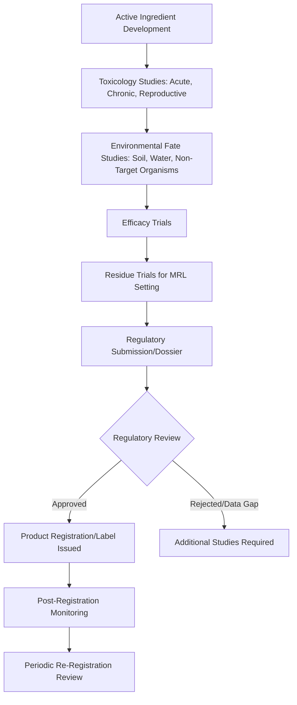
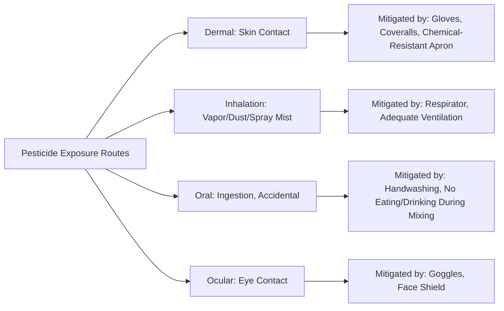

## Pesticide Safety and Regulations

### Overview

Pesticide safety and regulation encompasses the legal frameworks, labeling requirements, handling protocols, and risk mitigation practices that govern pesticide manufacture, sale, application, and disposal. Regulatory systems aim to balance pest control efficacy with protection of human health, non-target organisms, and environmental quality. While specific statutes vary by country, most regulatory frameworks share common structural elements: registration/approval processes, labeling standards, applicator certification, and residue limits.

**Key Points**

- The pesticide label is a legally binding document; using a product inconsistent with its label instructions is generally a regulatory violation in most jurisdictions
- Regulatory frameworks differ by country/region, but commonly include pre-market registration, restricted-use classifications, and residue tolerance limits
- Worker protection standards, personal protective equipment (PPE) requirements, and re-entry intervals are distinct but interlocking safety mechanisms
- [Unverified as universally applicable] Specific regulatory bodies, statutes, and thresholds cited below reflect commonly referenced frameworks (e.g., US EPA/FIFRA); local/national regulations should be consulted for jurisdiction-specific compliance

---

### Regulatory Frameworks (Representative Examples)

| Region/Body | Framework | Core Function |
| --- | --- | --- |
| United States | FIFRA (Federal Insecticide, Fungicide, and Rodenticide Act), enforced by EPA | Product registration, labeling, restricted-use classification |
| European Union | Regulation (EC) No 1107/2009 | Active substance approval, product authorization by member states |
| Codex Alimentarius | Codex Pesticide Residue Limits | International reference MRLs (Maximum Residue Limits) for trade |
| FAO/WHO | Joint Meeting on Pesticide Residues (JMPR) | Risk assessment underpinning international MRL setting |

[Inference] Countries without independent registration infrastructure often reference EPA, EU, or Codex assessments when establishing domestic pesticide regulations, though this varies by national policy.

---

### Pesticide Registration Process

#### Key Data Requirements

- **Acute toxicity**: Oral, dermal, and inhalation LD50/LC50 values determine WHO/EPA hazard category
- **Chronic toxicity**: Long-term feeding studies assessing carcinogenicity, reproductive/developmental effects
- **Environmental fate**: Soil half-life, water solubility, leaching potential, bioaccumulation factor
- **Non-target organism impact**: Studies on pollinators (bees), aquatic species (fish, invertebrates), and avian species
- **Residue trials**: Field trials establishing MRLs for treated crops at labeled application rates and pre-harvest intervals

---

### The Pesticide Label as a Legal Document

The label specifies legally enforceable conditions of use. Key sections typically include:

- **Signal word**: DANGER (highest acute toxicity), WARNING (moderate), CAUTION (lowest) — reflecting the product's toxicity category
- **Active ingredient(s) and concentration**
- **Directions for use**: crop/site, application rate, method, timing, maximum applications per season
- **Precautionary statements**: PPE requirements, environmental hazards, first aid instructions
- **Re-entry interval (REI)**: minimum time before unprotected entry into treated areas
- **Pre-harvest interval (PHI)**: minimum time between last application and harvest
- **Storage and disposal instructions**

**Example**

A label stating "REI: 24 hours; PHI: 7 days" means workers may not enter the treated field without PPE for 24 hours post-application, and the crop may not be harvested until 7 days after the final application — both are legally binding, not general guidance.

---

### Applicator Certification and Restricted-Use Classification

#### Restricted-Use Pesticides (RUP)

Products classified as higher-risk (to applicator, environment, or bystanders) are typically restricted to use by, or under direct supervision of, certified applicators, rather than being available for unrestricted general public purchase.

#### Certification Categories (Representative)

- **Private applicator**: Certified for use on own or employer's agricultural land
- **Commercial applicator**: Certified for hire, often subdivided by use category (e.g., agricultural plant, right-of-way, aquatic, structural)

[Inference] Certification renewal typically requires periodic continuing education credits or re-examination, though specific intervals and requirements vary by issuing authority.

---

### Personal Protective Equipment (PPE) and Exposure Routes

#### Standard PPE Components

- **Chemical-resistant gloves**: material (nitrile, neoprene, butyl rubber) must match label-specified resistance to the active ingredient's solvent carrier
- **Coveralls/protective clothing**: often required over regular clothing during mixing/loading and application
- **Respiratory protection**: required for products with inhalation hazard, ranging from dust masks to full-face respirators depending on label specification
- **Eye protection**: goggles or face shields for splash-risk operations (mixing concentrates)
- **Footwear**: chemical-resistant boots, particularly during mixing/loading

**Key Points**

- PPE requirements are label-specified and vary by product, not generalized across all pesticides
- Dermal exposure is generally the most common route during mixing, loading, and application activities [Inference, based on typical occupational exposure studies, though route dominance can vary by task and formulation]

---

### Application Safety Practices

#### Mixing and Loading

- Read the full label before opening the container
- Use dedicated measuring equipment; avoid cross-contamination between products
- Mix in well-ventilated areas, away from water sources to prevent contamination
- Use closed transfer systems where available to minimize concentrate exposure

#### Application

- Observe wind speed and direction restrictions to minimize drift onto non-target areas, sensitive crops, or waterways
- Maintain buffer zones near water bodies, apiaries, and sensitive habitats as specified by label or local regulation
- Avoid application during pollinator foraging periods for bee-toxic products, where labeled

#### Post-Application

- Observe re-entry interval (REI) before allowing unprotected entry
- Post warning signs in treated areas where required by regulation
- Clean equipment and PPE according to label/manufacturer instructions
- Store unused product and empty containers per label and local hazardous waste regulations

---

### Environmental and Non-Target Organism Protection

#### Pollinator Protection

- Bee-toxicity ratings inform application timing restrictions (e.g., avoiding bloom-period application for highly bee-toxic products)
- Systemic insecticides (e.g., neonicotinoids) have drawn particular regulatory scrutiny in some jurisdictions due to potential presence in pollen/nectar [Unverified as a settled scientific consensus, as regulatory status and supporting evidence continue to evolve across jurisdictions]

#### Aquatic Organism Protection

- Buffer zones and no-spray setbacks near water bodies reduce runoff/drift contamination risk
- Some active ingredients carry specific aquatic toxicity warnings restricting use near fish-bearing waters

#### Endangered Species Considerations

Some regulatory frameworks (e.g., US EPA Endangered Species Act consultations) impose geographically specific use restrictions where a registered pesticide's use could affect a listed species' habitat.

---

### Residue Limits and Food Safety

#### Maximum Residue Limit (MRL) / Tolerance

The maximum concentration of pesticide residue legally permitted in/on a food commodity, established from residue trial data at labeled application rates and pre-harvest intervals.

$$\text{MRL Compliance} = \text{Measured Residue} \leq \text{Established Tolerance}$$

**Example**

If a pesticide's PHI is 14 days and a grower harvests only 10 days after application, residue levels may exceed the established MRL even if the product was applied at the correct rate, since insufficient degradation time has elapsed.

#### Import Tolerances and International Trade

Countries may set import tolerances for commodities treated with pesticides not registered domestically but permitted in the exporting country, subject to residue data review — a mechanism that helps reconcile differing MRLs across trading partners. [Inference] The specific process and acceptance criteria vary considerably by importing country's regulatory framework.

---

### Illustrative PPE and Exposure Pathway Diagram

<svg xmlns="http://www.w3.org/2000/svg" viewBox="0 0 500 300">
<title>Pesticide Applicator PPE Zones (svg_diagram)</title>
<circle cx="250" cy="90" r="35" fill="#ffe8d6" stroke="#333" stroke-width="1.5" />
<text x="250" y="95" font-size="11" text-anchor="middle">Head/Face</text>
<text x="250" y="45" font-size="10" text-anchor="middle" fill="#555">Goggles / Respirator</text>
<rect x="210" y="130" width="80" height="90" fill="#e0fbfc" stroke="#333" stroke-width="1.5" />
<text x="250" y="180" font-size="11" text-anchor="middle">Torso</text>
<text x="250" y="120" font-size="10" text-anchor="middle" fill="#555">Coveralls / Apron</text>
<rect x="150" y="140" width="50" height="70" fill="#d8f3dc" stroke="#333" stroke-width="1.5" />
<text x="175" y="180" font-size="10" text-anchor="middle">Arm</text>
<rect x="300" y="140" width="50" height="70" fill="#d8f3dc" stroke="#333" stroke-width="1.5" />
<text x="325" y="180" font-size="10" text-anchor="middle">Arm</text>
<text x="175" y="230" font-size="10" text-anchor="middle" fill="#555">Gloves</text>
<text x="325" y="230" font-size="10" text-anchor="middle" fill="#555">Gloves</text>
<rect x="220" y="225" width="25" height="60" fill="#d8f3dc" stroke="#333" stroke-width="1.5" />
<rect x="255" y="225" width="25" height="60" fill="#d8f3dc" stroke="#333" stroke-width="1.5" />
<text x="250" y="298" font-size="10" text-anchor="middle" fill="#555">Chemical-Resistant Boots</text>
</svg>

---

### Poisoning Response and First Aid Principles

- Label first aid sections are product-specific and take precedence over general guidance
- General principles: remove from exposure source, remove contaminated clothing, flush skin/eyes with water for dermal/ocular exposure
- Contact a poison control center or emergency medical service for suspected significant exposure; bring the product label/container to inform treatment
- [Unverified as universal] Induced vomiting is not recommended for most modern pesticide exposures without explicit medical or label direction, though specific guidance depends on the ingested compound

---

### Storage, Transport, and Disposal

- **Storage**: Original labeled containers, locked/secured storage away from food, feed, and water sources, temperature ranges per label
- **Transport**: Secured to prevent spillage, placarding requirements for large quantities under hazardous materials transport regulations
- **Container disposal**: Triple-rinsing (or pressure rinsing) of empty containers before disposal/recycling per label and local regulation
- **Unused product disposal**: Typically requires hazardous waste disposal channels rather than general waste or drain disposal

---

### Record-Keeping Requirements

Many jurisdictions require documentation of: product used, EPA/registration number, application date/time/location, rate, target pest, applicator identity/certification number, and weather conditions at application — supporting both regulatory compliance and traceability in case of drift complaints or residue issues.

---

**Related Topics**

- Pesticide classification and modes of action (IRAC/HRAC/FRAC)
- Integrated Pest Management (IPM) as a regulatory-encouraged practice
- Pesticide drift management and buffer zone calculation
- Worker Protection Standard (WPS) compliance
- Pollinator protection and bee-toxicity labeling
- Pesticide environmental fate: soil half-life, leaching, bioaccumulation
- International MRL harmonization and Codex Alimentarius standards
- Pesticide applicator certification and continuing education requirements