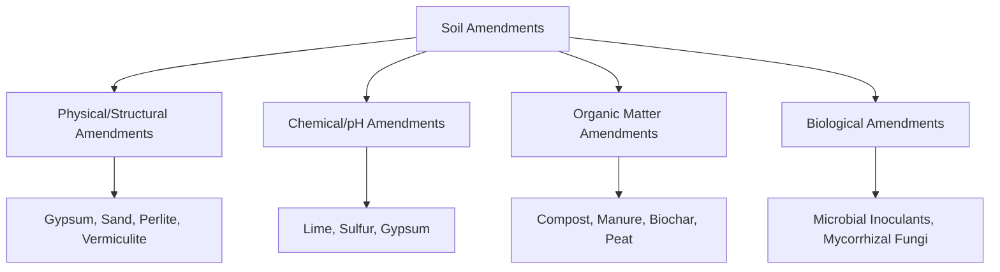
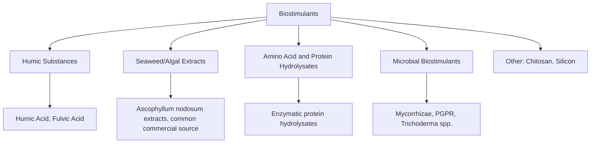
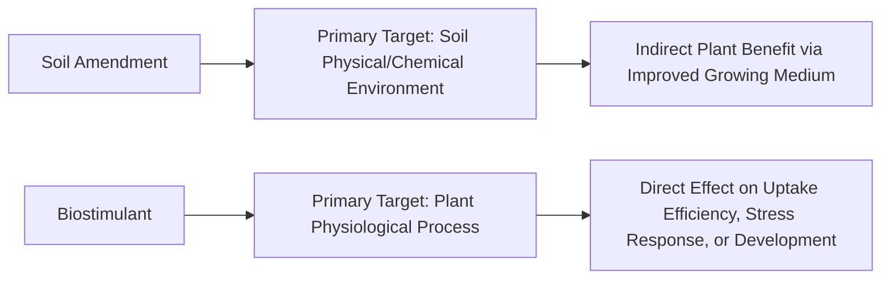

## Soil Amendments and Biostimulants

### Overview

Soil amendments are materials added to soil to improve its physical, chemical, or biological properties for plant growth, distinct from fertilizers whose primary function is direct nutrient supply. Biostimulants are substances or microorganisms applied to plants or soil that enhance nutrient uptake efficiency, abiotic stress tolerance, or crop quality traits through physiological mechanisms rather than direct nutrient content. The two categories overlap in practice but are conceptually distinguished by primary mode of action.

**Key Points**

- Amendments primarily target soil structure, pH, or biological activity; biostimulants primarily target plant physiological response
- Regulatory classification of biostimulants varies significantly by jurisdiction — some treat them as a distinct product category, others fold them into fertilizer or plant-growth-regulator frameworks
- Neither category is a substitute for core nutrient management, though both can improve nutrient use efficiency (NUE) when properly integrated
- Evidence quality varies considerably across biostimulant product classes; some (e.g., certain seaweed extracts, humic substances) have substantial peer-reviewed support, while others have more limited or context-dependent evidence

---

### Soil Amendments: Classification

#### Physical/Structural Amendments

Modify bulk density, aggregation, porosity, and drainage without primarily altering chemistry.

- **Gypsum (CaSO₄·2H₂O)**: Improves soil structure in sodic soils by displacing sodium with calcium on cation exchange sites, promoting aggregation without raising pH (distinguishing it from lime)
- **Sand/perlite/vermiculite**: Improve drainage and reduce compaction in fine-textured soils, primarily used in container media and localized soil modification
- **Biochar**: Pyrolyzed organic material; increases porosity, water-holding capacity, and provides long-term stable carbon; also functions as a chemical amendment via cation exchange capacity (CEC) contribution

#### Chemical/pH Amendments

- **Agricultural lime (CaCO₃/dolomitic lime)**: Neutralizes soil acidity, raising pH; dolomitic lime additionally supplies magnesium
- **Elemental sulfur**: Lowers soil pH via microbial oxidation to sulfuric acid, a slower process than direct acid application
- **Gypsum**: Supplies calcium and sulfur without altering pH significantly, useful where calcium is needed but pH is already adequate or high

$$\text{S} + 1.5\text{O}_2 + \text{H}_2\text{O} \xrightarrow{\text{soil bacteria}} \text{H}_2\text{SO}_4$$

**Example**

A soil testing pH 5.2 (moderately acidic) for a crop requiring pH 6.5 would typically receive an agricultural lime application calculated from a lime requirement test (buffer pH method), not simply a generic per-hectare rate, since buffering capacity varies with soil organic matter and clay content.

#### Organic Matter Amendments

- **Compost**: Stabilized organic matter improving CEC, water-holding capacity, and microbial activity; nutrient content is variable and generally lower/slower-release than mineral fertilizer
- **Manure**: Contributes both nutrients and organic matter; C:N ratio affects short-term nitrogen availability (high C:N materials can immobilize soil N during decomposition)
- **Peat**: Traditionally used for organic matter and water retention in container media; [Unverified as universally accepted] increasingly subject to sustainability scrutiny in some regions due to peatland extraction concerns
- **Cover crop residue**: In-situ organic matter contribution through green manure incorporation

#### Biological Amendments

- **Mycorrhizal fungi inoculants**: Establish symbiotic associations with plant roots, extending effective root surface area for water/nutrient (particularly P) uptake
- **Rhizobium inoculants**: Symbiotic N-fixing bacteria applied to legume seed/soil to establish root nodule symbiosis
- **Free-living N-fixing/PGPR (plant growth-promoting rhizobacteria)**: Enhance nutrient availability or produce plant growth-influencing compounds without forming host-specific symbiotic structures

---

### Biostimulants: Classification

#### Humic Substances

Humic and fulvic acids, derived from decomposed organic matter (often leonardite or composted sources), are proposed to improve nutrient chelation, root development, and soil CEC.

- **Mechanism (proposed)**: Chelation of micronutrients improving plant availability; stimulation of root hair development; improved soil aggregate stability
- [Inference] Response magnitude is highly variable across soil type, existing organic matter level, and crop species, with more consistent benefits generally observed in low-organic-matter or degraded soils

#### Seaweed/Algal Extracts

Derived predominantly from brown algae species (e.g., *Ascophyllum nodosum*, kelp species); contain a complex mixture of polysaccharides (e.g., alginates, laminarin), plant hormone-like compounds (cytokinin/auxin-like activity), and micronutrients.

- Proposed effects: enhanced stress tolerance (drought, cold, salinity), improved root growth, extended shelf life in some horticultural applications
- [Inference] Active compound concentration and consistency vary by extraction method, harvest source, and processing, contributing to variable field response across products

#### Amino Acid and Protein Hydrolysates

Enzymatically or chemically hydrolyzed protein sources (plant or animal-derived) supplying free amino acids and short peptides.

- Proposed mechanisms: direct nitrogen source in readily available form, chelating agent for micronutrients, signaling molecules influencing stress response pathways
- Commonly foliar-applied; response is generally more pronounced under stress conditions (e.g., post-transplant shock, heat stress) than under optimal growing conditions [Inference]

#### Microbial Biostimulants

- **Mycorrhizal fungi**: Discussed above under amendments; classified as biostimulant when marketed for physiological/stress benefits rather than purely structural soil effects
- ***Trichoderma* spp.**: Root-colonizing fungi associated with induced systemic resistance and improved nutrient solubilization, in addition to some direct biocontrol activity against soil pathogens
- **PGPR (Plant Growth-Promoting Rhizobacteria)**: Bacterial genera (e.g., *Bacillus*, *Pseudomonas*, *Azospirillum*) associated with phytohormone production, nutrient solubilization, and induced stress tolerance

#### Other Categories

- **Chitosan**: Derived from crustacean shell chitin; associated with induced systemic resistance and some direct antimicrobial activity
- **Silicon**: Not classified as an essential nutrient in most frameworks, but associated with improved cell wall strength, pest/disease resistance, and abiotic stress tolerance in silicon-accumulating species (e.g., rice, sugarcane)

---

### Mechanism Comparison: Amendments vs. Biostimulants

**Key Points**

- The categories are not mutually exclusive: biochar and microbial inoculants function as both structural/biological soil amendments and physiological biostimulants depending on framing and application context
- Amendment effects are typically measured via soil chemical/physical properties (pH, CEC, bulk density); biostimulant effects are typically measured via plant response metrics (root biomass, chlorophyll content, stress survival rate)

---

### Application Considerations

#### Soil Amendments

- **Lime/sulfur rate calculation**: Based on buffer pH testing (e.g., SMP buffer method) rather than water pH alone, since buffering capacity determines the quantity needed to shift pH
- **Incorporation depth**: Lime reacts slowly and benefits from incorporation into the root zone rather than surface application alone, particularly in no-till systems where surface-applied lime may take longer to influence subsurface pH
- **Timing**: Amendments requiring microbial transformation (elemental sulfur) need lead time before planting; effects are not immediate

#### Biostimulants

- **Application timing**: Often most effective when applied preventively or at known stress points (transplant, pre-flowering, ahead of forecast stress events) rather than reactively after visible damage
- **Compatibility**: Tank-mix compatibility with fertilizers/pesticides should be verified, as some biostimulant formulations (particularly microbial products) may be sensitive to co-application with certain fungicides or high-salt fertilizer solutions
- **Carrier and formulation**: Foliar vs. soil-drench vs. seed-treatment application methods affect uptake pathway and effective rate

---

### Illustrative Root Zone Interaction Diagram

<svg xmlns="http://www.w3.org/2000/svg" viewBox="0 0 500 320">
<title>Amendment and Biostimulant Interaction in Root Zone (svg_diagram)</title>
<rect x="20" y="20" width="460" height="280" fill="#f4f1de" stroke="#333" stroke-width="1" />
<line x1="20" y1="120" x2="480" y2="120" stroke="#8B5E3C" stroke-width="2" stroke-dasharray="5,3" />
<text x="250" y="110" font-size="11" text-anchor="middle" fill="#555">Soil Surface</text>
<ellipse cx="250" cy="200" rx="70" ry="90" fill="none" stroke="#2a9d8f" stroke-width="2" stroke-dasharray="4,2" />
<text x="250" y="200" font-size="11" text-anchor="middle" fill="#2a9d8f">Root Zone</text>
<circle cx="150" cy="160" r="12" fill="#e9c46a" stroke="#333" />
<text x="150" y="145" font-size="9" text-anchor="middle">Lime</text>
<circle cx="350" cy="160" r="12" fill="#e9c46a" stroke="#333" />
<text x="350" y="145" font-size="9" text-anchor="middle">Gypsum</text>
<circle cx="200" cy="230" r="10" fill="#a8dadc" stroke="#333" />
<text x="200" y="255" font-size="9" text-anchor="middle">Mycorrhizae</text>
<circle cx="300" cy="230" r="10" fill="#a8dadc" stroke="#333" />
<text x="300" y="255" font-size="9" text-anchor="middle">Humic Acid</text>
<circle cx="250" cy="150" r="8" fill="#e76f51" stroke="#333" />
<text x="250" y="135" font-size="9" text-anchor="middle">Seaweed Extract</text>
</svg>

---

### Regulatory and Evidence Considerations

- Biostimulant regulatory frameworks are actively evolving; the EU Fertilising Products Regulation (2019/1009) established a distinct plant biostimulant category with defined function claims and efficacy substantiation requirements, while other jurisdictions may regulate similar products under existing fertilizer, pesticide, or unregulated novel-product frameworks [Unverified as current, given the pace of regulatory development in this area — verification against current regulatory text is recommended for compliance purposes]
- Efficacy claims should be evaluated against replicated field trial data specific to the crop and region of interest rather than generalized marketing claims, given the documented variability in biostimulant response across environments
- Amendment efficacy (lime, gypsum, sulfur) is generally more predictable and mechanistically well-characterized than most biostimulant categories, reflecting the more direct physical/chemical nature of their primary mechanisms

---

**Related Topics**

- Soil pH management and lime requirement testing (buffer pH method)
- Cation exchange capacity (CEC) and soil chemistry fundamentals
- Mycorrhizal fungi and Rhizobium inoculant application
- Biochar production and soil carbon sequestration
- Nutrient management planning and fertilizer integration
- Abiotic stress physiology in crop plants (drought, salinity, temperature)
- Biostimulant regulatory frameworks (EU Fertilising Products Regulation and comparators)
- Compost production and C:N ratio management