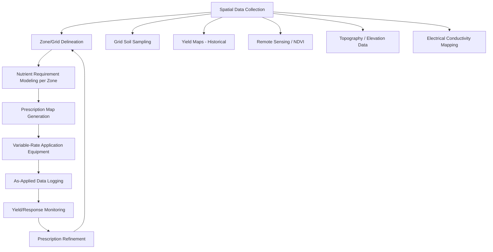
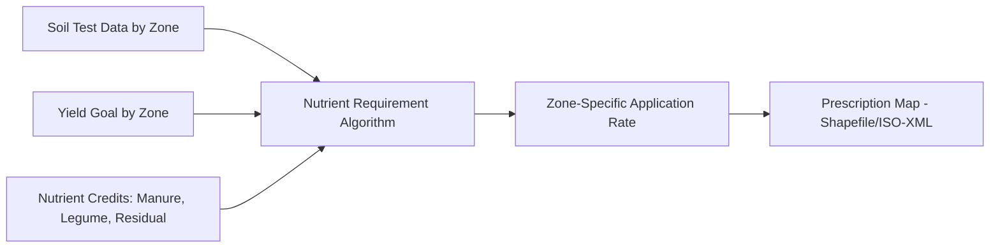
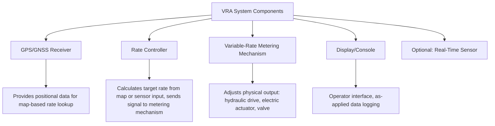

## Precision Nutrient Application

### Overview

Precision nutrient application refers to technology-enabled methods for delivering fertilizers and amendments at variable rates matched to spatial and temporal variability within a field, rather than applying a single uniform rate across an entire management unit. It integrates spatial data collection (soil sampling, remote sensing, yield history), decision algorithms, and variable-rate application (VRA) equipment to align nutrient supply with localized crop demand.

**Key Points**

- Core workflow: data collection → zone/grid delineation → prescription map generation → variable-rate application → outcome monitoring
- Spatial variability sources include soil type, topography, historical management, and drainage patterns within a single field
- Precision application aims to improve nutrient use efficiency (NUE), reduce over/under-application zones, and lower environmental loss risk relative to blanket rate application
- Technology components (GPS, sensors, controllers) function as an integrated system; individual components alone do not constitute precision management without a coherent data-to-decision pipeline

---

### Precision Nutrient Management Workflow

---

### Spatial Data Collection Methods

#### Grid Soil Sampling

Fixed-interval sampling points (commonly 1–2.5 hectare grid cells, though intervals vary by region and budget) provide spatially explicit soil test values (pH, P, K, organic matter) used to interpolate nutrient maps across the field.

**Key Points**

- Denser grids capture more spatial detail but increase sampling/lab cost proportionally
- Interpolation methods (e.g., kriging, inverse distance weighting) estimate values between sampled points
- Grid sampling is generally better suited to fields with less obvious visual/topographic zonation

#### Management Zone Delineation

Zones are drawn based on relatively homogeneous soil type, yield potential, or landscape position rather than a fixed grid, often informed by:

- Soil survey/type boundaries
- Multi-year yield map overlays identifying consistently high/low-performing areas
- Topographic position (slope, aspect, elevation) affecting water movement and erosion
- Apparent electrical conductivity (EC) mapping, correlating with soil texture and moisture-holding capacity

[Inference] Zone-based sampling is generally more cost-efficient than dense grid sampling for large-scale row-crop production, though grid sampling may offer higher resolution where zone boundaries are not visually or topographically obvious.

#### Remote Sensing and Vegetation Indices

- **NDVI (Normalized Difference Vegetation Index)**: Derived from satellite, aerial, or drone-mounted multispectral sensors; correlates with canopy vigor/biomass and can indicate in-season nutrient status variability
- **Other indices**: NDRE (Normalized Difference Red Edge), often preferred for detecting N status in denser canopies where NDVI saturates

$$\text{NDVI} = \frac{\text{NIR} - \text{Red}}{\text{NIR} + \text{Red}}$$

**Example**

A drone-collected NDVI map showing a distinct low-vigor patch correlating with a known low-lying, poorly drained zone from topographic data would support an interpretation of localized nutrient loss (e.g., denitrification in saturated soil) rather than a uniform field-wide deficiency, informing a targeted rather than blanket corrective application.

#### Electrical Conductivity (EC) Mapping

Sensor-towed or on-the-go EC measurement correlates with soil texture, moisture-holding capacity, and sometimes salinity; used as a proxy layer for delineating zones where direct soil chemical sampling at high density is cost-prohibitive.

---

### Prescription Map Generation

Prescription maps translate zone-level or grid-level data into spatially explicit target application rates, typically generated in GIS or dedicated precision-ag software platforms.

#### Key Considerations

- **Algorithm basis**: Rate recommendations per zone follow the same nutrient budgeting logic as field-level planning (crop requirement minus soil supply minus credits), applied at finer spatial resolution
- **File format compatibility**: Prescription maps are commonly exported as shapefiles or the ISO-XML standard for cross-compatibility between GIS software and equipment display/controller systems from different manufacturers
- **Rate range constraints**: Equipment-specific minimum/maximum application rate limits must be incorporated into the prescription to avoid mechanically infeasible rate requests

---

### Variable-Rate Application (VRA) Equipment

#### Map-Based VRA

Equipment follows a pre-loaded prescription map, adjusting application rate via GPS position without real-time sensing during the application pass.

- Requires accurate GPS positioning (commonly RTK-corrected for sub-inch to few-centimeter accuracy in high-precision applications)
- Rate controller adjusts metering mechanism (auger speed, valve opening, spinner speed) based on map position and travel speed

#### Sensor-Based (Real-Time) VRA

Application rate adjusts based on live sensor readings during the pass, without a pre-generated map.

- **Optical canopy sensors**: Measure reflectance in-season, primarily for nitrogen top-dress rate adjustment based on real-time crop vigor
- **On-the-go soil sensors**: Less common for direct nutrient sensing (soil nutrient sensors face greater technical challenges than optical crop sensors), more frequently used for texture/EC-based zone data collection rather than real-time rate control

#### Hybrid Systems

Combine a baseline prescription map with real-time sensor-based adjustment, allowing correction for within-season variability not captured in pre-season data.

---

### Equipment Components

- **GPS/GNSS receiver**: Positional accuracy tier (standard GPS, WAAS-corrected, RTK) determines achievable application precision; RTK is generally required for sub-plant-level precision such as variable-rate planting, while coarser correction may suffice for broadcast fertilizer zones
- **Rate controller**: Interprets prescription map position or sensor input and commands the metering system accordingly
- **Metering mechanism**: Physical adjustment method varies by applicator type (auger speed for dry spreaders, orifice/valve control for liquid systems, spinner speed/deflector angle affecting spread pattern for broadcast spreaders)
- **As-applied data logging**: Records actual delivered rate by location, enabling comparison against the prescription and supporting subsequent yield-response analysis

---

### Fertigation-Based Precision Application

Drip and micro-irrigation systems enable precise, spatially and temporally controlled nutrient delivery when paired with sectional control valves and injection systems.

- **Sectional control**: Divides irrigation zones to allow differential nutrient concentration or timing by field section
- **Injection metering**: Venturi injectors, positive displacement pumps deliver calibrated nutrient solution concentration into the irrigation line
- **Timing precision**: Enables split, frequent applications aligned closely with daily/weekly crop uptake patterns, particularly valuable for high-value horticultural crops

---

### Illustrative Variable-Rate Zone Map Concept

<svg xmlns="http://www.w3.org/2000/svg" viewBox="0 0 500 320">
<title>Variable-Rate Nitrogen Prescription Zones (svg_diagram)</title>
<rect x="20" y="20" width="460" height="280" fill="none" stroke="#333" stroke-width="2" />
<rect x="20" y="20" width="150" height="140" fill="#f4a261" />
<text x="95" y="95" font-size="12" text-anchor="middle" fill="#333">Zone A</text>
<text x="95" y="112" font-size="10" text-anchor="middle" fill="#333">180 kg N/ha</text>
<rect x="170" y="20" width="160" height="140" fill="#e9c46a" />
<text x="250" y="95" font-size="12" text-anchor="middle" fill="#333">Zone B</text>
<text x="250" y="112" font-size="10" text-anchor="middle" fill="#333">140 kg N/ha</text>
<rect x="330" y="20" width="150" height="140" fill="#2a9d8f" />
<text x="405" y="95" font-size="12" text-anchor="middle" fill="white">Zone C</text>
<text x="405" y="112" font-size="10" text-anchor="middle" fill="white">100 kg N/ha</text>
<rect x="20" y="160" width="230" height="140" fill="#e76f51" />
<text x="135" y="235" font-size="12" text-anchor="middle" fill="white">Zone D</text>
<text x="135" y="252" font-size="10" text-anchor="middle" fill="white">200 kg N/ha</text>
<rect x="250" y="160" width="230" height="140" fill="#2a9d8f" />
<text x="365" y="235" font-size="12" text-anchor="middle" fill="white">Zone C</text>
<text x="365" y="252" font-size="10" text-anchor="middle" fill="white">100 kg N/ha</text>
<text x="250" y="310" font-size="10" text-anchor="middle" fill="#555">Zones delineated from yield history, soil test, and topography</text>
</svg>

---

### Data Integration and Software Platforms

- **Farm management information systems (FMIS)**: Centralize multi-year data layers (soil test, yield, imagery, as-applied records) supporting prescription generation and season-over-season comparison
- **Cross-compatibility standards**: ISO 11783 (ISOBUS) enables communication between equipment and controllers across different manufacturers, reducing vendor lock-in for data transfer
- **Cloud-based platforms**: Increasingly common for storing/processing spatial layers and generating prescriptions, often paired with mobile/desktop interfaces for grower or agronomist review before finalizing a prescription

[Inference] Specific platform capabilities, data format support, and interoperability vary by vendor and update cycle; current documentation from the equipment/software provider should be consulted for implementation-specific detail.

---

### Economic and Agronomic Evaluation

#### Return on Investment Considerations

- Cost components: soil sampling density, equipment/technology investment (VRA-capable spreaders/sprayers, GPS correction subscription), agronomic/GIS service fees
- Benefit components: input cost savings in over-applied zones, yield improvement in under-applied zones, reduced environmental loss risk (harder to monetize directly but relevant to regulatory compliance and long-term soil health)

**Key Points**

- Fields with higher inherent spatial variability (e.g., variable topography, mixed soil types) generally show greater relative benefit from precision application compared to highly uniform fields [Inference, as variability magnitude is the primary driver of potential rate optimization gain]
- Economic benefit is field- and operation-specific; a standardized ROI figure across all farming contexts is not established, given wide variation in variability magnitude, crop value, and technology cost structures

#### Validation Through On-Farm Trials

Strip trials comparing variable-rate zones against a uniform check rate, analyzed against yield monitor data, provide field-specific evidence of prescription accuracy and economic benefit rather than relying solely on theoretical zone modeling.

---

**Related Topics**

- Nutrient management planning and soil test-based rate calculation
- GPS/GNSS correction systems (WAAS, RTK) for agricultural application
- Remote sensing and multispectral imagery interpretation in crop production
- Yield mapping and on-farm strip trial design
- ISOBUS and farm equipment data interoperability standards
- Fertigation system design for drip/micro-irrigation
- Soil electrical conductivity mapping and interpretation
- Farm management information systems (FMIS) and data layer integration