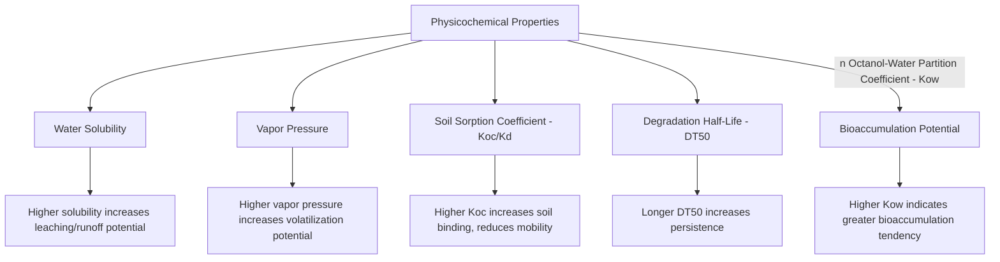
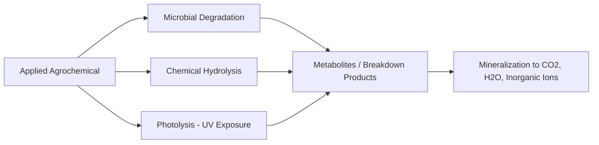
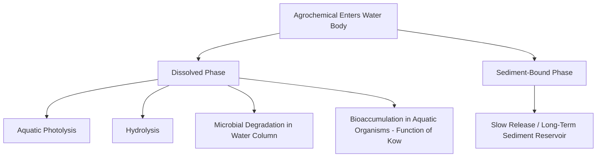

## Environmental Fate of Agrochemicals

### Overview

Environmental fate describes the physical, chemical, and biological processes that determine how an agrochemical (fertilizer or pesticide) moves, transforms, and persists in soil, water, and air after application. Fate assessment underpins both regulatory risk evaluation and field-level management decisions aimed at minimizing off-site movement and non-target exposure.

**Key Points**

- Core fate processes: sorption/desorption, degradation (chemical, photolytic, microbial), volatilization, leaching, and runoff transport
- Fate behavior is compound-specific, governed by physicochemical properties (solubility, vapor pressure, soil sorption coefficient, degradation half-life)
- Soil, climate, and management interact with intrinsic compound properties to determine actual field behavior — properties alone do not fully predict outcomes without site context
- Regulatory fate assessment (registration dossiers) generates standardized parameters (e.g., DT50, Koc) used across risk models, though real-world variability around these reference values is expected

---

### Key Physicochemical Properties Governing Fate

#### Water Solubility

Compounds with high water solubility (e.g., many herbicides, nitrate) are more prone to dissolution into soil water and subsequent leaching or surface runoff transport.

#### Vapor Pressure

Determines volatilization tendency — the propensity to transition from liquid/solid to gas phase, particularly relevant for surface-applied products under warm, low-humidity conditions.

#### Soil Sorption Coefficient (Koc, Kd)

$$K_{oc} = \frac{K_d}{f_{oc}}$$

Where $K_d$ is the soil-water distribution coefficient and $f_{oc}$ is the fraction of organic carbon in soil. Higher Koc values indicate stronger binding to soil organic matter, generally reducing leaching potential but potentially increasing persistence and erosion-bound transport.

#### Degradation Half-Life (DT50)

The time required for 50% of the applied compound to degrade under specified conditions (soil, water, or field), following (in many but not all cases) approximately first-order decay kinetics:

$$C_t = C_0 \, e^{-kt}, \quad \text{where } k = \frac{\ln(2)}{DT_{50}}$$

**Example**

A compound with a soil DT50 of 30 days would theoretically decline to approximately 12.5% of its initial concentration after 90 days (three half-lives), assuming first-order kinetics hold and environmental conditions (temperature, moisture) remain relatively stable — actual field dissipation frequently deviates from this idealized curve due to fluctuating conditions.

#### Octanol-Water Partition Coefficient (Kow)

Indicates the compound's tendency to partition into lipid tissue versus water, informing bioaccumulation potential in aquatic organisms; typically expressed as log Kow, with higher values indicating greater bioaccumulation concern.

---

### Fate Processes in Soil

#### Sorption and Desorption

Agrochemicals bind to soil particles (clay minerals, organic matter) via various mechanisms (ion exchange, hydrogen bonding, van der Waals forces), reducing the freely dissolved fraction available for transport or plant/microbial uptake at a given time. Sorption is generally reversible to varying degrees, with desorption releasing bound compound back into soil solution as conditions change (e.g., rainfall diluting soil solution concentration).

#### Degradation Pathways

- **Microbial degradation**: Soil microorganisms metabolize the compound as an energy/carbon source; rate depends on microbial community composition, soil temperature, moisture, and pH — generally the dominant degradation pathway for most organic pesticides in soil
- **Chemical hydrolysis**: Water-mediated bond cleavage, pH-dependent for many compounds (some hydrolyze faster under acidic conditions, others under alkaline conditions)
- **Photolysis**: UV-driven degradation at or near the soil/water surface; relevant primarily for surface-residing residues rather than compounds incorporated below the photic zone

#### Metabolites and Breakdown Products

Degradation frequently produces intermediate metabolites, some of which may retain biological activity or present distinct fate/toxicity profiles from the parent compound, requiring separate regulatory fate assessment in many jurisdictions. [Inference] The regulatory threshold for requiring metabolite-specific assessment varies by jurisdiction and by the metabolite's proportion/toxicological significance relative to the parent compound.

---

### Transport Pathways

#### Leaching

Downward movement through the soil profile with percolating water, primarily governed by compound solubility, soil sorption (Koc), soil texture (sandy soils show greater leaching potential than fine-textured/high-organic-matter soils), and irrigation/rainfall volume.

- **Nitrate leaching**: Highly soluble, weakly sorbed anion; represents the primary N loss pathway to groundwater in many cropping systems, particularly under excess irrigation/rainfall relative to crop uptake
- **Pesticide leaching**: Compounds with low Koc and long DT50 (persistent and mobile) present the highest groundwater contamination risk profile among agrochemicals

#### Surface Runoff

Overland water flow transporting dissolved and particle-bound agrochemical fractions to surface water bodies, influenced by:

- Slope and field topography
- Rainfall intensity relative to infiltration capacity
- Time elapsed between application and rainfall event (shorter intervals generally increase runoff loss risk)
- Vegetative cover/residue reducing overland flow velocity and erosion

#### Erosion-Bound Transport

Strongly sorbed compounds (high Koc), particularly phosphorus and some pesticides, are transported predominantly attached to eroded soil particles rather than in dissolved form, making erosion control a key mitigation lever for these specific compounds.

#### Volatilization

Loss to the atmosphere as vapor, relevant for:

- Surface-applied ammonium/urea-based fertilizers (ammonia volatilization), influenced by soil pH, temperature, wind speed, and moisture
- Pesticides with sufficient vapor pressure, particularly under warm conditions following surface application without incorporation

---

### Fate in the Atmosphere

- **Spray drift**: Physical particle/droplet movement during application, distinct from post-application volatilization; governed by droplet size, wind speed, and application height
- **Long-range atmospheric transport**: Some persistent, semi-volatile compounds can undergo repeated volatilization-deposition cycles enabling transport well beyond the application site [Unverified as broadly applicable, as this pathway is primarily documented for a subset of older, highly persistent organochlorine-type compounds rather than most currently registered agrochemicals]
- **Atmospheric degradation**: Photodegradation and reaction with atmospheric oxidants (e.g., hydroxyl radicals) contribute to airborne compound breakdown

---

### Fate in Water Systems

- Dissolved-phase compounds undergo photolysis, hydrolysis, and microbial degradation at rates typically distinct from soil-based degradation rates for the same compound
- Sediment-bound residues can act as a longer-term reservoir, potentially remobilizing under altered conditions (e.g., sediment disturbance, pH shifts)
- Nutrient loading (N and P) in water bodies contributes to eutrophication, a distinct water-quality concern from direct toxicity, driven by excessive algal/aquatic plant growth and subsequent oxygen depletion during decomposition

---

### Factors Modifying Fate Behavior

| Factor | Effect on Fate |
| --- | --- |
| Soil organic matter | Higher OM increases sorption (reduces mobility) for most organic compounds; also supports greater microbial degradation activity |
| Soil pH | Affects both hydrolysis rate (compound-specific direction) and ammonia volatilization (higher pH increases NH₃ loss) |
| Soil moisture | Affects microbial activity (optimal range for degradation), leaching potential, and volatilization rate |
| Temperature | Generally increases microbial degradation rate and volatilization rate within typical field ranges |
| Tillage/incorporation | Incorporation reduces volatilization and runoff loss relative to surface application, though may alter leaching dynamics |
| Application timing relative to rainfall | Shorter interval before significant rainfall increases runoff/leaching loss risk |

---

### Illustrative Agrochemical Fate Pathway Diagram

<svg xmlns="http://www.w3.org/2000/svg" viewBox="0 0 500 340">
<title>Agrochemical Environmental Fate Pathways (svg_diagram)</title>
<rect x="180" y="20" width="140" height="50" fill="#e9c46a" stroke="#333" stroke-width="1.5" />
<text x="250" y="50" font-size="12" text-anchor="middle">Applied Agrochemical</text>
<line x1="250" y1="70" x2="100" y2="120" stroke="#333" stroke-width="1.5" marker-end="url(#a4)" />
<line x1="250" y1="70" x2="400" y2="120" stroke="#333" stroke-width="1.5" marker-end="url(#a4)" />
<line x1="250" y1="70" x2="250" y2="120" stroke="#333" stroke-width="1.5" marker-end="url(#a4)" />
<rect x="30" y="120" width="140" height="45" fill="#a8dadc" stroke="#333" />
<text x="100" y="147" font-size="11" text-anchor="middle">Volatilization (Air)</text>
<rect x="180" y="120" width="140" height="45" fill="#8B5E3C" stroke="#333" />
<text x="250" y="140" font-size="11" text-anchor="middle" fill="white">Soil Sorption /</text>
<text x="250" y="155" font-size="11" text-anchor="middle" fill="white">Degradation</text>
<rect x="330" y="120" width="140" height="45" fill="#e76f51" stroke="#333" />
<text x="400" y="140" font-size="11" text-anchor="middle" fill="white">Surface Runoff /</text>
<text x="400" y="155" font-size="11" text-anchor="middle" fill="white">Erosion</text>
<line x1="250" y1="165" x2="250" y2="215" stroke="#333" stroke-width="1.5" marker-end="url(#a4)" />
<rect x="180" y="215" width="140" height="45" fill="#2a9d8f" stroke="#333" />
<text x="250" y="242" font-size="11" text-anchor="middle" fill="white">Leaching to Groundwater</text>
<line x1="400" y1="165" x2="400" y2="215" stroke="#333" stroke-width="1.5" marker-end="url(#a4)" />
<rect x="330" y="215" width="140" height="45" fill="#264653" stroke="#333" />
<text x="400" y="242" font-size="11" text-anchor="middle" fill="white">Surface Water Body</text>
<line x1="400" y1="260" x2="400" y2="300" stroke="#333" stroke-width="1.5" marker-end="url(#a4)" />
<rect x="330" y="300" width="140" height="30" fill="#e0fbfc" stroke="#333" />
<text x="400" y="320" font-size="10" text-anchor="middle">Aquatic Organism Exposure</text>
</svg>

---

### Regulatory Fate Assessment Framework

Registration dossiers typically require standardized laboratory and field dissipation studies generating:

- **Laboratory soil degradation studies**: Controlled temperature/moisture conditions establishing baseline DT50 values
- **Field dissipation studies**: Real-world conditions capturing combined degradation, leaching, and volatilization effects, typically yielding shorter or more variable half-lives than laboratory-only studies due to additional loss pathways
- **Aquatic fate studies**: Hydrolysis and aquatic photolysis rate determination under standardized pH/light conditions
- **Groundwater and surface water modeling**: Simulation models (e.g., leaching indices, exposure models) use fate parameters combined with soil/climate scenarios to estimate potential environmental concentrations for risk assessment purposes

[Inference] Specific model names, required study protocols, and acceptance criteria vary by regulatory jurisdiction (e.g., differing requirements between US EPA and EU frameworks); current jurisdiction-specific guidance documents should be consulted for compliance purposes.

---

### Mitigation Strategies Informed by Fate Understanding

- **Timing adjustment**: Avoiding application immediately before forecast heavy rainfall reduces runoff/leaching loss for mobile, moderately persistent compounds
- **Incorporation**: Reduces volatilization loss for surface-volatile compounds (e.g., incorporating urea rather than leaving it on the surface)
- **Buffer strips and reduced tillage**: Mitigate erosion-bound transport of strongly sorbed compounds (notably phosphorus)
- **Product/formulation selection**: Selecting compounds with more favorable fate profiles (shorter persistence, lower mobility) for sensitive site contexts (e.g., near wellheads or surface water) where site vulnerability is elevated
- **Inhibitor use**: Urease and nitrification inhibitors specifically target volatilization and leaching/denitrification loss pathways for nitrogen fertilizers

---

**Related Topics**

- Fertilizer types and formulations (including stabilized/controlled-release products)
- Pesticide classification and modes of action
- Nutrient management planning and loss pathway mitigation
- Pesticide safety and regulations (registration fate data requirements)
- Soil chemistry: cation exchange capacity and organic matter dynamics
- Water quality monitoring and eutrophication management
- Buffer zone design and erosion control practices
- Groundwater vulnerability assessment and vadose zone transport modeling