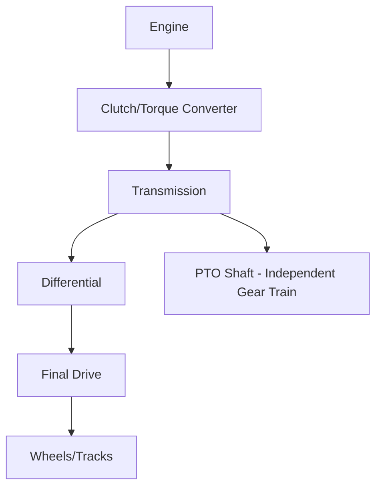
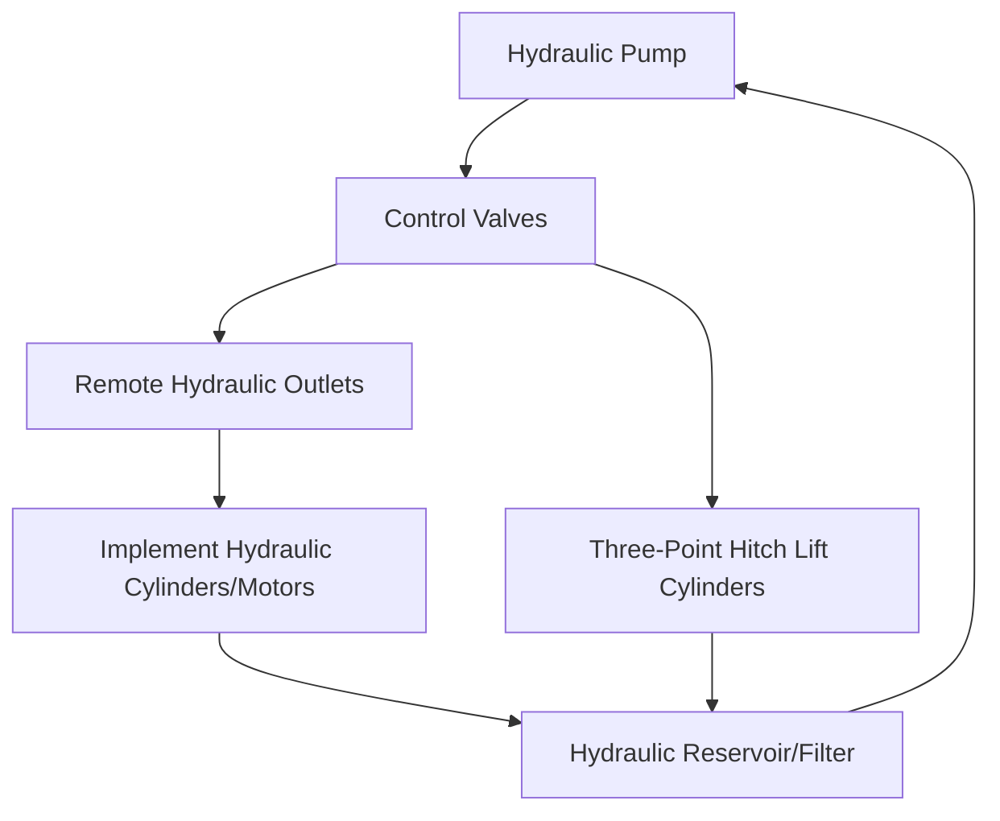
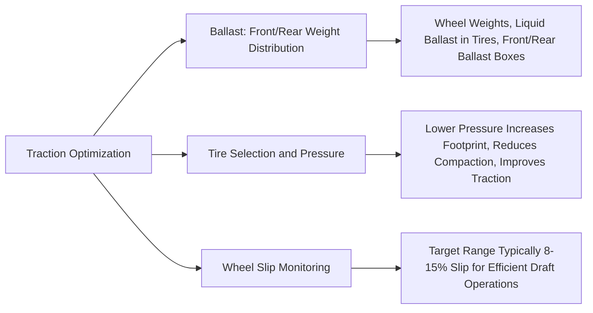
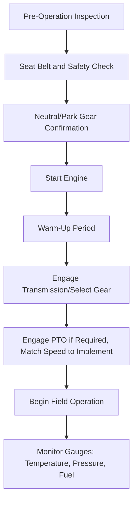

## Tractor Systems and Operation

### Overview

The agricultural tractor is the primary power source for field operations, integrating an engine, transmission, hydraulic system, power take-off (PTO), and hitching mechanisms to drive and power a wide range of implements. Understanding tractor systems requires examining both the power-generation and power-transfer subsystems, as well as operational practices that affect efficiency, safety, and equipment longevity.

**Key Points**

- Core subsystems: engine, drivetrain/transmission, hydraulic system, PTO, hitching/linkage system, and operator controls
- Power is transferred to implements via three primary paths: drawbar (pulling force), PTO (rotary power), and hydraulics (fluid power)
- Tractor selection and setup (ballast, tire pressure, gear/throttle combination) significantly affect fuel efficiency and traction performance
- Modern tractors increasingly integrate electronic control systems (engine management, precision guidance) alongside traditional mechanical systems

---

### Engine Systems

#### Engine Type and Configuration

Nearly all modern agricultural tractors use diesel compression-ignition engines due to their torque characteristics, fuel efficiency, and durability under sustained heavy loads relative to gasoline engines.

- **Naturally aspirated vs. turbocharged**: Turbocharging increases power density by forcing more air into the cylinder, common in modern mid-to-high horsepower tractors
- **Emissions control systems**: Modern diesel engines incorporate technologies such as diesel particulate filters (DPF), selective catalytic reduction (SCR, requiring diesel exhaust fluid/DEF), and exhaust gas recirculation (EGR) to meet emissions regulations (e.g., Tier 4 Final in the US, Stage V in the EU)

[Inference] Specific emissions technology combinations vary by manufacturer, engine size, and regional regulatory tier; current manufacturer documentation should be consulted for a specific model's configuration.

#### Power Ratings

- **Engine (gross) horsepower**: Maximum power output at the engine flywheel
- **PTO horsepower**: Power available at the PTO shaft after drivetrain losses, generally lower than gross engine horsepower
- **Drawbar horsepower**: Power available for pulling, further reduced by drivetrain and traction losses

$$\text{Drawbar HP} < \text{PTO HP} < \text{Gross Engine HP}$$

---

### Drivetrain and Transmission Systems

#### Transmission Types

- **Manual/synchromesh transmission**: Discrete gear ratios selected manually via clutch and gear lever; simpler and generally lower-cost but requires more operator skill for smooth ratio changes under load
- **Power shift transmission**: Allows gear changes under load without a clutch pedal (using hydraulic clutch packs), improving operational continuity during field work
- **Continuously variable transmission (CVT)**: Provides stepless speed adjustment via hydrostatic or hydro-mechanical power splitting, allowing precise speed matching to task (e.g., very slow speeds for planting) without discrete gear steps
- **Hydrostatic transmission**: Uses a hydraulic pump-motor combination for infinitely variable speed control, common in smaller/compact tractors and some specialized applications

#### Differential and Final Drive

- **Differential lock**: Mechanically locks both axle half-shafts together, preventing wheel slip differential loss when one wheel loses traction (e.g., in mud or on a slope), though it should generally be disengaged before turning to avoid drivetrain stress and reduced steering response
- **Final drive**: Gear reduction stage near the wheels providing the final torque multiplication before power reaches the wheel

#### Four-Wheel Drive (4WD/MFWD) Systems

Mechanical front-wheel-drive (MFWD) systems engage front axle drive for improved traction, particularly valuable in soft soil conditions, on slopes, or when pulling heavy draft loads; typically engaged/disengaged by the operator based on field conditions rather than remaining constantly engaged, since some designs experience increased tire scrubbing/wear during tight turns with 4WD engaged.

---

### Power Take-Off (PTO) System

The PTO transfers rotary mechanical power from the engine (via a dedicated gear train, largely independent of the main transmission) to a driveline connecting to an implement.

#### PTO Speed Standards

| PTO Type | Standard Speed (RPM) | Common Applications |
| --- | --- | --- |
| 540 | 540 | Smaller implements, older/lower-horsepower tractors |
| 540E (Economy) | 540 at reduced engine RPM | Fuel-efficient operation at 540 RPM equivalent |
| 1000 | 1000 | Larger, higher-power-demand implements |
| 1000E (Economy) | 1000 at reduced engine RPM | Fuel-efficient operation at 1000 RPM equivalent |

**Key Points**

- Matching implement PTO speed requirement to the correct tractor PTO setting is essential; mismatched speeds can cause implement damage or unsafe operation
- PTO shaft guards and shielding are critical safety components; PTO entanglement represents a well-documented serious injury risk in agricultural safety literature
- Independent PTO clutches allow PTO engagement/disengagement without affecting tractor ground travel, distinct from transmission-driven PTO designs on some older/simpler tractors

---

### Hydraulic System

#### Key Components

- **Hydraulic pump**: Typically gear, piston, or vane-type pumps generating fluid pressure and flow
- **Remote hydraulic outlets (SCVs)**: Selective control valves providing hydraulic power to external implement cylinders/motors (e.g., for loaders, cylinders on trailed implements)
- **Three-point hitch hydraulics**: Dedicated circuit controlling hitch lift arms
- **Load-sensing systems**: Modern hydraulic systems increasingly use load-sensing (flow-on-demand) architecture, adjusting pump output to actual demand rather than continuously running at maximum flow, improving fuel efficiency

#### Hydraulic Fluid Considerations

Fluid type (often shared with transmission/hydraulic common reservoir designs, though some tractors use separate systems) and maintenance intervals are manufacturer-specified; using incorrect fluid specification can affect seal compatibility and system performance. [Inference] Specific fluid specifications vary considerably by manufacturer and model; the operator's manual is the authoritative source for a given machine.

---

### Three-Point Hitch and Linkage System

#### Category Standards

Three-point hitches are standardized by category (0 through 4) based on tractor size/power, defining pin diameter and spacing to ensure implement compatibility.

| Category | Approximate Tractor Power Range | Common Application |
| --- | --- | --- |
| 0 | Under ~20 HP | Small compact/garden tractors |
| 1 | ~20–45 HP | Compact/utility tractors |
| 2 | ~40–100 HP | Mid-size utility tractors |
| 3 | ~80–225 HP | Large row-crop tractors |
| 4 | Over ~180 HP | High-horsepower tractors |

[Inference] Power range boundaries are approximate and vary by manufacturer/regional convention; the category is fundamentally defined by physical pin dimensions rather than a strict horsepower cutoff.

#### Draft Control and Position Control

- **Position control**: Maintains a fixed implement height/position regardless of soil resistance variation, suited to operations requiring consistent depth (e.g., some tillage, seeding)
- **Draft control**: Automatically adjusts implement depth in response to sensed draft load (pulling resistance), helping maintain more consistent engine load and traction across variable soil conditions, commonly used for primary tillage implements like moldboard or chisel plows

---

### Ballast and Traction Management

- **Ballasting**: Adding weight (wheel weights, liquid ballast such as water/calcium chloride solution in tires, or ballast boxes) improves traction for heavy draft operations, but excess ballast increases fuel consumption and soil compaction risk during transport or light-draft tasks
- **Tire inflation pressure**: Lower pressure increases the tire footprint, improving traction and reducing soil compaction, but excessively low pressure risks tire damage/instability; correct pressure is load- and speed-dependent per tire manufacturer charts
- **Wheel slip target**: [Inference] Commonly cited efficient operating range for drawbar work is approximately 8–15% slip, varying somewhat by soil type and source; excessive slip indicates insufficient traction (wasted fuel, increased tire wear) while very low/zero slip on heavy draft work may indicate under-ballasting is not the limiting factor or that further ballast would not meaningfully improve efficiency

---

### Illustrative Power Transfer Pathways Diagram

<svg xmlns="http://www.w3.org/2000/svg" viewBox="0 0 500 300">
<title>Tractor Power Transfer Pathways (svg_diagram)</title>
<rect x="180" y="20" width="140" height="50" fill="#e76f51" stroke="#333" stroke-width="1.5" />
<text x="250" y="50" font-size="13" text-anchor="middle" fill="white">Diesel Engine</text>
<line x1="250" y1="70" x2="100" y2="120" stroke="#333" stroke-width="2" marker-end="url(#a5)" />
<line x1="250" y1="70" x2="250" y2="120" stroke="#333" stroke-width="2" marker-end="url(#a5)" />
<line x1="250" y1="70" x2="400" y2="120" stroke="#333" stroke-width="2" marker-end="url(#a5)" />
<rect x="30" y="120" width="140" height="50" fill="#2a9d8f" stroke="#333" />
<text x="100" y="140" font-size="11" text-anchor="middle" fill="white">Drawbar</text>
<text x="100" y="157" font-size="10" text-anchor="middle" fill="white">(Transmission/Wheels)</text>
<rect x="180" y="120" width="140" height="50" fill="#e9c46a" stroke="#333" />
<text x="250" y="140" font-size="11" text-anchor="middle">PTO</text>
<text x="250" y="157" font-size="10" text-anchor="middle">(Rotary Power)</text>
<rect x="330" y="120" width="140" height="50" fill="#a8dadc" stroke="#333" />
<text x="400" y="140" font-size="11" text-anchor="middle">Hydraulics</text>
<text x="400" y="157" font-size="10" text-anchor="middle">(Fluid Power)</text>
<line x1="100" y1="170" x2="100" y2="220" stroke="#333" stroke-width="1.5" marker-end="url(#a5)" />
<line x1="250" y1="170" x2="250" y2="220" stroke="#333" stroke-width="1.5" marker-end="url(#a5)" />
<line x1="400" y1="170" x2="400" y2="220" stroke="#333" stroke-width="1.5" marker-end="url(#a5)" />
<text x="100" y="240" font-size="10" text-anchor="middle">Pulling Implements</text>
<text x="250" y="240" font-size="10" text-anchor="middle">Rotary Implements</text>
<text x="400" y="240" font-size="10" text-anchor="middle">Cylinders/Loaders</text>
</svg>

---

### Operator Controls and Pre-Operation Procedures

#### Standard Pre-Operation Checks

- Engine oil, coolant, and hydraulic fluid levels
- Tire condition and inflation pressure
- PTO shield/guard integrity
- Brake and steering function checks (typically at low speed, in a clear area)
- Visual inspection for fluid leaks and loose/damaged components

#### Starting and Operating Sequence

#### Gear and Throttle Selection

Matching engine RPM and gear ratio to the task (rather than running at maximum throttle regardless of load) improves fuel efficiency; many modern tractors provide an "economy" PTO setting or engine management mode allowing reduced engine RPM at rated PTO speed for fuel savings during lighter-load PTO operations.

---

### Safety Considerations

- **Rollover protective structure (ROPS)**: Combined with seat belt use, ROPS is a primary mitigation against rollover fatality risk, one of the most significant tractor-related injury categories documented in agricultural safety data
- **PTO shielding**: Master shields and implement-side guards must remain in place; loose clothing near an operating PTO shaft presents an entanglement hazard
- **Slow-moving vehicle (SMV) emblem and road lighting**: Required in many jurisdictions for tractors operating on public roads, given the speed differential with other traffic
- **Bystander/extra rider policy**: Most manufacturer guidance and safety programs recommend against carrying extra riders unless the tractor has a designed passenger seat, due to fall/crush injury risk

[Inference] Specific regulatory requirements for road operation (lighting, SMV emblems, licensing) vary by jurisdiction; local transport regulations should be consulted.

---

### Maintenance Fundamentals

| System | Typical Maintenance Task | Approximate Interval Basis |
| --- | --- | --- |
| Engine oil/filter | Change per manufacturer schedule | Operating hours (varies by model/oil type) |
| Air filter | Inspect/clean or replace | Operating hours or visual restriction indicator |
| Hydraulic/transmission fluid | Change and filter replacement | Operating hours per manufacturer schedule |
| Coolant system | Level check, periodic flush | Operating hours/seasonal |
| Grease points | Lubricate per grease chart | Frequently (daily to weekly during active use) |

[Inference] Exact intervals are manufacturer- and model-specific, often expressed in engine operating hours rather than calendar time; the operator's manual and manufacturer maintenance schedule are the authoritative reference.

---

**Related Topics**

- Implement hitching systems and three-point hitch category compatibility
- Precision agriculture guidance systems (GPS/RTK auto-steer integration)
- Tractor safety programs and ROPS/PTO injury prevention
- Diesel engine emissions technology (SCR, DPF, Tier/Stage regulations)
- Soil compaction management and tire/traction optimization
- Hydraulic system troubleshooting and load-sensing architecture
- Preventive maintenance scheduling for farm machinery
- Implement power and speed matching (PTO-driven equipment selection)