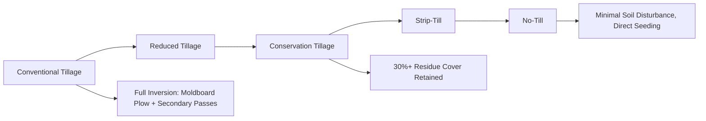
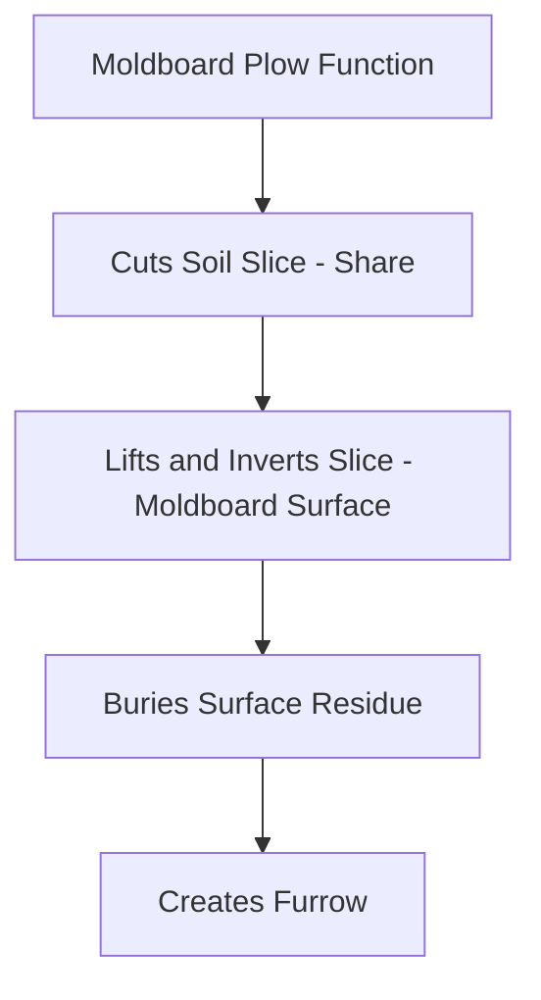
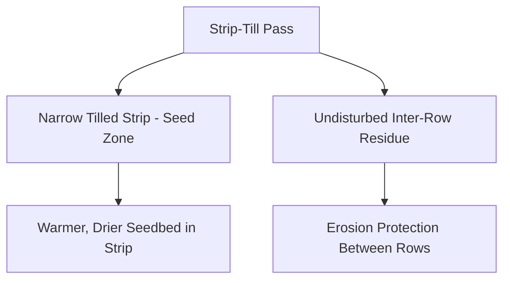

## Tillage Equipment and Practices

### Overview

Tillage is the mechanical manipulation of soil to prepare a seedbed, manage residue, incorporate amendments, and control weeds. Equipment and practices span a continuum from intensive full-inversion primary tillage to no-till systems that leave soil largely undisturbed. Equipment selection interacts closely with soil type, moisture conditions, crop rotation, and conservation goals such as erosion control and organic matter retention.

**Key Points**

- Tillage is broadly categorized as primary (deep, aggressive, breaks up soil structure) or secondary (shallower, seedbed refinement)
- The tillage intensity continuum ranges from conventional (full inversion) through reduced/conservation tillage to no-till
- Equipment choice affects residue management, soil erosion risk, fuel consumption, and soil compaction patterns
- No single tillage system is universally optimal; suitability depends on soil type, climate, crop, and management goals

---

### Tillage Intensity Continuum

**Key Points**

- Conservation tillage is generally defined by residue cover thresholds (commonly ≥30% surface residue after planting) rather than a specific implement type
- Reduced intensity generally correlates with lower fuel consumption per pass and reduced erosion risk, but may require greater reliance on herbicides for weed control in the absence of mechanical incorporation
- [Inference] Optimal position on this continuum is highly site-specific; heavy, poorly drained soils in cool climates sometimes retain a documented agronomic case for periodic tillage that lighter, well-drained soils may not require

---

### Primary Tillage Equipment

Primary tillage operations are typically deeper, more aggressive, and performed less frequently (often once per season or rotation cycle) to break up compacted layers, incorporate crop residue, or invert the soil profile.

#### Moldboard Plow

- **Mechanism**: The share cuts a horizontal slice of soil, which the curved moldboard surface then lifts, turns, and inverts, burying surface residue and exposing subsoil
- **Depth range**: [Inference] Commonly 15–30 cm depending on soil type and power availability, though specific depth targets vary by region and soil condition
- **Advantages**: Effective residue burial, weed seed burial, break-up of compacted layers
- **Disadvantages**: High fuel/power requirement, leaves soil bare and highly susceptible to erosion until secondary tillage/planting, can accelerate organic matter oxidation

#### Chisel Plow

- **Mechanism**: Uses shank-mounted points/shovels to fracture and lift soil without full inversion, leaving significant residue on the surface
- **Depth range**: Similar to or slightly shallower than moldboard plowing in many applications
- **Advantages**: Retains more residue cover than moldboard plowing (reducing erosion risk), lower power requirement per unit depth than full inversion
- **Disadvantages**: Less effective at burying residue, weed seed, or incorporating surface-applied amendments compared to moldboard plowing

#### Disk Plow/Heavy Offset Disk

- **Mechanism**: Large concave disk blades cut and partially invert soil; heavy offset disks are commonly used for initial breakup of heavy residue or sod
- **Applications**: Effective in conditions where moldboard plows struggle (e.g., very dry, hard soil; heavy sod breaking), and for initial residue sizing ahead of other tillage

#### Subsoiler/Ripper

- **Mechanism**: Deep, narrow shanks (often 30–60+ cm depth) fracture compacted soil layers (plow pans, traffic-induced compaction) with minimal surface disturbance and residue disruption relative to depth achieved
- **Application timing**: Most effective when soil moisture is at or below field capacity in the compacted zone, since fracturing occurs through shattering rather than plastic deformation; operating in overly wet conditions can smear rather than fracture the compacted layer

---

### Secondary Tillage Equipment

Secondary tillage operations refine the seedbed after primary tillage, typically shallower and less power-intensive.

#### Disk Harrow (Tandem/Offset)

- **Mechanism**: Gangs of concave disk blades break up clods, mix residue into the surface layer, and level the field surface
- **Applications**: Common seedbed preparation pass following primary tillage or for shallow residue incorporation without a preceding primary pass

#### Field Cultivator

- **Mechanism**: Sweeps or shovels mounted on a rigid or flexible frame, often paired with rolling baskets or harrows, providing shallow cultivation for seedbed finishing and weed control between primary tillage and planting

#### Spring-Tooth/Spike-Tooth Harrow

- **Mechanism**: Flexible tines that break surface crusting, level soil, and provide light incorporation, typically used as a final seedbed finishing pass

#### Rotary Tiller (Power Take-Off Driven)

- **Mechanism**: PTO-driven rotating tines create a fine, level seedbed in a single pass, common in smaller-scale, horticultural, or specialty crop production where a very fine tilth is required
- **Considerations**: Higher power-per-width requirement than passive (ground-driven) implements; repeated use at consistent depth can contribute to a compacted "tillage pan" at the operating depth

---

### Conservation Tillage Systems

#### Strip-Till

- **Mechanism**: Tills only a narrow strip (commonly 15–25 cm wide) where the seed row will be placed, leaving inter-row residue and soil structure undisturbed
- **Advantages**: Combines seedbed warming/drying benefits of tillage (beneficial in cool, wet spring conditions) with erosion protection benefits of residue retention between rows
- **Equipment specifics**: Often combines a coulter, row cleaner, shank, and berming discs in a single toolbar pass; some systems apply banded fertilizer in the same operation

#### No-Till

- **Mechanism**: Seed is placed directly into undisturbed soil/residue using specialized no-till planters/drills with coulters and heavy down-pressure to cut through residue and achieve seed-to-soil contact
- **Advantages**: Minimal soil disturbance preserves soil structure, maximizes erosion protection, generally reduces fuel consumption and labor per season, can improve long-term soil organic matter and water infiltration
- **Challenges**: Requires greater reliance on herbicides for weed control absent mechanical incorporation, can present cooler/wetter spring seedbed conditions in some climates (potentially delaying planting), and residue management (uniform spreading from the prior harvest) becomes critical to successful no-till establishment

---

### Tillage Equipment Comparison

| Equipment | Category | Typical Depth | Residue Retention | Primary Use Case |
| --- | --- | --- | --- | --- |
| Moldboard plow | Primary | Deep (15–30 cm) | Low | Full inversion, residue/weed burial |
| Chisel plow | Primary | Moderate–deep | Moderate–high | Fracture soil, retain more residue |
| Disk plow | Primary | Moderate | Low–moderate | Heavy residue/sod breakup |
| Subsoiler/ripper | Primary | Very deep (30–60+ cm) | High | Compaction fracture, minimal disturbance |
| Disk harrow | Secondary | Shallow–moderate | Moderate | Seedbed finishing, residue mixing |
| Field cultivator | Secondary | Shallow | Moderate–high | Seedbed finishing, weed control |
| Rotary tiller | Secondary | Shallow | Low | Fine seedbed, horticultural use |
| Strip-till unit | Conservation | Narrow strip only | High (inter-row) | Seed zone prep with residue retention |
| No-till drill/planter | Conservation | Seed slot only | Very high | Direct seeding, minimal disturbance |

---

### Soil and Environmental Considerations

#### Compaction Risk

- **Tillage pan formation**: Repeated operation at the same depth (particularly with rotary tillers or disk implements) can create a compacted layer at the tillage boundary, restricting root penetration and water movement
- **Traffic-induced compaction**: Wheel traffic during tillage operations (particularly under wet conditions) can compact soil independently of the tillage tool's direct action; controlled traffic farming (restricting wheel paths to defined lanes) is one mitigation approach

#### Erosion Considerations

- Bare, tilled soil is substantially more vulnerable to both wind and water erosion than residue-covered soil, particularly during the period between tillage and canopy closure
- Conservation tillage/no-till systems are widely adopted specifically to address erosion concerns in vulnerable landscapes (sloped fields, erodible soil types, high-erosivity rainfall regions)

#### Soil Moisture and Temperature Effects

- Tillage generally dries and warms the seedbed relative to undisturbed residue-covered soil, which can be agronomically advantageous in cool, wet spring conditions but disadvantageous in moisture-limited environments where residue-conserved soil moisture supports crop establishment

---

### Illustrative Tillage Depth Profile Diagram

<svg xmlns="http://www.w3.org/2000/svg" viewBox="0 0 500 300">
<title>Comparative Tillage Depth and Disturbance Profile (svg_diagram)</title>
<rect x="20" y="20" width="460" height="260" fill="#f4f1de" stroke="#333" stroke-width="1" />
<line x1="20" y1="80" x2="480" y2="80" stroke="#8B5E3C" stroke-width="1" stroke-dasharray="3,3" />
<text x="460" y="75" font-size="9" fill="#555">Surface</text>
<rect x="50" y="80" width="60" height="130" fill="#e76f51" opacity="0.7" />
<text x="80" y="225" font-size="9" text-anchor="middle">Moldboard</text>
<text x="80" y="237" font-size="9" text-anchor="middle">(full invert)</text>
<rect x="140" y="80" width="60" height="100" fill="#e9c46a" opacity="0.7" />
<text x="170" y="195" font-size="9" text-anchor="middle">Chisel</text>
<rect x="230" y="80" width="60" height="60" fill="#a8dadc" opacity="0.7" />
<text x="260" y="155" font-size="9" text-anchor="middle">Disk/Field</text>
<text x="260" y="167" font-size="9" text-anchor="middle">Cultivator</text>
<rect x="320" y="80" width="30" height="45" fill="#2a9d8f" opacity="0.8" />
<text x="335" y="140" font-size="9" text-anchor="middle">Strip-</text>
<text x="335" y="151" font-size="9" text-anchor="middle">Till</text>
<rect x="380" y="80" width="10" height="15" fill="#264653" />
<text x="385" y="110" font-size="9" text-anchor="middle">No-Till</text>
<text x="385" y="122" font-size="9" text-anchor="middle">(seed slot)</text>
<rect x="410" y="90" width="60" height="20" fill="#264653" opacity="0.9" />
<text x="440" y="103" font-size="8" text-anchor="middle" fill="white">Subsoiler shank</text>
<line x1="440" y1="110" x2="440" y2="260" stroke="#264653" stroke-width="6" />
<text x="440" y="275" font-size="8" text-anchor="middle">Deep, narrow</text>
</svg>

---

### Implement Selection Decision Factors

- **Soil texture**: Heavy clay soils may benefit more from periodic deep tillage/subsoiling to address compaction; sandy soils generally show lower compaction risk and may transition to reduced tillage more readily
- **Crop rotation and residue volume**: High-residue crops (e.g., maize) may require more aggressive residue sizing/incorporation than low-residue crops if transitioning between systems
- **Field topography**: Sloped, erosion-prone fields favor reduced tillage/no-till systems
- **Weed pressure and herbicide resistance status**: Fields with herbicide-resistant weed populations may retain a stronger agronomic case for mechanical weed control via tillage as part of an integrated resistance management strategy
- **Equipment and labor availability**: Transitioning tillage systems often requires different (and sometimes additional) specialized equipment (e.g., no-till drills, strip-till toolbars) representing a capital investment consideration

---

**Related Topics**

- Soil compaction management and controlled traffic farming
- Cover cropping integration with reduced/no-till systems
- Herbicide-based weed control and resistance management
- Soil erosion control practices and buffer strip design
- Tractor systems and power requirements for tillage implements
- Precision planting and no-till seeding equipment
- Soil organic matter dynamics under varying tillage intensity
- Crop residue management and decomposition rates