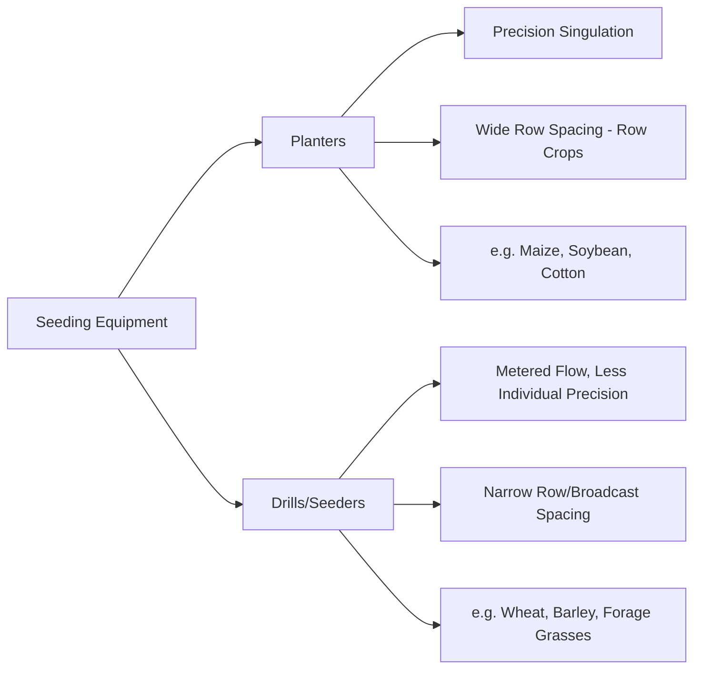
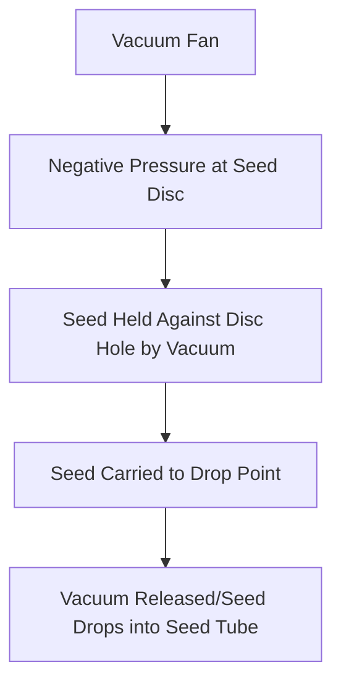
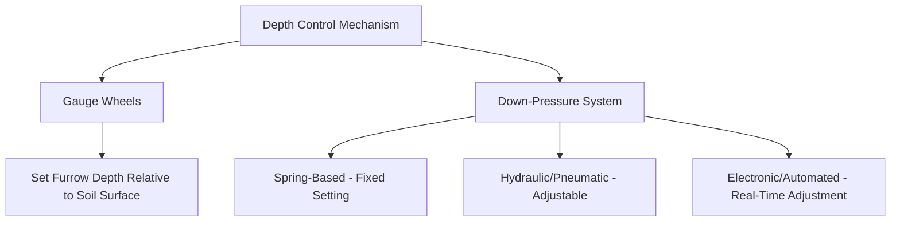
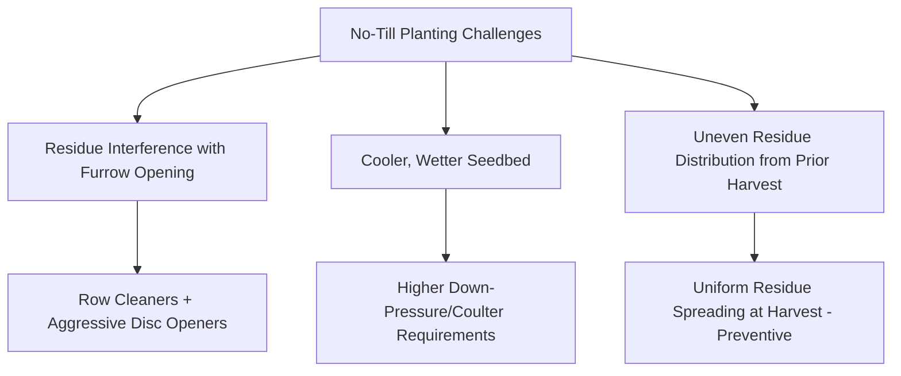

## Planting and Seeding Equipment

### Overview

Planting and seeding equipment establishes crop stands by placing seed at controlled depth, spacing, and population into a prepared or unprepared seedbed. Equipment design varies substantially by crop type (row crops vs. small grains), seed size/shape, and tillage system compatibility. Precision of seed placement directly affects emergence uniformity, stand establishment, and ultimately yield potential.

**Key Points**

- Two broad equipment categories: planters (precision, individual seed placement, typically row crops) and drills/seeders (metered but less individually precise, typically small grains/dense stands)
- Core functional subsystems across most equipment: seed metering, seed delivery/tube, furrow opening, seed covering, and down-pressure/depth control
- Equipment compatibility with tillage system (conventional, strip-till, no-till) depends heavily on furrow-opening and residue-handling components
- Modern equipment increasingly integrates electronic seed metering and monitoring, replacing older ground-driven mechanical systems

---

### Planter vs. Drill: Core Distinction

- **Planters** singulate individual seeds and place them at precise, evenly-spaced intervals within the row, suited to larger-seeded row crops where per-plant spacing significantly affects yield (e.g., maize, soybean, cotton, sunflower)
- **Drills/seeders** meter a continuous or near-continuous seed flow into narrowly spaced rows or a broadcast pattern, suited to crops planted at high population density where individual seed spacing precision is less agronomically critical (e.g., wheat, barley, many forage species)

---

### Seed Metering Systems

#### Mechanical (Plate) Metering

- **Mechanism**: A rotating plate with seed-sized cells picks up and releases seeds via gravity/agitation as the plate rotates, ground-driven via chain/gear linkage to travel speed
- **Considerations**: Plate cell size must match seed size; performance can be sensitive to seed shape irregularity and requires plate changes for different seed sizes

#### Vacuum (Pneumatic) Metering

- **Mechanism**: A rotating disc with holes uses vacuum (negative air pressure) to hold individual seeds against disc apertures, releasing them at a defined drop point as vacuum is interrupted
- **Advantages**: Generally provides higher singulation accuracy across a range of seed sizes/shapes compared to purely mechanical plate systems, widely adopted in modern row-crop planters
- **Considerations**: Requires a functioning vacuum fan/blower system and consistent seed lot quality (uniform size, minimal debris) for optimal singulation performance

#### Finger Pickup Metering

- **Mechanism**: Spring-loaded fingers pick individual seeds from a seed pool and release them at the drop point, an alternative precision metering approach to vacuum systems
- **Applications**: Historically common in row-crop planters, still used in some current equipment as an alternative to vacuum metering

#### Fluted/Cell Wheel Metering (Drills)

- **Mechanism**: Rotating fluted or cell wheels meter a continuous or semi-continuous seed flow rate proportional to rotation speed, common in grain drills where individual seed singulation precision is not the design goal
- **Rate adjustment**: Typically via gearbox/sprocket ratio changes or, in modern electric-drive systems, via variable-speed electric motor control

#### Electric Drive Metering

Modern planters increasingly use individually electric-motor-driven metering units (row-by-row) rather than a single ground-driven shaft, enabling:

- Independent rate control per row (supporting variable-rate and multi-hybrid/variety planting)
- Consistent metering speed independent of instantaneous wheel slip/speed fluctuation
- Faster planting speeds while maintaining singulation accuracy, a capability increasingly marketed by major planter manufacturers [Inference, as specific speed/accuracy performance claims are manufacturer- and model-specific and should be verified against current published specifications]

---

### Furrow Opening and Seed Placement

#### Double-Disc Openers

- **Mechanism**: Two angled discs meet at a point, cutting a V-shaped furrow into which seed is dropped
- **Applications**: Common across both planters and no-till drills; effective across a range of soil conditions and moderate residue levels

#### Hoe/Shoe Openers

- **Mechanism**: A rigid or spring-loaded shoe/hoe point displaces soil to form the furrow rather than cutting with discs
- **Applications**: More common in drills for small grains, particularly effective in looser, well-prepared seedbeds; generally less residue-tolerant than disc openers in heavy no-till residue conditions

#### Row Cleaners

Mounted ahead of the furrow opener, row cleaners (star wheels or similar) move surface residue away from the seed row without significantly disturbing soil, improving furrow opener function and seed-to-soil contact in high-residue no-till/strip-till conditions.

---

### Depth Control and Down-Pressure Systems

- **Gauge wheels**: Ride alongside the furrow opener disc(s), setting furrow depth relative to the soil surface independent of planter frame position
- **Down-pressure systems**: Apply force to maintain consistent furrow depth across variable soil conditions/residue/compaction within a field
  - **Spring-based**: Fixed mechanical setting, simplest but least adaptive to within-field variability
  - **Hydraulic/pneumatic**: Adjustable pressure setting, allowing operator adjustment for different field/soil conditions between passes
  - **Automated/sensor-based**: Modern systems use load sensors to automatically adjust down-pressure row-by-row in real time, responding to instantaneous soil resistance variation within a single pass

**Key Points**

- Insufficient down-pressure in hard/compacted soil zones results in shallow, inconsistent seed placement and poor seed-to-soil contact
- Excessive down-pressure, particularly in wet or loose soil, can cause sidewall compaction (smearing of the furrow wall), potentially restricting root development
- Uniform emergence timing across a field is strongly influenced by depth placement consistency, since seeds at inconsistent depths experience different soil temperature/moisture conditions and emerge at different times

---

### Seed Covering and Closing Systems

- **Press wheels**: Firm soil over the seed furrow, ensuring seed-to-soil contact necessary for moisture uptake and germination
- **Closing wheels (angled or spoked)**: Specifically designed to close the furrow (particularly important in no-till, where firm/high-residue soil can otherwise leave the furrow partially open) without excessive compaction directly over the seed
- **Drag chains/finishing attachments**: Some planters/drills include trailing chains or harrows for light surface leveling behind the row unit

---

### Row Spacing and Configuration

| Crop Category | Typical Row Spacing Range | Equipment Type |
| --- | --- | --- |
| Maize (row crop) | 50–100 cm (commonly ~75–80 cm in many regions) | Row-crop planter |
| Soybean | Narrow to standard row (varies by region/practice) | Row-crop planter or narrow-row drill |
| Wheat/small grains | Narrow, closely spaced rows | Grain drill |
| Cotton | Wide row spacing similar to maize range | Row-crop planter |

[Inference] Specific row spacing conventions vary considerably by region, equipment availability, and agronomic practice; local extension recommendations reflect regional optimization for the specific crop and climate.

---

### Variable-Rate and Multi-Hybrid Planting

Building on electric-drive metering capability, modern planters can integrate with prescription maps (similar to variable-rate fertilizer application) to:

- Adjust seeding population by zone based on soil productivity potential
- Switch between two seed varieties/hybrids row-by-row or section-by-section within a single pass (multi-hybrid planting), matching genetics to zone-specific characteristics (e.g., drought tolerance in lower-productivity zones)

[Inference] Multi-hybrid and variable-rate planting adoption and specific system capabilities are evolving rapidly with manufacturer product cycles; current equipment specifications should be verified against manufacturer documentation for a specific model.

---

### No-Till and High-Residue Planting Considerations

- No-till planters typically require heavier frames, stronger down-pressure systems, and often coulters (a rotating disc ahead of the opener) to cut through residue and firm soil compared to conventional-till planters
- Uniform residue distribution from the combine at the prior harvest is a preventive factor significantly affecting subsequent no-till planting success, since clumped residue causes hair-pinning (residue folded into the furrow rather than cleanly cut) and poor seed-to-soil contact

---

### Illustrative Planter Row Unit Cross-Section

<svg xmlns="http://www.w3.org/2000/svg" viewBox="0 0 500 300">
<title>Row Unit Components - Precision Planter (svg_diagram)</title>
<rect x="20" y="20" width="460" height="260" fill="#f4f1de" stroke="#333" stroke-width="1" />
<circle cx="100" cy="90" r="30" fill="#a8dadc" stroke="#333" stroke-width="1.5" />
<text x="100" y="60" font-size="10" text-anchor="middle">Row Cleaner</text>
<circle cx="180" cy="130" r="25" fill="#e9c46a" stroke="#333" stroke-width="1.5" transform="rotate(15 180 130)" />
<circle cx="200" cy="130" r="25" fill="#e9c46a" stroke="#333" stroke-width="1.5" opacity="0.8" transform="rotate(-15 200 130)" />
<text x="190" y="100" font-size="10" text-anchor="middle">Double-Disc Opener</text>
<line x1="190" y1="155" x2="190" y2="200" stroke="#8B5E3C" stroke-width="3" />
<circle cx="190" cy="205" r="6" fill="#264653" />
<text x="190" y="225" font-size="9" text-anchor="middle">Seed</text>
<rect x="230" y="145" width="40" height="55" fill="#2a9d8f" stroke="#333" stroke-width="1.5" />
<text x="250" y="215" font-size="9" text-anchor="middle">Gauge Wheel</text>
<circle cx="330" cy="185" r="30" fill="#e76f51" stroke="#333" stroke-width="1.5" />
<text x="330" y="230" font-size="10" text-anchor="middle">Closing Wheel</text>
<circle cx="410" cy="200" r="25" fill="#264653" stroke="#333" stroke-width="1.5" />
<text x="410" y="240" font-size="10" text-anchor="middle" fill="#264653">Press Wheel</text>
<line x1="20" y1="260" x2="480" y2="260" stroke="#8B5E3C" stroke-width="2" stroke-dasharray="4,2" />
<text x="460" y="255" font-size="9" fill="#555">Soil surface</text>
</svg>

---

### Calibration and Field Verification

- **Seed rate calibration**: Verifying actual metered seed drop rate against target population, either via manufacturer-provided calibration charts (mechanical systems) or electronic monitor readouts (modern precision systems), rather than assuming factory settings match field conditions without verification
- **Stand establishment assessment**: Post-emergence field checks (population counts, spacing uniformity assessment) validate whether equipment setup achieved the intended stand, informing adjustments for subsequent fields or seasons
- **Singulation/skip-and-multiple monitoring**: Modern electronic planter monitors track individual row seed spacing in real time, flagging skips (missed seed placement) and multiples (two seeds dropped together) that reduce effective population uniformity

---

**Related Topics**

- Tillage equipment and practices (seedbed preparation interaction)
- Precision agriculture and variable-rate seeding technology
- Seed quality, germination testing, and seed treatment
- Crop stand establishment and emergence uniformity assessment
- No-till system management and residue distribution at harvest
- Row spacing agronomy and plant population optimization
- Tractor systems and PTO/hydraulic power requirements for seeding equipment
- Multi-hybrid and zone-based planting strategies