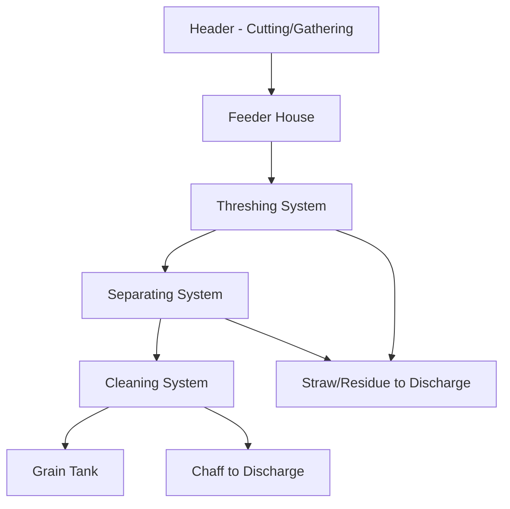
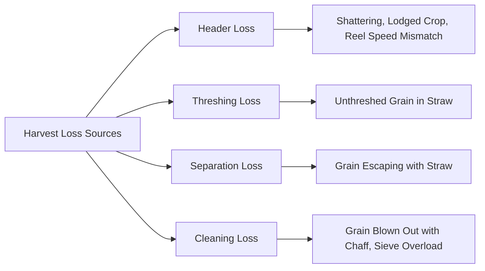
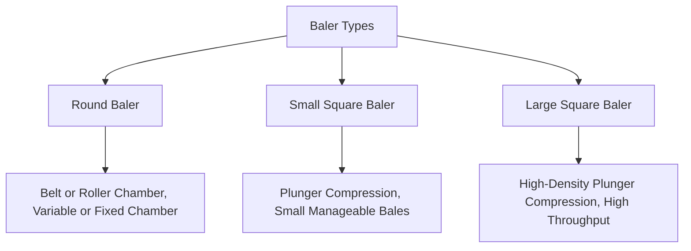

## Harvesting Machinery

### Overview

Harvesting machinery mechanically separates, collects, and processes mature crops from the field, replacing manual harvest labor at scale. Equipment design varies substantially by crop category — grain, forage, root/tuber, and specialty/fruit crops each demand distinct header, separation, and handling mechanisms. The combine harvester represents the dominant integrated machine for cereal and oilseed crops, performing cutting, threshing, separating, and cleaning in a single pass.

**Key Points**

- Core harvest functions across most grain machinery: cutting/gathering, threshing (separating grain from plant material), separating (removing grain from straw/chaff), and cleaning (removing remaining debris)
- Header type is crop-specific and typically the most frequently changed component to adapt a combine to different crops
- Harvest losses occur at multiple stages (header, threshing, separation, cleaning) and are measurable/manageable through proper machine setup
- Timing, moisture content, and machine settings interact significantly; correct settings for one crop/condition are not universally transferable

---

### Combine Harvester: Core Functional Systems

#### Header Systems

- **Grain platform (cutter bar) header**: Horizontal sickle bar cuts standing crop at ground level, with a reel sweeping cut material onto the platform auger; suited to small grains (wheat, barley) and can handle downed/lodged crop with reel adjustment
- **Row-crop header (corn head)**: Individual row units with gathering chains and snapping rolls strip ears from stalks (for maize) while leaving stalks standing or feeding them through, distinct in mechanism from platform headers
- **Draper header**: Uses a fabric/belt conveyor system instead of an auger to move cut crop toward the feeder house, generally providing gentler material handling and improved feeding uniformity, particularly valued in canola/specialty crop harvest and increasingly adopted for cereals
- **Flex header**: Platform header with flexible cutter bar that follows ground contour, used for low-growing crops like soybeans where cutting height must closely track uneven ground

#### Threshing System

- **Rasp bar/rotary threshing cylinder**: Conventional combines use a transverse rotating cylinder with rasp bars striking crop material against a concave (perforated curved surface) to separate grain from the head/pod
- **Rotor-based (axial-flow) systems**: Use one or two longitudinally mounted rotors performing combined threshing and separation functions along a helical path, an alternative architecture to conventional cylinder-and-straw-walker designs
- **Concave clearance and cylinder/rotor speed**: Adjustable settings controlling threshing aggressiveness; excessive aggressiveness causes grain damage/cracking, insufficient aggressiveness leaves grain unthreshed in the material

#### Separating System

- **Straw walkers**: Conventional design using reciprocating perforated walker sections to agitate straw, allowing remaining grain to fall through to the cleaning system while straw is conveyed to the rear for discharge/chopping
- **Rotary separation**: Axial-flow/rotary combines integrate separation into the rotor's helical action rather than using discrete straw walkers, often achieving different capacity/loss characteristics under high-yield or high-moisture conditions [Inference, as comparative performance depends heavily on crop condition, and manufacturer-specific design details vary]

#### Cleaning System

- **Sieves/chaffer**: Oscillating perforated sieves stratify material, allowing grain to fall through while larger chaff/straw material is carried over the sieve end for discharge
- **Cleaning fan**: Provides airflow lifting lighter chaff material off the sieves while heavier grain falls through, working in combination with sieve opening settings

---

### Combine Setup and Loss Management

**Key Points**

- Header losses are frequently the largest loss category in many harvest situations, particularly with pod-shatter-prone crops (e.g., soybeans, canola) or lodged/downed crop conditions
- Ground speed, reel speed, cylinder/rotor speed, concave clearance, fan speed, and sieve opening are interdependent settings; changing one often requires re-evaluating others to maintain balanced performance
- Field loss monitoring (drop pan tests or built-in yield/loss monitor sensors) provides quantitative feedback for adjusting settings rather than relying solely on visual estimation

**Example**

A grower harvesting soybeans in dry, brittle-pod conditions might reduce ground speed and reduce reel speed relative to ground speed (to minimize header agitation causing pod shatter) even though this reduces harvest capacity, prioritizing loss reduction over throughput under high-shatter-risk conditions.

---

### Grain Moisture and Harvest Timing

- Grain moisture content at harvest affects both storage stability (requiring drying if above safe storage moisture) and machine threshing efficiency (very dry grain increases shatter/cracking risk, while excessively wet/immature grain resists clean threshing)
- Target harvest moisture windows are crop-specific and commonly informed by regional agronomic guidance balancing field drydown time against weathering/lodging risk from delayed harvest
- [Inference] Specific optimal moisture ranges vary by crop, variety, and end-use requirement (e.g., seed grain vs. feed grain vs. milling grain); current regional extension guidance provides more precise, locally calibrated targets than generic reference ranges

---

### Forage Harvesting Equipment

#### Mower/Mower-Conditioner

- **Disc or drum mower**: Rotating disc/drum-mounted blades cut standing forage; disc mowers are common due to good performance across varying crop conditions and reduced susceptibility to damage from foreign objects compared to older reciprocating sickle designs
- **Conditioning rolls/flails**: Following the cutting mechanism, conditioning rolls crimp/crush stems (or flail conditioners abrade the stem surface) to accelerate field drydown by disrupting the waxy cuticle layer

#### Rake

Rakes gather cut/wilted forage into a windrow for subsequent baling or chopping, using rotary, wheel, or belt mechanisms depending on design; raking timing and technique affect leaf loss (particularly significant in legume forages like alfalfa where leaves carry disproportionate nutritive value).

#### Baler

- **Round baler**: Forms cylindrical bales via belt, chain-and-slat, or roller mechanisms rolling material into a compact cylinder, widely used for hay/forage storage in many regions due to weather-shedding bale shape and relatively simple mechanism
- **Square balers (small and large)**: Use a reciprocating plunger to compress material into rectangular bales, offering more efficient stacking/transport density than round bales, with large square balers achieving substantially higher density and throughput for commercial-scale forage handling

#### Forage Harvester (Chopper)

Self-propelled or pull-type forage harvesters cut and chop standing or windrowed crop (whole-plant silage corn, chopped hay, or direct-cut forage) into small particle-size pieces for silage fermentation or direct feeding, using a cutterhead (flywheel or drum-mounted knives) against a shear bar, with chop length adjustable via feed roll speed relative to cutterhead rotation speed.

---

### Root and Tuber Harvesting Equipment

- **Potato harvester**: Digs tubers from soil (typically via a share/blade lifting the row), separates soil/vines from tubers using shaking/vibrating conveyor chains and sometimes airflow, delivering cleaned tubers to a hopper or accompanying truck
- **Sugar beet harvester**: Combines topping (removing leafy crown), lifting (extracting root from soil), and cleaning functions, often in a single self-propelled machine for large-scale production
- [Inference] Specific mechanism details vary considerably by manufacturer and machine scale (small-plot research equipment vs. large commercial harvesters); this represents general functional categories rather than an exhaustive equipment survey

---

### Specialty and Fruit Harvesting Equipment

- **Mechanical shake harvesters**: Used for tree fruits/nuts (e.g., almonds, some stone fruits) where a mechanical clamp vigorously shakes the trunk/limb to dislodge mature fruit onto a catching frame or the ground for pickup
- **Grape harvesters**: Straddle-type machines use shaking rods/rollers to dislodge berries from the vine as the machine passes over the row, catching fruit on conveyor belts within the machine frame
- **Manual/hand-harvest-assisted platforms**: Many high-value fresh-market fruit and vegetable crops remain predominantly hand-harvested, with mechanization limited to assist platforms (conveyor-equipped harvest aids reducing carrying distance) rather than full mechanical separation, given fruit damage sensitivity and quality/appearance requirements for fresh market

---

### Illustrative Combine Harvester System Diagram

<svg xmlns="http://www.w3.org/2000/svg" viewBox="0 0 500 300">
<title>Combine Harvester Material Flow (svg_diagram)</title>
<rect x="20" y="120" width="80" height="50" fill="#e9c46a" stroke="#333" stroke-width="1.5" />
<text x="60" y="150" font-size="10" text-anchor="middle">Header</text>
<line x1="100" y1="145" x2="140" y2="145" stroke="#333" stroke-width="2" marker-end="url(#a6)" />
<rect x="140" y="120" width="60" height="50" fill="#a8dadc" stroke="#333" stroke-width="1.5" />
<text x="170" y="150" font-size="9" text-anchor="middle">Feeder House</text>
<line x1="200" y1="145" x2="240" y2="145" stroke="#333" stroke-width="2" marker-end="url(#a6)" />
<rect x="240" y="90" width="80" height="50" fill="#e76f51" stroke="#333" stroke-width="1.5" />
<text x="280" y="120" font-size="9" text-anchor="middle" fill="white">Threshing</text>
<line x1="280" y1="140" x2="280" y2="170" stroke="#333" stroke-width="2" marker-end="url(#a6)" />
<rect x="240" y="170" width="80" height="45" fill="#2a9d8f" stroke="#333" stroke-width="1.5" />
<text x="280" y="197" font-size="9" text-anchor="middle" fill="white">Separating</text>
<line x1="280" y1="215" x2="280" y2="245" stroke="#333" stroke-width="2" marker-end="url(#a6)" />
<rect x="240" y="245" width="80" height="35" fill="#264653" stroke="#333" stroke-width="1.5" />
<text x="280" y="267" font-size="9" text-anchor="middle" fill="white">Cleaning</text>
<line x1="320" y1="262" x2="400" y2="262" stroke="#333" stroke-width="2" marker-end="url(#a6)" />
<rect x="400" y="240" width="70" height="45" fill="#f4a261" stroke="#333" stroke-width="1.5" />
<text x="435" y="265" font-size="9" text-anchor="middle">Grain Tank</text>
<line x1="320" y1="115" x2="400" y2="115" stroke="#8B5E3C" stroke-width="2" marker-end="url(#a6)" />
<text x="400" y="110" font-size="9" fill="#555">Straw discharge</text>
</svg>

---

### Automation and Monitoring Technology

- **Yield monitors**: GPS-referenced mass flow sensors (commonly measuring grain flow via impact plate or optical sensors at the clean grain elevator) generate spatially explicit yield maps used in subsequent precision management decisions
- **Automated header height/leveling control**: Sensors adjust header height and side-to-side leveling in real time to follow ground contour, reducing operator workload and improving cutting consistency
- **Automated threshing/cleaning adjustment**: Increasingly available systems use sensor feedback (grain loss sensors, throughput sensors) to automatically adjust cylinder/rotor speed, concave clearance, and fan/sieve settings in response to changing crop conditions within a field, rather than relying solely on static operator-set values
- [Inference] Specific automation feature sets and naming conventions vary by manufacturer and model year; current manufacturer specifications should be consulted for a given machine's capabilities

---

### Maintenance and Seasonal Preparation

- Pre-season inspection of belts, chains, concave/cylinder wear components, and sieve condition reduces in-season breakdown risk during the time-sensitive harvest window
- Residue chopper/spreader maintenance (blade sharpness, spread pattern uniformity) directly affects subsequent tillage or no-till planting success, linking harvest equipment condition to downstream field operations
- Post-harvest cleaning (removing crop residue/debris from internal components) reduces fire risk during storage and pest/rodent attraction

---

**Related Topics**

- Grain drying and post-harvest storage management
- Yield mapping and precision agriculture data integration
- Forage quality preservation and silage fermentation science
- Tillage equipment and residue management interaction
- Harvest loss assessment methods (drop pan testing)
- Tractor and self-propelled machinery power/hydraulic systems
- Crop-specific harvest timing and moisture management guidelines
- Farm equipment maintenance scheduling and seasonal preparation