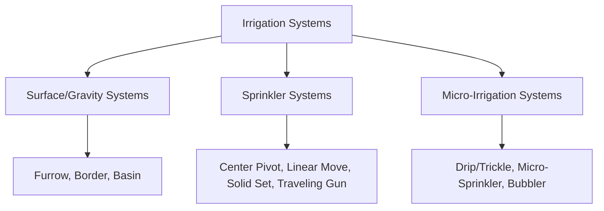
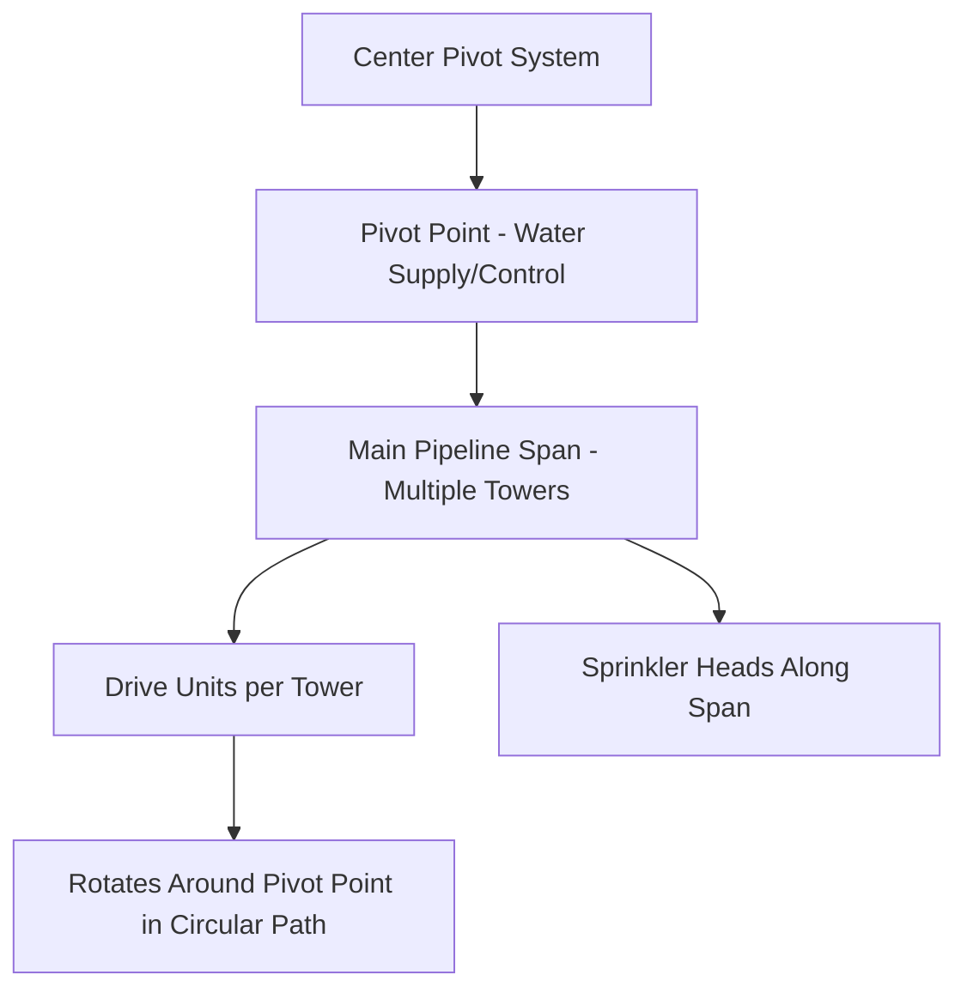
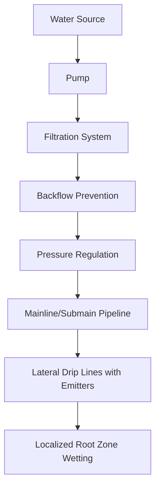

## Irrigation Equipment

### Overview

Irrigation equipment delivers supplemental water to crops when natural precipitation is insufficient, spanning gravity-fed surface systems, pressurized sprinkler systems, and localized micro-irrigation systems. Equipment selection interacts with water source characteristics, field topography, soil infiltration properties, crop type, and water-use efficiency goals. System design determines application uniformity, labor requirements, and energy consumption.

**Key Points**

- Three broad categories: surface (gravity-fed), sprinkler (pressurized overhead), and micro-irrigation (localized, low-volume)
- Application efficiency varies substantially by system type, generally increasing from surface through sprinkler to well-managed micro-irrigation systems
- System choice depends on water source/quality, field topography, crop value, energy cost, and capital investment capacity
- Distribution uniformity (how evenly water is applied across a field) is a key performance metric distinct from total volume delivered

---

### Irrigation System Categories

---

### Surface (Gravity-Fed) Irrigation

#### Furrow Irrigation

- **Mechanism**: Water flows via gravity along shallow furrows between crop rows, infiltrating into the root zone as it advances down the field
- **Equipment components**: Gated pipe or siphon tubes control water release from a supply ditch/pipeline into individual furrows; surface drains or tailwater recovery systems capture runoff at the field's lower end
- **Considerations**: Requires relatively uniform field slope (typically graded/laser-leveled for optimal performance); application uniformity is sensitive to furrow length, slope, and soil infiltration rate variability along the furrow's length

#### Border/Basin Irrigation

- **Border strip**: Water flows across a leveled strip bounded by parallel ridges, suited to close-growing crops (forages, small grains) on relatively uniform slopes
- **Basin irrigation**: Water is ponded within a leveled, diked basin until infiltration is complete, commonly used for rice production (continuous or intermittent flooding) and some orchard systems

#### Surface Irrigation Considerations

[Inference] Surface irrigation generally exhibits lower application efficiency (a greater proportion of applied water lost to deep percolation or tailwater runoff) compared to pressurized systems, though efficiency varies substantially with field leveling precision, soil type, and management skill rather than being an inherent fixed limitation of the method.

---

### Sprinkler Irrigation Systems

#### Center Pivot

- **Mechanism**: A pipeline supported on wheeled towers rotates around a fixed central pivot point, irrigating a circular (or partial-circle) area; each tower has an independent electric or hydraulic drive unit, with alignment maintained via angle sensors/control systems
- **Sprinkler head configuration**: Modern systems commonly use low-pressure spray heads mounted on drop tubes close to the crop canopy (rather than high-pressure impact sprinklers mounted higher on the pipeline), reducing wind drift and evaporation losses while operating at lower system pressure and energy cost
- **Coverage pattern**: Since outer sections of the pivot travel a greater linear distance per rotation than inner sections, sprinkler nozzle sizing increases progressively from the pivot point outward to maintain relatively uniform application depth across the radius
- **End guns/corner systems**: Extend coverage into the square field corners otherwise unreached by the circular pivot path, using a larger-throw end gun or, in more advanced systems, a swinging corner arm that extends and retracts automatically

#### Linear Move (Lateral Move)

- **Mechanism**: Similar tower/span structure to a center pivot, but the entire system moves in a straight line across a rectangular field rather than rotating, typically requiring a water supply via a moving hose/cable-tow arrangement or a lined ditch with a moving pump intake
- **Applications**: Suited to rectangular fields where center pivot circular coverage would leave excessive uncovered corner area

#### Solid Set/Permanent Set Sprinklers

- **Mechanism**: Fixed sprinkler heads on permanently or semi-permanently installed pipelines cover the entire field simultaneously (or in large sections cycled by valve operation) without machine movement
- **Applications**: Common in orchards, vineyards, and some high-value crops where fixed infrastructure investment is justified; also used for frost protection in some tree fruit systems, exploiting the latent heat release of water freezing on plant tissue

#### Traveling Gun/Hose Reel

- **Mechanism**: A large single sprinkler gun mounted on a wheeled cart is towed slowly across the field by a cable winding onto a reel (itself driven by water pressure through a turbine or piston mechanism), applying water in a wide-radius pattern as it travels
- **Applications**: Suited to irregularly shaped fields or situations where permanent infrastructure investment is not justified; generally lower capital cost per unit area than center pivot systems but higher labor requirement for repositioning between passes

---

### Micro-Irrigation Systems

#### Drip/Trickle Irrigation

- **Mechanism**: Water is delivered slowly and precisely to the root zone through emitters (built into or attached to drip tubing/tape) at low flow rates and pressures, minimizing evaporation and runoff losses relative to overhead application
- **Emitter types**: Pressure-compensating emitters maintain relatively consistent flow rate across a range of inlet pressures (important on long lateral runs or sloped fields where pressure varies along the line), while non-compensating emitters have flow rate that varies more directly with pressure
- **Drip tape vs. drip line**: Thin-walled drip tape is commonly used for annual row crops (often removed/replaced seasonally), while thicker-walled drip line/tubing with more durable emitters is common for perennial crops (orchards, vineyards) intended for multi-year installation

#### Micro-Sprinklers

Small, low-volume sprinkler heads mounted at or near ground level, providing a wider wetted pattern than drip emitters while still operating at low pressure/flow relative to conventional sprinklers; common in orchard and nursery/container production.

#### Subsurface Drip Irrigation (SDI)

Drip lines are buried below the soil surface (commonly 15–40 cm depending on crop root depth and soil type), reducing evaporation loss further than surface-laid drip tape and minimizing interference with surface field operations, though requiring more careful system design (root intrusion management, emitter clogging prevention) given inaccessibility for visual inspection.

---

### Filtration and Water Treatment (Critical for Micro-Irrigation)

Micro-irrigation systems, given their small emitter orifices, are particularly vulnerable to clogging from physical (sediment), chemical (mineral precipitate), and biological (algae, bacterial slime) sources.

| Filter Type | Primary Function |
| --- | --- |
| Sand media filter | Removes organic matter and fine sediment |
| Screen filter | Removes physical particulate matter, often used as secondary/backup filtration |
| Disc filter | Provides depth filtration for both organic and inorganic particulates |
| Hydrocyclone/sand separator | Removes heavier sand particles, typically from well water sources |

**Key Points**

- Filtration requirements scale with water source quality; surface water sources (canals, ponds) generally require more robust filtration than clean groundwater sources due to higher organic/biological load
- Chemical treatment (chlorination for biological growth control, acid injection for mineral scale prevention) is commonly integrated into micro-irrigation system maintenance protocols
- Neglected filtration is a well-documented cause of premature emitter clogging and reduced system distribution uniformity over time

---

### Pumping and Pressure Systems

- **Centrifugal pumps**: Common for surface water sources and moderate pressure/flow requirements
- **Submersible pumps**: Used for well/groundwater sources, positioned below the water table within the well casing
- **Pressure regulation**: Pressure-reducing valves and regulators maintain design operating pressure for sprinkler/micro-irrigation systems, since both under- and over-pressurization degrade application uniformity or emitter/nozzle performance
- **Energy considerations**: Pumping energy cost is a significant recurring operational expense for pressurized systems, particularly where water must be lifted substantial elevation or pumped at higher pressure (e.g., high-pressure impact sprinklers vs. low-pressure drip systems)

---

### Distribution Uniformity and Efficiency Metrics

$$DU_{lq} = \frac{\text{Average of lowest quarter of measured application depths}}{\text{Average of all measured application depths}} \times 100$$

**Key Points**

- Distribution uniformity (DU) quantifies how evenly water is applied across a field or system, distinct from total application efficiency (proportion of applied water beneficially used by the crop versus lost to evaporation, runoff, or deep percolation)
- Well-maintained, properly designed drip systems generally achieve higher application efficiency than sprinkler systems, which in turn generally outperform surface irrigation systems, though actual performance in any specific installation depends heavily on design, maintenance, and management quality rather than system type alone [Inference, reflecting the substantial installation-to-installation variability documented in irrigation efficiency literature]

---

### Illustrative Center Pivot System Diagram

<svg xmlns="http://www.w3.org/2000/svg" viewBox="0 0 500 320">
<title>Center Pivot Irrigation System Layout (svg_diagram)</title>
<circle cx="250" cy="160" r="140" fill="#e9f5e1" stroke="#2a9d8f" stroke-width="2" stroke-dasharray="4,2" />
<circle cx="250" cy="160" r="8" fill="#264653" />
<text x="250" y="145" font-size="10" text-anchor="middle">Pivot Point</text>
<line x1="250" y1="160" x2="390" y2="160" stroke="#8B5E3C" stroke-width="4" />
<circle cx="310" cy="160" r="6" fill="#e76f51" />
<text x="310" y="180" font-size="8" text-anchor="middle">Tower 1</text>
<circle cx="370" cy="160" r="6" fill="#e76f51" />
<text x="370" y="180" font-size="8" text-anchor="middle">Tower 2</text>
<circle cx="390" cy="160" r="5" fill="#264653" />
<text x="410" y="150" font-size="8" text-anchor="middle">End Gun</text>
<line x1="250" y1="160" x2="330" y2="90" stroke="#8B5E3C" stroke-width="1" opacity="0.4" />
<line x1="250" y1="160" x2="150" y2="90" stroke="#8B5E3C" stroke-width="1" opacity="0.4" />
<text x="250" y="300" font-size="10" text-anchor="middle" fill="#555">Circular coverage; corners require end gun or corner arm</text>
</svg>

---

### Frost and Freeze Protection Applications

Solid-set sprinkler systems are used in some tree fruit and vineyard operations for freeze protection, applying continuous water during freezing conditions so that the latent heat released as water freezes on plant tissue keeps the tissue temperature near 0°C rather than dropping to ambient sub-freezing air temperature. This requires continuous application throughout the freeze event, since interrupted application can leave tissue exposed to the colder ambient temperature and cause more severe damage than no irrigation at all.

---

### Automation and Control Technology

- **Timer/controller-based scheduling**: Automated valve actuation on pre-programmed schedules, common across drip and sprinkler system types
- **Soil moisture sensor integration**: Feedback-based irrigation scheduling using soil moisture sensors (capacitance, tensiometer, or other technologies) to trigger irrigation based on measured soil water status rather than fixed calendar schedules
- **Remote monitoring/control**: Cellular or radio-based telemetry allows remote system monitoring and control, particularly valuable for center pivot systems covering large areas where physical inspection is time-consuming
- **Variable-rate irrigation (VRI)**: Advanced center pivot systems can vary application rate along the pivot span and/or by rotational position, applying water according to zone-specific soil or crop needs rather than a single uniform rate across the entire circle [Inference, as specific VRI system architecture and control granularity vary by manufacturer]

---

**Related Topics**

- Soil moisture monitoring and irrigation scheduling methods
- Water source management and groundwater/surface water regulations
- Fertigation system design and nutrient injection integration
- Crop water requirement (evapotranspiration-based) scheduling
- Field leveling and land grading for surface irrigation
- Pump selection and energy efficiency in irrigation systems
- Frost protection strategies in perennial crop systems
- Precision agriculture integration with variable-rate irrigation