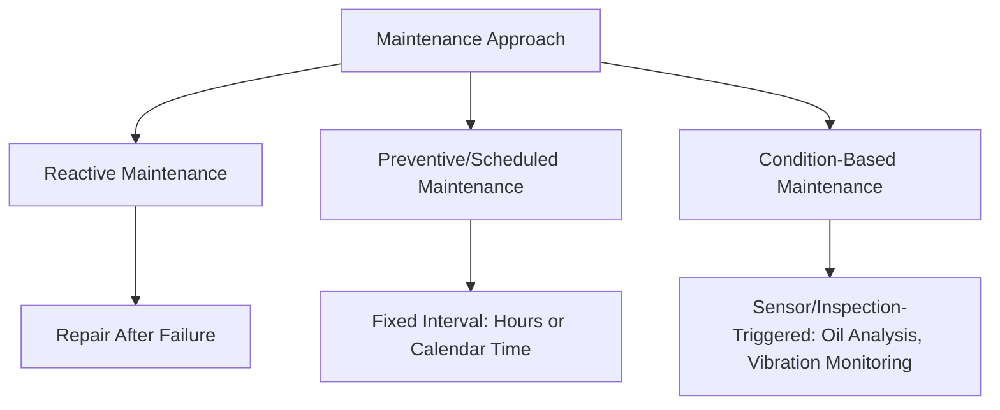
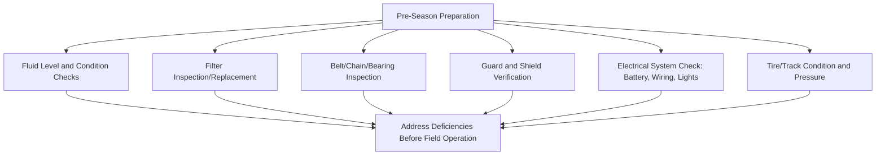
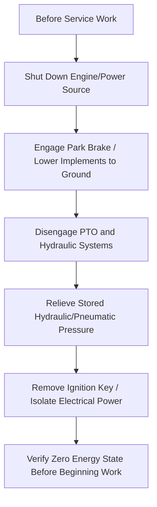

## Equipment Maintenance and Safety

### Overview

Equipment maintenance and safety encompasses the preventive care practices that keep farm machinery operating reliably and the procedural/physical safeguards that protect operators and bystanders from injury. The two domains are closely linked: well-maintained equipment (sharp components, functioning guards, properly adjusted systems) is inherently safer to operate, while safety-focused maintenance practices (lockout procedures, guard inspection) reduce both injury risk and unplanned downtime.

**Key Points**

- Preventive maintenance (scheduled, condition-based) reduces both breakdown risk during time-critical operations and long-term repair cost relative to reactive (failure-driven) maintenance
- Machine guarding, particularly around PTO shafts, belts, chains, and augers, addresses well-documented major injury categories in agricultural safety data
- Lockout/tagout-type procedures before service work prevent unexpected machine startup or movement during maintenance
- Maintenance intervals and specifications are manufacturer- and model-specific; the operator's manual remains the authoritative reference for a given machine

---

### Preventive Maintenance Framework

- **Reactive maintenance**: Repair performed only after failure occurs; generally results in higher total cost (unplanned downtime during critical operations, potential secondary damage from continued operation of a failing component) compared to preventive approaches
- **Preventive/scheduled maintenance**: Service performed at fixed intervals (operating hours or calendar time) regardless of observed condition, following manufacturer-recommended schedules
- **Condition-based maintenance**: Service triggered by actual measured condition (oil analysis results, vibration signatures, visual wear indicators) rather than a fixed interval, allowing maintenance timing to reflect actual equipment condition rather than a generic schedule

[Inference] The optimal balance between scheduled and condition-based approaches depends on equipment criticality, operation scale, and available diagnostic tools; large operations increasingly supplement manufacturer-scheduled maintenance with condition monitoring for high-value components.

---

### Core Maintenance Categories

#### Lubrication

- **Grease points**: Most machinery has multiple grease fittings (zerks) requiring regular application per a grease chart specific to the machine, commonly at daily-to-weekly intervals during active use depending on component and duty cycle
- **Engine and hydraulic/transmission fluid**: Scheduled changes based on operating hours, with fluid analysis (checking for contamination, wear metal content) sometimes used to extend or validate change intervals beyond fixed schedules
- **Grease/lubricant specification**: Using manufacturer-specified lubricant type (viscosity grade, additive package) matters for component longevity; substituting an incompatible lubricant can accelerate wear or seal degradation

#### Filtration Systems

| Filter Type | Function | Typical Service Trigger |
| --- | --- | --- |
| Engine air filter | Prevents particulate ingestion into engine | Visual restriction indicator or scheduled interval |
| Engine oil filter | Removes contaminants from lubricating oil | Concurrent with oil change |
| Fuel filter | Removes particulate/water from fuel | Scheduled interval, or performance-based (power loss) |
| Hydraulic filter | Removes contaminants from hydraulic fluid | Scheduled interval, often shorter after major hydraulic component replacement |

#### Belts, Chains, and Drive Components

- **Belt tension and wear inspection**: Loose or worn belts reduce power transfer efficiency and can slip under load; cracking, glazing, or fraying indicate replacement need
- **Chain lubrication and tension**: Roller chains (common in header drives, elevators, conveyors) require periodic lubrication and tension adjustment to prevent premature wear and reduce derailment/breakage risk
- **Bearing inspection**: Excessive play, unusual noise, or heat generation in bearings indicates wear requiring replacement before catastrophic failure

#### Tire and Track Maintenance

- Inflation pressure affects traction, compaction, fuel efficiency, and tire wear pattern/longevity; pressure should match load and application per manufacturer/tire charts rather than a single fixed value across all uses
- Track systems (on tracked tractors/combines) require tension adjustment and undercarriage component inspection distinct from tire-based maintenance considerations

---

### Seasonal and Pre-Operation Maintenance

**Key Points**

- Pre-season inspection performed with adequate lead time (rather than immediately before a time-critical operation) allows parts ordering and repair completion without delaying planting or harvest
- Post-season storage preparation (cleaning residue/debris, protecting against corrosion, appropriate storage conditions) reduces off-season deterioration and supports smoother pre-season startup
- Daily pre-operation checks (fluid levels, visual leak inspection, guard integrity, tire condition) remain necessary even with a thorough pre-season service, since conditions can change during active use

---

### Machine Guarding and Physical Safety Systems

#### PTO Shaft Guarding

PTO shaft entanglement represents one of the most frequently documented serious injury mechanisms in agricultural safety literature, given the shaft's high rotational speed and the potential for loose clothing to catch. Master shields (on the tractor PTO stub) and implement-side shaft guards (rotating or fixed shields covering the driveline) must remain in place and in good condition; damaged or missing guards should be repaired/replaced before operation rather than operated around.

#### Belt, Chain, and Auger Guarding

- Fixed or interlocked guards covering exposed belts, chains, sprockets, and augers prevent contact with moving components during normal operation
- Auger entanglement (particularly on grain augers and combine internal augers) represents another well-documented injury category, given the mechanism's tendency to draw material (and body parts) into the intake

#### Rollover Protective Structures (ROPS) and Seat Belts

Combined ROPS and seat belt use substantially reduces fatality risk in tractor rollover incidents, one of the most significant categories of fatal agricultural machinery injury documented across multiple agricultural safety studies; ROPS function as designed only when the seat belt is worn, since an unrestrained operator can be thrown clear of the protective structure's zone during a rollover event.

---

### Lockout/Isolation Procedures for Service Work

**Key Points**

- Stored energy (raised implements, pressurized hydraulic accumulators, tensioned springs) can cause unexpected movement even with the engine off; service procedures should account for these stored-energy hazards, not just rotating/moving parts driven directly by the engine
- Working under raised implements or components without mechanical support (jack stands, blocking, or engaged safety props/locks) rather than relying solely on hydraulic cylinder pressure is a well-documented crush hazard, since hydraulic systems can lose pressure or drift over time
- Multiple-person service work benefits from clear communication protocols (e.g., verbal confirmation before re-engaging power) to prevent one person inadvertently starting/moving equipment while another is in a hazardous position

---

### Electrical and Fuel System Safety

- **Battery handling**: Battery acid and hydrogen gas venting during charging present chemical burn and explosion hazards respectively; appropriate ventilation and avoiding open flame/sparks near batteries during charging or jump-starting is standard practice
- **Fuel handling**: Diesel fuel presents lower flammability risk than gasoline but is not without fire hazard; fueling procedures (engine off, away from ignition sources) remain standard regardless of fuel type
- **Wiring inspection**: Damaged or degraded wiring insulation presents both electrical short and fire risk, particularly relevant on older equipment or in dusty/vibration-heavy operating environments

---

### Illustrative Guarding Zones Diagram

<svg xmlns="http://www.w3.org/2000/svg" viewBox="0 0 500 300">
<title>Common Machinery Guarding Zones (svg_diagram)</title>
<rect x="20" y="20" width="460" height="260" fill="#f4f1de" stroke="#333" stroke-width="1" />
<circle cx="120" cy="100" r="35" fill="none" stroke="#e76f51" stroke-width="3" />
<line x1="95" y1="75" x2="145" y2="125" stroke="#e76f51" stroke-width="3" />
<text x="120" y="150" font-size="10" text-anchor="middle">PTO Shaft Guard</text>
<rect x="230" y="70" width="60" height="60" fill="none" stroke="#e9c46a" stroke-width="3" />
<circle cx="260" cy="100" r="15" fill="none" stroke="#e9c46a" stroke-width="2" />
<text x="260" y="150" font-size="10" text-anchor="middle">Belt/Sprocket Guard</text>
<rect x="360" y="70" width="20" height="80" fill="none" stroke="#2a9d8f" stroke-width="3" />
<text x="370" y="165" font-size="10" text-anchor="middle">Auger Guard</text>
<rect x="120" y="200" width="260" height="15" fill="#264653" opacity="0.8" />
<text x="250" y="235" font-size="10" text-anchor="middle">ROPS structure with seat belt (rollover protection)</text>
</svg>

---

### Personal Protective Equipment for Maintenance Tasks

- **Eye protection**: Required for grinding, welding, battery service, and pressurized fluid system work
- **Hand protection**: Cut-resistant or chemical-resistant gloves appropriate to the specific task (sharp components vs. fluid/lubricant exposure)
- **Hearing protection**: Recommended during extended exposure to high-noise equipment (engines, PTO-driven implements) given cumulative hearing damage risk from prolonged exposure
- **Respiratory protection**: Relevant during specific tasks such as welding (fume exposure) or working in enclosed/poorly ventilated spaces

---

### Record-Keeping and Maintenance Tracking

- Maintenance logs (service dates, hours, parts replaced, observed issues) support scheduling consistency, warranty compliance, and resale value documentation
- Digital fleet management/telematics systems increasingly automate hour tracking and can flag scheduled maintenance intervals, reducing reliance on manual tracking, though the underlying maintenance principles remain unchanged regardless of tracking method
- [Inference] Adoption of digital maintenance tracking varies considerably by farm scale and equipment age; specific platform capabilities should be verified against current manufacturer/vendor documentation

---

### Common Maintenance-Related Safety Incidents and Contributing Factors

- Bypassing guards for convenience during operation, intending temporary removal, but resuming work without reinstalling the guard
- Working under raised equipment supported only by hydraulic pressure without mechanical blocking
- Servicing equipment with the engine running or PTO engaged when the task could be performed with power isolated
- Loose clothing, unrestrained hair, or jewelry near rotating components (PTO shafts, belts, augers)
- Fatigue-related lapses during extended maintenance sessions, particularly during time-pressured pre-season or in-season repair work

---

**Related Topics**

- Tractor systems and PTO/hydraulic operation fundamentals
- ROPS design standards and rollover injury prevention
- Grain handling safety (auger and confined space hazards)
- Fleet management and telematics for maintenance tracking
- Hydraulic system troubleshooting and stored-energy hazards
- Occupational safety training programs for agricultural workers
- Harvesting machinery-specific maintenance requirements
- Seasonal equipment storage and corrosion prevention practices