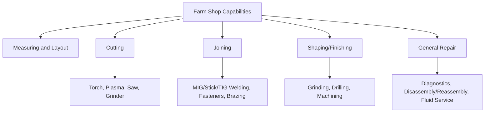
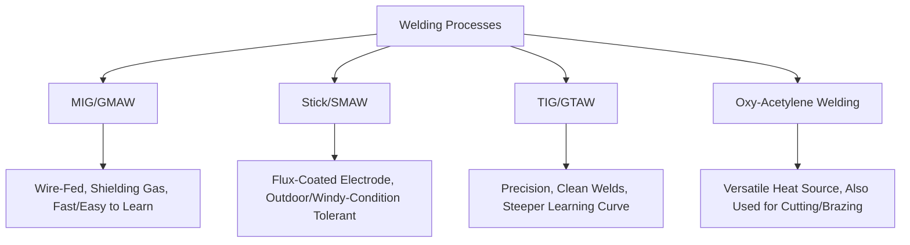
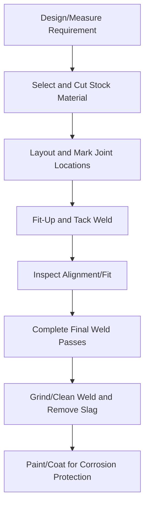

## Farm Shop Tools and Fabrication

### Overview

The farm shop serves as the primary maintenance and fabrication facility for repairing, modifying, and building equipment components on-site. Core capabilities span hand and power tools for general repair, welding and cutting equipment for structural fabrication, and metalworking machinery for precision component work. Shop capability directly affects equipment downtime duration, since on-farm repair capacity reduces dependency on off-site service availability during time-critical field operations.

**Key Points**

- Core shop functions: measuring/layout, cutting, joining (welding/fastening), shaping (grinding/machining), and general repair
- Welding capability (particularly MIG/GMAW) is typically the most consequential single investment for on-farm fabrication versatility
- Tool and equipment safety practices (guarding, PPE, ventilation) are as important as the fabrication skills themselves given the injury/fire risk profile of shop work
- Shop layout and organization affect both efficiency and safety, particularly regarding flammable material storage relative to welding/cutting operations

---

### Shop Function Categories

---

### Hand Tools

#### Measuring and Layout

- **Tape measures, squares, and levels**: Fundamental for accurate cutting and fabrication layout before any cutting or welding begins
- **Calipers and micrometers**: Provide precision measurement for component fit, bearing/shaft diameters, and clearance verification during repair
- **Soapstone/paint markers**: Used to mark cut lines on metal, remaining visible through the heat and spatter of cutting/welding operations where pencil or standard markers would not

#### Wrenches, Sockets, and Fasteners

- **Combination and adjustable wrenches, socket sets**: Core tools for bolted assembly work across metric and standard/imperial sizing, since farm equipment fleets frequently mix both standards depending on manufacturer origin
- **Impact wrenches (pneumatic or electric)**: Provide high torque output for removing rusted or heavily torqued fasteners without the leverage/time demands of manual wrenching
- **Torque wrenches**: Essential for fasteners with specified torque values (e.g., wheel lug nuts, cylinder head bolts, implement mounting hardware) where under- or over-torquing can cause premature failure or component damage

#### Pliers, Cutters, and Striking Tools

Standard shop complement of pliers (slip-joint, needle-nose, locking/vise-grip), diagonal/end cutters, hammers, and punches supporting general disassembly, fastening, and metal-shaping tasks.

---

### Power Tools

#### Angle Grinders

- **Applications**: Surface grinding, weld cleanup, cutting (with abrasive cutoff wheels), and wire-wheel surface preparation
- **Safety consideration**: Disc guards should remain installed and appropriate for the disc type (grinding vs. cutting discs are not interchangeable in terms of guard/RPM rating); disc bursting under improper use presents a significant laceration/impact injury risk

#### Drill Presses and Hand Drills

- **Drill press**: Provides stable, perpendicular drilling with adjustable speed control, generally producing more accurate and consistent holes than hand-held drilling, particularly important for larger-diameter or precision-fit holes
- **Hand/cordless drills**: Provide portability for field repairs or work on assembled equipment where a stationary drill press is impractical

#### Bench Grinders

Fixed-mount grinding wheels used for sharpening cutting edges (mower blades, cultivator points, chisel plow shanks) and general metal shaping; typically paired with a wire wheel attachment on the opposite spindle end for cleaning rust/corrosion from components.

#### Reciprocating and Band Saws

- **Portable reciprocating saw**: Versatile cutting tool for metal (with appropriate blade) and wood, useful for demolition/disassembly and rough cutting
- **Horizontal/vertical band saw**: Provides more accurate, controlled cutting of metal stock for fabrication work, generally producing cleaner cuts with less material waste than torch or plasma cutting for stock preparation

---

### Welding Processes

#### MIG Welding (Gas Metal Arc Welding, GMAW)

- **Mechanism**: A continuously fed wire electrode is melted into the joint while a shielding gas (commonly argon/CO₂ blends for steel) protects the weld pool from atmospheric contamination
- **Advantages**: Relatively fast to learn, high productivity for straightforward joint geometry, well-suited to the majority of general farm fabrication and repair welding on mild steel
- **Considerations**: Shielding gas is disrupted by wind, generally limiting practical outdoor use without wind protection compared to stick welding

#### Stick Welding (Shielded Metal Arc Welding, SMAW)

- **Mechanism**: A flux-coated consumable electrode is manually manipulated; the flux coating burns to produce its own shielding gas and slag layer protecting the weld pool
- **Advantages**: Tolerant of outdoor/windy conditions and less sensitive to base metal surface contamination (rust, mill scale) than MIG welding, making it well suited to field repairs and less-than-ideal material condition
- **Considerations**: Generally requires more operator skill to produce consistent weld quality than MIG welding, and slag removal is an additional post-weld step

#### TIG Welding (Gas Tungsten Arc Welding, GTAW)

- **Mechanism**: A non-consumable tungsten electrode creates the arc while filler metal (if used) is fed manually; shielding gas (typically pure argon) protects the weld pool
- **Applications**: Produces the highest-quality, most precise welds among common processes, particularly valuable for thin material, aluminum, stainless steel, or aesthetically/structurally critical joints; less commonly the primary farm shop process given its steeper learning curve and slower deposition rate relative to MIG for general heavy fabrication work

#### Oxy-Acetylene Welding, Cutting, and Brazing

- **Welding**: Historically significant, now less commonly the primary joining method compared to MIG/stick in most modern farm shops, though the equipment remains valued for its versatility
- **Cutting**: Oxy-fuel cutting torches remain widely used for cutting steel, particularly thicker stock, though plasma cutters have become increasingly common for cleaner, faster cuts, especially on thinner material
- **Brazing/heating**: The same equipment supports brazing (joining via a lower-melting-point filler without melting the base metal) and localized heating for bending, loosening rusted/seized fasteners, or straightening bent components

---

### Plasma Cutting

- **Mechanism**: An ionized gas (plasma) jet, electrically conductive, melts and blows away metal along the cut path, generating a narrower kerf and generally faster/cleaner cuts than oxy-fuel cutting, particularly on thinner material
- **Applications**: Increasingly common in farm shops as a complement to or partial replacement for oxy-fuel cutting, valued for cut quality and speed on sheet and moderate-thickness plate

---

### Fabrication Workflow Example

**Example**

Fabricating a replacement drawbar reinforcement plate would typically involve cutting stock steel plate to size, tack-welding it in position on the existing drawbar to verify fit and clearance, completing full weld passes along all edges once alignment is confirmed, grinding welds smooth where needed for clearance, and applying a rust-inhibiting coating before returning the component to service.

---

### Shop Safety Practices

#### Welding and Cutting Fire/Ventilation Safety

- **Fire risk**: Welding/cutting sparks and slag can ignite nearby flammable materials (fuel, oily rags, wood dust, dry vegetation); maintaining clear space around hot work and having fire extinguishing equipment readily accessible is standard practice
- **Ventilation**: Welding fume exposure (particularly from galvanized/coated metal, which produces zinc oxide fume, or from certain alloy/coating combinations) presents respiratory hazard; adequate ventilation or fume extraction, along with appropriate respiratory protection for specific higher-risk materials, is warranted
- **Fuel gas cylinder handling**: Oxygen and acetylene cylinders require secure upright storage/transport (chained or otherwise restrained against falling), separation between fuel gas and oxidizer cylinders in storage, and protection of valve/regulator components from impact damage

#### Personal Protective Equipment for Fabrication Work

| Task | Key PPE |
| --- | --- |
| Welding (arc processes) | Welding helmet with appropriate shade lens, flame-resistant clothing, welding gloves |
| Cutting/grinding | Safety glasses/face shield, hearing protection, appropriate gloves |
| Oxy-fuel cutting/welding | Tinted goggles/lens appropriate to the process, flame-resistant clothing |
| General shop work | Safety glasses, appropriate footwear, hearing protection for extended power tool use |

#### Machine Guarding in the Shop

- Grinding wheel guards, saw blade guards, and drill press chuck guards (where equipped) should remain in place and functional; removing guards for perceived convenience increases contact injury risk
- Rotating equipment (drill presses, bench grinders) presents entanglement risk from loose clothing, gloves near rotating chucks/wheels, and unrestrained hair, similar in principle to field equipment PTO/belt hazards

#### Compressed Air and Pneumatic Tool Safety

Compressed air systems used for pneumatic tools present eye injury risk from debris propulsion and, at sufficiently high pressure/close range, tissue injury risk from air injection; eye protection and proper tool/nozzle use (not directing compressed air at skin) are standard precautions.

---

### Illustrative Shop Layout Zoning Diagram

<svg xmlns="http://www.w3.org/2000/svg" viewBox="0 0 500 320">
<title>Farm Shop Functional Zoning (svg_diagram)</title>
<rect x="20" y="20" width="460" height="280" fill="none" stroke="#333" stroke-width="2" />
<rect x="40" y="40" width="140" height="100" fill="#f4a261" opacity="0.6" stroke="#333" />
<text x="110" y="95" font-size="11" text-anchor="middle">Welding/Cutting Bay</text>
<text x="110" y="112" font-size="9" text-anchor="middle">(fire-safe clearance)</text>
<rect x="200" y="40" width="140" height="100" fill="#a8dadc" opacity="0.6" stroke="#333" />
<text x="270" y="95" font-size="11" text-anchor="middle">Bench/Power Tool Area</text>
<text x="270" y="112" font-size="9" text-anchor="middle">(grinder, drill press)</text>
<rect x="360" y="40" width="100" height="100" fill="#e76f51" opacity="0.6" stroke="#333" />
<text x="410" y="95" font-size="10" text-anchor="middle" fill="white">Fuel/Flammable</text>
<text x="410" y="112" font-size="9" text-anchor="middle" fill="white">Storage (isolated)</text>
<rect x="40" y="160" width="420" height="120" fill="#2a9d8f" opacity="0.3" stroke="#333" />
<text x="250" y="215" font-size="11" text-anchor="middle">Equipment Repair/Service Bay</text>
<text x="250" y="235" font-size="9" text-anchor="middle">(open floor space, lift/jack access)</text>
</svg>

---

### Material and Fastener Considerations

- **Steel grades and identification**: Structural repairs benefit from matching or exceeding the original component's steel grade/strength; mixing significantly different strength grades in load-bearing repairs without engineering judgment can create unpredictable failure points
- **Fastener grade markings**: Bolt head markings indicate strength grade (e.g., grade 5, grade 8 in common US standards); using a lower-grade replacement fastener in a high-stress application can lead to premature failure
- [Inference] Specific material/fastener specification requirements are application-dependent and, for structurally critical or safety-related components, may warrant consultation with equipment manufacturer parts/service documentation rather than generic substitution

---

### Shop Organization and Inventory Management

- Organized tool storage (shadow boards, labeled cabinets) reduces search time and supports tool accountability, particularly relevant in shops with multiple operators/family members
- Maintaining a basic fastener and consumable inventory (common bolt sizes, welding wire/electrodes, grinding discs) reduces mid-repair delays for common items
- Designated hazardous material storage (used oil, batteries, chemical containers) supports both safety and, in many jurisdictions, regulatory compliance for disposal

---

**Related Topics**

- Equipment maintenance and safety (field machinery servicing)
- Tractor systems and hydraulic/mechanical component repair
- Metal fastener grades and torque specification standards
- Welding process selection for specific material types (aluminum, stainless steel)
- Shop ventilation and welding fume exposure management
- Fire prevention and extinguisher selection for workshop environments
- Hydraulic hose and fitting fabrication/repair
- Implement fabrication for custom farm equipment modifications