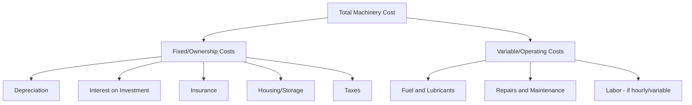
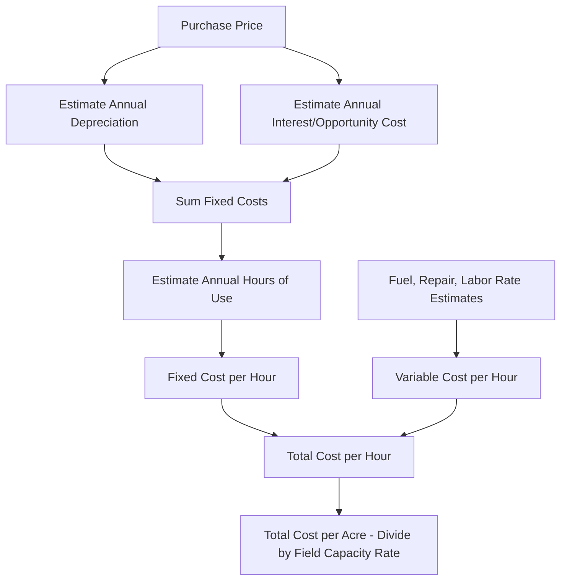
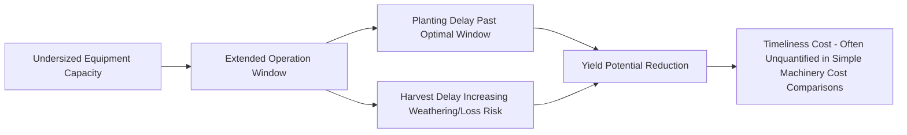
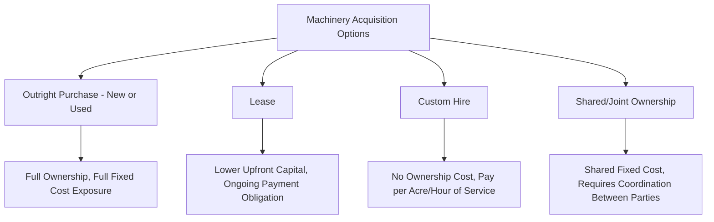

## Machinery Economics and Selection

### Overview

Machinery economics addresses how farm operators evaluate, acquire, and manage equipment as capital assets, balancing ownership cost, timeliness of operations, and financing structure against operation scale and cash flow constraints. Selection decisions integrate cost analysis (ownership vs. operating costs), capacity planning (matching equipment size to acreage and timeliness needs), and acquisition strategy (purchase, lease, custom hire, or shared ownership).

**Key Points**

- Total machinery cost separates into fixed (ownership) costs, incurred regardless of use, and variable (operating) costs, incurred proportional to use
- Break-even analysis comparing ownership against custom hire or leasing depends heavily on annual use volume
- Timeliness cost — yield or quality loss from operations performed outside the optimal window — is a real but often under-quantified cost of undersized equipment capacity
- Machinery selection is farm-specific; no universal "correct" machine size or acquisition method applies across all operations given differing acreage, cash flow, and risk tolerance

---

### Fixed vs. Variable Machinery Costs

#### Fixed (Ownership) Costs

Incurred simply by owning the machine, regardless of how much or how little it is used in a given year.

- **Depreciation**: Decline in asset value over time due to age, wear, and obsolescence; commonly estimated via straight-line, declining-balance, or manufacturer/industry-published depreciation schedules for used equipment valuation
- **Interest**: Cost of capital tied up in the machine, whether actual loan interest or the opportunity cost of capital that could have been invested elsewhere
- **Insurance and taxes**: Property/liability insurance premiums and any applicable property taxes on the asset
- **Housing/storage**: Cost of building/maintaining equipment storage facilities, protecting the asset from weather-related deterioration

$$\text{Fixed Cost per Hour} = \frac{\text{Annual Fixed Costs}}{\text{Annual Hours of Use}}$$

**Key Points**

- Fixed cost per hour of use decreases as annual hours of use increase, since the same total fixed cost is spread across more hours — this relationship underlies the economic logic favoring higher annual utilization
- Low annual use (common on smaller acreages) results in high fixed cost per hour/per acre, a central driver of the economic case for custom hire or shared ownership arrangements on smaller operations

#### Variable (Operating) Costs

Incurred proportional to actual machine use.

- **Fuel and lubricants**: Directly tied to hours operated and load/power demand
- **Repairs and maintenance**: Generally increases with cumulative use and machine age, though timing/magnitude varies by component and maintenance quality
- **Operator labor**: Variable when compensated hourly or by task; a fixed cost component if salaried labor would be paid regardless of machine use

---

### Machinery Cost Estimation Approach

**Example**

A tractor purchased for a given price with an estimated useful life and annual fixed costs (depreciation, interest, insurance, housing) totaling a calculated sum, used for 400 hours annually, would show a meaningfully higher fixed cost per hour than the same machine used for 800 hours annually — illustrating why annual use volume is a primary driver of per-hour ownership cost, independent of the machine's variable operating costs.

$$\text{Cost per Acre} = \frac{\text{Total Cost per Hour}}{\text{Field Capacity (acres per hour)}}$$

---

### Field Capacity and Timeliness

#### Effective Field Capacity

$$\text{Effective Field Capacity (ac/hr)} = \frac{\text{Working Width} \times \text{Speed} \times \text{Field Efficiency}}{8.25 \text{ (unit conversion constant, imperial units)}}$$

Field efficiency accounts for time lost to turning, adjustment, refilling/unloading, and other non-productive time within the operating hour, typically expressed as a percentage below 100%.

[Inference] Specific field efficiency percentages vary by operation type, field size/shape, and operator experience; published reference values (e.g., from agricultural engineering handbooks) provide starting estimates rather than universal constants for a specific farm's actual conditions.

#### Timeliness Cost

- **Concept**: Equipment capacity insufficient to complete time-sensitive operations (planting, spraying, harvest) within the agronomically optimal window imposes a cost through reduced yield potential or quality, distinct from the direct fixed/variable machinery cost
- **Quantification challenge**: Timeliness cost is genuinely difficult to estimate precisely since it depends on weather variability in a given year, crop-specific yield response curves to delayed operations, and the probability distribution of favorable field-day windows — [Inference] many practical machinery selection decisions incorporate timeliness considerations qualitatively (erring toward somewhat larger capacity than a pure fixed/variable cost minimization would suggest) rather than through precise dollar quantification, given this estimation difficulty

---

### Acquisition Strategy Options

#### Outright Purchase (New or Used)

- **New equipment**: Full warranty coverage, latest technology/features, but highest initial depreciation rate (particularly steep in early years of ownership for most equipment categories)
- **Used equipment**: Lower purchase price and reduced depreciation rate exposure (since the steepest depreciation has already occurred), but potentially higher repair risk and reduced/absent warranty coverage depending on age and remaining manufacturer warranty terms

#### Leasing

- **Operating lease**: Lower periodic payment, equipment returned at lease end, generally suited to operations preferring to avoid long-term ownership commitment or wanting predictable, budgetable payment schedules
- **Finance/capital lease**: Structured more similarly to a purchase with financing, often with an ownership transfer option at lease end

#### Custom Hire

Contracting a service provider to perform an operation (e.g., custom harvesting, custom spraying) using their own equipment and labor, converting what would otherwise be a fixed ownership cost into a variable, per-acre or per-hour service cost.

**Key Points**

- Custom hire is generally more cost-competitive for operations with limited acreage insufficient to justify full ownership fixed costs, or for specialized/infrequently-needed equipment
- Reliance on custom hire introduces scheduling dependency risk — timeliness may be affected by the custom operator's availability and schedule with other clients, particularly during regionally synchronized time-critical windows

#### Shared/Joint Ownership

Multiple operations jointly purchase and share use of a machine, spreading fixed cost across a larger combined acreage/use base than any single operation alone; requires coordination on scheduling, maintenance responsibility, and eventual replacement/exit terms, typically formalized through a written agreement given the potential for scheduling conflicts during peak-demand periods.

---

### Own vs. Custom Hire Break-Even Analysis

$$\text{Break-Even Acreage} = \frac{\text{Annual Fixed Ownership Cost}}{\text{Custom Rate per Acre} - \text{Variable Ownership Cost per Acre}}$$

**Example**

If annual fixed ownership costs for a piece of equipment total a given amount, and the custom hire rate exceeds the operator's own variable cost per acre by a certain margin, the break-even acreage represents the point below which custom hire is the lower-cost option and above which ownership becomes more economical — a calculation that should be revisited as fixed costs, custom rates, or farm acreage change over time rather than treated as a one-time, permanent conclusion.

---

### Illustrative Cost-per-Acre vs. Annual Use Relationship

<svg xmlns="http://www.w3.org/2000/svg" viewBox="0 0 500 320">
<title>Fixed Cost per Acre Declining with Annual Use (svg_diagram)</title>
<line x1="60" y1="280" x2="460" y2="280" stroke="#333" stroke-width="2" />
<line x1="60" y1="280" x2="60" y2="40" stroke="#333" stroke-width="2" />
<text x="260" y="310" font-size="11" text-anchor="middle">Annual Hours/Acres of Use</text>
<text x="25" y="160" font-size="11" text-anchor="middle" transform="rotate(-90 25 160)">Fixed Cost per Acre</text>
<path d="M 70 60 Q 150 100 250 200 Q 350 250 450 270" fill="none" stroke="#e76f51" stroke-width="3" />
<text x="150" y="90" font-size="10" fill="#e76f51">Low use = high cost/acre</text>
<text x="380" y="255" font-size="10" fill="#e76f51">High use = low cost/acre</text>
<line x1="250" y1="280" x2="250" y2="40" stroke="#2a9d8f" stroke-width="1" stroke-dasharray="4,3" />
<text x="250" y="35" font-size="9" text-anchor="middle" fill="#2a9d8f">Break-even use level (illustrative)</text>
</svg>

---

### Right-Sizing Equipment to Operation Scale

| Consideration | Effect on Sizing Decision |
| --- | --- |
| Total acreage | Larger acreage generally supports larger equipment investment through better fixed-cost spread |
| Available labor | Limited labor availability may favor larger/faster equipment to reduce total labor-hours needed |
| Crop mix and window overlap | Multiple time-sensitive operations competing for the same calendar window increase the case for greater capacity |
| Soil/field conditions | Wet-prone soils with narrow field-ready windows increase timeliness cost of undersized equipment |
| Financial risk tolerance/cash flow | Tighter cash flow may favor leasing, custom hire, or used equipment over large new-equipment capital outlay |
| Growth trajectory | Anticipated acreage expansion may justify capacity somewhat ahead of current immediate need, subject to financing capacity |

---

### Replacement Decision Factors

- **Repair cost trend**: Rising repair frequency/cost as equipment ages eventually crosses the point where continued ownership becomes less economical than replacement, though this crossover point is highly equipment- and usage-specific
- **Technology obsolescence**: Newer equipment may offer efficiency, precision, or capability improvements (e.g., precision application technology, fuel efficiency gains) that factor into replacement timing beyond pure mechanical condition
- **Resale/trade-in value trajectory**: Depreciation curves are generally steeper in early ownership years and flatten over time, affecting the optimal timing for trading rather than holding equipment through its full mechanical life
- [Inference] Specific replacement timing recommendations vary considerably by equipment category, usage intensity, and market conditions for used equipment resale value; farm-specific financial analysis is more reliable than generic replacement interval rules of thumb

---

### Financing Considerations

- Loan terms (interest rate, term length, down payment requirement) affect total cost of ownership beyond the equipment's purchase price alone
- Matching loan term to the equipment's expected useful economic life (rather than an arbitrarily longer or shorter term) helps avoid situations where the loan balance remains after the equipment's productive/economic life has ended, or conversely, an unnecessarily aggressive repayment schedule straining cash flow
- Tax considerations (depreciation deduction methods, applicable credits or incentives) can materially affect the after-tax cost comparison between acquisition options, though specific tax treatment depends on current tax code provisions and individual filing circumstances [Unverified as currently applicable without consulting current tax guidance, given that tax provisions affecting equipment depreciation are subject to periodic legislative change]

---

**Related Topics**

- Farm financial management and capital budgeting
- Depreciation methods and used equipment valuation
- Custom hire rate benchmarking and service agreements
- Field capacity calculation and operational planning
- Equipment maintenance and safety (repair cost management)
- Precision agriculture technology investment evaluation
- Tax planning for agricultural capital equipment
- Whole-farm risk management and cash flow planning