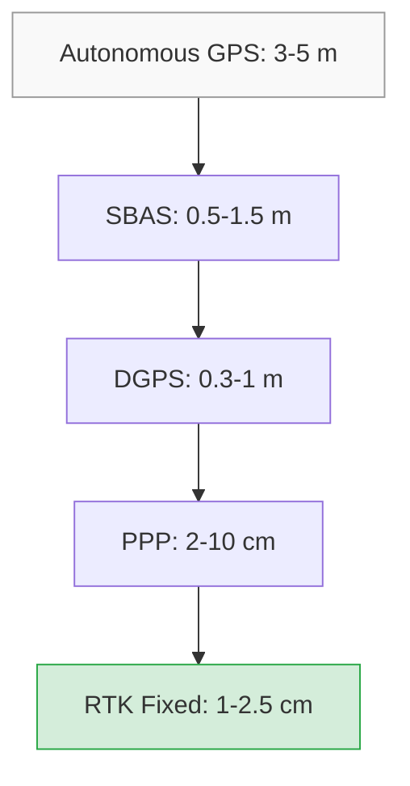
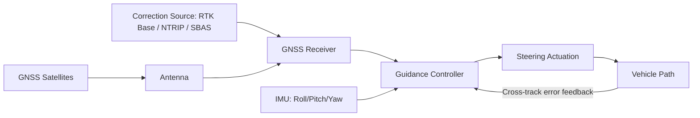

## GPS and GNSS Guidance Systems

### Overview

GNSS (Global Navigation Satellite System) guidance is the positioning backbone of precision agriculture, enabling machinery to follow programmed paths across a field with error margins ranging from several meters down to sub-2 cm, depending on the correction method used. GPS (Global Positioning System, operated by the United States) is one constellation within the broader GNSS umbrella, which also includes GLONASS (Russia), Galileo (European Union), and BeiDou (China). Modern agricultural receivers are typically multi-constellation, fusing signals from several systems simultaneously to improve satellite availability, reduce multipath error, and maintain accuracy under canopy or terrain obstruction.

### Core Positioning Concepts

**Trilateration**

A GNSS receiver calculates its position by measuring the time delay between signal transmission from a satellite and reception at the receiver antenna. Multiplying this delay by the speed of light gives a pseudorange — an estimated distance to that satellite. With pseudoranges from at least four satellites, the receiver solves for its three-dimensional position (latitude, longitude, altitude) plus a clock-bias correction term, since the receiver's internal clock is far less precise than the atomic clocks on board satellites.

$$d = c \times \Delta t$$

Where $d$ is the pseudorange, $c$ is the speed of light, and $\Delta t$ is the measured signal travel time.

**Sources of Positioning Error**

| Error Source | Typical Magnitude (Uncorrected) | Cause |
| --- | --- | --- |
| Satellite clock/orbit error | 1–2 m | Imperfect ephemeris data |
| Ionospheric delay | 5–10 m | Signal refraction in the ionosphere |
| Tropospheric delay | 0.5–1 m | Signal refraction in the lower atmosphere |
| Multipath | 0.5–5 m | Signal reflecting off structures, canopy, water |
| Receiver noise | <1 m | Internal hardware limitations |
| Satellite geometry (DOP) | Variable | Poor spatial spread of visible satellites |

**Dilution of Precision (DOP)**

DOP is a unitless multiplier describing how satellite geometry affects positional accuracy. A tight cluster of satellites overhead produces high DOP (worse accuracy); a wide, evenly spread constellation produces low DOP (better accuracy). Agricultural guidance systems commonly report Horizontal DOP (HDOP) and reject or flag fixes when HDOP exceeds a threshold (often 2.0–4.0) because path accuracy is unreliable under poor geometry.

### Correction Methods and Accuracy Tiers

Raw, uncorrected GNSS positioning (autonomous GPS) yields roughly 3–5 m accuracy, which is inadequate for repeatable row-following. Precision agriculture relies on differential correction techniques layered on top of raw signals.

**1. DGPS (Differential GPS)**

A ground-based reference station at a known, surveyed location computes the error between its known position and its GPS-derived position, then broadcasts a correction signal (often via a beacon or radio link) to nearby rovers. Typical accuracy: 0.3–1 m (sub-meter). Correction quality degrades with distance from the base station (spatial decorrelation), generally usable within roughly 100–300 km of the reference station.

**2. SBAS (Satellite-Based Augmentation Systems)**

Regional geostationary satellite networks broadcast wide-area corrections derived from a network of ground reference stations. Examples include WAAS (North America), EGNOS (Europe), MSAS (Japan), and GAGAN (India). Accuracy: 0.5–1.5 m, free to use with a compatible receiver, no subscription or local base station required. This is a common baseline tier for mid-tier autosteer systems.

**3. RTK (Real-Time Kinematic)**

RTK uses carrier-phase measurements (the actual sine-wave cycles of the GNSS carrier signal) rather than just the coarser pseudorange code, resolving the ambiguity in the number of whole wavelengths between satellite and receiver. A local base station (fixed, surveyed position) or a network of reference stations (Network RTK / VRS — Virtual Reference Station) streams carrier-phase corrections to the rover, typically over a radio link or cellular data (NTRIP — Networked Transport of RTCM via Internet Protocol).

- Accuracy: 1–2.5 cm horizontal, repeatable pass-to-pass accuracy critical for controlled traffic farming
- Requires a fixed baseline generally under 10–20 km from a single base station, or subscription to a Network RTK/CORS (Continuously Operating Reference Station) service for wider coverage
- Convergence time (achieving "RTK Fixed" status from a cold start) can take 30 seconds to several minutes depending on satellite visibility and multipath conditions
- RTK status typically reports as Float (approximate, decimeter-level, ambiguities not yet resolved) or Fixed (full centimeter-level accuracy, ambiguities resolved)

**4. PPP (Precise Point Positioning) and PPP-RTK**

PPP uses precise satellite orbit and clock corrections broadcast via satellite (no local base station needed) combined with dual-frequency receivers to model out atmospheric errors directly. Convergence is slower than RTK (historically 20–30 minutes, though modern PPP-RTK hybrid services reduce this significantly) but coverage is global without needing nearby ground infrastructure. Accuracy: 2–10 cm depending on service tier and convergence time. Commercial examples include John Deere's StarFire/SF-RTK-like corrections, Trimble RTX, and OmniSTAR HP/XP tiers. [Unverified: exact current-generation accuracy specifications and service names vary by vendor and change over product cycles; consult current vendor documentation for guaranteed figures.]

### System Architecture

A complete guidance system consists of the following components:

- **GNSS Antenna** — mounted on the highest point of the vehicle (cab roof) to maximize sky view and minimize multipath. Antenna height and offset from the vehicle's center of gravity must be precisely configured, as errors here translate directly into cross-track error during turns and on slopes.
- **GNSS Receiver/Engine** — computes the position fix, handling correction stream decoding (RTCM format for RTK, SBAS message decoding, etc.).
- **IMU (Inertial Measurement Unit)** — a set of accelerometers and gyroscopes that measures roll, pitch, and yaw. On sloped terrain, a GNSS antenna mounted several meters above the ground shifts horizontally as the vehicle rolls, introducing "tilt error." The IMU compensates for this by correcting the reported position to reflect the implement's or wheel's true ground position rather than the antenna's tilted position.
- **Guidance Controller/Terminal** — the in-cab display and processing unit that compares the vehicle's real-time position against a planned guidance line and computes steering corrections.
- **Steering Actuation** — either an electric motor clamped to the steering wheel, an integrated electro-hydraulic steering valve, or a fully integrated factory autosteer-ready system.
- **Correction Source** — radio modem (UHF/VHF for local base stations), cellular modem (NTRIP for network RTK), or satellite L-band receiver (for PPP services).

### Guidance Line Patterns

Guidance software generates a reference path (the "AB line") that the vehicle follows, with parallel offset passes computed automatically for subsequent rounds.

- **Straight AB Line** — defined by two points (A and B); all subsequent passes are parallel offsets at the implement's working width.
- **Curved AB Line (A+)** — follows a recorded curved path, useful for contour farming or irregular field boundaries; subsequent passes replicate the curve shape at fixed offsets.
- **Pivot Guidance** — a circular pattern centered on a fixed pivot point, used for center-pivot irrigated fields.
- **Adaptive Curve** — continuously records and adjusts the curve based on the operator's actual driven path, blending recorded history with live steering input.
- **Identical Curve** — repeats an existing curve pattern at a parallel offset without requiring the operator to drive it manually each pass.

### Key Performance Metrics

- **Cross-Track Error (XTE)** — the perpendicular distance between the vehicle's actual position and the planned guidance line; the primary real-time accuracy indicator displayed to the operator.
- **Pass-to-Pass Accuracy** — repeatability between adjacent passes over a short time window (e.g., within 15 minutes), critical for minimizing skips and overlaps.
- **Year-to-Year (Repeatable) Accuracy** — the ability to return to the exact same guidance line across seasons, essential for controlled traffic farming (CTF) where permanent wheel tracks are established to confine compaction to fixed lanes. This tier of accuracy requires RTK with a fixed, surveyed base station, since SBAS and PPP corrections are not repeatable to centimeter level across long time gaps.

### Practical Example: Autosteer Pass Calculation

A planter with a 12-row header at 76 cm (30 in) row spacing has a total working width of:

$$W = 12 \times 0.76\ \text{m} = 9.12\ \text{m}$$

If the guidance system operates on RTK Fixed with 2 cm pass-to-pass accuracy, the maximum realistic overlap/gap tolerance per pass is approximately 2 cm — meaning over a 9.12 m width, the area-loss percentage from overlap is:

$$\text{Overlap \%} = \frac{0.02}{9.12} \times 100 \approx 0.22\%$$

Compare this to an SBAS-only system with 0.5 m accuracy on the same implement:

$$\text{Overlap \%} = \frac{0.5}{9.12} \times 100 \approx 5.5\%$$

This difference compounds over a full season and directly informs input savings calculations (seed, fertilizer, chemical) used to justify RTK subscription costs.

### Common Field Issues and Troubleshooting

- **Signal Loss/Multipath Under Canopy or Near Structures** — tall crops (corn, sugarcane), tree lines, grain bins, and steel structures can reflect or block signals; mitigated by dual-antenna setups, receiver filtering algorithms, and IMU dead-reckoning bridging during brief outages.
- **RTK Correction Dropout** — loss of radio link or cellular signal causes the receiver to fall back to Float or SBAS-level accuracy; some systems bridge short dropouts (seconds to a few minutes) using IMU and recent correction data before accuracy visibly degrades. [Inference: bridging duration varies by manufacturer firmware and is not standardized across brands.]
- **Antenna Height/Offset Miscalibration** — incorrect entry of antenna height, forward/lateral offset from the implement, or wheelbase geometry produces a consistent (non-random) cross-track bias, distinct from random noise-driven error.
- **Base Station Baseline Distance** — operating an RTK rover too far from a fixed local base station increases the risk of Float status or longer re-convergence after signal interruptions.
- **Magnetic/Electrical Interference** — proximity to high-current cables or improperly grounded electronics can disturb IMU readings, particularly on retrofit autosteer kits.

### Applications in Precision Agriculture

- **Auto-guidance/Autosteer** — hands-free or hands-on steering assistance for planting, spraying, tillage, and harvesting operations, reducing operator fatigue and overlap.
- **Controlled Traffic Farming (CTF)** — permanent traffic lanes established using repeatable RTK guidance lines, confining soil compaction to fixed wheel tracks and preserving cropped soil structure.
- **Variable Rate Application (VRA)** — GNSS position is fused with prescription maps to vary seed, fertilizer, or chemical application rates on the go.
- **Yield Mapping** — combine-mounted GNSS receivers geotag yield monitor data in real time, generating spatial yield maps for later analysis.
- **Boundary Mapping and Area Calculation** — GNSS-logged field boundaries feed into farm management information systems (FMIS) for area billing, compliance reporting, and record-keeping.
- **Section/Row Control** — GNSS position combined with implement geometry enables automatic shutoff of individual boom sections or planter rows to prevent double-application on point rows and headlands.

### Related Topics

- RTK base station setup and NTRIP caster configuration
- Variable Rate Application (VRA) and prescription map generation
- Controlled Traffic Farming (CTF) system design
- Section control and automatic boom/row shutoff systems
- Yield monitoring and yield map interpolation
- ISOBUS and machine-to-implement communication standards
- Remote sensing and multispectral imagery integration with guidance data
- Autonomous and driverless tractor navigation systems