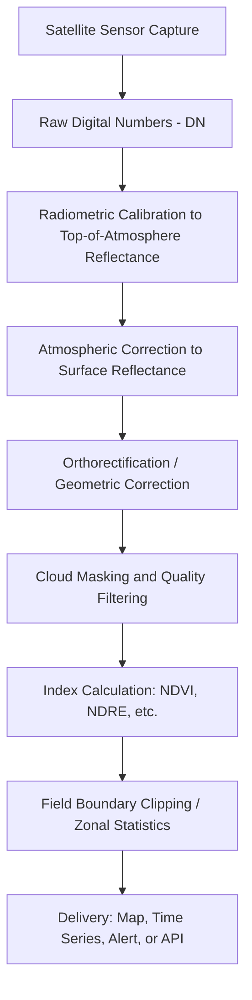

## Remote Sensing and Satellite Imagery

### Overview

Remote sensing in agriculture is the acquisition of information about crops, soil, and field conditions without physical contact, using sensors mounted on satellites, aircraft, or drones. The core principle is that different materials and plant conditions reflect and absorb electromagnetic radiation differently across the spectrum, and these reflectance signatures can be measured, mapped, and interpreted to infer crop health, water status, nitrogen deficiency, pest stress, and yield potential. Satellite-based remote sensing specifically refers to imagery captured from orbiting platforms, offering broad-area, repeatable, and increasingly affordable coverage compared to manned aircraft.

### Electromagnetic Spectrum and Spectral Signatures

Healthy vegetation exhibits a distinctive reflectance pattern: low reflectance in visible blue and red wavelengths (absorbed by chlorophyll for photosynthesis), a small reflectance peak in green (why plants appear green to the eye), and very high reflectance in near-infrared (NIR) due to internal leaf cell structure. Stressed, diseased, or senescing vegetation shows reduced NIR reflectance and increased red reflectance as chlorophyll degrades, forming the basis of nearly all vegetation health indices.

| Spectral Band | Approximate Wavelength | Agricultural Relevance |
| --- | --- | --- |
| Blue | 450–520 nm | Atmospheric correction, soil/vegetation discrimination |
| Green | 520–600 nm | Vegetation vigor, chlorophyll reflectance peak |
| Red | 630–690 nm | Chlorophyll absorption, primary NDVI input |
| Red Edge | 705–745 nm | Early-stage stress and nitrogen sensitivity, less saturation than red |
| Near-Infrared (NIR) | 760–900 nm | Cell structure, biomass, primary NDVI input |
| Shortwave Infrared (SWIR) | 1550–1750 nm, 2080–2350 nm | Canopy water content, soil moisture, residue detection |
| Thermal Infrared | 8000–14000 nm | Canopy temperature, evapotranspiration, water stress |

### Vegetation Indices

**NDVI (Normalized Difference Vegetation Index)**

The most widely used vegetation index, exploiting the contrast between red absorption and NIR reflectance in healthy chlorophyll-rich vegetation.

$$NDVI = \frac{NIR - Red}{NIR + Red}$$

Values range from −1 to 1. Values near 0 typically indicate bare soil or non-vegetated surfaces, moderate positive values (0.2–0.5) indicate sparse or stressed vegetation, and high values (0.6–0.9) indicate dense, healthy canopy. NDVI is known to saturate at high biomass levels, meaning it loses sensitivity to distinguish between moderately dense and very dense canopies. [Inference: exact saturation thresholds vary by crop type, canopy architecture, and sensor calibration.]

**Other Common Indices**

- **EVI (Enhanced Vegetation Index)** — incorporates a blue band to correct for atmospheric aerosol scattering and reduces soil background influence, improving sensitivity in high-biomass conditions where NDVI saturates.
- **SAVI (Soil-Adjusted Vegetation Index)** — introduces a soil brightness correction factor $L$, useful in early-season or sparse-canopy conditions where bare soil dominates the pixel signal.

$$SAVI = \frac{(NIR - Red)}{(NIR + Red + L)} \times (1 + L)$$

- **NDRE (Normalized Difference Red Edge)** — substitutes the red-edge band for red, offering better sensitivity to chlorophyll and nitrogen status in mid-to-late season crops where NDVI has saturated.

$$NDRE = \frac{NIR - RedEdge}{NIR + RedEdge}$$

- **NDWI (Normalized Difference Water Index)** — uses NIR and SWIR or green bands to estimate canopy or surface water content, useful for irrigation monitoring and drought stress detection.
- **GNDVI (Green NDVI)** — substitutes green for red, sometimes more sensitive to chlorophyll concentration variation than standard NDVI.

### Satellite Platforms Commonly Used in Agriculture

| Platform | Operator | Resolution | Revisit Time | Notes |
| --- | --- | --- | --- | --- |
| Sentinel-2 (A/B/C) | European Space Agency (ESA) | 10 m (visible/NIR), 20 m (red edge/SWIR) | ~5 days (combined constellation) | Free and open access via Copernicus program; widely used baseline for agricultural monitoring |
| Landsat 8/9 | NASA/USGS | 30 m (multispectral), 15 m (panchromatic), 100 m (thermal, resampled to 30 m) | 8 days (combined constellation) | Free and open; long historical archive dating to 1972 (Landsat 1) valuable for multi-decade trend analysis |
| MODIS (Terra/Aqua) | NASA | 250 m–1 km | Daily | Coarse resolution but very high temporal frequency; used for regional/continental-scale monitoring |
| Planet (PlanetScope) | Planet Labs | ~3 m | Daily | Commercial, large constellation of small satellites ("Doves"); subscription-based |
| Maxar (WorldView series) | Maxar Technologies | <1 m (commercial very-high-resolution) | Variable, on-demand tasking possible | Commercial, high cost, used for detailed field-boundary or infrastructure analysis |

[Unverified: exact current satellite counts, specific mission end-of-life dates, and pricing tiers change over time; consult current provider documentation (e.g., Copernicus Open Access Hub, USGS EarthExplorer, Planet's developer docs) for up-to-date specifications.]

### Data Acquisition Workflow

**Radiometric and Atmospheric Correction**

Raw satellite sensor output is recorded as digital numbers (DN), which must be converted to physically meaningful reflectance values before indices are meaningful or comparable across dates. This involves:

1. **Radiometric calibration** — converting DN to top-of-atmosphere (TOA) radiance/reflectance using sensor-specific calibration coefficients.
2. **Atmospheric correction** — removing the scattering and absorption effects of the atmosphere (aerosols, water vapor, ozone) to derive surface (bottom-of-atmosphere) reflectance. Common algorithms include Sen2Cor (for Sentinel-2) and LaSRC (for Landsat).
3. **Orthorectification** — correcting geometric distortion from terrain relief and sensor viewing angle so pixels align accurately to real-world coordinates, essential for multi-date comparison and integration with GNSS-referenced field boundaries.
4. **Cloud and shadow masking** — flagging and excluding pixels obscured by clouds, cloud shadows, or haze, since these produce spurious index values.

### Spatial, Temporal, and Spectral Resolution Trade-offs

Sensor design inherently trades off three resolution dimensions:

- **Spatial resolution** — the ground area represented by one pixel; finer spatial resolution (e.g., sub-meter) resolves individual plant rows but generates far larger data volumes.
- **Temporal resolution (revisit time)** — how frequently a location is imaged; critical for tracking rapidly changing conditions like disease outbreak or irrigation timing.
- **Spectral resolution** — the number and narrowness of spectral bands captured; more/narrower bands (hyperspectral) allow finer discrimination of plant biochemistry but increase processing complexity and cost.

Coarse-resolution, high-revisit sensors (MODIS) suit regional yield forecasting and drought monitoring; fine-resolution, moderate-revisit sensors (Sentinel-2, Landsat) suit field-level management zone delineation; very-fine-resolution commercial sensors (Planet, Maxar) suit sub-field scouting and boundary-level anomaly detection.

### Applications in Precision Agriculture

- **Crop Health Monitoring** — time-series NDVI/NDRE tracking to detect stress from disease, pest pressure, waterlogging, or nutrient deficiency before it is visible to the naked eye in the field.
- **Variable Rate Nitrogen Management** — NDRE or NDVI-derived biomass maps inform in-season nitrogen application rate maps, targeting deficient zones rather than uniform blanket application.
- **Management Zone Delineation** — multi-year NDVI stability analysis identifies persistent zones of high/low productivity within a field, used to design variable rate seeding, fertility, and soil sampling strategies.
- **Irrigation Scheduling** — thermal infrared imagery estimates canopy temperature and evapotranspiration, feeding into water stress indices (e.g., Crop Water Stress Index, CWSI) for irrigation timing decisions.
- **Yield Prediction and Forecasting** — cumulative seasonal vegetation index trends correlate with end-of-season yield, used at both farm and regional/national forecasting scales.
- **Field Boundary and Land Use Mapping** — automated classification of satellite imagery delineates field boundaries, crop type (via crop classification algorithms), and land use change over time, supporting compliance reporting and carbon program verification.
- **Weed and Anomaly Detection** — fine-resolution imagery combined with classification algorithms can flag anomalous patches suggestive of weed pressure, compaction, or drainage issues for targeted scouting.

### Practical Example: Interpreting an NDVI Field Map

A soybean field imaged mid-season via Sentinel-2 shows the following zonal NDVI averages:

| Zone | Mean NDVI | Interpretation |
| --- | --- | --- |
| A (low-lying, poorly drained) | 0.42 | Likely waterlogging stress or delayed emergence |
| B (mid-field, uniform soil) | 0.81 | Healthy, dense canopy, on expected growth trajectory |
| C (field edge, compacted headland) | 0.55 | Moderate stress, consistent with compaction from equipment turning |

An agronomist would use this map to prioritize ground-truthing (physical scouting) in Zones A and C first, rather than walking the entire field uniformly, and could combine the NDVI map with soil electrical conductivity (EC) data to distinguish drainage-driven stress from compaction-driven stress.

### Limitations and Practical Considerations

- **Cloud Cover** — optical satellite sensors cannot see through clouds; persistent cloud cover in a region can create multi-week gaps in usable imagery, particularly problematic during critical growth stages in wet climates.
- **Mixed Pixels** — at coarser resolutions, a single pixel may contain a mix of soil, vegetation, and shadow, diluting the index signal, particularly early in the season with partial canopy cover.
- **Atmospheric Correction Accuracy** — imperfect atmospheric correction introduces index inconsistency between dates, complicating strict time-series comparison; some providers apply harmonization steps across sensor generations to mitigate this. [Inference: the degree of residual error depends on the specific correction algorithm and atmospheric conditions at capture time.]
- **Index Saturation** — as previously noted, NDVI saturates in dense canopy, making red-edge-based indices (NDRE) preferable for mid-to-late season nitrogen status assessment.
- **Latency** — free public satellite data (Sentinel-2, Landsat) typically has processing and delivery latency of hours to a few days, which may lag behind the decision window for time-sensitive interventions like fungicide timing.
- **Ground-Truthing Requirement** — remote sensing indices are correlative, not diagnostic; a low NDVI zone indicates stress but not its cause, so field verification remains necessary to confirm whether the driver is water, nutrients, pests, disease, or compaction.

### Related Topics

- Vegetation index selection and crop-specific index performance
- UAV/drone-based multispectral and hyperspectral imaging
- Google Earth Engine and cloud-based remote sensing analytics platforms
- Crop classification and land cover change detection algorithms
- Evapotranspiration modeling and irrigation scheduling from thermal imagery
- Integration of remote sensing data with variable rate application controllers
- Soil moisture remote sensing (SAR-based approaches, e.g., Sentinel-1)
- Yield forecasting models combining remote sensing and weather data