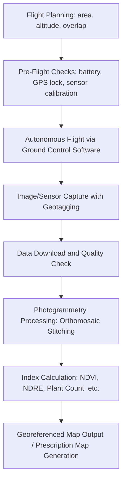

## Drones in Agriculture

### Overview

Agricultural drones (Unmanned Aerial Vehicles, or UAVs) are aerial platforms equipped with sensors, cameras, or spraying/spreading payloads that operate closer to the crop canopy and at higher spatial resolution than satellite or manned aircraft platforms. Compared to satellite remote sensing, drones offer centimeter-level resolution, flexible on-demand scheduling independent of satellite revisit cycles or cloud cover interference, and the ability to carry application payloads (spraying, seeding) in addition to sensing payloads. The two dominant categories in agricultural use are fixed-wing drones (efficient for large-area mapping) and multirotor drones (versatile for hovering, precise application, and lower cost of entry).

### Platform Types

**Multirotor Drones**

Use multiple rotors (typically four, six, or eight) for lift and control. Common in agriculture for their vertical takeoff/landing (VTOL) capability, hovering stability, and mechanical simplicity relative to fixed-wing platforms.

- **Advantages**: no runway required, precise hovering for detailed inspection, lower unit cost, simpler payload swapping
- **Disadvantages**: shorter flight times (typically 15–40 minutes per battery) and smaller coverage area per flight compared to fixed-wing
- **Typical uses**: crop scouting, spot-spraying, small-to-mid-field spray/spread applications, detailed inspection of specific problem areas identified by satellite imagery

**Fixed-Wing Drones**

Resemble small airplanes, generating lift aerodynamically rather than through continuous rotor thrust, resulting in significantly greater flight efficiency and endurance.

- **Advantages**: longer flight times (45 minutes to several hours depending on platform), larger area coverage per flight (hundreds of hectares), generally more efficient at cruising altitude for mapping
- **Disadvantages**: require a clear runway or catapult launch and belly-landing or net-recovery, less maneuverable, unsuitable for hovering-based spraying
- **Typical uses**: large-area mapping and surveying, NDVI/multispectral surveys across large farms or agricultural cooperatives

**Hybrid VTOL Fixed-Wing**

Combines vertical takeoff/landing rotors with fixed-wing cruise flight, aiming to capture the coverage efficiency of fixed-wing platforms without requiring a runway. Increasingly used for mid-to-large-scale mapping operations where runway access is impractical. [Inference: adoption levels and cost-competitiveness of hybrid VTOL vs. traditional fixed-wing vary significantly by region and vendor maturity.]

### Sensor Payloads

| Sensor Type | Captures | Primary Agricultural Use |
| --- | --- | --- |
| RGB (visible light) | Standard red-green-blue imagery | Visual scouting, plant counting, general orthomosaic mapping |
| Multispectral | Discrete bands (often red, green, blue, red-edge, NIR) | NDVI/NDRE calculation, crop health and stress mapping |
| Hyperspectral | Hundreds of narrow, contiguous spectral bands | Research-grade biochemical analysis, disease detection, species classification |
| Thermal infrared | Surface/canopy temperature | Irrigation stress detection, water leak/drainage identification |
| LiDAR (Light Detection and Ranging) | 3D point cloud via laser pulse time-of-flight | Canopy height, biomass volume estimation, terrain/topography mapping, tree/orchard structure |

### Core Flight and Data Workflow

**Flight Planning Parameters**

- **Altitude** — determines ground sample distance (GSD, the real-world size represented by one pixel); lower altitude yields finer resolution but requires more flight time and images to cover the same area.
- **Front and Side Overlap** — successive images must overlap (commonly 70–85% front overlap, 60–75% side overlap) to allow photogrammetry software to correctly stitch images into a single orthomosaic using detected common features between frames.
- **Ground Control Points (GCPs)** — surveyed markers placed in the field before flight, used to improve absolute positional accuracy of the final stitched map, particularly important when centimeter-level georeferencing is required (e.g., for precise prescription map alignment with RTK-guided machinery).

**Photogrammetry (Structure from Motion)**

Software (e.g., Pix4D, DroneDeploy, Agisoft Metashape) processes overlapping images by identifying common features across frames, then computing camera position and 3D scene geometry through a technique called Structure from Motion (SfM). Output products typically include an orthomosaic (a single, geometrically corrected, seamless image of the entire flown area), a digital surface model (DSM) capturing elevation including vegetation/structures, and a digital terrain model (DTM) representing bare-earth elevation.

### Spray and Application Drones

Agricultural spray drones have grown substantially as a category, particularly for targeted application in specialty crops, hard-to-access terrain (steep slopes, wet fields), and situations where ground equipment would cause compaction.

- Typical payload capacity ranges from roughly 10–40 liters (varies significantly by platform and region), with newer heavy-lift agricultural spray drones exceeding this in some markets.
- Application relies on rotor downwash for droplet penetration into the canopy, combined with GNSS-guided (often RTK) autonomous flight paths for consistent swath control and reduced overlap/skips.
- Regulatory classification of spray drones varies substantially by country; many jurisdictions classify agricultural spray drones under a distinct category from general commercial drones due to payload/chemical dispensing, often requiring additional certification. [Unverified: specific regulatory frameworks and weight/payload thresholds differ by country and change over time; consult current national aviation and agricultural chemical application authorities for compliance requirements.]

### Regulatory Considerations

Drone operation for agriculture generally intersects with civil aviation authority regulations covering:

- **Pilot certification** — many jurisdictions require a remote pilot certificate or equivalent for commercial agricultural drone operation (e.g., Part 107 in the United States under the FAA).
- **Airspace restrictions** — operations near airports, controlled airspace, or above certain altitude ceilings (commonly capped around 120 m / 400 ft in many jurisdictions) require authorization.
- **Visual Line of Sight (VLOS) vs. Beyond Visual Line of Sight (BVLOS)** — most standard agricultural drone operations are restricted to VLOS unless the operator holds a specific BVLOS waiver/authorization, which is increasingly relevant for large-area fixed-wing mapping and spray operations across expansive farms.
- **Chemical application-specific rules** — spray drone operators may face additional requirements tied to pesticide applicator licensing, buffer zone requirements, and drift mitigation standards distinct from general aviation rules.

[Unverified: this section describes general regulatory categories common across many jurisdictions; specific rules, weight thresholds, and certification requirements vary by country and are subject to change — verify against the current regulations of the relevant national aviation and agricultural authorities before operation.]

### Applications in Precision Agriculture

- **Crop Scouting and Stand Counting** — high-resolution RGB imagery enables automated plant counting and emergence assessment shortly after planting, identifying gaps or replant zones.
- **Targeted Crop Health Mapping** — multispectral drone surveys provide finer-resolution NDVI/NDRE mapping than satellite imagery, useful for identifying sub-field anomalies invisible at satellite resolution.
- **Variable Rate Prescription Generation** — drone-derived biomass and health maps feed directly into prescription maps for variable rate seeding, fertilization, or spraying by ground equipment.
- **Precision Spraying** — targeted drone-based spot-spraying reduces chemical input compared to blanket ground application, particularly valuable in orchards, vineyards, and irregularly shaped or hard-to-access fields.
- **Livestock Monitoring** — thermal and RGB drone surveys support herd counting, location tracking, and detection of isolated/distressed animals in extensive grazing systems.
- **Irrigation System Monitoring** — thermal imagery identifies pivot malfunctions, leaks, or uneven water distribution across large irrigated fields.
- **Storm and Damage Assessment** — rapid post-event aerial surveys (hail, flooding, wind lodging) support insurance claims and replanting decisions with objective, georeferenced documentation.
- **Orchard and Vineyard Structural Analysis** — LiDAR and photogrammetric canopy modeling estimate tree/vine volume, height uniformity, and pruning needs at individual plant resolution.

### Practical Example: Comparing Satellite vs. Drone for a Stress Investigation

A wheat field shows a moderate NDVI depression (0.45 vs. a field average of 0.75) in Sentinel-2 imagery covering a 10 m x 10 m pixel area. A drone multispectral survey of just that sub-area, flown at 60 m altitude with a resulting GSD of approximately 3–4 cm/pixel, reveals that the affected zone is composed of parallel linear stripes rather than a uniform patch — a pattern consistent with a sprayer boom section malfunction rather than disease or waterlogging, which would typically present as an irregular, non-linear patch. This distinction, invisible at satellite resolution, directly changes the diagnosis and remediation approach (equipment repair vs. agronomic intervention).

### Limitations and Practical Considerations

- **Battery/Flight Time Constraints** — multirotor platforms in particular require multiple battery swaps to cover large farms, adding labor and logistics overhead.
- **Weather Sensitivity** — wind, rain, and temperature extremes restrict safe flight windows and can affect sensor data quality (e.g., wind-induced canopy movement blurring imagery).
- **Data Processing Time and Expertise** — photogrammetry processing of large image sets is computationally intensive and requires either capable on-farm hardware or cloud processing services, plus some technical proficiency to interpret outputs correctly.
- **Regulatory Compliance Burden** — certification, registration, and airspace authorization requirements add operational overhead compared to satellite imagery, which requires no on-farm licensing.
- **Coverage vs. Resolution Trade-off** — the finer resolution advantage of drones over satellites comes at the cost of significantly smaller area coverage per flight, making drones complementary to, rather than a full replacement for, satellite monitoring on very large operations.

### Related Topics

- Photogrammetry software workflows (Pix4D, DroneDeploy, Agisoft Metashape)
- Drone-based precision spraying regulations and droplet drift management
- LiDAR canopy modeling for orchard and vineyard management
- Integration of drone-derived maps with variable rate application controllers
- BVLOS (Beyond Visual Line of Sight) regulatory pathways for large-scale operations
- Multispectral vs. hyperspectral sensor selection for crop stress diagnostics
- Autonomous drone fleet management and swarm operations for large farms
- Combining drone and satellite data in multi-scale monitoring pipelines