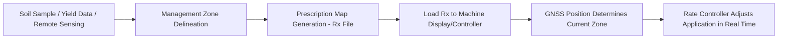

## Variable Rate Technology

### Overview

Variable Rate Technology (VRT) is the practice of adjusting the application rate of an agricultural input — seed, fertilizer, lime, pesticide, irrigation water — in real time as equipment moves across a field, rather than applying a single uniform rate to the entire field. VRT matches input intensity to spatially varying field conditions (soil fertility, yield potential, pest pressure, elevation, moisture) with the goals of increasing input use efficiency, reducing waste and environmental loss, and improving overall profitability and yield uniformity. VRT is a core execution layer of precision agriculture, translating spatial data (soil maps, yield maps, remote sensing indices) into physical machine action.

### Control Approaches

**Map-Based VRT**

The applicator's rate is controlled according to a pre-loaded prescription map, with the machine's GNSS position determining which rate to apply at each location as it traverses the field.

- Requires prior data collection and processing (grid or zone soil sampling, historical yield maps, remote sensing-derived management zones) before the field operation occurs.
- Prescription maps are typically generated in farm management information system (FMIS) software and exported in standardized formats (e.g., Shapefile, ISO-XML per the ISOBUS/ISO 11783 standard) for compatibility across brands.
- Advantage: allows deliberate agronomic planning, incorporation of multiple data layers (soil type, historical yield, topography), and offline review/adjustment before field operation.
- Disadvantage: dependent on the accuracy and recency of the underlying data; a prescription based on outdated soil tests or a single bad yield year may misrepresent current field conditions.

**Sensor-Based (Real-Time) VRT**

An on-the-go sensor mounted on the applicator measures a relevant crop or soil property directly ahead of or at the application point, and the controller adjusts rate immediately based on that live reading — no pre-built map required.

- Common sensor types: optical canopy reflectance sensors (e.g., crop canopy sensors measuring NDVI-like indices for nitrogen management), soil electrical conductivity (EC) sensors, and on-combine yield/moisture sensors feeding forward for next-pass decisions.
- Advantage: responds to actual real-time crop or soil conditions at the moment of application, requiring no prior mapping investment and adapting to within-season variability (e.g., mid-season nitrogen status).
- Disadvantage: limited to whatever the sensor directly measures at the point of travel; cannot incorporate historical or multi-layered spatial data the way a map-based prescription can.

**Hybrid Approaches**

Many modern systems combine both: a base prescription map sets a baseline rate informed by historical/soil data, while a real-time sensor applies an in-season adjustment factor on top of the map-based rate, blending planned agronomic strategy with live in-field responsiveness.

### Core Hardware Components

- **Rate Controller** — the onboard computer that receives the target rate (from map or sensor) and commands the metering system to achieve it, continuously comparing actual delivered rate (from flow/speed sensors) against target rate in a closed feedback loop.
- **Metering System** — the physical mechanism that delivers the variable rate: hydraulically or electrically driven metering rollers/augers (dry fertilizer, seed), variable-orifice or pulse-width-modulated (PWM) nozzles (liquid sprays), or variable-speed drive systems (seed meters, spinner spreaders).
- **GNSS Receiver** — provides the positional reference required for map-based VRT to determine which zone of the prescription applies at the machine's current location (see GPS/GNSS guidance systems for accuracy tiers).
- **Section/Row Control Integration** — many VRT systems are combined with automatic section control, which shuts off individual boom sections, planter rows, or spreader sections in headlands, point rows, or already-covered areas, preventing both rate error and double-application overlap simultaneously.
- **ISOBUS/ISO 11783 Compatibility** — an industry-standard communication protocol allowing implements and rate controllers from different manufacturers to interoperate with a single universal terminal (UT) display, reducing the need for brand-specific hardware pairing. [Unverified: specific interoperability behavior can still vary by implement manufacturer and firmware version despite nominal ISOBUS compliance; verify compatibility for specific equipment combinations before deployment.]

### Prescription Map Generation Workflow

1. **Data Collection** — grid soil sampling (typically 1–2.5 hectare grid cells, though density varies by operation) or zone sampling based on management zones; historical multi-year yield maps; remote sensing-derived vegetation indices; topographic/elevation data; soil electrical conductivity surveys.
2. **Management Zone Delineation** — clustering algorithms or manual delineation group areas of similar productivity potential or soil characteristics into discrete zones, reducing the complexity of continuous spatial variability into actionable, machine-executable zones.
3. **Rate Assignment** — an agronomic model or rule set assigns a target rate to each zone based on the input type: e.g., nutrient removal-based fertility rates (matching fertilizer to expected crop uptake and existing soil test levels), yield-potential-based seeding rates (higher plant population in high-potential zones, lower in stress-prone zones, though optimal direction can be crop- and hybrid-specific), or pest-pressure-based pesticide rates.
4. **Prescription File Export** — the finalized rate-by-zone map is exported as a georeferenced file (Shapefile with a rate attribute field, or ISO-XML Task File) compatible with the target machine's rate controller.
5. **In-Field Execution and As-Applied Logging** — the machine executes the prescription while logging actual as-applied rate and position data, which becomes an input for future prescription refinement and verification of application accuracy.

### Common VRT Applications by Input Type

| Input | Basis for Rate Variation | Typical Data Source |
| --- | --- | --- |
| Seed (planting population) | Yield potential zones, soil water-holding capacity, hybrid/variety response | Historical yield maps, soil type maps, elevation |
| Nitrogen fertilizer | Crop nitrogen status, yield potential, residual soil nitrate | Canopy sensors (real-time), soil tests, remote sensing (NDRE) |
| Phosphorus/Potassium/Lime | Soil nutrient levels, pH, nutrient removal by prior crop | Grid or zone soil sampling |
| Pesticides/Fungicides | Pest/disease pressure zones, weed density maps | Scouting data, remote sensing anomaly detection, weed sensors (e.g., green-on-brown/green-on-green optical weed detection) |
| Irrigation water | Soil moisture, evapotranspiration demand, soil water-holding capacity by zone | Soil moisture sensors, thermal remote sensing, variable rate irrigation (VRI) pivot systems |

### Practical Example: Variable Rate Nitrogen Calculation

A cornfield is divided into three management zones based on NDRE-derived biomass status mid-season. The agronomist uses a simple sufficiency-based algorithm comparing each zone's NDRE to a well-fertilized reference strip:

$$\text{Sufficiency Index} = \frac{NDRE_{zone}}{NDRE_{reference}}$$

| Zone | NDRE | Sufficiency Index | Base N Rate (kg/ha) | Adjusted N Rate (kg/ha) |
| --- | --- | --- | --- | --- |
| A (deficient) | 0.32 | 0.71 | 180 | 180 × (1 + (1 − 0.71)) ≈ 232 |
| B (adequate) | 0.44 | 0.98 | 180 | 180 × (1 + (1 − 0.98)) ≈ 184 |
| C (surplus/lodged risk) | 0.46 | 1.02 | 180 | 180 × (1 + (1 − 1.02)) ≈ 175 |

This illustrates the general principle of a sufficiency-based adjustment algorithm; actual commercial algorithms (e.g., those embedded in canopy sensor systems) use proprietary calibration curves and crop-specific coefficients rather than a simple linear ratio. [Inference: the specific mathematical form and calibration of commercial sufficiency algorithms are typically proprietary and not publicly documented in full detail.]

### Economic and Agronomic Considerations

- **Return on Investment (ROI)** — VRT investment (equipment upgrade, soil sampling costs, prescription-writing services or software subscriptions) must be weighed against input savings and yield gains; ROI is generally strongest on fields with high spatial variability and weakest on highly uniform fields where a single optimal rate already serves most of the area well.
- **Data Quality Dependency** — prescription accuracy is only as good as the underlying data; sparse soil sampling grids, outdated yield data, or poorly calibrated sensors propagate error directly into the applied rate.
- **Agronomic Direction Debates** — for seeding rate in particular, the "high-yield-zones-get-more-seed" strategy is not universally agreed upon; some agronomic research suggests lower-potential (stressed) zones may benefit more from reduced population to reduce competition for limited resources, while high-potential zones may benefit from increased population to capture available yield potential — the correct direction is crop-, hybrid-, and environment-dependent. [Inference: this is an active area of agronomic research and recommendations vary by crop, region, and ongoing trial results.]
- **Environmental Benefits** — reducing over-application in low-need zones lowers nutrient runoff and leaching risk, and reducing over-application of pesticides lowers non-target environmental exposure, supporting both regulatory compliance and sustainability program participation (e.g., carbon and ecosystem service markets that reward input-use efficiency).

### Limitations and Practical Considerations

- **Equipment Compatibility** — retrofitting older equipment with VRT capability can require aftermarket rate controllers and may face ISOBUS compatibility gaps with certain implement/tractor combinations.
- **Calibration Requirements** — metering systems (seed meters, fertilizer augers, sprayer nozzles) must be properly calibrated for the specific product being applied, since flow characteristics differ by product density, granule size, or viscosity; miscalibration undermines VRT accuracy regardless of prescription quality.
- **Response Lag** — physical metering systems have a mechanical response lag between a commanded rate change and the actual rate change reaching the ground/nozzle, which can cause under- or over-application at zone boundaries, particularly at higher travel speeds; look-ahead algorithms in modern controllers attempt to compensate by anticipating zone transitions.
- **Multi-Year Validation** — a single season's yield response to a VRT prescription can be confounded by weather variability; robust prescription refinement typically requires multi-year data and, ideally, controlled on-farm strip trials comparing variable rate to uniform rate as a check.

### Related Topics

- Soil sampling strategies: grid sampling vs. zone/directed sampling
- ISOBUS (ISO 11783) standard and Universal Terminal (UT) compatibility
- Management zone delineation algorithms and clustering methods
- On-the-go optical crop canopy sensors for nitrogen management
- Variable Rate Irrigation (VRI) for center pivot systems
- Automatic section control and boom/row shutoff systems
- On-farm strip trial design for prescription validation
- Farm Management Information Systems (FMIS) and prescription file standards