## Farm Management Software

### Overview

Farm Management Software (FMS), often referred to as a Farm Management Information System (FMIS), is the data integration and decision-support layer of precision agriculture. It aggregates data from field equipment (GNSS guidance, yield monitors, VRT controllers), remote sensing sources, soil sampling labs, weather services, and financial records into a unified platform, enabling record-keeping, spatial analysis, prescription generation, compliance reporting, and business decision-making. Where individual precision agriculture tools (guidance, remote sensing, VRT) generate raw operational data, FMIS is the layer that consolidates, contextualizes, and converts that data into actionable outputs and historical records.

### Core Functional Modules

**Field Records and Mapping**

Maintains a georeferenced database of field boundaries, ownership/lease details, crop rotation history, and physical operations. Field boundaries are typically captured via GNSS-logged perimeter drives, manually digitized from satellite/aerial imagery, or imported from cadastral/land registry data. This module forms the spatial foundation to which all other data layers are attached.

**Data Aggregation and Import/Export**

Ingests data from disparate sources: as-applied and as-planted files from equipment monitors, yield monitor data from combines, soil test results from laboratories, weather station feeds, and remote sensing imagery. Standardized formats and protocols matter significantly here:

- **ISO-XML (ISO 11783 / ISOBUS Task Files)** — the primary standard for exchanging task data (prescriptions, as-applied logs) between FMIS software and ISOBUS-compliant machine terminals across different equipment brands.
- **Shapefile (.shp)** — a common GIS vector format for field boundaries, management zones, and prescription maps, widely supported across FMIS platforms and GIS tools.
- **Proprietary brand ecosystems** — major equipment manufacturers (e.g., John Deere Operations Center, Climate FieldView, Trimble Ag Software) operate their own cloud platforms with varying degrees of open API access and cross-brand interoperability. [Unverified: the specific interoperability and data-sharing agreements between major platforms change over time as partnerships and API policies evolve; consult current platform documentation for the latest integration status.]

**Prescription Map Generation**

Combines soil, yield, and remote sensing data layers to generate variable rate prescription maps for seeding, fertility, and crop protection (see Variable Rate Technology for the underlying methodology). This is typically one of the most computationally involved modules, often incorporating zone delineation algorithms and agronomic rate-assignment models.

**Yield Data Analysis**

Processes raw combine yield monitor data (which requires cleaning to remove artifacts such as header-width transition errors, low-flow start/stop pass anomalies, and GNSS positional noise) into cleaned, georeferenced yield maps. Multi-year yield map overlays support identification of persistently high- or low-yielding zones, informing management zone delineation and input allocation decisions.

**Financial and Input Tracking**

Records input costs (seed, fertilizer, chemical, fuel, labor), tracks inventory, and in more advanced platforms, calculates per-field or per-zone profitability by combining yield revenue against input costs — enabling identification of unprofitable field zones that may warrant removal from production, land use change, or targeted input reduction regardless of yield.

**Compliance and Reporting**

Generates records required for regulatory compliance (e.g., pesticide application records mandated by many jurisdictions), certification programs (organic certification audit trails, sustainability program documentation), and increasingly, carbon program and ecosystem service market verification, which typically require documented evidence of practices such as reduced tillage, cover cropping, or nitrogen use efficiency over time.

### System Architecture

```mermaid
flowchart TD
    A[Field Equipment: Guidance, Yield Monitors, VRT Controllers] --> D[Data Ingestion Layer]
    B[Remote Sensing: Satellite, Drone Imagery] --> D
    C[Soil Labs / Weather Services / Manual Records] --> D
    D --> E[Central Database: Field Boundaries, Time-Series Records]
    E --> F[Analytics Engine: Zone Delineation, Yield Analysis, Financial Calc]
    F --> G[Prescription Map Generator]
    F --> H[Reporting and Compliance Module]
    F --> I[Dashboard / Visualization Layer]
    G --> J[Export to ISO-XML / Shapefile for Machine Controllers]
```

**Data Layer Considerations**

Most modern FMIS platforms are cloud-based, with local mobile or in-cab apps syncing data to a central cloud database when connectivity is available, and caching data locally for offline field use in areas with poor cellular coverage. Spatial data is typically stored using standard GIS conventions (vector data for boundaries/zones, raster data for imagery/index layers), often built on top of PostGIS or similar spatial database extensions in the underlying architecture. [Inference: specific underlying database technology choices are generally not publicly disclosed by commercial FMIS vendors and vary by platform.]

### Interoperability and Data Standards

- **AgGateway and ADAPT (Agricultural Data Application Programming Toolkit)** — an industry initiative and open-source framework aimed at standardizing data translation between different agricultural software and equipment ecosystems, reducing the need for one-off custom integrations between every pairing of platforms.
- **API-Based Integrations** — many platforms expose REST APIs allowing third-party agronomy, financial, or analytics tools to read/write field data programmatically, though the depth and openness of these APIs varies considerably by vendor and commercial tier.
- **Data Ownership and Privacy** — a significant industry discussion point concerns who owns farm-generated data (the farmer, the equipment manufacturer, or the software provider) and under what terms it can be aggregated, resold, or used to train predictive models; most major platforms now publish data privacy agreements addressing this, though terms differ by provider. [Unverified: specific current data ownership terms are contractual and vendor-specific; farmers should review the current terms of service for their specific platform rather than relying on general industry norms.]

### Practical Example: End-to-End Data Flow for a Nitrogen Prescription

1. A combine's yield monitor logs georeferenced yield data during the prior season's corn harvest, uploaded to the FMIS via cellular sync or USB transfer.
2. The FMIS cleans the yield data (removing header-transition and low-flow artifacts) and overlays it with three prior years of yield data to identify stable high- and low-yield zones.
3. Mid-season NDRE imagery from a satellite or drone provider is imported and overlaid on the same field boundary.
4. The analytics engine combines historical yield zones with current-season NDRE status to calculate a sufficiency-based nitrogen adjustment per zone.
5. A prescription map is generated and exported as an ISO-XML task file.
6. The file is transferred to the applicator's ISOBUS-compliant terminal (via cellular sync to the machine's onboard display, or USB where connectivity is unavailable).
7. As the applicator runs the prescription, as-applied rate and position data streams back to the FMIS, closing the loop for next season's analysis and providing an audit record for compliance reporting.

### Selection Criteria for Evaluating FMIS Platforms

- **Equipment/Brand Compatibility** — whether the platform natively supports the farm's existing equipment brands or requires third-party data bridges.
- **Data Import/Export Flexibility** — support for open standards (ISO-XML, Shapefile) versus lock-in to a single proprietary ecosystem.
- **Offline Functionality** — reliability of mobile/in-cab apps in areas with poor or no cellular connectivity, a practical concern for many rural operations.
- **Scalability** — suitability for the operation's scale, from a single small farm to a multi-thousand-hectare enterprise or an agricultural service provider managing many client farms.
- **Cost Structure** — subscription-based (often per-hectare or per-account annual fee) versus one-time licensing, and whether core features (mapping, basic record-keeping) are separated from premium features (prescription generation, advanced analytics) behind different pricing tiers.
- **Support for Agronomic Advisor Collaboration** — whether external crop consultants or agronomists can be granted access to collaborate on prescription development and record review.

### Limitations and Practical Considerations

- **Data Silos** — despite standards like ISO-XML and initiatives like ADAPT, practical interoperability gaps persist between competing commercial ecosystems, sometimes requiring manual data re-entry or third-party bridging services.
- **Connectivity Dependency** — cloud-based platforms with weak offline modes can create friction in areas with unreliable rural internet or cellular coverage, a persistent practical constraint in many farming regions.
- **Data Quality Garbage-In/Garbage-Out** — the analytical value of an FMIS is entirely dependent on the quality of the underlying data; uncalibrated yield monitors, sparse soil sampling, or inconsistent field boundary updates all directly degrade downstream prescription and reporting accuracy.
- **Learning Curve and Adoption Barriers** — the breadth of features in comprehensive FMIS platforms can present a significant learning curve, and studies of technology adoption in agriculture generally note that ease of use and clear ROI demonstration are major factors in whether a platform sees sustained use versus abandonment after initial trial. [Inference: this reflects a general pattern noted in agricultural technology adoption literature rather than a claim about any specific platform.]
- **Vendor Lock-In Risk** — switching platforms after years of historical data accumulation can be costly or technically difficult if the incumbent platform does not support full data export in open, portable formats.

### Related Topics

- ISOBUS (ISO 11783) and ISO-XML task file standards
- AgGateway and the ADAPT open-source data translation framework
- Yield monitor calibration and yield data cleaning methodologies
- Prescription map generation and management zone delineation
- Farm data privacy, ownership, and third-party data-sharing agreements
- Carbon program and ecosystem service market documentation requirements
- Integration of weather data and irrigation scheduling within FMIS platforms
- Mobile/offline-first application design for rural connectivity constraints