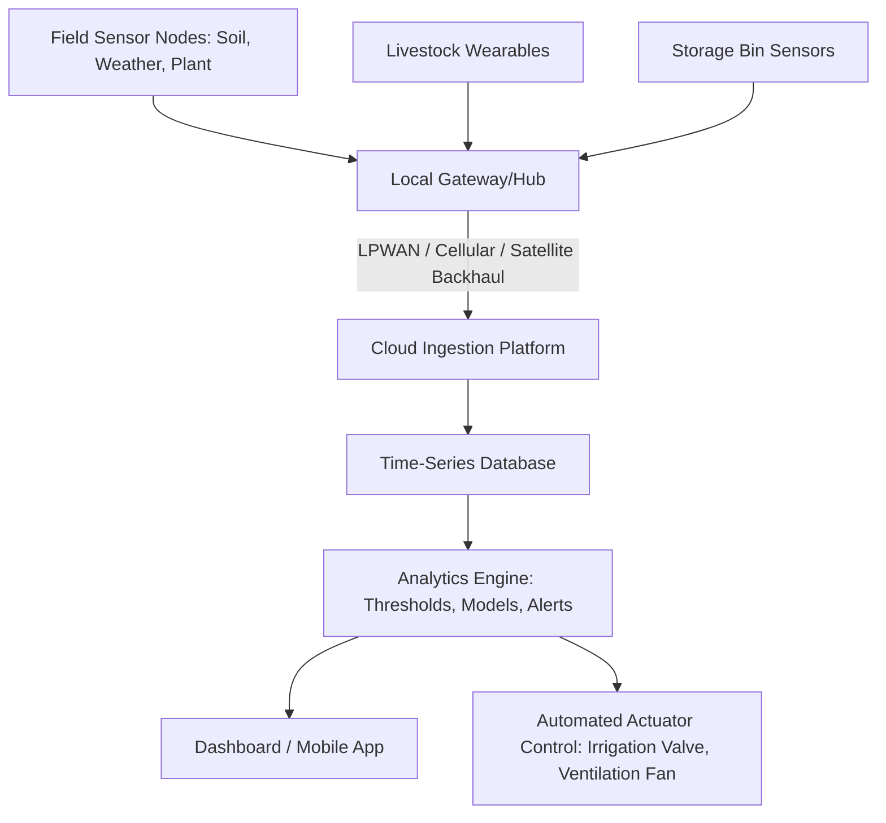

## Sensors and IoT in Agriculture

### Overview

The Internet of Things (IoT) in agriculture refers to networks of physically distributed, connected sensors and actuators deployed across fields, greenhouses, livestock operations, and storage facilities that collect environmental and operational data continuously and transmit it to centralized platforms for monitoring, analysis, and automated control. Where remote sensing and drones provide periodic, area-wide observation, IoT sensor networks provide continuous, point-based, high-frequency data — soil moisture at a specific depth every 15 minutes, air temperature in a greenhouse every minute, water flow in an irrigation line in real time. This combination of continuous ground-truth data with periodic aerial/spatial data forms a complementary sensing hierarchy in modern precision agriculture.

### Sensor Categories

**Soil Sensors**

- **Soil Moisture Sensors** — measure volumetric water content using methods including capacitance (measuring the dielectric permittivity of soil, which changes with water content), time-domain reflectometry (TDR, measuring the travel time of an electromagnetic pulse through a probe inserted in soil), and tensiometers (measuring soil water tension/suction directly, relevant to plant-available water). Typically deployed at multiple depths within a single probe to capture the root zone moisture profile.
- **Soil Temperature Sensors** — inform germination timing, microbial activity estimates, and disease risk models sensitive to soil temperature thresholds.
- **Soil Electrical Conductivity (EC) Sensors** — correlate with soil texture, salinity, and cation exchange capacity; often mounted on mobile sled/toolbar rigs pulled across a field to generate high-resolution EC maps used for management zone delineation, though fixed-point EC sensors also exist for continuous salinity monitoring.
- **Soil Nutrient/pH Sensors** — measure specific ion concentrations (nitrate, potassium) or pH directly in-field via ion-selective electrodes; generally less mature and less widely deployed at scale than moisture/EC sensing due to calibration drift and probe fouling challenges. [Inference: reliability and commercial maturity of continuous in-field nutrient sensors varies significantly by manufacturer and specific ion being measured.]

**Weather and Microclimate Sensors**

On-farm weather stations measure air temperature, relative humidity, rainfall, wind speed/direction, solar radiation, and barometric pressure at field-specific resolution, which can differ meaningfully from the nearest regional weather station, particularly in areas with topographic variation or microclimate effects. This localized data feeds crop disease/pest risk models (many fungal and insect pest models are driven by temperature and humidity/leaf wetness thresholds) and irrigation scheduling calculations.

**Plant and Canopy Sensors**

- **Leaf Wetness Sensors** — detect the presence and duration of moisture on leaf surfaces, a key input to many fungal disease infection risk models.
- **Dendrometers** — measure micro-scale stem or trunk diameter fluctuations, used as a proxy for plant water status in orchard and vineyard research/commercial applications.
- **Optical Canopy Sensors** — on-the-go or fixed sensors measuring reflectance-based vegetation indices for real-time crop status assessment (see Variable Rate Technology for application in sensor-based VRT).

**Livestock Sensors**

- **Wearable Sensors** — ear tags, collars, or boluses (ingestible sensors residing in the reticulum) measuring activity level, rumination time, body temperature, and location (via GNSS or local positioning), used for estrus detection, health/disease early-warning, and location tracking in extensive grazing systems.
- **Environmental Sensors in Livestock Facilities** — temperature, humidity, and ammonia/gas concentration sensors in barns and confinement facilities, feeding automated ventilation control systems.

**Storage and Post-Harvest Sensors**

Temperature and humidity sensors in grain bins and storage facilities monitor conditions linked to spoilage, mold growth, and insect activity risk, often paired with automated aeration fan control systems that activate based on sensor thresholds.

### IoT Network Architecture

**Connectivity Protocols**

Agricultural IoT deployments face a distinct connectivity challenge compared to urban/industrial IoT: sensors are often spread across large areas with limited or no existing cellular/WiFi infrastructure, and battery life must often extend to months or years given the impracticality of frequent field visits for battery replacement. This has driven adoption of Low-Power Wide-Area Network (LPWAN) protocols specifically suited to these constraints.

| Protocol | Range | Power Use | Data Rate | Typical Use |
| --- | --- | --- | --- | --- |
| LoRaWAN | 2–15 km (rural, line-of-sight favorable) | Very low (multi-year battery life) | Low (small payloads) | Soil sensors, weather stations, low-frequency livestock tracking |
| NB-IoT (Narrowband IoT) | Cellular network range | Low | Low-moderate | Sensors in areas with existing cellular tower coverage |
| Sigfox | 3–10 km (rural) | Very low | Very low | Simple periodic sensor readings, similar niche to LoRaWAN |
| Cellular (3G/4G/5G) | Cellular network range | Higher (relative to LPWAN) | High | Gateways/hubs aggregating sensor data, image/video transmission, real-time control systems |
| Satellite IoT | Global (where line-of-sight to satellite exists) | Low-moderate | Very low | Remote areas entirely outside cellular coverage |
| Bluetooth Low Energy (BLE) / Zigbee | Short range (tens to low hundreds of meters) | Low | Moderate | Local sensor-to-gateway hops within a barn, greenhouse, or short-range field mesh |

[Unverified: specific range and battery life figures vary substantially based on terrain, obstruction, antenna configuration, and transmission frequency; the figures above represent commonly cited general ranges rather than guaranteed performance in any specific deployment.]

**Edge vs. Cloud Processing**

Some agricultural IoT systems perform preliminary data processing at the edge (on the sensor node or local gateway) before transmission, reducing bandwidth requirements and enabling faster local response (e.g., an irrigation controller triggering a valve based on a local soil moisture threshold without waiting for a round-trip to the cloud). More complex analytics (multi-sensor fusion, machine learning-based prediction models, historical trend analysis) typically occur in the cloud where greater computational resources are available.

### Practical Example: Threshold-Based Irrigation Automation

A soil moisture sensor network reports volumetric water content (VWC) at 20 cm depth every 30 minutes across five zones of a center-pivot irrigated field. The automation logic follows a simple threshold rule:

$$\text{Irrigate if } VWC_{zone} < VWC_{trigger}$$

Where $VWC_{trigger}$ is typically set based on the crop's allowable depletion percentage of total available water for the specific soil type. For a soil with field capacity of 32% VWC and a permanent wilting point of 14% VWC, a common allowable depletion of 50% for a moderately sensitive crop sets:

$$VWC_{trigger} = 14 + 0.5 \times (32 - 14) = 23\%$$

When zone-specific sensors report VWC below 23%, the system either alerts the operator for manual pivot control or, in a fully automated setup, sends a command directly to a variable rate irrigation (VRI) controller to increase water application in that specific pivot sector, closing the loop from sensor to actuator without manual intervention.

### Applications in Precision Agriculture

- **Irrigation Scheduling and Automation** — soil moisture and weather sensor networks trigger irrigation timing and, combined with VRI systems, spatially variable irrigation rates.
- **Disease and Pest Risk Modeling** — leaf wetness, temperature, and humidity sensor data feed epidemiological models (e.g., for late blight in potatoes, or fire blight in orchards) that generate spray timing alerts, reducing calendar-based (fixed-schedule) spraying in favor of risk-based timing.
- **Livestock Health and Behavior Monitoring** — wearable sensor data supports early detection of illness (via activity/rumination anomalies), estrus detection for breeding timing, and location tracking for theft prevention or lost-animal recovery in extensive systems.
- **Grain Storage Management** — bin sensor networks trigger automated aeration to manage temperature and moisture, reducing spoilage risk and supporting quality-based grading at sale.
- **Greenhouse and Controlled Environment Agriculture** — dense sensor networks (temperature, humidity, CO2, light, soil/substrate moisture) feed automated climate control systems, forming the backbone of controlled environment agriculture (CEA) operations.
- **Equipment and Asset Monitoring** — telematics sensors on machinery track location, fuel use, engine hours, and maintenance needs, extending IoT concepts from the field to fleet management.

### Limitations and Practical Considerations

- **Power and Maintenance Logistics** — despite low-power protocol design, battery replacement and physical sensor maintenance (soil probe fouling, sensor drift, physical damage from equipment or wildlife) remain ongoing operational burdens across large sensor networks.
- **Calibration and Sensor Drift** — soil and nutrient sensors in particular are prone to calibration drift over time due to soil chemistry changes, probe degradation, or biofouling, requiring periodic recalibration or replacement to maintain data reliability.
- **Network Coverage Gaps** — remote or topographically complex farmland may fall outside LPWAN gateway range or cellular coverage, requiring additional gateway infrastructure investment or satellite backhaul, which increases per-node deployment cost.
- **Data Volume and Integration Complexity** — as sensor node counts scale into the hundreds or thousands across an operation, integrating heterogeneous sensor types and protocols into a single coherent FMIS view becomes a significant systems integration challenge.
- **Point-Data vs. Spatial Representativeness** — a fixed-point sensor measures conditions only at its specific location; extrapolating that reading to represent an entire management zone assumes spatial homogeneity that may not hold, particularly for soil moisture in fields with variable soil texture or topography.
- **Cybersecurity Considerations** — as IoT networks increasingly connect to automated actuators (irrigation valves, ventilation systems), the security of the network and cloud platform becomes operationally significant, since unauthorized access could trigger unwanted physical actions in addition to data exposure. [Inference: the maturity of cybersecurity practices across the agricultural IoT vendor landscape is uneven and not something that can be generalized reliably across the industry.]

### Related Topics

- LoRaWAN network deployment and gateway planning for rural coverage
- Variable Rate Irrigation (VRI) system integration with soil moisture sensor networks
- Disease and pest epidemiological models driven by weather sensor data
- Livestock wearable technology and precision livestock farming
- Controlled Environment Agriculture (CEA) climate control automation
- Edge computing architectures for on-farm real-time sensor processing
- Grain storage monitoring and automated aeration control systems
- Agricultural IoT cybersecurity and network security practices