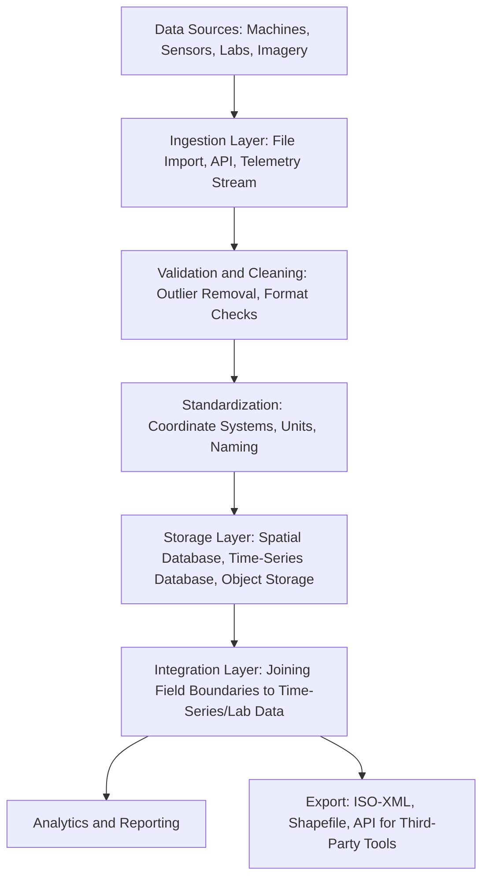

## Agricultural Data Management

### Overview

Agricultural data management is the discipline of collecting, structuring, storing, integrating, and governing the diverse data streams generated across a farming operation — spatial field data, machine telemetry, sensor readings, remote sensing imagery, laboratory results, and financial records — so that this data remains accurate, accessible, interoperable, and secure over time. Where Farm Management Software (FMIS) is the application layer that farmers directly interact with, agricultural data management encompasses the underlying practices, standards, and architectural decisions that determine whether that data is trustworthy, portable, and usable for both near-term operational decisions and long-term multi-year analysis.

### Categories of Agricultural Data

| Data Category | Examples | Typical Characteristics |
| --- | --- | --- |
| Spatial/Geospatial | Field boundaries, management zones, soil maps, yield maps, imagery | Vector (points/lines/polygons) or raster (gridded pixel) formats, georeferenced to a coordinate system |
| Time-Series/Sensor | Soil moisture logs, weather station readings, IoT telemetry | High-frequency, timestamped, often streaming |
| Operational/Machine | As-planted, as-applied, as-harvested logs, equipment telematics | Georeferenced and timestamped, generated automatically by machine controllers |
| Laboratory | Soil test results, tissue test results, grain quality assays | Discrete, periodic, tied to a specific sample location/date |
| Financial | Input costs, commodity sales, land rent, labor costs | Transactional, often tied to accounting periods rather than field geography directly |
| Regulatory/Compliance | Pesticide application records, certification audit trails | Structured to satisfy specific reporting requirements, often with legally mandated retention periods |

### Data Structures and Formats

**Vector vs. Raster Spatial Data**

Agricultural spatial data is represented in two fundamental GIS structures: vector data (discrete geometric shapes — points for sample locations, lines for guidance paths, polygons for field boundaries and management zones) and raster data (continuous gridded values — satellite imagery, interpolated yield surfaces, elevation models). Understanding which structure a given dataset uses determines which analysis tools and file formats are appropriate; for example, zonal statistics (calculating an average raster value within a vector polygon boundary) is a foundational operation combining both structures, used constantly in translating remote sensing imagery into per-zone or per-field summary values.

**Common File Formats**

- **Shapefile (.shp)** — a longstanding, widely supported vector GIS format (technically a multi-file format including .shp, .shx, .dbf, and others), used for field boundaries, management zones, and prescription maps.
- **GeoJSON** — a text-based, human-readable vector format increasingly used in web-based and API-driven agricultural applications due to its simplicity and native compatibility with JavaScript/web mapping libraries.
- **GeoTIFF** — a raster format embedding georeferencing metadata directly in the image file, the standard format for satellite/drone imagery and derived index rasters (NDVI maps, elevation models).
- **ISO-XML (ISO 11783)** — the ISOBUS task file standard for exchanging prescriptions and as-applied/as-planted/as-harvested data between FMIS platforms and machine controllers across brands.
- **CSV/Delimited Text** — a simple, near-universal format for tabular data (soil test results, simple point-based sensor logs), lacking native spatial or type structure but valued for its broad compatibility.

### Data Pipeline Architecture

**Data Cleaning Considerations**

Raw agricultural data frequently contains systematic artifacts requiring correction before reliable analysis:

- **Yield Monitor Data** — combine harvester header-width transition zones at pass boundaries, low-flow start/stop artifacts at the beginning and end of passes, and GNSS positional noise all introduce spurious data points that must be filtered or flagged before generating a valid yield map.
- **Sensor Drift and Outliers** — soil and weather sensors can produce erroneous readings from calibration drift, physical fouling, or transient malfunction; automated outlier detection (e.g., flagging values outside physically plausible ranges, or sudden discontinuous jumps inconsistent with the sensor's expected response time) is a standard preprocessing step.
- **Coordinate Reference System (CRS) Consistency** — spatial datasets from different sources may use different coordinate reference systems (e.g., WGS84 geographic coordinates vs. a projected UTM zone); combining datasets without reprojecting to a common CRS produces silent, hard-to-detect spatial misalignment errors.

### Interoperability Standards and Initiatives

- **ISOBUS / ISO 11783** — the dominant machine-to-software data exchange standard in agriculture, defining both the physical/electrical communication protocol between tractor and implement and the ISO-XML file format for task data exchange.
- **AgGateway and ADAPT** — an industry consortium (AgGateway) maintaining the ADAPT (Agricultural Data Application Programming Toolkit), an open-source framework designed to translate between the many brand-specific data formats in use, reducing the need for custom point-to-point integrations between every pair of software platforms.
- **Open Geospatial Consortium (OGC) Standards** — general GIS interoperability standards (e.g., Web Map Service/WMS, Web Feature Service/WFS) that underpin how many agricultural platforms serve and consume spatial data over the web, though adoption specifics vary by vendor.

### Data Governance and Ownership

Agricultural data governance addresses who controls, accesses, and benefits from farm-generated data, an area of active industry discussion given that modern machinery and software continuously generate detailed operational data as a byproduct of normal use.

- **Ownership Clarity** — most current industry agreements and codes of conduct affirm that the farmer owns the data generated on their operation, though the specific contractual terms governing how equipment manufacturers and software providers may access, aggregate, or monetize that data (e.g., for benchmarking products, informing predictive models, or third-party data sales) vary by provider and are defined in individual terms of service agreements. [Unverified: specific ownership and usage terms are contractual and vendor-specific, and industry-wide practices continue to evolve; farmers should review current terms of service for their specific platforms rather than relying on general industry statements.]
- **Consent and Portability** — governance frameworks generally emphasize that farmers should be able to consent to specific data uses (rather than blanket consent), and should be able to export their data in a usable format if they switch providers, though the practical ease of this varies by platform.
- **Aggregated/Benchmarking Data** — some platforms use anonymized, aggregated data across many farms to generate regional benchmarking insights (e.g., comparing a farm's yield to a regional average); the specific anonymization and aggregation methodology, and whether farmers can opt out, differs by provider.

### Data Security Considerations

- **Access Control** — role-based access management restricting which employees, contractors, or agronomic advisors can view or modify specific data layers (e.g., a hired agronomist may have prescription-writing access without full financial data visibility).
- **Backup and Redundancy** — given multi-year historical data's value for zone delineation and trend analysis, robust backup practices (cloud-based redundancy, periodic export to farmer-controlled storage) protect against provider platform discontinuation or data loss.
- **Network Security for Connected Devices** — as IoT sensors and automated actuators increasingly connect farm operations to cloud platforms, standard cybersecurity practices (secure authentication, encrypted transmission, regular firmware updates) become operationally relevant, since compromised access could affect not just data confidentiality but physical equipment behavior. [Inference: the maturity and consistency of cybersecurity practices across the agricultural technology vendor landscape varies and is not something that can be generalized reliably industry-wide.]

### Practical Example: Multi-Source Data Integration for Management Zone Analysis

A farm manager wants to delineate management zones for a 60-hectare field using three independent data sources with different native formats:

1. **Five years of combine yield data** (proprietary machine format, exported as shapefiles per season) — imported and cleaned to remove header-transition and low-flow artifacts, then reprojected to a consistent UTM coordinate system.
2. **A soil EC survey** (CSV point data with latitude/longitude and EC readings) — converted to a vector point layer and interpolated into a continuous EC raster surface using a spatial interpolation method (e.g., kriging or inverse distance weighting).
3. **Current-season NDRE satellite imagery** (GeoTIFF raster, native WGS84 coordinate system) — reprojected to match the UTM system used for the other layers, then clipped to the field boundary.

These three layers, now spatially aligned to a common coordinate system and boundary, are combined through a zone-clustering algorithm to generate a final management zone map — a process only possible because each source, despite arriving in a different native format and coordinate system, was standardized during the data management pipeline before analysis.

### Applications in Precision Agriculture

- **Multi-Year Yield Trend Analysis** — properly archived and cleaned yield data across seasons enables identification of persistently productive or problematic zones, distinguishing chronic issues from single-season weather anomalies.
- **Cross-Platform Prescription Development** — standardized data exchange (ISO-XML, ADAPT-mediated translation) allows a prescription generated in one software platform to be executed on equipment from a different manufacturer.
- **Regulatory and Certification Audit Trails** — well-structured, timestamped application records support pesticide use compliance reporting and organic/sustainability certification audits without manual record reconstruction.
- **Carbon and Ecosystem Service Program Verification** — emerging carbon markets and sustainability programs increasingly require verifiable, timestamped practice records (tillage events, cover crop establishment, input reduction) drawn directly from farm data management systems as evidence.
- **Benchmarking and Peer Comparison** — aggregated, anonymized data across many farms enables individual operations to compare their performance metrics against regional or crop-specific benchmarks.

### Limitations and Practical Considerations

- **Fragmentation Across Brands** — despite standards like ISOBUS and initiatives like ADAPT, practical interoperability gaps persist between competing proprietary ecosystems, and full seamless cross-brand data flow is not universally achieved. [Unverified: the degree of interoperability gap varies by specific software/equipment pairing and changes as vendors update integration partnerships.]
- **Historical Data Migration Difficulty** — farms accumulating years of data within a single platform's proprietary structure can face significant technical and time costs when migrating to a different provider, creating practical vendor lock-in even where data export is nominally supported.
- **Data Quality as the Limiting Factor** — no amount of sophisticated data management infrastructure compensates for poor-quality source data (uncalibrated sensors, infrequent soil sampling, inconsistent field boundary updates); data governance and pipeline design should be paired with attention to data collection quality at the source.
- **Connectivity and Rural Infrastructure Constraints** — cloud-centric data architectures depend on reliable connectivity for timely synchronization, which remains inconsistent in many rural farming regions, necessitating robust offline-capable local storage and sync mechanisms in well-designed agricultural software.

### Related Topics

- ISOBUS (ISO 11783) and ADAPT data translation framework
- Spatial interpolation methods (kriging, inverse distance weighting) for point-to-surface conversion
- Yield monitor data cleaning and quality control methodologies
- Farm data ownership, privacy, and third-party data-sharing agreements
- Carbon program and ecosystem service market data verification requirements
- Coordinate reference systems and spatial data reprojection
- Cloud vs. on-premise/offline-first architecture for rural connectivity constraints
- Agricultural cybersecurity practices for connected farm equipment