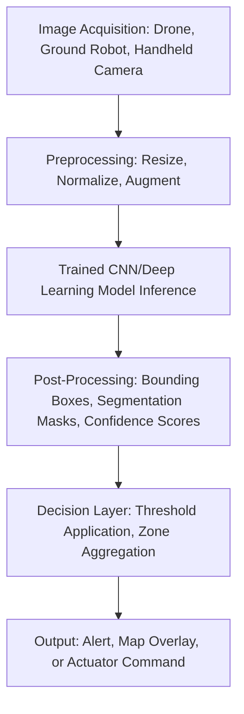

## Artificial Intelligence Applications in Farming

### Overview

Artificial intelligence (AI) in agriculture refers to computational systems — primarily machine learning (ML) and computer vision models — that learn patterns from agricultural data (imagery, sensor time-series, historical yield and weather records) to make predictions, classifications, or autonomous decisions that would otherwise require direct human judgment or manual analysis. AI serves as the analytical layer sitting atop the data infrastructure discussed in remote sensing, IoT sensors, and farm data management, converting raw, high-volume data streams into predictions (yield forecasts), classifications (disease identification, weed detection), and autonomous actions (robotic harvesting, targeted spraying).

### Core AI/ML Techniques Applied in Agriculture

**Computer Vision and Image Classification**

Convolutional Neural Networks (CNNs) and related deep learning architectures are trained on labeled image datasets to classify or detect objects within images — the dominant AI technique for visual agricultural tasks. Training typically requires large labeled datasets (thousands to hundreds of thousands of annotated images) covering the target crop, growth stages, and condition variability the model must generalize across.

- **Disease and Pest Identification** — models trained on images of diseased vs. healthy plant tissue classify disease presence and type, often deployed via smartphone apps allowing farmers to photograph a symptomatic leaf for near-instant diagnosis.
- **Weed Detection and Discrimination** — models distinguish crop plants from weeds (green-on-green detection, more technically challenging than green-on-brown detection against bare soil) to enable targeted herbicide spraying or mechanical weeding, directly reducing chemical input volume compared to blanket application.
- **Fruit/Produce Counting and Grading** — object detection models count fruit for yield estimation (e.g., counting apples or grapes visible in canopy imagery) or grade harvested produce by size, color, and visible defects on packing line vision systems.
- **Plant Stand Counting** — detecting individual seedlings in drone or ground-based imagery to assess emergence rates and identify replant-worthy gaps shortly after planting.

**Predictive Modeling and Time-Series Forecasting**

Machine learning regression models (ranging from classical methods like random forests and gradient boosting to more complex neural network architectures for sequential data) are trained on historical weather, soil, and yield data to forecast future outcomes.

- **Yield Prediction** — models combining historical yield, current-season weather, remote sensing vegetation index trends, and soil data forecast expected yield before harvest, supporting marketing, storage, and logistics planning decisions.
- **Disease/Pest Outbreak Risk Forecasting** — models trained on historical weather conditions preceding known outbreak events predict elevated risk windows, extending beyond simple threshold-based rules (see Sensors and IoT) into more complex multi-variable pattern recognition.
- **Price and Market Forecasting** — models incorporating historical commodity price data, weather-driven supply forecasts, and macroeconomic indicators support marketing timing decisions, though this domain generally exhibits higher irreducible uncertainty than biophysical crop models. [Inference: agricultural commodity price forecasting accuracy is inherently limited by exposure to macroeconomic, geopolitical, and weather factors that are not fully predictable by any model.]

**Robotics and Autonomous Systems**

AI-driven perception and control systems enable physical automation of tasks traditionally requiring direct human labor or operator-driven machinery.

- **Autonomous Navigation** — building on GNSS guidance (see GPS and GNSS guidance systems), AI-based perception systems (typically combining cameras, LiDAR, and radar) enable obstacle detection and avoidance, allowing fully autonomous tractors and implements to operate without a continuously present human operator, subject to regulatory and safety oversight requirements that vary by jurisdiction.
- **Robotic Harvesting** — computer vision identifies ripe produce (assessing color, size, and sometimes firmness proxies) and robotic arms execute picking, most advanced in structured, high-value specialty crops (e.g., certain fruit and vegetable crops) where the economic value per unit justifies the engineering complexity; broad-scale robotic harvesting of field crops like grain remains largely automated at the whole-machine level (autonomous combines) rather than the individual-plant manipulation level.
- **Targeted/Robotic Weeding** — combines weed detection computer vision with mechanical (blade, laser, or precision spray) actuation to eliminate individual weeds without disturbing crop plants, reducing herbicide reliance.

**Natural Language Processing (NLP) and Conversational Tools**

Increasingly, agricultural software incorporates NLP-based interfaces (chatbots, voice assistants) allowing farmers to query farm data, retrieve agronomic recommendations, or interact with FMIS platforms using natural language rather than navigating structured dashboards. [Inference: the sophistication and reliability of these conversational interfaces vary considerably across current commercial agricultural software offerings.]

### Technical Architecture: A Typical Computer Vision Pipeline

**Model Development Workflow**

1. **Data Collection and Labeling** — acquiring representative images across the target conditions (growth stages, lighting, disease severity levels, geographic/varietal diversity) and manually annotating them (bounding boxes, segmentation masks, or class labels) — typically the most time- and cost-intensive phase of agricultural computer vision development.
2. **Model Training** — training a CNN or similar architecture on the labeled dataset, commonly using transfer learning (starting from a model pretrained on a large general-purpose image dataset and fine-tuning on the agriculture-specific dataset) to reduce the amount of labeled data and compute required compared to training from scratch.
3. **Validation and Testing** — evaluating model performance on held-out data not used in training, using metrics such as precision, recall, and F1 score (for classification/detection tasks) or mean absolute error/root mean squared error (for regression/counting tasks).
4. **Deployment** — deploying the trained model either to the cloud (processing images uploaded from field devices) or to the edge (running directly on a drone, robot, or handheld device for low-latency, offline-capable inference), with edge deployment often requiring model compression techniques to fit within the memory and compute constraints of field hardware.
5. **Monitoring and Retraining** — tracking model performance in production and periodically retraining as new data becomes available or as conditions drift from the original training distribution (e.g., a disease model trained primarily on one region's climate conditions may underperform when deployed in a substantially different growing environment).

### Practical Example: Weed Detection Confidence Thresholding

A green-on-green weed detection model outputs a confidence score between 0 and 1 for each detected object, classifying it as crop or weed. The targeted spray system applies a decision threshold:

$$\text{Spray if } P(\text{weed}) > \tau$$

Where $\tau$ is a tunable threshold. Setting $\tau$ low (e.g., 0.3) increases recall (catching more actual weeds) but increases false positives (spraying crop plants misclassified as weeds, causing crop damage). Setting $\tau$ high (e.g., 0.8) increases precision (fewer crop plants mistakenly sprayed) but increases false negatives (missed weeds that continue competing with the crop). This precision-recall trade-off is a standard consideration in deploying any classification-based agricultural AI system, and the optimal threshold depends on the relative economic cost of a missed weed versus a damaged crop plant, which varies by crop value and weed competitiveness.

### Applications in Precision Agriculture

- **Disease and Pest Diagnosis** — smartphone and drone-based image classification tools provide rapid, often near-instant diagnostic support, extending expert-level identification capability to growers without direct access to a plant pathologist.
- **Precision Weed Management** — AI-driven targeted spraying and mechanical weeding systems substantially reduce herbicide volume compared to blanket application, both lowering input cost and reducing environmental/resistance-selection pressure from broadcast chemical use.
- **Yield Forecasting** — pre-harvest yield prediction models support grain marketing timing, storage capacity planning, and logistics scheduling for harvest and transport.
- **Autonomous Field Operations** — AI-enabled autonomous tractors, sprayers, and harvesters reduce labor dependency, an increasingly significant consideration given persistent agricultural labor shortages in many regions. [Inference: the extent of labor shortage as an adoption driver varies by region and crop sector, and is generally supported by industry reporting rather than being a universally quantified figure.]
- **Livestock Monitoring and Health Prediction** — AI models applied to wearable sensor data (see Sensors and IoT in Agriculture) predict disease onset, estrus timing, and calving events earlier and more reliably than manual observation alone in large herds.
- **Robotic Harvesting in Specialty Crops** — computer vision-guided robotic harvesters address labor-intensive, time-sensitive harvest windows in high-value fruit and vegetable crops.
- **Supply Chain and Quality Grading** — AI-based vision systems on packing lines automate produce grading by size, color, and defect detection, improving consistency and throughput compared to manual grading.

### Limitations and Practical Considerations

- **Data Requirements and Labeling Cost** — high-performing computer vision models require substantial labeled training data specific to the target crop, region, and condition variability; models trained on data from one region, crop variety, or growth stage range may not generalize reliably to different conditions without additional fine-tuning data.
- **Environmental Variability** — field conditions (variable lighting, occlusion from overlapping leaves, dust, motion blur from moving platforms) introduce noise that controlled laboratory or greenhouse-trained models may not handle robustly, often requiring field-collected training data specifically to achieve production-grade reliability.
- **Explainability and Trust** — deep learning models are often difficult to interpret in terms of exactly why a specific classification or prediction was made, which can create adoption friction among growers or agronomists who want to understand the reasoning behind a recommendation, particularly for high-stakes decisions.
- **Connectivity for Cloud-Dependent Models** — models requiring cloud inference face the same rural connectivity constraints discussed in agricultural data management, driving interest in edge-deployed, offline-capable model architectures for field robotics and real-time spray control.
- **Regulatory and Safety Oversight for Autonomy** — fully autonomous field equipment (no on-board human operator) faces evolving and jurisdiction-specific regulatory frameworks regarding liability, safety certification, and permitted operating conditions; the maturity of these frameworks varies considerably by country and is an active area of policy development. [Unverified: specific autonomous equipment regulations differ by jurisdiction and are subject to ongoing change; consult current national and regional regulatory bodies for applicable requirements.]
- **Cost and ROI Justification** — AI-enabled equipment (robotic weeders, autonomous harvesters) often carries a significant capital cost premium over conventional equipment, requiring clear labor savings or input reduction benefits to justify adoption, particularly for smaller-scale operations.

### Related Topics

- Computer vision model training and transfer learning for agricultural imagery
- Precision/targeted spraying systems and green-on-green weed detection
- Autonomous tractor and harvester navigation and obstacle avoidance
- Yield forecasting models combining remote sensing and weather data
- Precision livestock farming and AI-based health/behavior prediction
- Edge AI deployment and model compression for field robotics
- Agricultural AI regulatory frameworks and autonomous equipment safety standards
- Explainable AI (XAI) methods for agronomic decision support systems