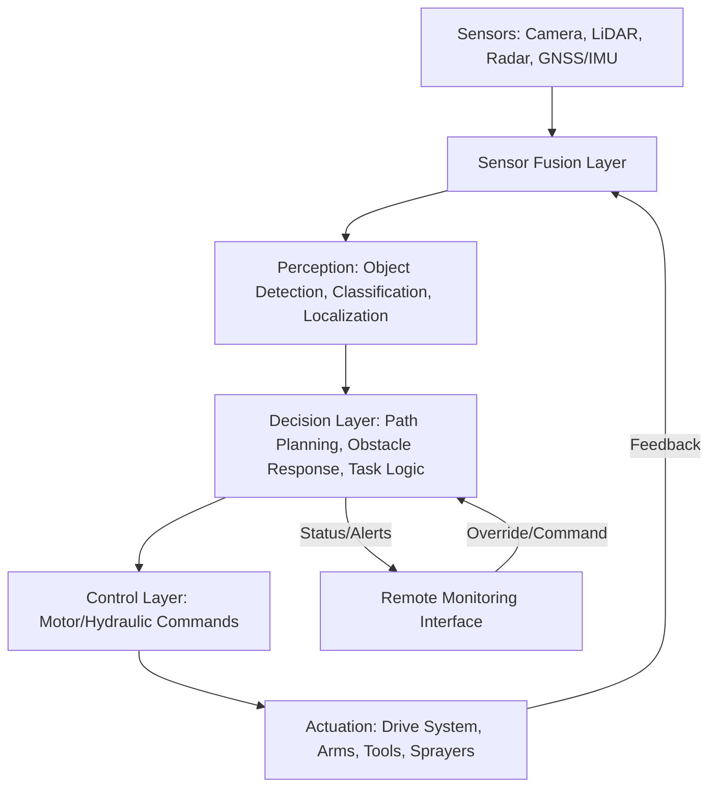

## Robotics and Automation in Farming

### Overview

Agricultural robotics and automation encompass physical machines that perform farm tasks with reduced or eliminated human operator involvement, ranging from partially automated systems that assist a human operator (autosteer-guided tractors, automated milking parlors) to fully autonomous systems that perceive their environment, make decisions, and execute physical actions without direct human control (driverless field robots, autonomous harvesters). This builds directly on the GNSS guidance foundations, sensor infrastructure, and AI perception systems covered elsewhere in this chapter, integrating them into complete physical systems capable of independent or semi-independent operation.

### Levels of Automation

Agricultural automation is often described along a spectrum analogous to (though not identically standardized as) the automotive industry's levels of driving automation:

| Level | Description | Agricultural Example |
| --- | --- | --- |
| Operator-Assisted | Human operator present and in control; system assists specific functions | Autosteer guidance with manual implement control |
| Supervised Autonomy | Human operator present but not actively controlling; monitors and can intervene | Semi-autonomous tractor requiring an in-cab or nearby supervisor |
| Remote Supervised Autonomy | No operator in/on the machine; a remote human monitors one or more machines and can intervene | Fleet of autonomous tractors managed by a single remote operator |
| Full Autonomy | System operates and makes decisions independently within its operational domain, without continuous human monitoring | Field robots executing scouting or weeding routes with only periodic human check-ins |

[Inference: this framework describes a general conceptual progression; agricultural robotics does not have a single universally adopted formal standard analogous to SAE's automotive autonomy levels, and specific vendor systems may not map cleanly onto discrete levels.]

### Core Robotic System Components

**Perception Systems**

Robots sense their environment using a combination of sensor modalities, since no single sensor type reliably handles all agricultural conditions:

- **Cameras (RGB, stereo, multispectral)** — provide visual data for object detection, crop/weed classification, and obstacle recognition; stereo camera pairs additionally estimate depth/distance.
- **LiDAR** — measures precise distance to surrounding objects via laser time-of-flight, valuable for obstacle detection and 3D mapping of terrain or canopy structure, generally more robust than cameras alone in variable lighting conditions.
- **Radar** — detects objects and estimates distance/velocity using radio waves, notably more robust than cameras or LiDAR in dust, fog, or heavy rain — conditions common in field environments during tillage or harvest operations.
- **GNSS/IMU** — provides absolute position and orientation reference (see GPS and GNSS guidance systems), typically fused with the above perception sensors through sensor fusion algorithms to produce a robust combined estimate of the robot's position and surroundings.

**Decision and Control Systems**

- **Path Planning** — algorithms that compute an efficient route across a field or orchard, accounting for field boundaries, obstacles, and task-specific coverage requirements (e.g., ensuring complete spray coverage without excessive overlap).
- **Obstacle Detection and Avoidance** — real-time processing of perception sensor data to identify and react to unexpected obstacles (people, animals, equipment, terrain hazards) not present in the pre-planned path, a critical safety function for any autonomous system operating in shared or unpredictable environments.
- **Task-Specific Control Algorithms** — logic governing the robot's specific function, such as targeted spray nozzle activation timing based on weed detection, or gripper force control for delicate fruit harvesting.

**Actuation Systems**

The physical mechanisms executing the robot's task: drive motors/hydraulics for locomotion, robotic arms/end-effectors for harvesting or manipulation, spray nozzles or mechanical tools for weeding, and specialized grippers designed for the specific crop's physical handling requirements (e.g., variable-force grippers for soft fruit to avoid bruising).

### System Architecture

### Categories of Agricultural Robots and Automated Systems

**Autonomous Field Vehicles**

Driverless tractors, sprayers, and harvesters capable of executing planned field operations without a continuously present in-cab operator. Some systems retrofit autonomy kits onto conventional equipment, while others are purpose-built autonomous platforms. Fleet approaches, in which multiple smaller autonomous units perform work collectively rather than relying on a single large machine, are also an area of active industry development, potentially offering redundancy (one unit's downtime does not halt the entire operation) and reduced individual machine weight (relevant to soil compaction concerns). [Inference: the relative economic and agronomic advantages of fleet-based versus single-large-machine autonomy models remain an active area of industry debate and are not settled with strong consensus.]

**Robotic Harvesters**

Computer vision-guided systems that identify, approach, and pick produce. Most commercially mature in structured, high-value specialty crops with relatively uniform plant architecture (e.g., certain berry, tomato, and orchard fruit operations), where the per-unit value justifies the engineering cost of reliable perception and gentle-handling actuation. Broad-acre grain crop harvesting remains automated primarily at the whole-machine level (autonomous combines following GNSS-guided paths) rather than at the individual-plant manipulation level, since grain harvest does not require individual fruit identification and handling.

**Robotic Weeders**

Ground-based robots (or robotic attachments on conventional equipment) that combine weed detection computer vision (see Artificial Intelligence Applications in Farming) with mechanical, laser, or precision-spray actuation to eliminate individual weeds. This approach directly reduces herbicide reliance and can address herbicide-resistant weed populations that are increasingly problematic for conventional chemical-only weed control strategies.

**Automated Livestock Systems**

- **Automated Milking Systems (AMS/Robotic Milkers)** — allow cows to be milked on a voluntary, self-initiated basis rather than fixed group milking times, using robotic arms guided by sensors (often laser or camera-guided teat detection) to attach milking equipment automatically.
- **Automated Feeding Systems** — robotic feed pushers and mixer-feeders that deliver precisely calculated feed rations on programmed schedules, reducing labor and improving feeding consistency.
- **Automated Manure/Barn Cleaning Systems** — robotic scrapers or vacuum systems that maintain barn cleanliness on a continuous or frequent schedule without manual labor.

**Greenhouse and Controlled Environment Robotics**

Robotic systems for seeding, transplanting, and harvesting within the more structured, controlled physical environment of greenhouses and vertical farms, where consistent lighting, spacing, and lack of weather variability simplify perception and navigation challenges relative to open-field robotics.

### Practical Example: Coverage Path Planning for an Autonomous Sprayer

An autonomous sprayer must cover a rectangular field of 400 m x 250 m with an effective spray width of 24 m per pass. The number of parallel passes required, ignoring headland turns, is:

$$\text{Number of Passes} = \frac{\text{Field Width}}{\text{Spray Width}} = \frac{250}{24} \approx 10.4 \rightarrow 11 \text{ passes}$$

Path planning software generates a boustrophedon (back-and-forth, "as the ox plows") pattern across the 11 passes, additionally computing headland turn maneuvers at each row end that account for the machine's minimum turning radius. The system must also incorporate obstacle avoidance logic to detect and safely respond to any unplanned obstruction (a person, animal, or piece of equipment) encountered during execution, overriding the pre-planned path when necessary — the same real-time perception-decision-actuation loop shown in the architecture diagram above.

### Safety and Regulatory Considerations

- **Operational Domain Definition** — autonomous systems are typically certified or approved to operate only within a defined operational design domain (specific field conditions, weather limits, and terrain types), outside of which reliability is not guaranteed.
- **Fail-Safe Design** — robust autonomous agricultural systems generally incorporate fail-safe behaviors (immediate stop, safe-state transition) triggered by sensor malfunction, loss of GNSS signal, communication loss with a remote monitoring station, or detection of an unresolvable obstacle.
- **Human-Robot Interaction Safety** — since farms are frequently shared spaces with workers, family members, visitors, and animals, robust and conservative obstacle detection is a critical safety requirement, generally prioritizing false-positive stops (halting unnecessarily) over false-negative failures (failing to detect a genuine obstacle).
- **Regulatory Frameworks** — regulations governing autonomous agricultural equipment operation (liability assignment, required human oversight levels, safety certification standards) vary considerably by jurisdiction and remain an evolving area of policy, generally lagging behind the pace of technological development in this space. [Unverified: specific national and regional regulatory requirements for autonomous farm equipment differ substantially and are subject to ongoing change; consult current regulatory authorities in the relevant jurisdiction.]

### Applications in Precision Agriculture

- **Labor Cost and Availability Mitigation** — automation addresses persistent agricultural labor shortages and rising labor costs in many regions, particularly for labor-intensive tasks like specialty crop harvesting and dairy milking.
- **Precision Task Execution** — robotic systems execute tasks (targeted weeding, individual fruit harvesting) with a consistency and precision difficult to sustain with human labor over long working hours.
- **Reduced Chemical Input** — robotic weeders and targeted spray systems substantially cut herbicide and pesticide volumes compared to blanket chemical application.
- **Extended Operating Hours** — autonomous systems can operate continuously (day and night, within safety and regulatory limits) without the fatigue constraints of human operators, potentially compressing time-sensitive operations like planting and harvest into shorter windows.
- **Animal Welfare and Consistency** — automated milking systems allow voluntary, stress-reduced milking schedules for dairy cattle, and automated feeding ensures consistent ration delivery regardless of staffing variability.
- **Data Generation as a Byproduct** — nearly all robotic and automated systems generate detailed operational and sensor data as a natural byproduct of their function, feeding directly into the farm data management pipelines discussed elsewhere in this chapter.

### Limitations and Practical Considerations

- **High Capital Cost** — autonomous and robotic systems generally carry a significant cost premium over conventional equipment, requiring clear labor savings, yield improvement, or input reduction to justify return on investment, particularly challenging for smaller-scale operations.
- **Reliability in Variable Field Conditions** — dust, mud, extreme weather, and highly variable terrain can degrade sensor performance and mechanical reliability more than in the controlled conditions where many systems are initially developed and tested.
- **Maintenance and Technical Expertise Requirements** — robotic systems introduce a different maintenance skill set (sensor calibration, software updates, electrical/robotic troubleshooting) compared to conventional mechanical equipment, potentially requiring new technical support relationships or in-house expertise.
- **Connectivity Dependency for Remote Monitoring** — fleets relying on remote supervision or cloud-based fleet management face the same rural connectivity constraints discussed throughout this chapter, motivating on-board fail-safe autonomy that does not depend entirely on continuous connectivity.
- **Regulatory Uncertainty** — as noted above, evolving and jurisdiction-specific regulation of autonomous equipment can create adoption uncertainty, particularly for fully unsupervised (no remote monitor) operation.
- **Task Generalization Limits** — most current commercial agricultural robots are narrowly specialized for a specific task and crop type; a system engineered for strawberry harvesting generally cannot be repurposed for a structurally different crop without substantial redesign, limiting the flexibility advantage that a single piece of conventional multi-purpose equipment might offer.

### Related Topics

- Autonomous tractor and harvester obstacle detection and sensor fusion
- Computer vision for robotic weeding and targeted spray systems (see Artificial Intelligence Applications in Farming)
- Automated milking systems and precision dairy management
- Coverage path planning algorithms for field robotics
- Regulatory frameworks for autonomous agricultural equipment
- Fleet management systems for multi-robot farm operations
- Greenhouse and vertical farm robotics for controlled environments
- Human-robot interaction safety standards in shared farm environments