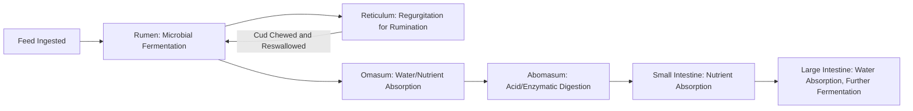

## Livestock Anatomy and Physiology

### Overview

Livestock anatomy and physiology is the study of the structural organization and functional processes of farm animal bodies — cattle, sheep, goats, swine, and poultry being the primary species of commercial interest. Anatomy describes the structure of body systems (skeletal, muscular, digestive, reproductive, respiratory, circulatory), while physiology describes how those structures function and interact to sustain life, growth, reproduction, and production (milk, meat, eggs, fiber). A foundational understanding of these systems underpins nearly every applied area of animal agriculture: nutrition formulation, breeding decisions, disease diagnosis, and welfare assessment all depend on correctly understanding normal anatomical structure and physiological function as the baseline against which abnormality is judged.

### Digestive Systems

**Ruminant Digestive System (Cattle, Sheep, Goats)**

Ruminants possess a four-compartment stomach adapted for the microbial fermentation of fibrous plant material (cellulose) that monogastric animals cannot efficiently digest on their own.

- **Rumen** — the largest compartment, functioning as a fermentation vat housing a dense microbial population (bacteria, protozoa, fungi) that ferments ingested feed, particularly fibrous carbohydrates, producing volatile fatty acids (VFAs — primarily acetate, propionate, and butyrate) that serve as the animal's primary energy source, along with microbial protein and B vitamins synthesized by the microbial population itself.
- **Reticulum** — closely associated with the rumen (sometimes considered functionally as a single reticulorumen unit), featuring a honeycomb-textured lining; involved in the "hardware disease" risk of trapping ingested foreign metal objects, and plays a role in the regurgitation process of rumination ("cud chewing").
- **Omasum** — absorbs water and some remaining nutrients from digesta, with a laminated internal structure resembling book pages ("many-plies" in some traditional terminology) that increases surface area for this absorption.
- **Abomasum** — the "true stomach," functionally analogous to the monogastric stomach, secreting hydrochloric acid and digestive enzymes (pepsin) for enzymatic protein digestion, the final stage before digesta enters the small intestine.

**Rumination Process**

Rumination is the cyclical process of regurgitating partially digested feed (cud) from the reticulorumen back to the mouth for additional chewing, which reduces particle size and increases surface area for further microbial fermentation. Adequate rumination time is a recognized indicator of ruminant health and diet adequacy, and reduced rumination time is used as a monitoring signal in some precision livestock wearable sensor systems (see Sensors and IoT in Agriculture).

**Monogastric Digestive System (Swine, Poultry)**

Monogastric animals possess a single-compartment stomach and rely primarily on their own enzymatic digestion rather than extensive pre-gastric microbial fermentation, though some fermentation occurs in the hindgut (cecum and colon), particularly in swine.

- **Swine** — a simple glandular stomach secreting hydrochloric acid and pepsin, followed by small intestine enzymatic digestion and absorption, with the cecum and colon providing some hindgut fermentation capacity for fiber not digested earlier in the tract, though substantially less extensive than ruminant forestomach fermentation.
- **Poultry** — a distinct digestive tract sequence: the crop (a storage/moistening pouch prior to the true stomach), the proventriculus (glandular stomach secreting acid and enzymes), and the gizzard (a muscular, often grit-containing organ that mechanically grinds feed, functionally substituting for the chewing/mastication absent in birds), followed by the small and large intestine.

### Skeletal and Muscular Systems

The skeletal system provides structural support, protects vital organs, and serves as the mineral reserve (particularly calcium and phosphorus) mobilized during periods of high physiological demand such as lactation or eggshell formation. The muscular system, beyond enabling locomotion, is the primary tissue of commercial interest in meat production, with muscle fiber type composition (influencing tenderness, color, and metabolic characteristics) varying by species, breed, and specific muscle group location on the carcass. Bone and muscle growth patterns follow a generally predictable allometric sequence during animal development, with different body regions and tissue types maturing at different relative rates — a foundational concept in understanding growth curves used in production and slaughter timing decisions.

### Reproductive System

**Female Reproductive Anatomy**

The female reproductive tract (ovaries, oviducts/fallopian tubes, uterus, cervix, vagina) governs the estrous cycle, a hormonally regulated recurring cycle culminating in ovulation (release of a mature egg/ova from the ovary) and, if fertilization occurs, pregnancy establishment and maintenance through gestation.

- **Estrous Cycle** — regulated by a hormonal cascade involving gonadotropin-releasing hormone (GnRH) from the hypothalamus, follicle-stimulating hormone (FSH) and luteinizing hormone (LH) from the pituitary gland, and estrogen/progesterone from the ovaries themselves; cycle length and specific hormonal timing vary by species (e.g., approximately 21 days in cattle, though this and other species-specific parameters can vary somewhat by breed and individual). [Inference: precise average cycle length figures are commonly cited reference ranges and individual animal variation exists.]
- **Gestation** — the pregnancy period from fertilization to parturition (birth), with species-specific typical durations (e.g., approximately 283 days in cattle, 114 days in swine, 150 days in sheep) that also show some natural variation around these averages.

**Male Reproductive Anatomy**

The male reproductive system (testes, epididymis, vas deferens, accessory sex glands, penis) produces sperm (spermatogenesis, occurring in the testes under hormonal regulation, primarily testosterone and FSH/LH from the pituitary) and delivers it during mating. Semen quality assessment (sperm concentration, motility, morphology) is a standard component of breeding soundness evaluation in both natural service and artificial insemination programs.

### Respiratory and Circulatory Systems

The respiratory system (nasal passages, trachea, bronchi, lungs) facilitates gas exchange (oxygen uptake, carbon dioxide removal), with respiratory rate serving as a basic vital sign monitored in health assessment and a factor in heat stress evaluation, since panting is a primary heat dissipation mechanism in several livestock species. The circulatory system (heart, blood vessels, blood) transports oxygen, nutrients, hormones, and immune cells throughout the body, with heart rate similarly serving as a basic vital sign, and blood parameters (packed cell volume, white blood cell counts, specific metabolite levels) forming the basis of diagnostic blood testing in veterinary practice.

### Mammary System and Lactation

The mammary gland, present in female mammals, undergoes hormonally driven development (mammogenesis) during puberty and pregnancy, followed by the onset of milk synthesis (lactogenesis) around parturition, and sustained milk production (galactopoiesis) throughout lactation, primarily regulated by prolactin, oxytocin (responsible for milk ejection/"let-down" in response to suckling or milking stimulus), and other lactogenic hormones. Udder/mammary gland anatomy varies notably by species: cattle typically have four quarters each with an independent teat and gland structure (relevant to udder health management, since infection in one quarter, as in mastitis, does not necessarily spread mechanically to others), while sheep and goats typically have two.

### Avian-Specific Physiology (Poultry)

Beyond the digestive tract differences noted above, poultry physiology includes several distinguishing features relevant to production:

- **Reproductive System** — female birds typically possess only a functional left ovary and oviduct (the right regresses during development), with egg formation proceeding through sequential oviduct regions (infundibulum for fertilization/initial egg white layering, magnum for the bulk of albumen, isthmus for shell membrane formation, and shell gland/uterus for calcification of the eggshell) before oviposition (laying).
- **Respiratory System** — birds possess a unique air sac system supplementing the lungs, enabling a unidirectional airflow pattern through the lungs (rather than the bidirectional in-and-out flow of mammalian breathing) that is generally considered more efficient for gas exchange, relevant to birds' generally higher metabolic rates relative to body size compared to mammals.
- **Thermoregulation** — birds lack sweat glands and rely primarily on panting and behavioral adaptations for heat dissipation, making heat stress management a particularly significant welfare and production concern in poultry housing design.

### Practical Example: Applying Anatomy to a Bloat Diagnosis

A dairy cow presents with visible left-side abdominal distension and discomfort. Understanding reticulorumen anatomy and function directly informs the diagnostic process: the left side distension location corresponds anatomically to the rumen's position within the abdominal cavity, and the presentation is consistent with ruminal bloat — an accumulation of fermentation gases (primarily carbon dioxide and methane) that cannot be normally eructated (belched) due to either frothy bloat (gas trapped in a stable foam matrix, often linked to legume-heavy diets producing plant proteins that stabilize foam) or free-gas bloat (a physical obstruction or positional issue preventing normal gas escape via the esophagus). This anatomical and physiological understanding directly determines the appropriate emergency intervention, which differs depending on bloat type (e.g., anti-foaming agents for frothy bloat versus addressing an obstruction for free-gas bloat), illustrating why foundational anatomy/physiology knowledge is a prerequisite for competent clinical decision-making in livestock health management.

### Applications in Animal Science

- **Nutrition Formulation** — diet formulation for ruminants versus monogastrics differs fundamentally based on digestive system capability, particularly regarding fiber digestion capacity and protein source considerations (e.g., ruminants can utilize non-protein nitrogen sources like urea via microbial conversion, an option unavailable to monogastrics).
- **Breeding and Reproductive Management** — estrous cycle and gestation length knowledge underpins artificial insemination timing, pregnancy diagnosis scheduling, and calving/farrowing/lambing management planning.
- **Health Diagnosis and Veterinary Care** — recognizing normal anatomical structure and physiological function is the necessary baseline for identifying disease, injury, or metabolic disorder presentations.
- **Growth and Carcass Management** — understanding muscle and bone growth allometry informs slaughter timing and carcass grading expectations across species and breeds.
- **Welfare Assessment** — physiological indicators (respiratory rate, heart rate, rumination time, behavioral patterns tied to normal physiological function) form the basis of many objective animal welfare assessment protocols.
- **Precision Livestock Farming Integration** — wearable and environmental sensor systems (see Sensors and IoT in Agriculture) are fundamentally built on physiological monitoring principles (rumination time, activity level, temperature) to infer health and reproductive status.

### Related Topics

- Ruminant nutrition and rumen microbiome management
- Estrous cycle synchronization protocols for artificial insemination
- Mastitis pathophysiology and udder health management
- Poultry reproductive physiology and egg production management
- Growth curve modeling and carcass composition in livestock
- Thermoregulation and heat stress physiology across livestock species
- Veterinary diagnostic reference ranges for vital signs and blood parameters
- Comparative digestive physiology across ruminant and monogastric species