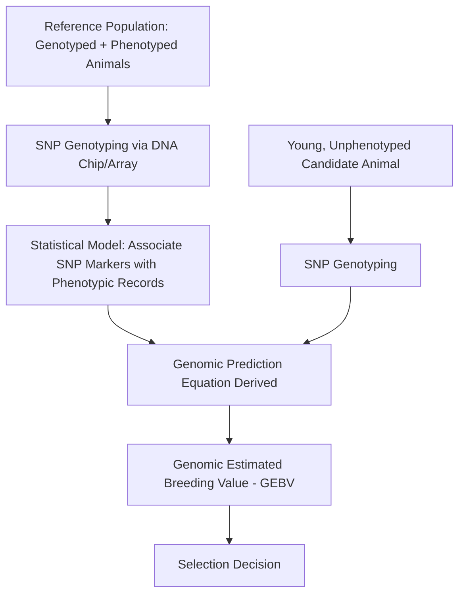

## Animal Genetics and Breeding

### Overview

Animal genetics and breeding is the applied science of understanding heritable traits in livestock and using that understanding to make selection and mating decisions that improve population performance over successive generations. This discipline sits at the intersection of Mendelian and quantitative genetics theory, statistical estimation methods, and modern molecular/genomic technologies, applied toward production traits (growth rate, milk yield, feed efficiency), reproductive traits (fertility, litter size), and increasingly, traits related to disease resistance, welfare, and environmental efficiency (e.g., feed conversion, methane emissions intensity).

### Foundational Genetic Concepts

**Genes, Alleles, and Genotype vs. Phenotype**

A gene occupies a specific locus on a chromosome and may exist in alternative forms called alleles. An animal's genotype is its specific combination of alleles at a locus (or across many loci), while its phenotype is the observable trait resulting from the interaction of genotype and environment. This genotype-phenotype distinction is foundational to breeding decisions: selection based purely on observed phenotype (e.g., selecting the highest-milk-producing cow) conflates genetic merit with environmental effects (nutrition, management, health history), which is why more sophisticated breeding programs use statistical methods to estimate the genetic component specifically.

**Qualitative vs. Quantitative Traits**

- **Qualitative (Mendelian) Traits** — controlled by one or a small number of genes with discrete, categorical phenotypic outcomes (e.g., coat color patterns, presence/absence of horns in some breeds, certain single-gene defects), generally following predictable Mendelian inheritance ratios.
- **Quantitative Traits** — controlled by many genes of individually small effect (polygenic) plus substantial environmental influence, producing continuous, normally-distributed phenotypic variation (e.g., milk yield, growth rate, litter size). The vast majority of economically important livestock production traits are quantitative, which is why quantitative genetics (rather than simple Mendelian ratios) forms the statistical backbone of modern livestock breeding programs.

### Quantitative Genetics Fundamentals

**Heritability**

Heritability ($h^2$) is the proportion of total phenotypic variance in a population attributable to additive genetic variance, expressed as a value between 0 and 1 (or 0% to 100%):

$$h^2 = \frac{V_A}{V_P}$$

Where $V_A$ is additive genetic variance and $V_P$ is total phenotypic variance (the sum of genetic and environmental variance components). A high heritability trait (e.g., many carcass composition traits, often cited in the 0.4–0.6 range) responds relatively efficiently to direct phenotypic selection, while a low heritability trait (e.g., many fertility and disease resistance traits, often below 0.1–0.15) responds slowly to selection based on individual phenotype alone and generally benefits more from family-based selection information or genomic approaches. [Inference: specific heritability estimates vary by population, breed, and study, and the figures cited here represent commonly referenced general ranges rather than fixed universal constants.]

**Breeding Value and Estimated Breeding Value (EBV)**

An animal's breeding value is the value of its genes for a given trait, specifically the portion of its genetic merit that is passed to offspring (twice the deviation of an individual's offspring average from the population mean, in classical quantitative genetics terms). Since true breeding value cannot be observed directly, breeding programs calculate an Estimated Breeding Value (EBV) using statistical models that incorporate the animal's own phenotypic records, pedigree relationships, and (in modern programs) genomic data.

**Selection Index and Multi-Trait Selection**

Because most breeding objectives involve improving multiple traits simultaneously (e.g., growth rate, feed efficiency, and carcass quality together), breeding programs commonly combine EBVs for several traits into a single selection index, weighting each trait according to its relative economic importance and its genetic correlation with other traits in the index. Genetic correlations between traits can be favorable (selecting for one improves another) or antagonistic (selecting for one trait degrades another, such as the historically observed antagonism between growth rate and some fertility traits in certain populations), requiring balanced selection strategies rather than single-trait maximization.

### Genomic Selection

Genomic selection uses dense panels of single nucleotide polymorphism (SNP) markers spread across the genome to estimate breeding values (Genomic Estimated Breeding Values, or GEBVs) without requiring the animal itself to have phenotypic records, by statistically associating SNP marker patterns with trait outcomes observed in a large reference population of related, previously phenotyped animals.

- **Key Advantage: Early Selection** — genomic testing can be performed on very young animals (even embryos, in some applications) or directly at birth, dramatically shortening the generation interval compared to waiting for an animal to reach maturity and produce its own phenotypic records (e.g., waiting for a bull's daughters to complete a full lactation before evaluating his milk production breeding value under traditional progeny testing).
- **Reference Population Dependency** — genomic prediction accuracy depends heavily on the size and relevance of the reference population; predictions are most accurate for populations closely related to the reference population used to build the prediction model, and accuracy can degrade when applied across substantially different breeds or genetic backgrounds not well represented in the reference data. [Unverified: specific accuracy figures for genomic prediction vary considerably by trait, breed, reference population size, and the specific statistical model used, and continue to be refined as reference populations grow; consult current breed association or research publications for trait- and breed-specific accuracy estimates.]
- **Application Across Species** — genomic selection has seen substantial commercial application in dairy cattle breeding in particular, with growing application in beef cattle, swine, poultry, and aquaculture breeding programs, though the degree of adoption and reference population maturity varies by species and sector.

### Mating Systems

**Inbreeding**

Mating between related individuals increases the proportion of loci that are homozygous (identical alleles inherited from both parents due to shared ancestry), quantified by the inbreeding coefficient ($F$), representing the probability that both alleles at a locus are identical by descent. Inbreeding generally increases the risk of expressing recessive deleterious alleles (since homozygosity increases the chance both copies at a locus are the harmful recessive form) and is associated with inbreeding depression — a general reduction in fitness-related traits (fertility, vigor, disease resistance) as inbreeding level rises. Breeding programs typically monitor and manage inbreeding rate through pedigree-based or genomic relationship calculations, balancing genetic progress (which benefits from selecting closely related top-performing animals) against the long-term risk of excessive inbreeding accumulation.

**Crossbreeding**

Mating animals from genetically distinct breeds or lines, commonly employed to exploit heterosis (hybrid vigor) — the tendency for crossbred offspring to outperform the average of their parent breeds for certain traits, particularly traits with lower heritability that are more influenced by non-additive genetic effects (dominance and epistatic interactions) which crossbreeding can favorably exploit. Crossbreeding is also used to combine complementary strengths of different breeds (e.g., combining a breed known for maternal/mothering traits with a breed known for growth/carcass traits in a structured crossbreeding system).

**Purebred Selection**

Selection within a single breed, maintaining breed identity while making genetic progress through the selection tools described above (EBVs, genomic selection, selection indices). Purebred populations often serve as the source of genetic material (e.g., bulls used for artificial insemination) for both continued purebred improvement and downstream crossbreeding programs.

### Reproductive Technologies Supporting Genetic Improvement

- **Artificial Insemination (AI)** — allows widespread use of genetically superior males across large numbers of females without natural mating logistics, dramatically increasing the selection intensity achievable on the male side of a breeding program (a single bull can sire vastly more offspring via AI than through natural service).
- **Embryo Transfer (ET)** — allows a genetically superior female to produce more offspring per year than natural gestation would permit, by hormonally stimulating multiple ovulations (superovulation), collecting resulting embryos, and transferring them into recipient females who carry the pregnancies to term.
- **In Vitro Fertilization (IVF) and Ovum Pick-Up (OPU)** — techniques allowing oocyte collection directly from a live female (including young, pre-pubertal, or pregnant females in some protocols) for laboratory fertilization and embryo production, further increasing the reproductive output achievable from genetically elite females beyond what superovulation-based embryo transfer alone allows.
- **Sexed Semen** — semen processed to enrich for X- or Y-chromosome-bearing sperm, allowing breeders to bias offspring sex ratio toward the economically preferred sex for a given production system (e.g., female-biased semen in dairy operations where female calves are the primary revenue-generating output).

### Practical Example: Interpreting an EBV for Selection Decisions

A dairy breeding program reports two bulls' EBVs for milk yield (kg) and fertility index:

| Bull | Milk Yield EBV | Fertility Index EBV | Accuracy (Reliability) |
| --- | --- | --- | --- |
| Bull A | +850 kg | −2.1 | 0.85 |
| Bull B | +620 kg | +1.4 | 0.78 |

Bull A shows substantially higher genetic merit for milk yield but a negative fertility index EBV (below breed average), illustrating the antagonistic genetic correlation sometimes observed between production and fertility traits in dairy cattle. A breeding decision purely maximizing milk yield would favor Bull A, but a balanced breeding objective incorporating a multi-trait selection index would weigh the fertility trade-off against the milk yield gain according to the relative economic value assigned to each trait in that specific operation's breeding goals — illustrating why single-trait selection is generally discouraged in modern applied breeding programs in favor of index-based multi-trait selection.

### Applications in Animal Science

- **Genetic Improvement Programs** — national and breed-association-level genetic evaluation programs calculate and publish EBVs/GEBVs used by commercial producers to select breeding stock.
- **Crossbreeding System Design** — structured crossbreeding programs (e.g., terminal crossbreeding systems in beef and swine production, where crossbred offspring are not retained for further breeding but instead directed entirely to production) exploit heterosis for specific commercial objectives.
- **Disease Resistance Breeding** — increasing incorporation of genetic markers and EBVs associated with disease resistance/susceptibility (e.g., specific documented genetic associations with certain disease conditions in various livestock species) into selection criteria, alongside traditional production traits.
- **Genetic Conservation** — breed conservation programs use pedigree and genomic relationship data to manage and preserve genetic diversity in rare or heritage breed populations, monitoring inbreeding accumulation risk in small population sizes.
- **Precision/Genomic-Informed Management** — genomic information increasingly informs not just selection decisions but also individualized management decisions (e.g., genomically-informed culling decisions in dairy herds, or genomically-informed mating allocation to manage inbreeding at the individual mating pair level).

### Limitations and Practical Considerations

- **Genotype-by-Environment Interaction** — an animal's genetic merit may not express identically across different management or environmental conditions, meaning breeding values estimated in one production system/environment do not always translate perfectly to a different system, a consideration particularly relevant when importing genetics across substantially different climates or management intensities. [Inference: the magnitude of genotype-by-environment interaction varies by trait and the degree of environmental difference between systems, and is an active area of ongoing research rather than a fully quantified universal relationship.]
- **Reference Population Bias in Genomic Selection** — genomic prediction accuracy is generally lower for breeds, crossbred populations, or genetic backgrounds underrepresented in the reference population used to build prediction models, a recognized limitation particularly relevant to genetic diversity and equity considerations in global livestock breeding.
- **Cost of Genomic Testing** — while genomic testing costs have declined substantially since the technology's commercial introduction, testing costs remain a factor in adoption decisions, particularly for smaller-scale operations or for species/sectors with less mature reference populations and testing infrastructure. [Unverified: specific current per-animal genomic testing costs vary by species, testing panel density, and provider, and change over time; consult current commercial testing service providers for current pricing.]
- **Long-Term Genetic Diversity Management** — the increased selection intensity enabled by AI, genomic selection, and reproductive technologies, while accelerating genetic progress, also carries a risk of narrowing the effective population size and genetic diversity of a breed if not actively managed, requiring deliberate inbreeding and diversity monitoring alongside genetic gain objectives.

### Related Topics

- Molecular genetics and SNP marker technology for genomic prediction
- Artificial insemination and reproductive technology protocols
- Crossbreeding system design for terminal and rotational programs
- Genetic evaluation methodologies (BLUP, single-step genomic BLUP)
- Inbreeding and genetic diversity management in breed conservation
- Disease resistance genetics and marker-assisted selection
- Genotype-by-environment interaction in livestock breeding
- Selection index construction and economic weighting of breeding objectives