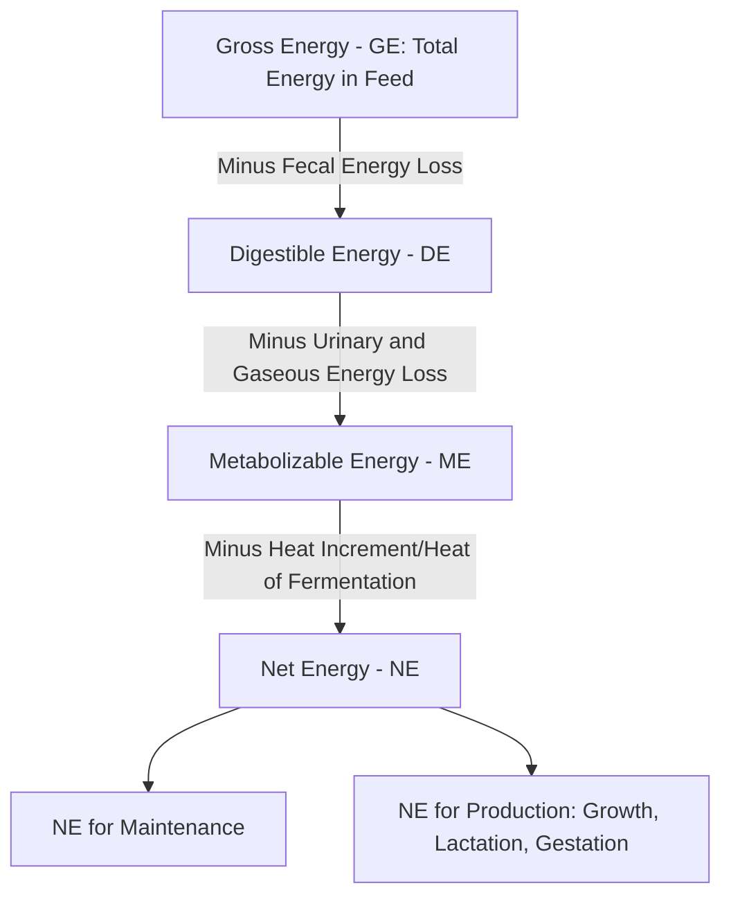

## Animal Nutrition Principles

### Overview

Animal nutrition is the study of how animals obtain, digest, absorb, and metabolize nutrients from feed to support maintenance, growth, reproduction, and production (milk, meat, eggs, fiber, work output). Nutritional science provides the quantitative and biochemical foundation for diet formulation, connecting the digestive anatomy and physiology of a species (see Livestock Anatomy and Physiology) to the practical task of designing feeding programs that meet an animal's requirements efficiently, economically, and with due regard for health and welfare outcomes.

### Major Nutrient Classes

**Water**

Often overlooked relative to other nutrients despite being quantitatively the largest requirement by weight; water is essential for virtually all physiological processes (thermoregulation, digestion, nutrient transport, waste elimination) and its requirement increases substantially with lactation, high ambient temperature, and high dry matter intake.

**Carbohydrates**

The primary energy source in most livestock diets, broadly divided into:

- **Non-Structural Carbohydrates (NSC)** — sugars, starches, and other readily fermentable/digestible carbohydrates, concentrated in grains and grain byproducts.
- **Structural Carbohydrates (Fiber)** — cellulose, hemicellulose, and lignin, comprising plant cell wall material; ruminants can extract substantial energy from structural carbohydrates via microbial fermentation (see rumen function in Livestock Anatomy and Physiology), while monogastrics extract comparatively little energy from these fractions, relying instead on limited hindgut fermentation capacity.

Fiber content is commonly quantified using detergent fiber analysis: Neutral Detergent Fiber (NDF, representing total cell wall content — cellulose, hemicellulose, and lignin) and Acid Detergent Fiber (ADF, representing cellulose and lignin, a subset of NDF), both used to estimate forage digestibility and appropriate intake limits in ruminant diet formulation.

**Protein**

Composed of amino acids, required for tissue growth, maintenance (protein turnover), enzyme and hormone synthesis, and milk/egg protein production. Protein is categorized nutritionally by both quantity and quality:

- **Crude Protein (CP)** — a standard laboratory estimate calculated from feed nitrogen content (nitrogen × 6.25, based on the approximate average nitrogen content of proteins), a simple and widely used but imprecise measure since it does not directly reflect amino acid profile or digestibility.
- **Rumen Degradable Protein (RDP) vs. Rumen Undegradable Protein (RUP/"Bypass Protein")** — in ruminant nutrition, dietary protein is split between the fraction degraded by rumen microbes (contributing to microbial protein synthesis, which itself becomes a major amino acid source for the animal) and the fraction that escapes rumen degradation to be digested directly in the small intestine, a distinction essential for balancing ruminant diets since rumen microbial protein synthesis is capacity-limited.
- **Essential Amino Acids** — amino acids the animal cannot synthesize in sufficient quantity and must obtain from the diet (directly, in monogastrics; indirectly via microbial synthesis and bypass protein, in ruminants); specific limiting amino acids vary by species and diet (e.g., lysine and methionine are commonly limiting in swine and poultry diets based on typical grain-and-oilseed-meal diet compositions).

**Lipids (Fats)**

A concentrated energy source (containing more than twice the energy density per unit weight of carbohydrates or protein) also serving as a carrier for fat-soluble vitamins and a source of essential fatty acids. Fat supplementation is used in high-energy-demand situations (early lactation dairy cows, finishing rations) but requires careful management in ruminant diets since excessive unprotected fat can disrupt rumen microbial fermentation; "rumen-protected" or "bypass" fat products are formulated to resist rumen degradation and be digested further down the tract instead.

**Minerals**

- **Macrominerals** — required in relatively larger quantities: calcium and phosphorus (skeletal structure, and critical for eggshell formation in poultry and milk production in dairy animals), sodium, chloride, potassium, magnesium, and sulfur.
- **Microminerals (Trace Minerals)** — required in much smaller quantities but still essential: zinc, copper, manganese, selenium, iodine, cobalt, and iron, involved in enzyme function, immune response, and reproductive performance; deficiencies or, in some cases, excesses (mineral toxicity) of specific trace minerals are linked to identifiable clinical and subclinical conditions.

**Vitamins**

- **Fat-Soluble Vitamins** — A, D, E, and K, absorbed alongside dietary fat and stored in body fat/liver tissue, with deficiency risk generally developing more slowly than water-soluble vitamin deficiency due to this storage capacity.
- **Water-Soluble Vitamins** — the B-vitamin complex and vitamin C; in ruminants, most B-vitamins are synthesized in adequate quantities by rumen microbes, generally making dietary supplementation less critical than in monogastrics, though supplementation may still be beneficial in specific high-production or stress situations. [Inference: the degree to which rumen microbial B-vitamin synthesis fully meets requirement varies by specific vitamin, production stage, and diet composition, and is an area with some ongoing nutritional research refinement.]

### Energy Systems and Requirements

Feed energy content and animal energy requirements are expressed through a system of partitioning that accounts for progressive energy losses at each digestive and metabolic stage:

- **Gross Energy (GE)** — the total chemical energy contained in a feed, measured by complete combustion (bomb calorimetry); a relatively uninformative value on its own since it does not account for digestibility.
- **Digestible Energy (DE)** — GE minus the energy lost in feces (undigested material).
- **Metabolizable Energy (ME)** — DE minus energy lost in urine and, in ruminants specifically, gaseous losses primarily as methane produced during rumen fermentation.
- **Net Energy (NE)** — ME minus the heat increment (heat generated during digestion and metabolism, sometimes called the heat of fermentation/heat of nutrient metabolism), representing the energy actually available for maintenance and production functions; net energy systems typically further partition into NE for maintenance and NE for specific production functions (growth, lactation, gestation) since the efficiency of energy use differs between these functions.

Net energy systems (rather than simpler DE or ME systems) are generally considered more biologically accurate for ruminant diet formulation because they account for the fact that the efficiency of converting ME to usable energy differs depending on whether that energy is used for maintenance versus growth versus lactation, though ME-based systems remain in wide practical use, particularly in poultry and swine formulation. [Inference: specific choice of energy system in practical use varies by species, region, and formulation software/standard being followed, and both approaches remain in active professional use.]

### Nutritional Requirements Across Physiological States

Nutrient requirements are not static but scale with physiological demand, generally following a hierarchy where maintenance requirements are met first, with additional nutrients then partitioned toward production functions:

- **Maintenance** — the baseline nutrient requirement to sustain body functions and body weight with no net gain or loss of tissue and no production output, scaling generally with metabolic body size (commonly approximated using body weight raised to an exponent, such as $BW^{0.75}$, reflecting the well-established relationship between metabolic rate and body size across species).
- **Growth** — additional nutrients required to support tissue accretion (muscle, bone, fat deposition), with requirements varying by growth stage (young, rapidly growing animals generally have higher nutrient density requirements per unit of feed intake than animals nearing mature size).
- **Reproduction/Gestation** — increased requirements during pregnancy, particularly pronounced in the last third of gestation when fetal growth accelerates most rapidly across most livestock species.
- **Lactation** — often the most nutritionally demanding physiological state in mature female livestock, with substantial increases in energy, protein, calcium, and water requirements scaling with milk yield and milk composition (e.g., higher-fat milk requiring proportionally more energy to produce).

### Diet Formulation Principles

Practical diet formulation balances the nutrient requirements of the target animal/production stage against the nutrient content and cost of available feed ingredients, typically constrained by:

- **Requirement Satisfaction** — meeting or appropriately approaching established requirement values for energy, protein, minerals, and vitamins for the specific species, breed, physiological state, and production target.
- **Palatability and Intake Capacity** — a diet must be physically consumable in sufficient quantity to meet requirements; bulky, low-energy-density diets can become intake-limited before nutrient requirements are met, particularly relevant in high-producing dairy cattle where physical rumen fill capacity can constrain total energy intake.
- **Ingredient Cost and Availability** — practical formulation is generally a least-cost optimization problem, using linear or nonlinear programming techniques to identify the lowest-cost ingredient combination that satisfies all nutritional constraints simultaneously.
- **Feed Safety and Anti-Nutritional Factors** — accounting for ingredient-specific limitations such as mycotoxin risk in grains, anti-nutritional compounds in certain oilseed meals (requiring processing to deactivate), or mineral antagonisms (where excess of one mineral interferes with absorption of another, such as excess molybdenum interfering with copper absorption in ruminants).

### Practical Example: Simplified Least-Cost Ration Balancing

A basic two-ingredient ration balancing problem for a beef cattle maintenance diet requiring 10% crude protein, using corn (8.5% CP) and soybean meal (44% CP):

Let $x$ = proportion of soybean meal, $(1-x)$ = proportion of corn. Setting up the protein balance equation:

$$0.44x + 0.085(1-x) = 0.10$$

Solving:

$$0.44x + 0.085 - 0.085x = 0.10$$

$$0.355x = 0.015$$

$$x \approx 0.042 \text{ (approximately 4.2\% soybean meal, 95.8\% corn)}$$

This illustrates the basic algebraic principle underlying diet formulation, though real-world ration balancing involves simultaneously satisfying many more constraints (energy, multiple mineral levels, fiber minimums, amino acid balance) across many more ingredients, which is why commercial diet formulation is generally performed using dedicated linear programming software rather than manual calculation. [Inference: this example is simplified for illustration of the underlying algebraic principle; actual commercial ration formulation incorporates substantially more constraints and complexity.]

### Applications in Animal Science

- **Ration Formulation Software** — commercial and research diet formulation tools apply linear/nonlinear programming to solve least-cost diet problems across dozens of simultaneous nutrient constraints and available ingredients.
- **Feed Efficiency and Production Economics** — since feed typically represents the largest single variable cost in most livestock production systems, nutrition directly drives production economics, with feed conversion ratio (feed input per unit of output, such as feed per kg of gain or feed per liter of milk) serving as a key efficiency metric.
- **Precision Feeding** — integration with individual animal identification and monitoring systems (see Sensors and IoT in Agriculture) enables individualized feeding programs matched to an animal's specific production level, growth stage, or health status, rather than uniform group-level feeding.
- **Nutritional Disease Prevention** — diet formulation directly manages risk of metabolic disorders linked to nutritional imbalance (e.g., milk fever/hypocalcemia linked to calcium metabolism around calving, or ruminal acidosis linked to excessive rapidly fermentable carbohydrate intake relative to effective fiber).
- **Environmental and Sustainability Considerations** — nutrition strategy increasingly incorporates environmental efficiency objectives, such as formulating diets to reduce nitrogen and phosphorus excretion (reducing environmental nutrient loading) or exploring feed additives associated with reduced enteric methane production in ruminants. [Unverified: the efficacy and current regulatory approval status of specific methane-reducing feed additives varies by product, region, and continues to evolve; consult current research and regulatory sources for specific product claims.]

### Limitations and Practical Considerations

- **Individual Variation** — published nutrient requirement tables (such as those from national research councils) represent population-level estimates and average requirements; individual animal variation in requirement (due to genetics, health status, or other factors) means formulated diets meeting "average" requirements may under- or over-supply specific individuals within a group-fed system.
- **Feed Analysis Accuracy** — diet formulation is only as accurate as the underlying feed ingredient nutrient composition data; using tabular "book values" rather than actual laboratory analysis of the specific feed lot being used introduces error, particularly for forages where nutrient content can vary substantially with growing conditions, maturity at harvest, and storage method.
- **Interaction Effects** — nutrients do not act in isolation; mineral-mineral antagonisms, energy-protein interaction effects on rumen microbial efficiency, and other interaction effects mean that formulating to meet each nutrient requirement independently does not guarantee optimal outcomes if these interactions are not also considered.
- **Dynamic Requirements** — nutrient requirements change continuously with physiological state, environmental conditions (e.g., increased maintenance energy requirement in cold or heat stress), and production level, meaning diet formulations generally require periodic reassessment and adjustment rather than being set once and left static across a production cycle.

### Related Topics

- Ruminant vs. monogastric digestive physiology (see Livestock Anatomy and Physiology)
- Linear programming methods for least-cost ration formulation
- Metabolic disorders linked to nutritional imbalance (milk fever, ketosis, acidosis)
- Feed analysis methods and laboratory nutrient testing
- Precision feeding and individual animal nutrition monitoring
- Enteric methane mitigation through dietary feed additives
- Mineral and vitamin supplementation strategies by species and production stage
- Forage quality assessment and NDF/ADF interpretation