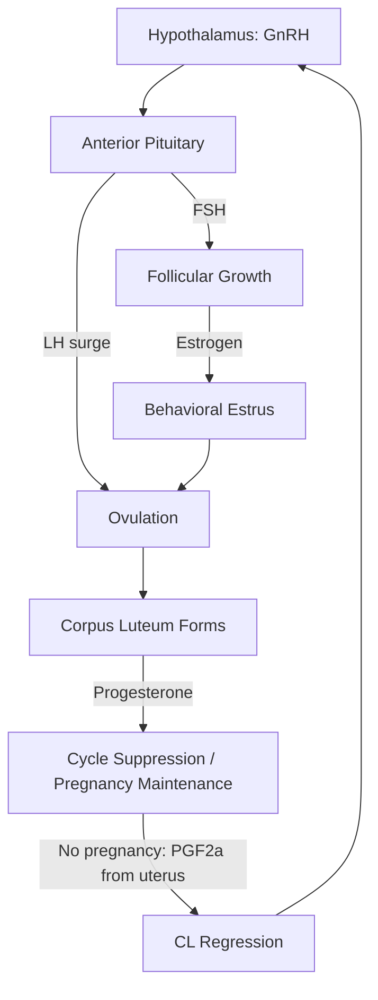
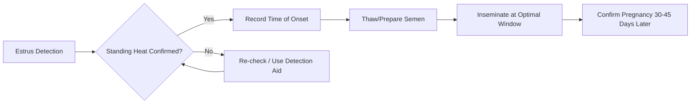

## Animal Reproduction and Breeding Management


### Overview

Animal reproduction and breeding management encompasses the biological processes governing fertility and offspring production in livestock, and the applied techniques used to control, improve, and optimize these processes for agricultural output. This domain integrates reproductive physiology, genetics, endocrinology, and herd management practices to maximize reproductive efficiency, genetic gain, and overall farm profitability.

**Key Points**

- Reproductive efficiency directly determines herd productivity, replacement rates, and genetic progress.
- Breeding management spans natural mating, assisted reproductive technologies (ART), and genetic selection strategies.
- Species-specific reproductive cycles (estrous vs. estrual patterns, gestation length, litter size) dictate management protocols.
- Nutrition, health status, and environment (heat stress, photoperiod) are major modifiers of fertility.

---

### Reproductive Physiology Fundamentals

#### The Estrous Cycle

Most livestock species (cattle, swine, sheep, goats, horses) are polyestrous or seasonally polyestrous, cycling repeatedly through a hormonally regulated sequence:

1. **Proestrus** – Follicular growth begins; estrogen rises.
2. **Estrus** – Sexual receptivity ("heat"); ovulation occurs near the end of or shortly after this phase in most species.
3. **Metestrus** – Corpus luteum (CL) forms post-ovulation; progesterone begins rising.
4. **Diestrus** – CL fully functional, progesterone dominant; if no pregnancy, luteolysis occurs and the cycle restarts.

| Species | Cycle Length | Estrus Duration | Ovulation Timing |
| --- | --- | --- | --- |
| Cattle | ~21 days | 12–18 hours | 10–14 hrs after estrus ends |
| Swine | ~21 days | 48–72 hours | Mid-to-late estrus |
| Sheep | ~17 days | 24–36 hours | Late estrus |
| Goats | ~21 days | 24–48 hours | Late estrus |
| Horses | ~21–22 days | 4–7 days | 24–48 hrs before estrus ends |

#### Hormonal Control Axis

The hypothalamic-pituitary-gonadal (HPG) axis governs the cycle:

- **GnRH** (hypothalamus) → stimulates **FSH** and **LH** release from the anterior pituitary.
- **FSH** drives follicular development.
- **LH surge** triggers ovulation.
- **Estrogen** (from follicles) causes behavioral estrus and the LH surge via positive feedback.
- **Progesterone** (from the CL) suppresses GnRH/LH, maintaining pregnancy and cycle quiescence.
- **Prostaglandin F2α (PGF2α)** (from the uterus, absent pregnancy) lyses the CL, allowing the next cycle.



### Male Reproductive Management

#### Semen Quality Assessment

Breeding soundness in males relies on evaluation of:

- **Libido and mating ability**
- **Scrotal circumference** (correlates with sperm production capacity and, in bulls, with daughters' age at puberty)
- **Semen volume, concentration, and motility**
- **Morphology** – percentage of normal sperm cells (head, midpiece, tail defects reduce fertility)

A Breeding Soundness Examination (BSE) typically classifies males as satisfactory, questionable, or unsatisfactory based on physical exam, scrotal measurement, and semen analysis thresholds (e.g., in bulls, commonly ≥30% motility and ≥70% normal morphology, though exact thresholds vary by standard and region [Unverified — consult local veterinary breeding soundness guidelines]).

#### Male:Female Ratios (Natural Service)

| Species | Typical Ratio (mature male:females) |
| --- | --- |
| Cattle (bulls) | 1:25–35 |
| Sheep (rams) | 1:35–50 |
| Goats (bucks) | 1:25–50 |
| Swine (boars) | 1:15–20 (hand mating) |

Ratios vary with age, terrain, breeding season length, and management system. [Inference — figures represent general extension-service guidance rather than fixed universal standards]

---

### Female Reproductive Management

#### Puberty and Breeding Readiness

Breeding decisions are based on **age**, **body weight**, and **body condition score (BCS)** rather than age alone, since nutritional status strongly influences puberty onset.

- Heifers: bred at 55–65% of mature body weight, typically 13–15 months old for calving at ~24 months.
- Gilts: bred at second or third estrus, typically 7–8 months old.
- Ewe lambs/doelings: bred at 60–70% mature weight, often at 7–10 months for accelerated systems.

#### Body Condition Scoring (BCS)

BCS systems (commonly 1–5 or 1–9 scale depending on species and region) assess fat reserves and correlate strongly with:

- Return to postpartum estrus
- Conception rates
- Calving/lambing/farrowing interval

Maintaining optimal BCS at breeding (rather than during pregnancy) has the largest impact on next-cycle fertility.

#### Postpartum Anestrus

Following parturition, females experience a period of reproductive quiescence driven by:

- Suckling intensity/frequency (lactational anestrus, especially pronounced in beef cattle and sows)
- Negative energy balance
- Uterine involution requirements (uterus must return to pre-pregnancy size/condition)

Management interventions to shorten postpartum anestrus include early weaning, calf removal/restricted suckling, flushing (increased plane of nutrition pre-breeding), and hormonal protocols.

---

### Breeding Systems

#### Natural Service

Direct mating without human intervention beyond pairing males and females. Simple, low-cost, but limits genetic selection intensity and disease control, and provides no accurate breeding date records unless heat detection is also practiced.

#### Artificial Insemination (AI)

Semen is collected, processed (often extended and cryopreserved), and manually deposited into the female reproductive tract.

**Advantages:**

- Access to genetically superior sires without owning/transporting the animal
- Disease control (reduces venereal disease transmission)
- Enables precise record-keeping and genetic planning
- Facilitates crossbreeding programs

**Key requirements:**

- Accurate **estrus detection** (visual signs: standing heat, mounting activity, vulvar swelling/discharge, mucus discharge; or detection aids: heat mount detectors, pedometers/activity monitors, tail chalk)
- Correct **timing relative to ovulation** (the "AM-PM rule" in cattle: inseminate ~12 hours after estrus onset)
- Proper **semen handling** (thawing protocols for frozen semen, typically 35–37°C water bath for a defined duration)
- Trained technician for **rectal palpation-guided or transcervical deposition** depending on species



#### Estrus Synchronization Protocols

Hormonal protocols align cycles across a group to enable batch AI or fixed-time AI (FTAI), improving labor efficiency and enabling tighter calving/lambing seasons.

Common components:

- **Progestins** (e.g., CIDR, MGA) – suppress estrus/ovulation temporarily; withdrawal triggers a synchronized return to estrus.
- **PGF2α analogs** – lyse an existing CL to induce luteolysis in cycling females.
- **GnRH** – used to synchronize follicular wave emergence and induce ovulation for fixed-time protocols.

A widely used cattle example is the **Ovsynch/CO-Synch** protocol, combining GnRH and PGF2α injections on a fixed schedule to permit insemination without heat detection.

$$\text{Conception Rate} = \frac{\text{Number Conceived}}{\text{Number Inseminated}} \times 100$$

#### Embryo Transfer (ET)

Superior donor females are superovulated (via FSH or eCG treatment), inseminated, and resulting embryos are flushed (non-surgically, ~7 days post-breeding in cattle) and transferred fresh or frozen into synchronized recipient females.

**Applications:**

- Rapid multiplication of genetically elite females' offspring
- International genetic exchange (embryos carry lower disease-transmission risk than live animals)
- Combined with **in vitro fertilization (IVF)** and **ovum pick-up (OPU)** for even greater output per donor

---

### Genetic Selection and Breeding Programs

#### Selection Methods

- **Individual/Mass selection** – choosing breeding stock based on own phenotypic performance.
- **Pedigree selection** – using ancestor performance records.
- **Progeny testing** – evaluating sires/dams based on offspring performance (gold standard for traits like milk yield, carcass quality).
- **Genomic selection** – using DNA marker panels (SNP chips) to predict genetic merit (Genomic Estimated Breeding Values, GEBVs) at birth, drastically shortening generation intervals, especially adopted widely in dairy cattle breeding.

#### Breeding Value and Heritability

$$h^2 = \frac{V_A}{V_P}$$

Where $V_A$ is additive genetic variance and $V_P$ is total phenotypic variance. Heritability estimates guide which traits respond efficiently to selection versus which require management changes (low-heritability traits like fertility and disease resistance respond more slowly to direct selection).

**Estimated Breeding Values (EBVs)** and **Expected Progeny Differences (EPDs)** are standard tools predicting an animal's genetic transmitting ability for specific traits (growth rate, milk yield, calving ease), expressed relative to a breed average.

#### Mating Systems

| System | Description | Purpose |
| --- | --- | --- |
| Purebreeding | Mating within a single breed | Maintain/improve breed standards |
| Crossbreeding | Mating between breeds | Exploit heterosis (hybrid vigor) and breed complementarity |
| Linebreeding | Mating related animals within a line | Concentrate desirable genetics |
| Inbreeding | Mating closely related animals | Fix traits, but risks inbreeding depression |

**Heterosis** commonly improves lowly-heritable, fitness-related traits (fertility, survivability, longevity) more than highly-heritable traits (carcass composition), which is a key rationale for crossbreeding programs in commercial livestock production.

---

### Pregnancy Diagnosis and Management

#### Diagnostic Methods

- **Transrectal palpation** – manual detection of uterine/fetal structures, typically from ~35–45 days post-breeding in cattle.
- **Ultrasonography** – earlier and more precise detection (as early as 26–28 days in cattle), also allows fetal sexing and viability assessment.
- **Blood/milk-based assays** – detect pregnancy-associated glycoproteins (PAG) or progesterone levels.

#### Gestation Lengths (Approximate)

| Species | Gestation Length |
| --- | --- |
| Cattle | ~283 days |
| Swine | ~114 days |
| Sheep | ~147 days |
| Goats | ~150 days |
| Horses | ~340 days |

#### Parturition Management

Key management practices around calving/lambing/farrowing:

- Monitoring for signs of impending parturition (udder development, relaxation of pelvic ligaments, restlessness)
- Providing clean, low-stress birthing environments to reduce dystocia complications and neonatal infection
- Colostrum management — timely (within first 6–12 hours) and adequate colostrum intake is critical for passive immunity transfer via absorption of maternal antibodies through the neonatal gut

---

### Reproductive Efficiency Metrics

Farm-level breeding programs are evaluated using standardized indices:

- **Conception Rate** – percentage of inseminations resulting in pregnancy per service.
- **Calving/Lambing/Farrowing Interval** – time between successive parturitions; shorter intervals generally indicate better reproductive efficiency.
- **Days Open** – interval from parturition to conception; directly affects lifetime productivity, especially in dairy systems.
- **Services per Conception** – average number of breedings needed per successful pregnancy.
- **Weaning Rate / Litter Size Born Alive** – particularly critical in prolific species like swine and sheep.

$$\text{Days Open} = \text{Date of Conception} - \text{Date of Parturition}$$

Behavior of these metrics under field conditions may vary substantially with nutrition, health status, climate, and management skill; benchmark values differ by production system and should be interpreted against regional/breed-specific standards. [Inference — general reproductive management principle]

---

### Reproductive Disorders and Health Considerations

Common issues affecting breeding management include:

- **Anestrus** (failure to cycle) – often nutritional or lactation-driven
- **Repeat breeder syndrome** – normal cycling but repeated failure to conceive
- **Dystocia** (difficult birth) – often linked to fetal-pelvic disproportion, especially in first-calf heifers
- **Retained placenta / metritis** – postpartum uterine infections delaying return to cyclicity
- **Cystic ovarian disease** – persistent follicular or luteal cysts disrupting normal cycling

Routine reproductive health programs typically combine veterinary examination schedules, vaccination protocols (for reproductive pathogens such as *Brucella*, *Leptospira*, BVDV, depending on species and region), and nutritional monitoring.

---

### Reproductive Tract Anatomy (Female, Generalized Mammalian)



```
[Ovary] (svg_diagram)
|
[Oviduct/Fallopian Tube] -- site of fertilization
|
[Uterine Horn(s)]
|
[Uterine Body]
|
[Cervix] -- barrier/seal during pregnancy
|
[Vagina]
|
[Vulva]
```

<svg xmlns="http://www.w3.org/2000/svg" viewBox="0 0 640 420" font-family="sans-serif">
<text x="320" y="24" text-anchor="middle" font-size="16" font-weight="bold" fill="#333">Female Reproductive Tract — Generalized Ruminant (svg_diagram)</text>

<ellipse cx="120" cy="90" rx="28" ry="20" fill="#f4c2c2" stroke="#a15c5c" stroke-width="2" />
<text x="120" y="60" text-anchor="middle" font-size="12" fill="#333">Ovary (L)</text>
<path d="M120,110 Q160,150 200,190 Q260,220 300,240" stroke="#c98787" stroke-width="14" fill="none" stroke-linecap="round" />
<text x="180" y="150" font-size="11" fill="#333">Uterine Horn (L)</text>

<ellipse cx="520" cy="90" rx="28" ry="20" fill="#f4c2c2" stroke="#a15c5c" stroke-width="2" />
<text x="520" y="60" text-anchor="middle" font-size="12" fill="#333">Ovary (R)</text>
<path d="M520,110 Q480,150 440,190 Q380,220 340,240" stroke="#c98787" stroke-width="14" fill="none" stroke-linecap="round" />
<text x="420" y="150" font-size="11" fill="#333">Uterine Horn (R)</text>

<rect x="290" y="235" width="60" height="35" rx="10" fill="#d99a9a" stroke="#a15c5c" stroke-width="2" />
<text x="320" y="257" text-anchor="middle" font-size="11" fill="#333">Body</text>

<rect x="300" y="270" width="40" height="45" fill="#b97575" stroke="#a15c5c" stroke-width="2" />
<text x="320" y="297" text-anchor="middle" font-size="10" fill="#fff">Cervix</text>

<rect x="295" y="315" width="50" height="60" fill="#e0b0b0" stroke="#a15c5c" stroke-width="2" />
<text x="320" y="348" text-anchor="middle" font-size="10" fill="#333">Vagina</text>

<rect x="300" y="375" width="40" height="20" fill="#c98787" stroke="#a15c5c" stroke-width="2" />
<text x="320" y="390" text-anchor="middle" font-size="9" fill="#fff">Vulva</text>


<text x="150" y="105" font-size="10" fill="#555">Oviduct</text>

<text x="490" y="105" font-size="10" fill="#555">Oviduct</text>

</svg>

---

### Practical Example: Designing a 60-Day Breeding Season for a Beef Herd

**Scenario:** A cow-calf operation wants to tighten calving distribution and improve weaning weight uniformity.

**Steps:**

1. **Pre-breeding examination** — BCS all cows (target BCS 5–6 on 1–9 scale at breeding); conduct BSE on all bulls.
2. **Estrus synchronization** — apply a CIDR-based fixed-time AI protocol to cycling and non-cycling cows to jump-start postpartum cyclicity.
3. **Fixed-Time AI (Day 0)** — inseminate the entire synchronized group without heat detection using proven high-accuracy sires (selected via EPDs for calving ease and growth).
4. **Cleanup bulls (Day 1–60)** — turn out bulls at a 1:25 ratio to breed any cows that did not conceive to AI, restricting the season to 60 days total.
5. **Pregnancy diagnosis (Day 90–100 post-turnout)** — ultrasound to confirm pregnancy, stage fetal age, and cull open (non-pregnant) cows.
6. **Outcome tracking** — record AI conception rate, overall season pregnancy rate, and calving distribution (percentage calving in first 21 days) the following season.

This system compresses the calving season, increases weaning weight uniformity (older calves within the group wean heavier), and accelerates genetic improvement through concentrated AI sire use.

---

**Related Topics**

- Estrous cycle endocrinology and hormone assay techniques
- Semen cryopreservation and extender chemistry
- In vitro fertilization (IVF) and ovum pick-up (OPU) protocols
- Genomic selection and SNP-based breeding value estimation
- Crossbreeding systems and heterosis exploitation in commercial livestock
- Nutrition-reproduction interactions (flushing, body condition scoring systems)
- Neonatal care and colostrum management
- Reproductive disease control (brucellosis, leptospirosis, trichomoniasis)
- Record-keeping systems and herd reproductive performance benchmarking
- Animal welfare considerations in assisted reproduction and confinement breeding systems