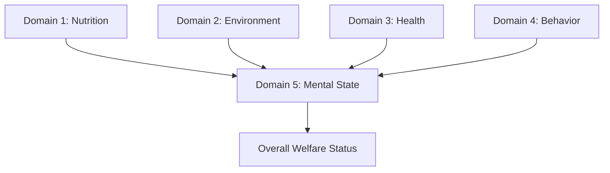
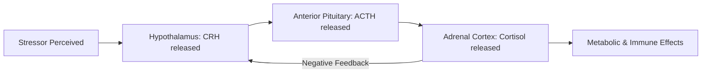
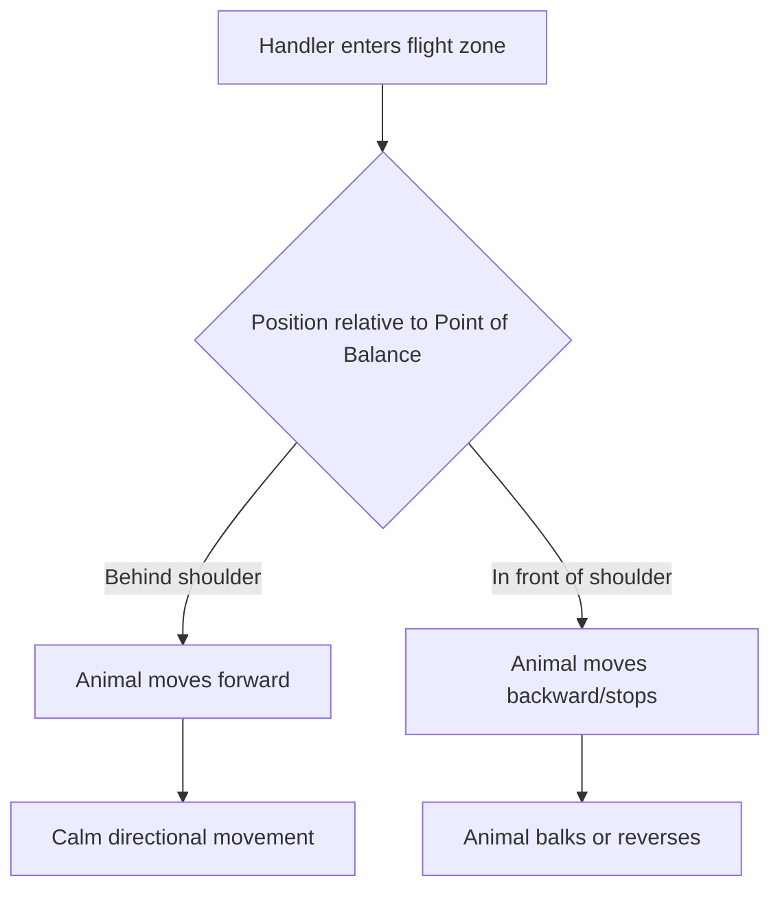

## Animal Behavior and Welfare

### Overview

Animal behavior and welfare science studies how livestock perceive, respond to, and cope with their environments, and applies this understanding to management practices that support both animal wellbeing and production outcomes. The field bridges ethology (the study of natural behavior patterns), physiology (stress and neuroendocrine responses), and applied husbandry, forming the scientific basis for welfare standards, housing design, and handling protocols used across modern agriculture.

**Key Points**

- Welfare is assessed through multiple converging measures: behavioral, physiological, health, and production indicators — no single measure is sufficient alone.
- Understanding species-specific natural behavior ("ethogram") is the foundation for designing appropriate housing and handling systems.
- Stress can be acute (short-term, often adaptive) or chronic (prolonged, generally detrimental to health and productivity).
- Welfare frameworks (e.g., the Five Domains, formerly Five Freedoms) provide structured, internationally recognized assessment criteria.

---

### Foundational Welfare Frameworks

#### The Five Freedoms (Historical Framework)

Originally developed in the UK (Brambell Report, 1965; formalized by the Farm Animal Welfare Council), this framework identifies minimum welfare provisions:

1. Freedom from hunger and thirst
2. Freedom from discomfort
3. Freedom from pain, injury, or disease
4. Freedom to express normal behavior
5. Freedom from fear and distress

#### The Five Domains Model (Contemporary Framework)

An evolution of the Five Freedoms that shifts focus from merely avoiding negatives to actively promoting positive welfare states:

| Domain | Focus | Example Indicators |
| --- | --- | --- |
| 1. Nutrition | Access to food/water | Body condition, hydration status |
| 2. Environment | Physical surroundings | Space, shelter, substrate, thermal comfort |
| 3. Health | Physical condition | Injury, disease, disability |
| 4. Behavior | Ability to express natural behaviors | Social interaction, play, exploration |
| 5. Mental State | Overall affective experience (integrates domains 1–4) | Fear, frustration, contentment, comfort |

The fifth domain (mental state) is considered the cumulative welfare outcome resulting from the first four physical/functional domains.

---

### Ethology: Species-Typical Behavior Patterns

#### Behavioral Categories Common Across Livestock

- **Ingestive behavior** – grazing/feeding patterns, drinking frequency, rumination (in ruminants)
- **Social behavior** – dominance hierarchies, allogrooming, herd/flock cohesion
- **Maternal behavior** – nest-building (sows), licking/bonding (cattle, sheep), isolation-seeking pre-parturition
- **Sexual behavior** – courtship, mounting, estrus-related activity
- **Comfort behavior** – wallowing (swine), dust bathing (poultry), self-grooming
- **Exploratory/investigative behavior** – rooting (swine), sniffing, environmental investigation
- **Agonistic behavior** – aggression, fighting, avoidance, submission displays

#### Species-Specific Behavioral Notes

**Cattle**

- Herd/social animals with established dominance hierarchies; prefer to move in single file along established paths.
- Strong flight zone and point-of-balance responses (see Handling section below).
- Ruminate 6–8 hours per day when at rest; ruminating behavior is a positive welfare indicator.

**Swine**

- Highly motivated to root and explore substrate; lack of rooting material is linked to redirected behaviors like tail-biting.
- Sows show strong nest-building drive in the 24 hours pre-farrowing.
- Naturally clean animals — will avoid defecating near feeding/resting areas if space allows.

**Poultry**

- Motivated to perform dust-bathing, perching, and nesting behaviors even in the absence of an obvious physiological need, indicating these are intrinsically rewarding ("behavioral needs").
- Establish pecking order hierarchies; overcrowding can escalate normal pecking into feather-pecking or cannibalism.

**Sheep and Goats**

- Strong flocking/herding instinct as an anti-predator strategy; isolation is a significant stressor.
- Goats show more exploratory and browsing behavior than sheep, which are primarily grazers.

---

### Stress Physiology

#### The Stress Response Pathway

Two primary neuroendocrine systems mediate the stress response:

1. **Sympathetic-Adrenal-Medullary (SAM) axis** – rapid response; releases catecholamines (epinephrine, norepinephrine) producing the "fight-or-flight" response (increased heart rate, respiration, glucose mobilization).
2. **Hypothalamic-Pituitary-Adrenal (HPA) axis** – slower, sustained response:

**Cortisol** is the most commonly measured indicator of HPA activation and is used as a physiological welfare biomarker, though it reflects general arousal (which can include positive excitement) as well as distress, so it is typically interpreted alongside behavioral observations rather than in isolation. [Inference — standard caveat in stress physiology methodology]

#### Acute vs. Chronic Stress

| Type | Duration | Typical Effect | Example |
| --- | --- | --- | --- |
| Acute | Minutes to hours | Often adaptive; short-term performance/immune boost | Brief handling, transport loading |
| Chronic | Days to lifetime | Immunosuppression, reduced growth/reproduction, stereotypic behavior | Prolonged crowding, unresolved social conflict |

#### Behavioral and Physiological Stress Indicators

- **Behavioral:** vocalization changes, stereotypies (repetitive, apparently functionless behaviors like bar-biting or weaving), reduced feeding/rumination, hypervigilance, withdrawal
- **Physiological:** elevated cortisol, elevated heart rate, altered heart rate variability, changes in body temperature, immune suppression markers
- **Production-linked:** reduced weight gain, reduced milk yield, reduced reproductive performance, increased disease susceptibility

---

### Handling and Human-Animal Interaction

#### Flight Zone and Point of Balance

Livestock (especially cattle, sheep, and swine) maintain a **flight zone** — a personal space boundary beyond which the animal tolerates human presence but within which it moves away. Effective low-stress handling relies on:

- Working at the **edge of the flight zone**, not deep within it (deep penetration causes panic; staying entirely outside prevents movement).
- Using the **point of balance** (typically at the animal's shoulder) — approaching behind it drives the animal forward; approaching in front of it drives the animal backward.
- Moving at an angle rather than directly toward/away from the animal to encourage calm, directional movement.

#### Low-Stress Handling Principles

- Minimize use of electric prods; rely on positioning, flags, and flight-zone pressure/release instead.
- Avoid sudden noises, shadows, and high-contrast visual elements in handling facilities (livestock have wide-angle but limited depth perception and are sensitive to visual contrast).
- Curved chute/race designs (e.g., Temple Grandin-style systems) exploit natural circling behavior and reduce visual access to what lies ahead, reducing balking.
- Consistent, calm human contact (positive human-animal relationship, HAR) is associated with reduced fear responses, improved ease of handling, and in some studies, improved production outcomes. [Inference — well-supported in applied ethology literature but effect magnitude varies by study and system]

---

### Housing and Environmental Enrichment

#### Space Allowance

Adequate space allows normal postural (lying, standing, turning) and locomotor behaviors. Insufficient space is linked to increased aggression, injury, and stereotypic behavior. Specific space recommendations vary substantially by species, production system, and regulatory jurisdiction, and are frequently updated in response to welfare research and legislation. [Unverified — consult current local/regional welfare codes for specific space allowance figures]

#### Environmental Enrichment Principles

Enrichment aims to allow expression of natural behaviors and reduce abnormal behavior:

- **Swine:** rooting substrates (straw, hay, chewable objects) reduce tail-biting and aggression.
- **Poultry:** perches, dust-bathing substrate, and nest boxes support natural behavioral repertoires.
- **Dairy cattle:** brushes (mechanical or manual) support grooming behavior; comfortable, well-bedded lying surfaces reduce lameness and increase lying time (a key welfare indicator).
- **Group housing** (vs. individual confinement) generally supports social behavior expression but requires careful management of group stability and stocking density to avoid increased aggression.

#### Thermal Comfort and Environmental Design

- **Thermoneutral zone** – the temperature range within which an animal maintains body temperature without extra metabolic cost; outside this zone, animals must expend energy on thermoregulation (shivering, panting), diverting resources from growth/production.
- Heat stress mitigation: shade, sprinklers/misting, fans, adjusted stocking density, feeding time shifts (cooler parts of day).
- Cold stress mitigation: windbreaks, bedding, shelter structures, adjusted energy density of rations.

---

### Abnormal Behavior and Welfare Problems

#### Stereotypic Behaviors

Repetitive, invariant behavior patterns with no obvious function, generally interpreted as indicators of past or present poor welfare (often linked to frustrated motivation or past chronic stress):

- **Crib-biting/wind-sucking** (horses) – linked to confinement, low-forage diets, weaning stress
- **Bar-biting, sham-chewing** (sows in gestation stalls) – linked to feed restriction and lack of foraging substrate
- **Feather-pecking, cannibalism** (poultry) – linked to overcrowding, lack of foraging material, lighting issues

#### Learned Helplessness and Chronic Distress

Prolonged exposure to uncontrollable aversive conditions can lead to reduced behavioral responsiveness, sometimes interpreted as a marker of chronic negative welfare state, though this remains an area of active research regarding its precise behavioral and cognitive correlates in livestock species. [Speculation — mechanistic interpretation is debated in the applied ethology literature]

---

### Welfare Assessment Methods

#### Animal-Based (Outcome) Measures

Directly assess the animal's condition rather than the resources/inputs provided:

- Body condition score, lameness score, injury/lesion scoring
- Qualitative Behavioral Assessment (QBA) – trained observer scoring of overall behavioral demeanor (e.g., "relaxed" vs. "agitated")
- Avoidance distance tests (a proxy for fear of humans)
- Novel object/novel environment tests (assessing fearfulness/exploratory tendency)

#### Resource-Based (Input) Measures

Assess the environment/management provided:

- Stocking density, space allowance
- Access to feed/water points
- Flooring type, bedding provision
- Enrichment availability

#### Integrated Assessment Protocols

Comprehensive on-farm welfare assessment protocols (such as the EU's Welfare Quality® project) combine animal-based and resource-based measures across the four core welfare principles: good feeding, good housing, good health, and appropriate behavior — synthesized into an overall welfare classification.

$$\text{Overall Welfare Score} = f(\text{Feeding}, \text{Housing}, \text{Health}, \text{Behavior})$$

---

### Practical Example: Reducing Handling Stress During Cattle Vaccination Processing

**Scenario:** A feedlot needs to process a group of cattle through a chute for vaccination with minimal stress and injury risk.

**Steps:**

1. **Facility check** – inspect chute/alley for shadows, loose chains, or visual distractions that could cause balking; ensure non-slip flooring.
2. **Group movement** – move cattle in small batches through curved alleyways, using flight-zone positioning rather than prods to encourage forward movement.
3. **Chute approach** – handler works at the point of balance, applying pressure at the edge of the flight zone and releasing pressure once the animal moves correctly (pressure-release conditioning).
4. **Restraint** – use a squeeze chute set to appropriate pressure for the animal's size; avoid excessive restraint duration.
5. **Vaccination** – administer with minimal restraint time, using proper injection site/technique to reduce tissue damage and associated pain-related behavior.
6. **Release** – release calmly; avoid sudden loud noises or prodding on exit, which can create negative associations with the facility for future handling events.
7. **Monitoring** – observe for post-handling indicators of excessive stress (elevated respiration, prolonged agitation, injury) to refine the protocol for subsequent processing days.

This approach reduces cortisol spikes, bruising/injury rates, and negative conditioning to the handling facility, improving both welfare outcomes and future ease of handling.

---

### Behavioral Assessment Diagram

<svg xmlns="http://www.w3.org/2000/svg" viewBox="0 0 640 380" font-family="sans-serif">
<text x="320" y="24" text-anchor="middle" font-size="16" font-weight="bold" fill="#333">Flight Zone and Point of Balance (svg_diagram)</text>

<ellipse cx="320" cy="200" rx="90" ry="40" fill="#d9c2a3" stroke="#7a5c3e" stroke-width="2" />
<text x="320" y="205" text-anchor="middle" font-size="11" fill="#333">Animal</text>

<ellipse cx="230" cy="200" rx="25" ry="18" fill="#c9ab82" stroke="#7a5c3e" stroke-width="2" />
<text x="230" y="204" text-anchor="middle" font-size="9" fill="#333">Head</text>

<line x1="290" y1="150" x2="290" y2="250" stroke="#a13c3c" stroke-width="2" stroke-dasharray="6,4" />
<text x="290" y="140" text-anchor="middle" font-size="10" fill="#a13c3c">Point of Balance</text>

<ellipse cx="320" cy="200" rx="200" ry="140" fill="none" stroke="#3c6ea1" stroke-width="2" stroke-dasharray="8,5" />
<text x="320" y="345" text-anchor="middle" font-size="11" fill="#3c6ea1">Flight Zone Boundary</text>

<circle cx="240" cy="80" r="10" fill="#4a7a3c" />
<text x="240" y="65" text-anchor="middle" font-size="9" fill="#333">Handler (front of POB)</text>
<text x="240" y="105" text-anchor="middle" font-size="8" fill="#555">→ animal moves back</text>
<circle cx="400" cy="80" r="10" fill="#4a7a3c" />
<text x="400" y="65" text-anchor="middle" font-size="9" fill="#333">Handler (behind POB)</text>
<text x="400" y="105" text-anchor="middle" font-size="8" fill="#555">→ animal moves forward</text>

<line x1="240" y1="90" x2="255" y2="150" stroke="#4a7a3c" stroke-width="1.5" marker-end="url(#arrow)" />
<line x1="400" y1="90" x2="360" y2="150" stroke="#4a7a3c" stroke-width="1.5" marker-end="url(#arrow)" />
</svg>

---

**Related Topics**

- Applied ethology research methods (ethograms, time-budget studies)
- Cortisol and heart rate variability as welfare biomarkers
- Temple Grandin handling facility design principles
- Welfare Quality® and other on-farm assessment protocols
- Transport and pre-slaughter welfare management
- Environmental enrichment design for intensive housing systems
- Regulatory and certification standards (organic, animal welfare-approved labeling schemes)
- Stereotypic behavior etiology and mitigation strategies
- Human-animal relationship (HAR) and stockperson training programs
- Comparative cognition and pain perception in livestock species