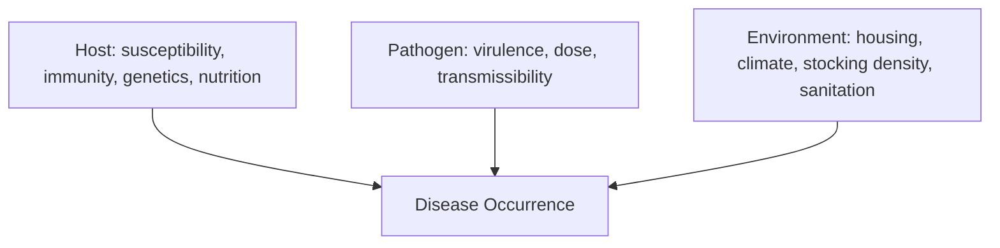
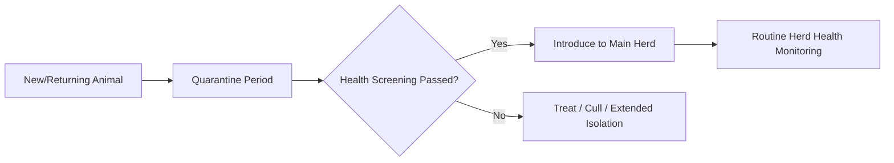

## Animal Health and Disease Prevention

### Overview

Animal health and disease prevention encompasses the principles and practices used to maintain livestock wellbeing, minimize infectious and non-infectious disease incidence, and protect both animal populations and the food supply chain. This domain integrates veterinary epidemiology, immunology, biosecurity engineering, and herd health management into systematic programs that reduce morbidity, mortality, and production losses while limiting the use of therapeutic interventions.

**Key Points**

- Disease prevention is more cost-effective and welfare-positive than treatment; programs are built around biosecurity, immunization, nutrition, and environmental management.
- Diseases are broadly classified as infectious (pathogen-caused) or non-infectious (metabolic, nutritional, genetic, traumatic).
- The disease triangle (host, pathogen, environment) frames how interventions can break transmission and susceptibility pathways.
- Antimicrobial stewardship and biosecurity are increasingly central to modern herd health programs due to resistance and trade/regulatory pressures.

---

### The Epidemiological Triad

Disease occurrence results from the interaction of three factors:

Prevention strategies target each vertex: increasing host resistance (vaccination, nutrition, genetics), reducing pathogen exposure (biosecurity, sanitation), and modifying environment (ventilation, stocking density, stress reduction).

---

### Classification of Animal Diseases

#### Infectious Diseases

Caused by transmissible pathogens:

| Category | Examples | Notes |
| --- | --- | --- |
| Bacterial | Mastitis (*Staphylococcus*, *Streptococcus*), Brucellosis, Salmonellosis | Often treatable with antibiotics; some are zoonotic |
| Viral | Foot-and-mouth disease, BVDV, Avian influenza, PRRS (swine) | No direct antiviral treatment in most cases; prevention relies on vaccination/biosecurity |
| Parasitic (internal) | Gastrointestinal nematodes, liver flukes, coccidiosis | Managed via anthelmintic programs and pasture management |
| Parasitic (external) | Ticks, mites (mange), lice, flies | Vector-borne disease risk (e.g., ticks transmitting anaplasmosis, babesiosis) |
| Fungal | Ringworm (dermatophytosis), mycotoxicosis (from contaminated feed) | Often environment/hygiene-related |
| Prion | Bovine Spongiform Encephalopathy (BSE) | Long incubation, no treatment, regulatory reporting critical |

#### Non-Infectious Diseases

- **Metabolic disorders** – milk fever (hypocalcemia), ketosis, grass tetany (hypomagnesemia), acidosis
- **Nutritional deficiencies/excesses** – mineral deficiencies (selenium, copper), vitamin deficiencies, mycotoxin toxicity
- **Genetic disorders** – inherited defects concentrated by inbreeding or carrier-sire use
- **Traumatic/management-related** – lameness from poor flooring, injuries from facility design flaws, heat/cold stress pathology

---

### Modes of Disease Transmission

Understanding transmission routes is foundational to designing prevention barriers:

- **Direct contact** – nose-to-nose contact, breeding, birthing fluids
- **Indirect/fomite transmission** – contaminated equipment, boots, vehicles, feed, water
- **Airborne** – respiratory droplets/aerosols (e.g., avian influenza, bovine respiratory disease complex)
- **Vector-borne** – ticks, mosquitoes, flies carrying pathogens between hosts
- **Vertical transmission** – dam to offspring in utero or via colostrum/milk
- **Fecal-oral** – contaminated feed, water, or pasture from infected feces

---

### Biosecurity Principles

Biosecurity is the set of management practices designed to prevent pathogen introduction (external biosecurity) and limit spread within a population (internal biosecurity/biocontainment).

#### External Biosecurity Measures

- **Controlled access** – limiting visitor and vehicle entry, designated entry points, sign-in logs
- **Quarantine protocols** – isolating newly purchased or returning animals for a defined observation period (commonly 2–4 weeks, adjusted to disease incubation periods relevant to the operation) before introduction to the main herd/flock
- **Sourcing control** – purchasing from known health-status sources, requesting health certificates/test results
- **Cleaning and disinfection** – footbaths, vehicle disinfection stations, equipment sanitation between groups/farms
- **Wildlife and pest control** – reducing contact with wild birds, rodents, and other disease reservoirs

#### Internal Biosecurity Measures

- **All-in/all-out management** – moving entire cohorts through facilities together, allowing full cleandown between groups (common in swine and poultry production)
- **Segregation by age/production stage** – reducing cross-exposure between naive young stock and older, potentially carrier animals
- **Dedicated equipment per group/unit** – avoiding cross-contamination via shared tools
- **Sick animal isolation** – prompt removal and separate handling of clinically affected individuals

---

### Immunology and Vaccination Programs

#### Immune System Basics

- **Innate immunity** – non-specific, immediate defenses (physical barriers, phagocytes, inflammatory response)
- **Adaptive immunity** – specific, pathogen-targeted responses developing over days, with immunological memory
  - **Humoral immunity** – antibody (immunoglobulin) production by B cells
  - **Cell-mediated immunity** – T cell-driven responses against intracellular pathogens

#### Passive vs. Active Immunity

- **Passive immunity** – antibodies transferred from dam to offspring, primarily via **colostrum** in most livestock species (since placental structure in ruminants and swine prevents significant prenatal antibody transfer). Adequate, timely colostrum intake (ideally within the first 6–12 hours of life, when gut permeability to large immunoglobulin molecules is highest) is critical for neonatal disease resistance.
- **Active immunity** – developed by the animal's own immune system, either through natural infection or vaccination.

#### Vaccine Types

| Type | Description | Considerations |
| --- | --- | --- |
| Modified-live (MLV) | Attenuated live pathogen | Strong, often longer-lasting immunity; generally contraindicated in pregnant animals due to abortion/fetal infection risk |
| Killed/inactivated | Pathogen inactivated, often with adjuvant | Safer in pregnant animals; typically requires booster doses for adequate immunity |
| Toxoid | Inactivated toxin (e.g., clostridial diseases) | Targets toxin-mediated disease rather than the organism itself |
| Subunit/recombinant | Specific pathogen antigens only | Reduced risk of reversion to virulence; may require adjuvants for adequate response |

#### Designing a Vaccination Schedule

Vaccination programs are tailored to regional disease prevalence, species, production system, and regulatory requirements, typically informed by veterinary consultation and considering:

- **Core vaccines** – protect against diseases with high prevalence, severity, or zoonotic/regulatory significance in the region
- **Risk-based vaccines** – administered based on specific exposure risk (e.g., leptospirosis in wet grazing regions)
- **Maternal antibody interference** – young animals with high maternal antibody titers may not respond well to vaccination until those titers decline, influencing timing of first doses
- **Booster timing** – many vaccines require an initial series plus periodic boosters to maintain protective titers

$$\text{Herd Immunity Threshold} \approx 1 - \frac{1}{R_0}$$

Where $R_0$ is the basic reproduction number of the pathogen in that population; this is a simplified epidemiological approximation and actual thresholds vary with population structure, vaccine efficacy, and pathogen behavior. [Inference — standard epidemiological formula, applied here in simplified generalized form]

---

### Herd/Flock Health Monitoring

#### Routine Health Surveillance

- **Physical observation** – daily checks for lameness, abnormal discharge, altered feeding/social behavior, respiratory signs
- **Temperature monitoring** – rectal temperature screening during disease investigation or high-risk periods
- **Body condition scoring** – tracking nutritional/health status trends over time
- **Diagnostic sampling** – blood work, fecal egg counts, milk culture, necropsy on mortality cases to identify emerging issues

#### Record-Keeping Systems

Effective disease prevention relies on structured records covering:

- Treatment history and withdrawal periods (critical for food safety compliance)
- Vaccination dates and products used
- Mortality/morbidity logs with suspected/confirmed causes
- Reproductive and production performance trends (often the first indicator of subclinical disease)

---

### Antimicrobial Use and Stewardship

#### Principles of Judicious Antimicrobial Use

- Use antibiotics only when clinically indicated, ideally guided by diagnosis/culture-sensitivity testing rather than blanket prophylactic use
- Adhere strictly to labeled dosing, duration, and **withdrawal periods** before milk/meat enters the food supply
- Avoid using medically important antimicrobials (those critical in human medicine) as first-line options where alternatives are effective, in line with evolving regulatory frameworks in many countries
- Rotate/limit use patterns to reduce selection pressure for antimicrobial-resistant organisms

#### Antimicrobial Resistance (AMR) Concerns

Overuse or misuse of antimicrobials in livestock is associated with the emergence and spread of resistant bacterial strains, a concern of both animal and public health significance given the potential for resistant organisms to transfer via the food chain or environment. [Inference — well-established public health concern; specific transmission dynamics and quantitative risk vary by pathogen and system and remain active areas of research]

---

### Parasite Control Programs

#### Internal Parasite Management

- **Strategic deworming** – timed to disease-risk periods (e.g., seasonal larval challenge on pasture) rather than indiscriminate scheduling
- **Fecal egg count monitoring** (FEC, FECRT — Fecal Egg Count Reduction Test) – used to assess parasite burden and detect anthelmintic resistance
- **Pasture management** – rotational grazing, rest periods, and mixed-species grazing to break parasite lifecycles (many gastrointestinal parasites are host-specific)
- **Refugia management** – deliberately leaving a portion of the parasite population untreated to slow the development of anthelmintic resistance across the whole population

#### External Parasite Management

- Topical/pour-on acaricides and insecticides
- Environmental management (manure management, reducing standing water for fly control)
- Rotational and combination treatments to manage resistance development

---

### Nutrition's Role in Disease Prevention

Adequate, balanced nutrition underpins immune competence and disease resistance:

- **Energy and protein balance** – deficiencies impair immune response and wound healing; excesses (e.g., rapid diet transitions) can trigger metabolic disease (acidosis, laminitis)
- **Trace minerals** – selenium, zinc, copper, and iodine are directly linked to immune function; deficiencies increase susceptibility to specific diseases (e.g., selenium deficiency linked to white muscle disease and impaired immune response)
- **Transition period nutrition** (dairy cattle) – careful management around calving reduces risk of metabolic disease cascades (milk fever → downer cow syndrome → secondary infections)
- **Mycotoxin management** – proper feed storage and testing reduces exposure to toxins that suppress immune function or cause direct organ damage

---

### Practical Example: Building a Biosecurity and Health Protocol for a Small-Scale Poultry Farm

**Scenario:** A backyard-to-commercial-transition poultry operation wants to reduce disease introduction risk, particularly avian influenza and coccidiosis.

**Steps:**

1. **Perimeter control** – install a single controlled entry point with a footbath containing an appropriate disinfectant; restrict visitor access to essential personnel only.
2. **Sourcing** – purchase chicks only from hatcheries with documented health testing (e.g., Pullorum-Typhoid clean status where applicable); avoid mixing birds from multiple unknown sources.
3. **Housing design** – ensure adequate ventilation to reduce ammonia buildup and respiratory disease risk, with dry litter management to reduce coccidiosis oocyst survival.
4. **Vaccination** – implement a core vaccination schedule appropriate to regional risk (e.g., Newcastle disease, infectious bronchitis) in consultation with a poultry veterinarian.
5. **Wild bird exclusion** – net or enclose outdoor access areas to reduce contact with wild waterfowl, a key avian influenza reservoir.
6. **Monitoring** – daily observation for respiratory signs, drops in feed/water consumption, or mortality spikes; maintain mortality logs and report unusual patterns promptly to veterinary/regulatory authorities where required.
7. **Manure and litter management** – regular litter changes and composting protocols to reduce parasite and bacterial buildup.

This layered approach addresses all three points of the epidemiological triad: reducing pathogen introduction (biosecurity), increasing host resistance (vaccination, nutrition), and improving environmental conditions (ventilation, litter management).

---

### Disease Prevention Hierarchy Diagram

<svg xmlns="http://www.w3.org/2000/svg" viewBox="0 0 640 400" font-family="sans-serif">
<text x="320" y="24" text-anchor="middle" font-size="16" font-weight="bold" fill="#333">Disease Prevention Hierarchy (svg_diagram)</text>
<rect x="220" y="50" width="200" height="50" rx="8" fill="#a3c9a8" stroke="#3e7a4c" stroke-width="2" />
<text x="320" y="80" text-anchor="middle" font-size="12" fill="#1e3d24">Biosecurity (Prevent Entry)</text>
<line x1="320" y1="100" x2="320" y2="130" stroke="#555" stroke-width="2" marker-end="url(#arrow2)" />
<rect x="200" y="130" width="240" height="50" rx="8" fill="#a3bfe0" stroke="#3e5c8a" stroke-width="2" />
<text x="320" y="160" text-anchor="middle" font-size="12" fill="#1e2d4d">Immunization &amp; Nutrition (Boost Resistance)</text>
<line x1="320" y1="180" x2="320" y2="210" stroke="#555" stroke-width="2" marker-end="url(#arrow2)" />
<rect x="180" y="210" width="280" height="50" rx="8" fill="#e0d3a3" stroke="#8a7a3e" stroke-width="2" />
<text x="320" y="240" text-anchor="middle" font-size="12" fill="#4d431e">Environmental &amp; Husbandry Management</text>
<line x1="320" y1="260" x2="320" y2="290" stroke="#555" stroke-width="2" marker-end="url(#arrow2)" />
<rect x="160" y="290" width="320" height="50" rx="8" fill="#e0a3a3" stroke="#8a3e3e" stroke-width="2" />
<text x="320" y="320" text-anchor="middle" font-size="12" fill="#4d1e1e">Early Detection &amp; Surveillance</text>
<line x1="320" y1="340" x2="320" y2="365" stroke="#555" stroke-width="2" marker-end="url(#arrow2)" />

<text x="320" y="385" text-anchor="middle" font-size="11" fill="#333">Treatment (Last Line, Not First)</text>

</svg>

---

**Related Topics**

- Veterinary epidemiology and outbreak investigation methods
- Colostrum management and passive immunity transfer physiology
- Antimicrobial resistance mechanisms and stewardship regulation
- Herd health economics and cost-benefit analysis of prevention programs
- Zoonotic disease risk and One Health frameworks
- Vaccine cold-chain management and storage protocols
- Anthelmintic resistance testing and refugia-based parasite management
- Transition period (periparturient) metabolic disease management in dairy cattle
- Regulatory reporting requirements for notifiable diseases
- Necropsy and diagnostic laboratory submission procedures