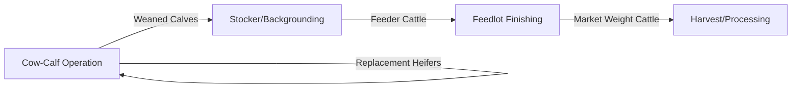

## Beef Cattle Production

### Overview

Beef cattle production is the systematic raising of cattle for meat, encompassing distinct production phases from breeding through finishing, each with specialized management, nutritional, and economic considerations. The industry is typically segmented into cow-calf, stocker/backgrounding, and feedlot finishing sectors, which may operate as separate enterprises or be vertically integrated within a single operation.

**Key Points**

- Beef production follows a sequential phase structure: cow-calf (breeding/calving) → stocker/backgrounding (growth) → feedlot (finishing) → harvest.
- Breed selection and crossbreeding strategies balance maternal traits (fertility, milking ability) against terminal traits (growth rate, carcass quality).
- Grazing/forage management is central to cow-calf economics, while feed efficiency dominates feedlot economics.
- Carcass quality and yield grading systems determine final product value and drive genetic and management selection decisions.

---

### Production System Segments

#### Cow-Calf Operations

The foundational breeding segment, maintaining a cow herd to produce calves annually. Primarily forage/pasture-based, with production centered on:

- Maintaining reproductive efficiency (see Animal Reproduction and Breeding Management)
- Calving management and calf survival
- Weaning weight optimization through cow milking ability and calf growth genetics

**Key metrics:** calving percentage, weaning rate, weaning weight, cow-to-bull ratio maintenance, cull cow management.

#### Stocker/Backgrounding Operations

Intermediate growing phase for weaned calves before feedlot entry, typically utilizing pasture, crop residues, or growing rations to add frame and weight economically before intensive grain finishing.

- **Purpose:** compensatory/economical growth using lower-cost forage-based gain before the higher-cost grain-finishing phase
- **Duration:** highly variable (weeks to several months) depending on target entry weight for the feedlot and available forage resources
- **Health focus:** critical period for respiratory disease (Bovine Respiratory Disease Complex, BRD) management due to weaning stress, co-mingling, and transport

#### Feedlot Finishing

Intensive, high-concentrate feeding phase to achieve target slaughter weight and desired carcass fat/marbling characteristics.

- **Housing:** typically open-lot pens with feed bunks and water access; scale ranges from small farmer-feeder operations to large commercial feedyards
- **Diet:** progressive transition from higher-forage "step-up" rations to high-grain finishing rations to maximize average daily gain (ADG) and feed efficiency while managing acidosis risk
- **Duration:** commonly 90–180+ days depending on entry weight, target finish weight, and genetics [Inference — considerable variation exists by market specification and breed type]

---

### Breed Selection and Genetics

#### Breed Categories by Function

| Category | Characteristics | Example Breeds |
| --- | --- | --- |
| British breeds | Good marbling, moderate frame, calving ease | Angus, Hereford, Shorthorn |
| Continental (European) breeds | Larger frame, higher growth rate, leaner carcasses | Charolais, Simmental, Limousin |
| Bos indicus / tropical breeds | Heat tolerance, parasite/tick resistance, hardiness | Brahman, Nelore |
| Composite/crossbred | Combine complementary traits via structured crossing | Brangus, Beefmaster, various commercial composites |

#### Crossbreeding Rationale

Crossbreeding programs exploit **heterosis (hybrid vigor)** and **breed complementarity**:

- Maternal-line breeds (e.g., Angus, Hereford) contribute fertility, calving ease, milking ability
- Terminal-line breeds (e.g., Charolais, Limousin) contribute growth rate and carcass muscling, typically used on terminal-cross calves not retained as replacements
- *Bos indicus* influence is incorporated in hot/humid regions for heat tolerance and parasite resistance, generally traded off against some marbling potential

#### Selection Tools

- **Expected Progeny Differences (EPDs)** – predict genetic transmitting ability for traits like birth weight, weaning weight, yearling weight, milk, marbling, ribeye area, and calving ease
- **Genomic-enhanced EPDs** – combine pedigree/performance data with DNA marker information for increased selection accuracy, particularly valuable for young animals without progeny records
- **Selection indices** – combine multiple EPDs into a single economic value reflecting a defined production/marketing goal (e.g., terminal index vs. maternal index)

---

### Nutrition Across Production Phases

#### Cow-Calf Nutrition

Primarily pasture/range-based, with nutritional management timed around the production cycle:

- **Pre-calving (late gestation):** increased energy/protein demand for fetal growth and colostrum quality; body condition score (BCS) at calving strongly influences rebreeding performance
- **Post-calving/breeding season:** highest nutritional demand period (lactation + rebreeding); often requires supplementation if pasture quality is insufficient
- **Mid-gestation (lowest requirement period):** typically the most economical time to utilize lower-quality forage or crop residues

#### Growing/Backgrounding Nutrition

Rations balanced for moderate, economical average daily gain (often targeting 1.5–2.5 lb/day depending on system and cattle type) using forages supplemented with moderate grain/protein as needed. [Inference — target gain rates vary substantially by region, forage quality, and market goals]

#### Finishing Nutrition

High-concentrate (grain-based) diets formulated to maximize gain and marbling while managing digestive health risks:

- **Step-up feeding programs** – gradual increase in grain/decrease in roughage over 2–3 weeks to allow rumen microbial adaptation and reduce acidosis risk
- **Feed additives** – ionophores (e.g., monensin) improve feed efficiency and help control coccidiosis; beta-agonists (where regulatory-approved) may be used late in the finishing period to improve lean growth efficiency
- **Bunk management** – careful monitoring of intake patterns to detect subclinical acidosis or health issues early

$$\text{Feed Conversion Ratio (FCR)} = \frac{\text{Feed Intake (kg)}}{\text{Weight Gain (kg)}}$$

Lower FCR indicates more efficient conversion of feed to body weight gain, a key economic metric in feedlot operations.

---

### Grazing and Pasture Management

#### Grazing Systems

| System | Description | Advantages |
| --- | --- | --- |
| Continuous grazing | Cattle graze one pasture season-long | Low labor/infrastructure cost |
| Rotational grazing | Cattle moved between multiple paddocks on a schedule | Improved forage utilization, pasture recovery, parasite lifecycle disruption |
| Management-intensive grazing (MIG) | Frequent moves (often daily) between small paddocks | Maximizes forage quality/utilization, requires more labor/fencing infrastructure |

#### Stocking Rate Considerations

Stocking rate (animals per unit land area) must balance forage availability, growth rate, and rest/recovery periods; overstocking degrades pasture productivity and increases parasite burden, while understocking underutilizes land resources. Appropriate rates vary substantially by forage type, climate, and rainfall pattern, and are typically determined through regional extension guidance and forage monitoring. [Unverified — highly region/forage-specific; consult local agronomic guidance]

---

### Health Management in Beef Production

#### Bovine Respiratory Disease Complex (BRD)

The most economically significant health challenge in stocker/backgrounding and early feedlot phases, driven by the combined stress of weaning, transport, comingling, and diet change, compounded by viral (BVDV, BRSV, IBR) and bacterial (*Mannheimia*, *Pasteurella*, *Histophilus*) pathogens.

**Prevention approaches:**

- Pre-weaning vaccination protocols ("preconditioning") administered before the stress of weaning/shipping
- Low-stress weaning methods (fenceline weaning, two-stage weaning) to reduce the physiological stress compounding disease susceptibility
- Adequate bunk/water space and reduced comingling stress upon arrival at new facilities

#### Other Key Health Considerations

- **Internal/external parasite control** – strategic deworming and fly/tick control programs, particularly important in pasture-based cow-calf systems
- **Clostridial disease vaccination** (blackleg and related diseases) – standard core vaccination in most beef programs
- **Reproductive disease management** – vaccination against diseases affecting fertility/abortion (e.g., BVDV, leptospirosis, vibriosis) is integrated into breeding season preparation

---

### Carcass Quality and Grading

#### USDA Quality Grade (Example System)

Reflects palatability factors, primarily marbling (intramuscular fat) and maturity:

| Grade | Marbling Level | Typical Market Position |
| --- | --- | --- |
| Prime | Abundant to slightly abundant | Premium foodservice/export |
| Choice | Modest to moderate | Mainstream retail |
| Select | Slight | Value-oriented retail |
| Standard/Commercial | Traces or less | Processing/lower-value markets |

#### USDA Yield Grade

Reflects the proportion of salable lean meat relative to fat, calculated from a formula incorporating hot carcass weight, ribeye area, backfat thickness, and kidney/pelvic/heart fat percentage; lower yield grade numbers (1) indicate higher cutability (more lean yield), while higher numbers (5) indicate lower cutability (more trim fat).

Grading systems and specific standards vary by country and regulatory body; the USDA system is presented here as a widely referenced example rather than a universal standard. [Unverified — confirm applicable grading system for the relevant regional market]

---

### Practical Example: Structuring a Spring-Calving Cow-Calf Enterprise Annual Cycle

**Scenario:** A commercial cow-calf operation wants to align management tasks with the reproductive and forage calendar for a spring-calving herd.

**Annual cycle outline:**

1. **Pre-calving (late winter):** increase nutritional plane for late-gestation cows; monitor body condition score, targeting adequate reserves for calving and rebreeding.
2. **Calving season (early spring):** intensive monitoring for dystocia, ensure timely colostrum intake, tag and record calves, process (vaccinate, castrate as needed) within the first days to weeks of life.
3. **Breeding season (60–90 days post-calving start, timed to spring/early summer):** turn out bulls at appropriate ratios or implement estrus synchronization/AI protocols; monitor breeding season length to maintain a tight calving distribution the following year.
4. **Summer grazing:** rotate pastures to manage forage quality and parasite exposure; monitor calf growth and cow condition.
5. **Preconditioning/weaning (fall):** wean calves using low-stress methods, administer preconditioning vaccinations, background on farm or market as feeder cattle depending on operation strategy.
6. **Pregnancy diagnosis and culling (fall):** confirm pregnancy status via palpation/ultrasound; cull open cows and those with structural, health, or temperament issues not suited for retention.
7. **Winter maintenance (mid-gestation):** utilize lower-cost forage/crop residue resources during the lowest nutritional-demand period of the production cycle.

This cycle synchronizes reproductive management, nutrition, and marketing decisions to optimize both animal performance and forage resource utilization across the year.

---

### Beef Production Flow Diagram

<svg xmlns="http://www.w3.org/2000/svg" viewBox="0 0 640 320" font-family="sans-serif">
<text x="320" y="24" text-anchor="middle" font-size="16" font-weight="bold" fill="#333">Beef Production System Flow (svg_diagram)</text>
<rect x="20" y="80" width="140" height="70" rx="8" fill="#b7d9a3" stroke="#4c7a3e" stroke-width="2" />
<text x="90" y="110" text-anchor="middle" font-size="11" fill="#1e3d1e">Cow-Calf</text>
<text x="90" y="128" text-anchor="middle" font-size="9" fill="#333">Breeding, Calving,</text>
<text x="90" y="140" text-anchor="middle" font-size="9" fill="#333">Weaning</text>
<line x1="160" y1="115" x2="200" y2="115" stroke="#555" stroke-width="2" marker-end="url(#arrow3)" />
<rect x="200" y="80" width="140" height="70" rx="8" fill="#a3c9d9" stroke="#3e6a7a" stroke-width="2" />
<text x="270" y="110" text-anchor="middle" font-size="11" fill="#1e353d">Stocker/</text>
<text x="270" y="125" text-anchor="middle" font-size="11" fill="#1e353d">Backgrounding</text>
<text x="270" y="140" text-anchor="middle" font-size="9" fill="#333">Forage-based growth</text>
<line x1="340" y1="115" x2="380" y2="115" stroke="#555" stroke-width="2" marker-end="url(#arrow3)" />
<rect x="380" y="80" width="140" height="70" rx="8" fill="#d9c2a3" stroke="#7a5c3e" stroke-width="2" />
<text x="450" y="110" text-anchor="middle" font-size="11" fill="#3d2e1e">Feedlot</text>
<text x="450" y="125" text-anchor="middle" font-size="9" fill="#333">Grain finishing,</text>
<text x="450" y="140" text-anchor="middle" font-size="9" fill="#333">marbling development</text>
<line x1="520" y1="115" x2="560" y2="115" stroke="#555" stroke-width="2" marker-end="url(#arrow3)" />
<rect x="560" y="80" width="60" height="70" rx="8" fill="#d9a3a3" stroke="#7a3e3e" stroke-width="2" />
<text x="590" y="115" text-anchor="middle" font-size="10" fill="#3d1e1e">Harvest</text>
<text x="590" y="130" text-anchor="middle" font-size="9" fill="#333">/Grade</text>
<path d="M90,150 Q90,220 90,150" fill="none" />
<line x1="90" y1="150" x2="90" y2="200" stroke="#4c7a3e" stroke-width="2" marker-end="url(#arrow3)" />
<text x="90" y="220" text-anchor="middle" font-size="9" fill="#4c7a3e">Replacement</text>
<text x="90" y="234" text-anchor="middle" font-size="9" fill="#4c7a3e">Heifers Retained</text>
</svg>

---

**Related Topics**

- Bovine Respiratory Disease Complex (BRD) prevention protocols
- EPD selection and genomic-enhanced genetic evaluation systems
- Rotational and management-intensive grazing system design
- Feedlot bunk management and acidosis prevention
- Carcass grading systems and value-based marketing
- Cow-calf enterprise budgeting and economic analysis
- Preconditioning and low-stress weaning programs
- Crossbreeding system design (terminal vs. maternal composites)
- Growth-promoting feed additives and regulatory considerations
- Forage species selection for beef cattle grazing systems