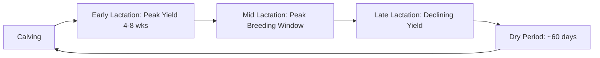

## Dairy Cattle Production

### Overview

Dairy cattle production is the specialized management of cattle for milk output, integrating reproductive scheduling, nutrition, milking technology, and health management to sustain high, persistent lactation across repeated production cycles. Unlike beef production's linear growth-to-harvest model, dairy operations manage a continuously cycling herd structure where reproduction, lactation, and dry periods interlock across each cow's productive lifetime.

**Key Points**

- Milk production is driven by the lactation curve, requiring precise nutritional and reproductive timing to sustain peak yield and persistency.
- The dairy cow's annual cycle (calving → lactation → breeding → dry period → calving) must repeat efficiently to maximize lifetime productivity.
- Udder health (mastitis control) and transition period management (around calving) are the two highest-impact health domains in dairy systems.
- Modern dairies increasingly integrate precision technologies (activity monitors, automated milking systems, milk sensors) into herd management.

---

### The Lactation Cycle

#### Lactation Curve Phases

- **Early lactation (0–70 days)** – milk yield rises rapidly to a peak (typically weeks 4–8 post-calving), while feed intake capacity lags behind energy demand, producing a period of **negative energy balance (NEB)**.
- **Peak lactation** – maximum daily yield point; peak yield strongly correlates with total lactation yield, making early-lactation management critical to overall production.
- **Mid lactation (70–200 days)** – yield gradually declines ("persistency"); this is also the optimal breeding window to maintain a ~12–13 month calving interval.
- **Late lactation (200+ days)** – continued decline in yield as pregnancy advances; cow transitions toward dry-off.
- **Dry period (~propose 60 days)** – lactation is deliberately ceased before the next calving to allow udder tissue regeneration and replenishment of body reserves, which is associated with improved yield in the subsequent lactation. [Inference — well-established dairy management principle, though optimal dry period length is debated and varies by parity/production level]

#### Persistency

Persistency describes how gradually milk yield declines after peak; higher persistency (a flatter decline curve) is generally favorable for total lactation yield, feed efficiency, and reduced metabolic stress relative to a sharply peaking, rapidly declining curve.

---

### The Transition Period

The transition period — roughly 3 weeks before to 3 weeks after calving — is considered the highest-risk window for metabolic and infectious disease in dairy cattle, due to the convergence of calving stress, rapid onset of lactation demand, and dramatic shifts in nutrient requirements.

#### Key Transition-Period Disorders

| Disorder | Cause | Management Focus |
| --- | --- | --- |
| Milk fever (hypocalcemia) | Inadequate calcium mobilization at calving onset | Pre-calving dietary cation-anion balance (DCAD) management |
| Ketosis | Severe negative energy balance, excessive fat mobilization | Maximizing dry matter intake pre- and post-calving |
| Displaced abomasum | Reduced rumen fill/gut motility around calving | Adequate forage intake, minimizing off-feed events |
| Retained placenta / metritis | Uterine involution failure, often linked to NEB/immune suppression | Nutrition, hygiene, and monitoring during calving |
| Fatty liver | Excessive body fat mobilization from severe NEB | Avoiding excessive body condition at dry-off |

#### Dietary Cation-Anion Difference (DCAD)

Pre-calving diets are often formulated with a negative DCAD to induce mild metabolic acidosis, which improves calcium mobilization from bone and reduces milk fever incidence:

$$\text{DCAD} = (Na^+ + K^+) - (Cl^- + S^{2-})$$

(expressed in milliequivalents per kilogram of dry matter; exact target ranges vary by feeding program and are typically set in consultation with a dairy nutritionist) [Unverified — specific numeric DCAD targets vary by system and should be confirmed against current nutritionist/extension guidance]

---

### Nutrition for Lactating Dairy Cattle

#### Nutrient Requirements by Production Stage

Dairy rations are formulated to meet the demands of milk synthesis, which requires substantially more energy and protein per unit body weight than beef cattle maintenance or growth diets:

- **Energy** – Net Energy for Lactation (NEL) system commonly used to balance rations against milk yield targets
- **Protein** – balanced for both rumen-degradable protein (feeding rumen microbes) and rumen-undegradable ("bypass") protein (supplying amino acids directly to the small intestine)
- **Fiber** – adequate effective/physically effective fiber (peNDF) is essential to maintain rumen function, cud-chewing activity, and butterfat synthesis
- **Minerals/vitamins** – calcium, phosphorus, magnesium, and trace minerals are closely monitored, particularly around the transition period

#### Total Mixed Ration (TMR) Feeding

Most modern confinement dairies feed a **Total Mixed Ration** — a homogenized blend of forages, concentrates, minerals, and additives — to ensure consistent nutrient intake per bite and reduce selective feeding/sorting behavior.

#### Body Condition Scoring in Dairy Cattle

BCS (commonly 1–5 scale in dairy) is monitored across the lactation cycle to avoid excessive body fat loss in early lactation (linked to metabolic disease) or excessive fat gain in late lactation/dry period (linked to transition disorders and dystocia risk).

---

### Milking Systems and Technology

#### Milking Parlor Types

| System | Description | Typical Scale |
| --- | --- | --- |
| Herringbone parlor | Cows stand at an angle in a row, milked from a pit | Small-to-mid scale |
| Parallel parlor | Cows stand perpendicular to the pit, higher throughput | Mid-to-large scale |
| Rotary parlor | Cows enter a continuously rotating platform | Large-scale operations |
| Robotic/Automated Milking System (AMS) | Cows voluntarily enter individual robotic units; milking without direct human labor | Increasingly adopted across scales |

#### Milking Frequency and Physiology

- Standard commercial dairies typically milk **2–3 times daily**; increased milking frequency generally increases yield (due to more frequent removal of milk relieving feedback inhibition of lactation) but requires additional labor/infrastructure investment.
- **Milk letdown reflex** – oxytocin release (triggered by teat stimulation, routine, and conditioned stimuli like parlor entry) causes myoepithelial cell contraction, enabling milk ejection; consistent pre-milking routines support reliable letdown.

#### Automated/Precision Dairy Technologies

- **Activity/rumination monitors** (collar, ear tag, or bolus-based) – detect estrus behavior changes and early illness indicators via altered activity or rumination patterns
- **In-line milk sensors** – monitor milk yield, conductivity (mastitis indicator), and components (fat, protein) per cow at each milking
- **Automated milking systems (robots)** – combine voluntary cow traffic, automated teat cleaning/attachment, and real-time milk quality sensing, generating continuous per-cow data streams for herd management software

---

### Udder Health and Mastitis Control

Mastitis (mammary gland inflammation, typically bacterial) is the most economically significant disease in dairy production, affecting milk yield, quality, and, in severe cases, cow survival.

#### Classification

- **Clinical mastitis** – visible signs (abnormal milk, udder swelling/heat/pain), varying from mild to severe/systemic
- **Subclinical mastitis** – no visible signs but elevated **somatic cell count (SCC)**, a key milk quality and udder health indicator monitored at both individual-cow and bulk-tank levels

#### Pathogen Categories

- **Contagious pathogens** (e.g., *Staphylococcus aureus*, *Streptococcus agalactiae*) – spread cow-to-cow, primarily during milking; controlled via milking hygiene and milking order management
- **Environmental pathogens** (e.g., *E. coli*, environmental streptococci) – originate from bedding/manure exposure; controlled via housing hygiene and teat-end sanitation between milkings

#### Prevention Program Components

- **Pre- and post-milking teat disinfection (dipping)** – reduces bacterial colonization of the teat canal
- **Proper milking machine function** – correct vacuum levels and pulsation settings to avoid teat-end damage
- **Dry cow therapy** – targeted or blanket antibiotic treatment at dry-off (practice varies by herd mastitis risk profile and regulatory/stewardship considerations) combined with internal teat sealants to physically block the teat canal during the dry period
- **Bedding and housing hygiene** – regular bedding replacement/management to reduce environmental pathogen load

$$\text{Somatic Cell Count (SCC)} ; [\text{cells/mL}]$$ is routinely tracked at cow and bulk-tank level as a proxy for subclinical mastitis prevalence and overall milk quality.

---

### Reproductive Management in Dairy Systems

Dairy reproduction management closely parallels general breeding principles (see Animal Reproduction and Breeding Management) but is tuned to dairy-specific economic priorities:

- **Target calving interval** – commonly ~12–13 months to maximize lifetime milk yield per day of herd life; longer intervals extend costly low-yield late-lactation and dry periods without producing a new lactation.
- **Voluntary waiting period (VWP)** – deliberate delay (commonly ~50–70 days postpartum, herd-dependent) before initiating breeding to allow uterine involution and negative energy balance recovery.
- **Estrus detection challenges** – high-producing dairy cows often show reduced/shorter behavioral estrus expression, partly linked to elevated feed intake and metabolic hormone clearance rates, making synchronization protocols and activity-monitoring technology particularly valuable in dairy settings. [Inference — well-documented physiological association in dairy reproduction literature]
- **Sexed semen use** – widely adopted to preferentially produce replacement heifers from top genetic-merit cows while using terminal beef sires on lower-merit cows/lines.

---

### Genetics and Breed Considerations

| Breed | Notable Characteristics |
| --- | --- |
| Holstein | Highest milk volume yield; dominant breed in most large-scale commercial dairies |
| Jersey | Higher butterfat/protein percentage, smaller body size, favorable feed efficiency per unit of milk solids |
| Brown Swiss | Strong udder/leg conformation, moderate-high yield |
| Ayrshire, Guernsey | Regional/niche breeds valued for specific components or grazing adaptability |

Genetic selection in dairy relies heavily on **Predicted Transmitting Ability (PTA)** values (an EPD-equivalent system) for milk yield, components (fat, protein), udder conformation, longevity, and increasingly, health/fertility traits, supported by widespread genomic testing of young animals.

---

### Practical Example: Managing the Transition Period for a 60-Cow Confinement Dairy

**Scenario:** A dairy wants to reduce the incidence of milk fever and ketosis in its herd during the transition period.

**Steps:**

1. **Close-up group formation** – separate cows into a dedicated close-up (pre-calving) pen 3 weeks before expected calving, allowing targeted ration formulation.
2. **DCAD-adjusted ration** – formulate the close-up diet with a negative DCAD using anionic salts, monitoring urine pH periodically to confirm the intended mild acidification response.
3. **Bunk space and stocking density** – ensure adequate bunk space (avoiding overcrowding) in the close-up pen to maximize dry matter intake, since reduced pre-calving intake is strongly linked to post-calving metabolic disease.
4. **Calving pen hygiene** – maintain clean, well-bedded individual or small-group calving areas to reduce metritis/infection risk.
5. **Fresh cow monitoring** – daily temperature and appetite checks for the first 10–14 days post-calving; use ketone testing (milk or blood) on at-risk cows to catch subclinical ketosis early.
6. **Gradual ration transition** – move fresh cows onto the lactating ration progressively rather than abruptly, supporting rumen microbial adaptation.
7. **Data review** – track transition disease incidence rates monthly, adjusting close-up nutrition/management based on trends.

This structured approach targets the primary risk factors (inadequate calcium mobilization, negative energy balance, and inadequate intake) that drive the majority of transition-period disease incidence.

---

### Lactation Curve Diagram

<svg xmlns="http://www.w3.org/2000/svg" viewBox="0 0 640 360" font-family="sans-serif">
<text x="320" y="24" text-anchor="middle" font-size="16" font-weight="bold" fill="#333">Typical Dairy Lactation Curve (svg_diagram)</text>

<line x1="70" y1="290" x2="590" y2="290" stroke="#333" stroke-width="2" />
<line x1="70" y1="290" x2="70" y2="50" stroke="#333" stroke-width="2" />
<text x="330" y="320" text-anchor="middle" font-size="11" fill="#333">Days in Milk (DIM)</text>
<text x="30" y="170" text-anchor="middle" font-size="11" fill="#333" transform="rotate(-90 30 170)">Milk Yield</text>

<path d="M70,270 C110,110 150,80 200,85 C280,95 350,150 450,220 C500,255 550,270 590,278" fill="none" stroke="`#3e6a9c`" stroke-width="3" />

<circle cx="200" cy="85" r="5" fill="#c94c4c" />
<text x="200" y="70" text-anchor="middle" font-size="10" fill="#c94c4c">Peak (4-8 wks)</text>

<line x1="150" y1="290" x2="150" y2="60" stroke="#aaa" stroke-width="1" stroke-dasharray="4,4" />
<text x="110" y="305" text-anchor="middle" font-size="9" fill="#555">Early Lact.</text>
<line x1="350" y1="290" x2="350" y2="130" stroke="#aaa" stroke-width="1" stroke-dasharray="4,4" />
<text x="270" y="305" text-anchor="middle" font-size="9" fill="#555">Mid Lact. (Breeding Window)</text>

<text x="480" y="305" text-anchor="middle" font-size="9" fill="#555">Late Lact.</text>

<rect x="590" y="270" width="30" height="20" fill="#d9c2a3" stroke="#7a5c3e" />
<text x="605" y="305" text-anchor="middle" font-size="8" fill="#555">Dry</text>
</svg>

---

**Related Topics**

- Transition cow nutrition and DCAD ration formulation
- Mastitis pathogen identification and milking hygiene protocols
- Automated milking system (robotic dairy) infrastructure and cow traffic design
- Genomic selection and PTA-based dairy genetic evaluation
- Sexed semen technology and reproductive program design
- Rumen physiology and TMR ration balancing
- Dairy cow comfort and freestall/bedding design for lameness prevention
- Milk quality standards and bulk tank somatic cell count regulation
- Precision livestock farming and activity-monitoring technology
- Calf and heifer-rearing programs for replacement stock development