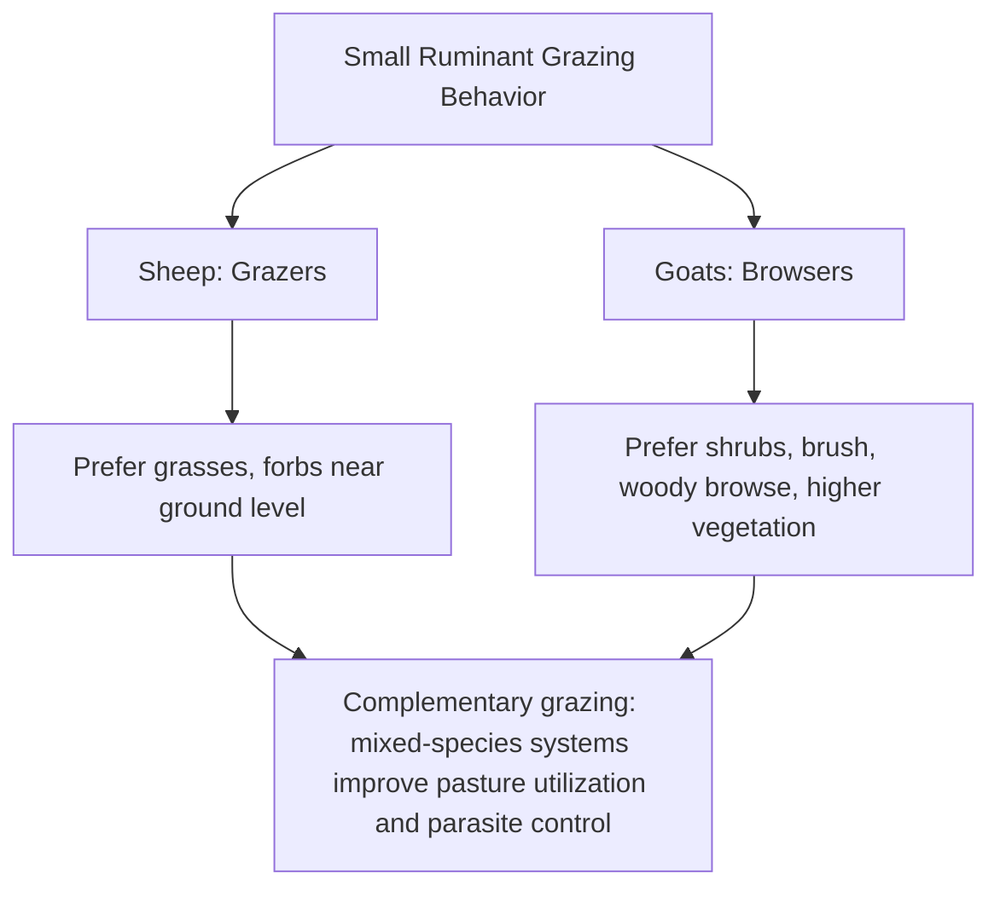
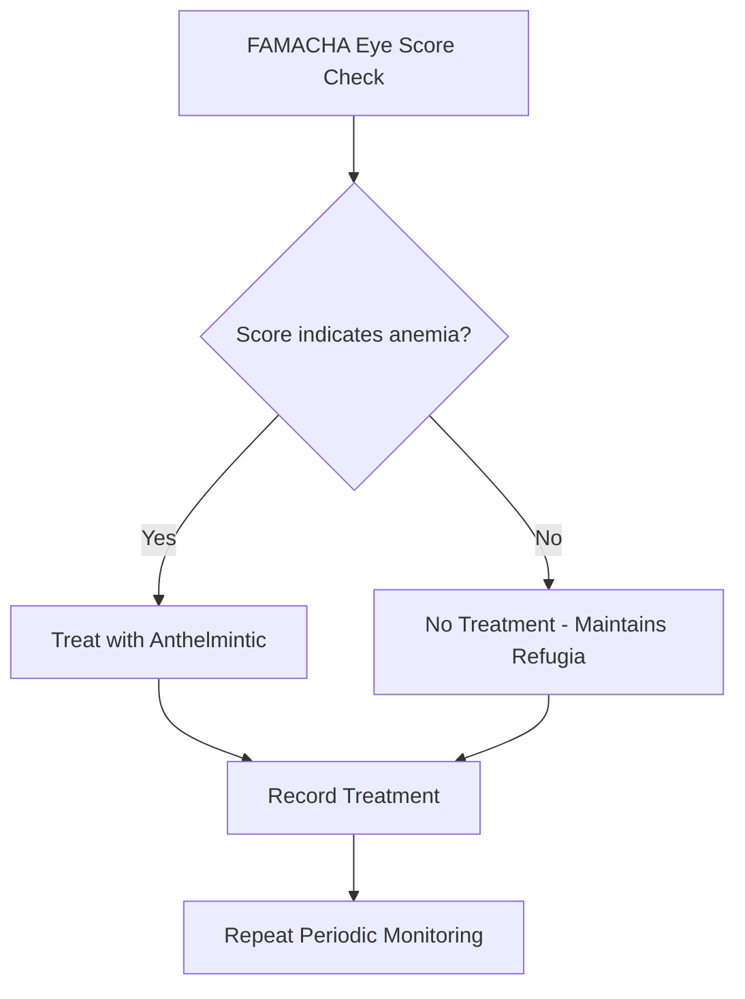

## Sheep and Goat Production

### Overview

Sheep and goat production (collectively termed "small ruminant" production) involves raising these species for meat, milk, fiber, or a combination of outputs, using management systems adapted to their distinct grazing behavior, seasonality, and prolificacy compared to cattle. While biologically related and often managed similarly, sheep and goats differ meaningfully in grazing preference, disease susceptibility, and typical production goals, warranting species-specific management consideration within a shared production framework.

**Key Points**

- Sheep are predominantly grazers (grass-preferring); goats are predominantly browsers (favoring shrubs/woody vegetation), a key distinction shaping pasture/rangeland utilization strategies.
- Production outputs span meat, milk, and fiber (wool in sheep, mohair/cashmere in some goat breeds), often shaping breed selection and management priorities.
- Internal parasitism (gastrointestinal nematodes) is the most significant health challenge across most small ruminant systems, particularly in humid/temperate grazing regions.
- Reproductive management leverages small ruminants' relatively high prolificacy (frequent multiple births) and, in many breeds, seasonal or accelerated breeding potential.

---

### Grazing Behavior and Comparative Physiology

This grazing/browsing distinction underlies the common practice of **multi-species grazing** (sheep/goats with cattle, or sheep with goats), which improves overall forage utilization across vegetation layers and can help break parasite lifecycles, since many internal parasites exhibit host specificity limiting cross-species transmission.

---

### Production System Types

#### Meat Production Systems

- **Extensive/pasture-based systems** – lower input, utilizing rangeland or pasture with minimal supplemental feeding; common in regions with extensive grazing land availability
- **Semi-intensive systems** – pasture-based with strategic supplementation during high-demand periods (late gestation, lactation, finishing)
- **Intensive/feedlot finishing** – confined feeding on concentrate-based diets for rapid finishing, particularly for market lambs/kids targeting specific weight or fat-cover specifications

#### Dairy Production Systems (Primarily Goats, and Regionally Sheep)

Dairy goat and dairy sheep operations parallel dairy cattle management principles (lactation curve management, milking routine, udder health) but at smaller scale, often integrated with on-farm cheese/artisan dairy processing in many production regions.

#### Fiber Production Systems

- **Wool production** (sheep) – breed selection and shearing management focused on fleece weight, fiber diameter (fineness), and staple length
- **Mohair production** (Angora goats) and **Cashmere production** (cashmere-type goats, often dual-purpose with meat) – specialized fiber markets with distinct genetic and management requirements

---

### Reproductive Management

#### Reproductive Characteristics

| Trait | Sheep | Goats |
| --- | --- | --- |
| Cycle length | ~17 days | ~21 days |
| Estrus duration | 24–36 hours | 24–48 hours |
| Gestation length | ~147 days | ~150 days |
| Typical litter size | 1–3 (breed-dependent) | 1–3+ (breed-dependent) |
| Seasonality | Many breeds are seasonal (short-day) breeders | Many breeds are seasonal (short-day) breeders; some tropical breeds cycle year-round |

#### Seasonal Breeding and Photoperiod

Many temperate sheep and goat breeds are **short-day breeders**, meaning reproductive activity is triggered by decreasing day length (typically resulting in fall breeding and spring births), an adaptation aligning offspring birth with favorable spring forage availability. Breeds originating from more equatorial/tropical regions often show reduced seasonality and can breed and produce offspring across more of the year.

#### Accelerated Lambing/Kidding Systems

Some operations pursue **accelerated breeding systems** (e.g., targeting 3 lamb/kid crops in 2 years rather than one per year) using hormonal synchronization and/or breeds/genetic lines with reduced seasonality, to increase output per breeding female per year at the cost of more intensive management and nutritional demands.

#### Prolificacy and Litter Size Management

Higher litter sizes increase output per female but also increase management complexity:

- **Colostrum/nutrition demands** – multiple offspring compete for a finite milk supply, sometimes necessitating supplemental feeding or fostering of extra offspring
- **Genetic selection for prolificacy** – some breeds (e.g., Finnsheep influence in crossbred sheep, Boer influence in meat goat programs) are specifically valued for higher twinning/multiple-birth rates

$$\text{Lambing/Kidding Percentage} = \frac{\text{Number of Offspring Born}}{\text{Number of Females Bred}} \times 100$$

---

### Nutrition Management

#### General Nutritional Considerations

Small ruminants have proportionally higher nutrient requirements per unit body weight than cattle due to their smaller body size and correspondingly higher metabolic rate relative to body mass, requiring closer attention to diet quality, particularly during late gestation and lactation when litter-bearing females face compounded nutrient demand.

#### Key Nutritional Periods

- **Flushing** – increasing nutritional plane in the weeks before breeding to improve ovulation rate and conception, a well-established practice for boosting litter size in seasonal breeding programs
- **Late gestation** – critical period for fetal growth (especially in multiple-bearing females), with inadequate nutrition linked to pregnancy toxemia (ketosis), particularly in ewes/does carrying multiple fetuses
- **Lactation** – highest nutritional demand period, especially for females nursing multiples

#### Copper Sensitivity (Sheep-Specific Consideration)

Sheep are notably more sensitive to copper toxicity than goats and cattle; mineral supplementation programs must account for this species difference, since a copper level appropriate for goats or cattle could be harmful if fed to sheep, making species-specific mineral formulation an important management detail on mixed-species operations. [Inference — well-documented comparative physiological point in small ruminant nutrition]

---

### Health Management

#### Internal Parasitism (Gastrointestinal Nematodes)

The dominant health and productivity constraint in most pasture-based small ruminant systems, particularly the barber pole worm (*Haemonchus contortus*), a blood-feeding parasite capable of causing severe anemia and rapid mortality, especially in humid/warm climates.

**Management approaches:**

- **FAMACHA© scoring** – a field-applicable method assessing ocular mucous membrane color as a proxy for anemia severity, used to selectively treat only clinically anemic animals rather than deworming the entire group, a key strategy for slowing anthelmintic resistance development
- **Fecal Egg Count Reduction Testing (FECRT)** – laboratory-based method to assess anthelmintic efficacy/resistance on a given operation
- **Pasture management** – rotational grazing, rest periods, and multi-species grazing to reduce parasite larval challenge
- **Refugia maintenance** – deliberately leaving some parasite population untreated to dilute resistant genotypes within the overall parasite population

#### Other Notable Health Concerns

- **Caseous lymphadenitis (CL)** – chronic bacterial disease causing abscesses, of particular concern in fiber-producing flocks/herds due to carcass/fleece contamination risk
- **Foot rot/foot scald** – bacterial hoof disease exacerbated by wet conditions, managed through hoof trimming, footbaths, and environmental management
- **Caprine Arthritis Encephalitis (CAE) and Ovine Progressive Pneumonia (OPP)** – retroviral diseases of goats and sheep respectively, often managed through herd testing and management practices to reduce transmission (particularly via colostrum/milk in some transmission pathways)
- **Pregnancy toxemia and hypocalcemia** – metabolic diseases of late gestation, especially in multiple-bearing females under nutritional stress

---

### Breed Selection Considerations

#### Sheep Breed Categories

| Category | Purpose | Example Breeds |
| --- | --- | --- |
| Wool breeds | Fiber production | Merino, Rambouillet |
| Meat breeds | Growth rate, carcass muscling | Suffolk, Hampshire, Texel |
| Dairy breeds | Milk production | East Friesian, Lacaune |
| Hair sheep (non-wool) | Reduced management input (no shearing), often heat/parasite tolerant | Katahdin, Dorper, St. Croix |

#### Goat Breed Categories

| Category | Purpose | Example Breeds |
| --- | --- | --- |
| Meat breeds | Growth rate, carcass yield | Boer, Kiko, Spanish |
| Dairy breeds | Milk production | Alpine, Saanen, Nubian, LaMancha |
| Fiber breeds | Mohair/cashmere production | Angora (mohair), Cashmere-type breeds |

---

### Practical Example: Designing a Rotational Grazing and Parasite Management Plan for a Meat Goat Herd

**Scenario:** A meat goat operation on humid pastureland wants to reduce *Haemonchus contortus* burden and slow anthelmintic resistance development.

**Steps:**

1. **Pasture subdivision** – divide grazing land into multiple paddocks to enable rotational grazing, allowing rest periods long enough for infective larvae on pasture to die off between grazing passes.
2. **Multi-species integration** – introduce cattle into the rotation where feasible, since cattle-specific parasites generally do not establish well in goats and vice versa, effectively "vacuuming" goat-infective larvae from pasture without amplifying goat parasite burden.
3. **FAMACHA monitoring** – implement routine (e.g., biweekly during high-risk season) FAMACHA scoring of the herd, treating only animals showing clinical anemia signs rather than blanket-deworming the group.
4. **Strategic deworming timing** – concentrate any necessary group treatments around highest-risk periods (e.g., late gestation/early lactation, when immune suppression increases parasite susceptibility) rather than a fixed calendar schedule.
5. **Browse-height management** – encourage goats to browse rather than graze close to the ground where most infective larvae concentrate, by managing pasture height and incorporating browse/brush areas into the rotation.
6. **Resistance monitoring** – periodically conduct FECRT to confirm continued efficacy of the anthelmintic products in use, adjusting the program if resistance is detected.

This integrated approach reduces reliance on blanket chemical deworming, slows resistance development through refugia preservation, and leverages the browsing behavior and multi-species grazing complementarity distinctive to goat management.

---

### Small Ruminant Grazing Niche Diagram

<svg xmlns="http://www.w3.org/2000/svg" viewBox="0 0 640 320" font-family="sans-serif">
<text x="320" y="24" text-anchor="middle" font-size="16" font-weight="bold" fill="#333">Grazing vs. Browsing Niche (svg_diagram)</text>

<line x1="40" y1="260" x2="600" y2="260" stroke="#7a5c3e" stroke-width="4" />

<rect x="40" y="245" width="560" height="15" fill="#a3d97a" />
<text x="320" y="280" text-anchor="middle" font-size="10" fill="#333">Ground-level grasses/forbs (Sheep grazing zone)</text>

<ellipse cx="150" cy="190" rx="50" ry="60" fill="#7ab35c" />
<ellipse cx="450" cy="180" rx="60" ry="70" fill="#7ab35c" />
<text x="320" y="120" text-anchor="middle" font-size="10" fill="#333">Shrubs/woody browse (Goat browsing zone)</text>

<ellipse cx="220" cy="240" rx="25" ry="15" fill="#e8e8e8" stroke="#555" stroke-width="1.5" />
<circle cx="245" cy="235" r="8" fill="#e8e8e8" stroke="#555" stroke-width="1.5" />
<text x="220" y="228" text-anchor="middle" font-size="9" fill="#333">Sheep</text>

<ellipse cx="420" cy="150" rx="22" ry="13" fill="#c9ab82" stroke="#555" stroke-width="1.5" />
<circle cx="440" cy="145" r="7" fill="#c9ab82" stroke="#555" stroke-width="1.5" />
<text x="420" y="132" text-anchor="middle" font-size="9" fill="#333">Goat</text>
</svg>

---

**Related Topics**

- FAMACHA scoring and integrated parasite management systems
- Seasonal breeding physiology and photoperiod manipulation
- Small ruminant dairy processing (cheese-making from sheep/goat milk)
- Wool and mohair fiber grading and marketing
- Pregnancy toxemia prevention in multiple-bearing ewes/does
- Multi-species and rotational grazing system design
- Meat goat and hair sheep genetics for low-input production systems
- Anthelmintic resistance testing (FECRT) protocols
- Caseous lymphadenitis and biosecurity in fiber flocks
- Accelerated lambing/kidding system design and hormonal synchronization