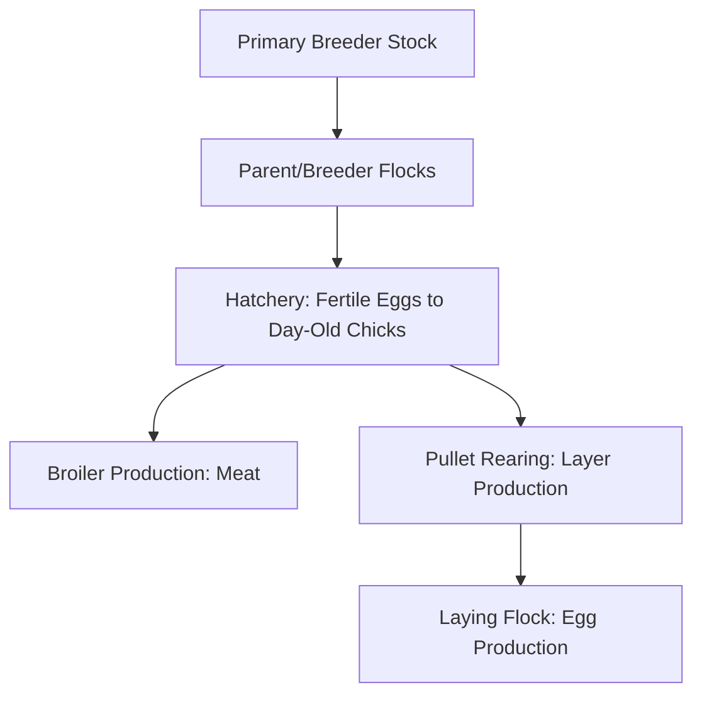
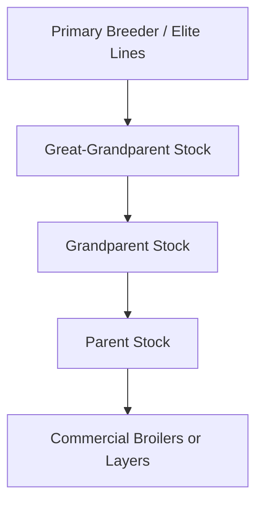

## Poultry Production

### Overview

Poultry production encompasses the raising of domesticated birds — primarily chickens, but also turkeys, ducks, and other species — for meat (broiler production) or eggs (layer production). The industry is characterized by short production cycles, high feed efficiency, and a high degree of vertical integration and technological intensification compared to most other livestock sectors, driven by the species' rapid growth rate and genetic responsiveness to selection.

**Key Points**

- Poultry production splits into two fundamentally distinct systems: broiler (meat) production and layer (egg) production, each with separate genetic lines optimized for their respective outputs.
- Modern broiler genetics achieve market weight in a fraction of the time required historically, driven by decades of intensive genetic selection for growth rate and feed efficiency.
- Housing and environmental control (temperature, ventilation, lighting, air quality) are central to poultry performance due to birds' high metabolic rate and sensitivity to environmental stress.
- Biosecurity is exceptionally critical in poultry due to the severity and rapid spread potential of diseases such as avian influenza and Newcastle disease.

---

### Production System Segments

#### Broiler (Meat) Production

Raising chicks to market weight for meat, characterized by an exceptionally short and intensive production cycle:

- **Grow-out period** – commonly around 5–7 weeks to market weight in conventional systems, though exact timelines vary by target market weight, genetic line, and management system [Inference — broadly representative figure; specific durations vary by production goal, e.g., smaller "fast-food" birds vs. larger "big bird" deboning targets]
- **All-in/all-out flow** – entire houses are populated with same-age chicks and fully emptied/cleaned between flocks, a core biosecurity and management practice
- **Feed efficiency focus** – broilers exhibit very favorable feed conversion ratios relative to most livestock, a key driver of the sector's economic competitiveness

#### Layer (Egg) Production

Raising and maintaining hens for egg output, structured around two life-cycle phases:

- **Pullet rearing** – raising female chicks from hatch to point-of-lay (commonly around 18–20 weeks of age), focused on proper skeletal and reproductive tract development rather than rapid weight gain
- **Laying phase** – egg production from point-of-lay through the end of the economic laying cycle (commonly a year or more, sometimes extended via "molting" programs that rest and reset the flock's laying cycle)

#### Turkey and Specialty Poultry Production

Turkey production follows broadly similar principles to broiler chicken production (all-in/all-out grow-out for meat) but with a longer grow-out period reflecting the species' larger mature size and slower relative growth rate; duck, goose, and other specialty poultry systems follow analogous meat or egg production logic adapted to species-specific behavior and market requirements.

---

### Genetics and Breeding Structure

#### The Poultry Breeding Pyramid

Commercial poultry genetics operate through a highly structured multiplication pyramid, distinct from most other livestock genetic systems:

A small number of global primary breeding companies maintain elite genetic lines, multiplying genetics down through several generations before reaching commercial production flocks, allowing rapid and coordinated dissemination of genetic improvement across the industry.

#### Selection Priorities by Line

- **Broiler lines** – selected primarily for growth rate, feed conversion efficiency, breast meat yield, and livability/leg soundness (to manage skeletal issues associated with rapid growth)
- **Layer lines** – selected primarily for egg number, egg size/shell quality, feed efficiency per egg, and persistency of lay across the production cycle

---

### Housing Systems

#### Broiler Housing

Predominantly floor-raised in large, environmentally controlled or naturally ventilated houses with litter (bedding material such as wood shavings) covering the floor, allowing birds to move freely and express natural behaviors such as dust-bathing and foraging within the litter.

#### Layer Housing Systems

| System | Description | Notes |
| --- | --- | --- |
| Conventional (battery) cages | Small wire cages housing a few hens each | Increasingly restricted/phased out in various jurisdictions due to welfare concerns regarding space and behavioral restriction |
| Enriched/furnished cages | Larger cages with nest boxes, perches, and scratch areas | Provides some behavioral opportunities within a cage system |
| Cage-free (barn/aviary) | Hens move freely within a barn, often with multi-tier aviary structures | Allows greater behavioral expression (perching, nesting, foraging) but requires careful management of air quality and social dynamics |
| Free-range | Cage-free with additional outdoor access | Combines aviary/barn housing with outdoor range access, subject to space and predator/disease exposure management challenges |

The regulatory and market landscape around layer housing systems continues to evolve significantly across different countries and retail markets, with various bans, phase-outs, and certification schemes affecting system adoption. [Unverified — regulatory specifics vary substantially by jurisdiction and change over time; confirm current requirements for the relevant market]

---

### Environmental Management

#### Temperature and Brooding

Newly hatched chicks (and poults) cannot effectively thermoregulate and require supplemental heat (brooding) that is progressively reduced as the birds feather out and mature, typically managed through zone heating (brooder stoves, radiant heaters) with careful monitoring of chick behavior/distribution as a heat-adequacy indicator (huddling indicates too cold; avoidance of the heat source indicates too warm).

#### Ventilation

Poultry houses require carefully managed ventilation to control:

- **Ammonia levels** – from litter/manure decomposition, linked to respiratory irritation and increased disease susceptibility if poorly controlled
- **Humidity** – excess moisture promotes litter caking and pathogen survival
- **Heat stress** – particularly critical in broiler production given birds' high metabolic heat output at market-ready size; tunnel ventilation systems (high-speed directional airflow) are widely used in modern broiler houses to manage heat stress in hot climates/seasons

#### Lighting Programs

Light duration and intensity are deliberately managed as production tools:

- **Broilers** – lighting programs balance growth performance against welfare/leg health considerations (some programs incorporate dark periods to allow rest and reduce sudden death/leg problems associated with continuous feeding access)
- **Layers** – photoperiod manipulation is used to control sexual maturity onset in pullets and sustain/stimulate egg production in laying hens, since reproductive activity in poultry (as in many seasonal breeders) is photoperiod-responsive

---

### Nutrition

#### Phase Feeding

Similar in principle to swine production, poultry diets are formulated in successive phases matched to age/production stage:

| Phase | Approximate Stage | Nutritional Focus |
| --- | --- | --- |
| Starter | Broiler: 0–10 days; Layer chick: 0–6 wks | High protein/amino acid density for early growth and development |
| Grower | Mid-cycle | Balanced growth-focused formulation |
| Finisher (broilers) | Final week(s) pre-slaughter | Adjusted formulation, often with reduced/no certain additives ahead of withdrawal requirements |
| Developer (pullets) | Pre-lay | Controlled energy to support structural development without premature excessive body weight |
| Layer ration | Point-of-lay onward | High calcium content to support eggshell formation, alongside balanced energy/protein for sustained egg output |

#### Key Nutritional Considerations

- **Amino acid balance** – similar to swine, poultry diets are formulated around limiting amino acids (particularly methionine and lysine) using the ideal protein concept for efficient nitrogen utilization
- **Calcium and phosphorus** – critical for skeletal development in growing birds and eggshell quality in layers; layer diets typically supply substantially more calcium than grower/broiler diets to meet the demands of daily eggshell calcification
- **Feed form** – pelleted or crumbled feed is common in broiler production to reduce feed wastage and improve intake efficiency compared to mash form

---

### Health and Biosecurity

#### High-Consequence Diseases

- **Avian Influenza (AI)** – viral disease with highly pathogenic strains capable of causing severe mortality and rapid spread; subject to intensive surveillance and regulatory reporting requirements in most poultry-producing countries due to both animal health and pandemic-potential public health concerns
- **Newcastle Disease** – viral disease causing respiratory, nervous, and/or reproductive signs, controlled through vaccination programs in many regions and strict biosecurity
- **Coccidiosis** – protozoal intestinal disease, a persistent challenge in floor-raised systems due to litter-based transmission; controlled via anticoccidial feed additives, vaccination (particularly in breeder/layer replacement programs), and litter management

#### Biosecurity Practices

Given the severity of high-consequence poultry diseases, biosecurity is typically the single most emphasized health management pillar:

- Controlled site access, shower-in/shower-out protocols on larger operations
- All-in/all-out flock management with thorough cleandown between flocks
- Wild bird exclusion (netting, enclosed housing) to reduce contact with wild waterfowl, a key avian influenza reservoir
- Rapid mortality reporting and surveillance systems to detect disease outbreaks early

---

### Egg Production and Quality

#### Egg Formation Cycle

Egg formation in a laying hen follows an approximately 24–26 hour cycle from ovulation to oviposition (laying), meaning a hen typically does not lay at exactly the same time each day, with the lay time gradually shifting later within a cycle before an occasional skipped day resets the pattern.

#### Egg Quality Parameters

- **Shell quality** – thickness, strength, and cleanliness, influenced by hen nutrition (calcium/vitamin D3), age (shell quality typically declines with advancing hen age), and health status
- **Interior quality** – albumen height/Haugh unit (a measure of albumen quality/freshness), yolk color (influenced by dietary xanthophyll pigment sources), and absence of blood/meat spots

---

### Practical Example: Managing a Broiler Flock's Environmental Program Through a Grow-Out Cycle

**Scenario:** A broiler operation wants to structure temperature and ventilation management across a typical grow-out cycle to optimize performance and welfare.

**Steps:**

1. **Pre-placement preparation** – preheat the house to appropriate brooding temperature before chick placement, ensuring litter and air temperature (not just air temperature) meet target levels, since chicks are highly sensitive to cold litter/floor surfaces.
2. **Early brooding (week 1)** – maintain elevated brooding zone temperature with minimal ventilation (sufficient for air quality only), monitoring chick distribution/behavior as the primary indicator of temperature adequacy.
3. **Progressive step-down (weeks 2–3)** – gradually reduce target temperature on a defined schedule as birds feather out and generate more metabolic heat, while progressively increasing minimum ventilation rates to manage rising ammonia and moisture output from a growing flock.
4. **Mid-to-late grow-out (weeks 4+)** – transition ventilation strategy toward heat stress management as birds approach market weight and generate substantial metabolic heat; in hot conditions/climates, engage tunnel ventilation for evaporative cooling effect.
5. **Litter monitoring** – regularly assess litter condition (moisture, caking) throughout the cycle, addressing wet spots (often around waterers) promptly to reduce ammonia release and footpad health issues.
6. **Pre-catch preparation** – adjust lighting/feed withdrawal timing ahead of catching and transport per food safety and welfare protocols.
7. **Post-flock cleanout** – complete litter removal or treatment, cleaning, and appropriate downtime before the next flock placement, consistent with the operation's all-in/all-out biosecurity program.

This staged environmental management approach reflects the rapidly changing thermoregulatory capacity and metabolic heat output of broilers across their compressed growth cycle.

---

### Poultry Breeding Pyramid Diagram

<svg xmlns="http://www.w3.org/2000/svg" viewBox="0 0 640 380" font-family="sans-serif">
<text x="320" y="24" text-anchor="middle" font-size="16" font-weight="bold" fill="#333">Poultry Genetic Multiplication Pyramid (svg_diagram)</text>
<polygon points="320,50 260,120 380,120" fill="#d9a3a3" stroke="#7a3e3e" stroke-width="2" />
<text x="320" y="95" text-anchor="middle" font-size="10" fill="#3d1e1e">Primary Breeder</text>
<polygon points="320,120 210,190 430,190" fill="#d9c2a3" stroke="#7a5c3e" stroke-width="2" />
<text x="320" y="165" text-anchor="middle" font-size="10" fill="#3d2e1e">Great-Grandparent Stock</text>
<polygon points="320,190 150,260 490,260" fill="#c2d9a3" stroke="#5c7a3e" stroke-width="2" />
<text x="320" y="235" text-anchor="middle" font-size="10" fill="#2e3d1e">Grandparent Stock</text>
<polygon points="320,260 90,330 550,330" fill="#a3c2d9" stroke="#3e5c7a" stroke-width="2" />
<text x="320" y="305" text-anchor="middle" font-size="10" fill="#1e2e3d">Parent Stock</text>
<polygon points="320,330 30,375 610,375" fill="#a3d9c2" stroke="#3e7a5c" stroke-width="2" />
<text x="320" y="360" text-anchor="middle" font-size="11" fill="#1e3d2e">Commercial Broilers / Layers</text>
</svg>

---

**Related Topics**

- Broiler leg health and skeletal integrity management under rapid growth genetics
- Layer housing system transitions and cage-free production planning
- Avian influenza surveillance and outbreak response protocols
- Poultry lighting program design for growth and reproductive control
- Coccidiosis vaccination and anticoccidial feed additive programs
- Tunnel ventilation system design for heat stress mitigation
- Hatchery management and egg incubation parameters
- Feed additive strategies (enzymes, probiotics) in poultry nutrition
- Molting programs and extended laying cycle management
- Poultry welfare certification schemes and third-party audit standards