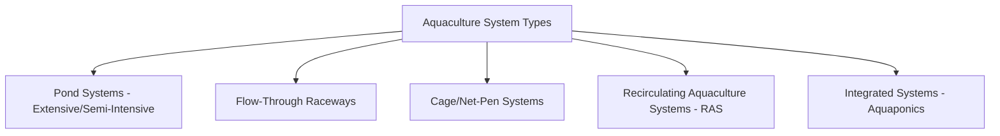
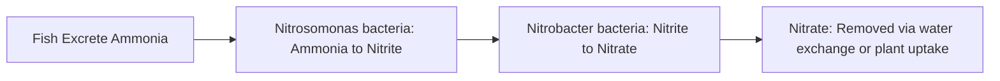
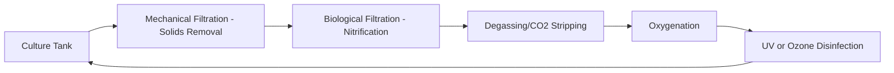
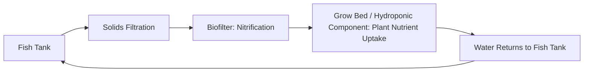

## Aquaculture Systems

### Overview

Aquaculture systems encompass the technologies and management approaches used to farm aquatic organisms — primarily fish, but also crustaceans, mollusks, and aquatic plants — under controlled or semi-controlled conditions. Unlike terrestrial livestock production, aquaculture management centers on water quality as the primary limiting and controlling factor, since aquatic animals are in continuous, intimate contact with their surrounding medium for respiration, waste elimination, and thermoregulation.

**Key Points**

- Water quality parameters (dissolved oxygen, temperature, ammonia, pH) function analogously to "feed and housing" combined in terrestrial systems — they simultaneously support growth and constrain stocking density.
- Aquaculture systems range along a spectrum from extensive (pond-based, low input) to highly intensive (recirculating systems, high stocking density, engineered control).
- Species selection dictates system design, since requirements differ dramatically between cold-water, warm-water, marine, and freshwater species.
- Effluent/waste management and disease biosecurity are increasingly central design considerations as production intensifies.

---

### Major System Types

#### Pond Systems

The most widespread traditional aquaculture approach, using earthen ponds with natural or supplemented productivity:

- **Extensive ponds** – rely primarily on natural pond productivity (phytoplankton, zooplankton) with minimal or no supplemental feeding; low stocking density, low input, low yield per unit area
- **Semi-intensive ponds** – combine natural productivity with supplemental feeding and/or fertilization to boost natural food production, moderate stocking density
- **Intensive ponds** – rely primarily on formulated feed with active aeration to support higher stocking densities than natural productivity alone could sustain

#### Flow-Through (Raceway) Systems

Linear channels or tanks with continuous water flow (typically drawn from a spring, river, or well source) passing through once before discharge, commonly used for cold-water species such as trout, where reliable cool, oxygen-rich water sources are available.

#### Cage and Net-Pen Systems

Fish are held in net enclosures suspended in open water bodies (lakes, rivers, coastal/marine areas), relying on the surrounding water body for water exchange, oxygenation, and waste dispersal. Widely used for marine finfish production (e.g., salmon) where suitable coastal sites exist.

#### Recirculating Aquaculture Systems (RAS)

Highly engineered, largely closed-loop systems that mechanically and biologically treat and reuse water, enabling high-density production with minimal water exchange and strong environmental control independent of external water body conditions or climate.

#### Aquaponics (Integrated Systems)

Combines RAS-style fish production with hydroponic plant cultivation, using fish waste (via bacterial nitrification) as a nutrient source for plant growth while the plants help remediate water quality before it returns to the fish system — a mutualistic design covered in more technical depth below given its integrated, systems-engineering nature.

---

### Water Quality Management

#### Core Parameters

| Parameter | Significance | General Management Note |
| --- | --- | --- |
| Dissolved Oxygen (DO) | Essential for respiration; often the primary limiting factor in intensive systems | Aeration (paddlewheels, diffusers, pure oxygen injection) maintains adequate levels, especially overnight when photosynthetic oxygen production ceases |
| Temperature | Governs metabolic rate, feeding response, and species suitability | Species have defined optimal ranges; extremes cause stress, reduced growth, or mortality |
| Ammonia (Total Ammonia Nitrogen, TAN) | Toxic metabolic waste product from protein metabolism/excretion | Managed via biofiltration (RAS), water exchange (flow-through/ponds), or natural pond nitrogen cycling |
| Nitrite | Intermediate, toxic nitrification byproduct | Indicates immature or overloaded biofilter in RAS; monitored closely during system start-up |
| pH | Affects toxicity of ammonia (un-ionized fraction increases at higher pH) and overall physiological stress | Managed via buffering, water source selection, and monitoring |
| Alkalinity | Buffers pH swings, supports stable nitrification | Often supplemented in RAS to sustain biofilter function |

#### The Nitrogen Cycle in Aquaculture

This biological nitrification process is the foundation of biofiltration in RAS and aquaponic systems, converting toxic ammonia and nitrite into the comparatively less toxic nitrate, which is then diluted through water exchange or actively consumed by plants in integrated systems.

$$\text{Un-ionized Ammonia Fraction} \uparrow \text{ as pH} \uparrow \text{ and Temperature} \uparrow$$

This relationship means that the same total ammonia concentration becomes proportionally more toxic at higher pH and temperature, making combined monitoring of these parameters more informative than tracking ammonia alone. [Inference — standard aquatic chemistry principle applied to aquaculture management context]

---

### Recirculating Aquaculture Systems (RAS) — Detailed Architecture

RAS represents the most engineered end of the aquaculture spectrum and merits closer technical examination given its growing adoption for high-value and land-based/climate-independent production.

#### Core System Components

1. **Culture tank(s)** – holds the stock; design (circular tanks are common) influences self-cleaning water flow patterns and waste collection efficiency
2. **Mechanical filtration** – removes solid waste (uneaten feed, feces) via drum filters, settling basins, or bead filters before it breaks down and degrades water quality
3. **Biological filtration (biofilter)** – provides surface area (media, moving bed biofilm reactors, trickling filters) for nitrifying bacteria colonization, converting ammonia to nitrite to nitrate
4. **Degassing** – removes dissolved carbon dioxide (a byproduct of fish respiration and biofilter bacterial activity) that would otherwise accumulate in a closed system
5. **Oxygenation** – supplemental oxygen injection (often pure oxygen in high-density systems) to maintain adequate dissolved oxygen levels beyond what aeration alone could achieve at high stocking density
6. **Disinfection** – UV sterilization or ozone treatment to reduce pathogen load in the recirculating water without the chemical residue concerns of some other disinfection methods

#### RAS Design Considerations

- **Biofilter sizing** – must be sized to the system's total ammonia production (a function of feed input/protein content and total biomass), since an undersized biofilter is the most common cause of water quality failure in RAS
- **Redundancy and backup systems** – power and aeration backup (generators, battery-backed alarms) are critical, since RAS failure can cause rapid, catastrophic stock loss due to the high stocking densities involved
- **Water exchange rate** – even "closed" RAS systems require some ongoing water exchange (commonly a small daily percentage) to dilute accumulating compounds not fully addressed by biofiltration (e.g., nitrate, dissolved organics)

#### RAS Advantages and Trade-offs

**Advantages:** minimal water use per unit production, location flexibility (independent of natural water bodies/climate), strong biosecurity/disease control potential, precise environmental control supporting optimized growth rates

**Trade-offs:** high capital investment, significant energy demand (pumping, aeration, temperature control), technical complexity requiring skilled operation, and vulnerability to rapid water quality collapse if system components (power, aeration, biofiltration) fail

---

### Aquaponics — Integrated Fish-Plant Production

#### System Logic

Aquaponics closes a nutrient loop between fish and plant production components: fish waste provides nutrients for plant growth (via bacterial nitrification converting ammonia to plant-available nitrate), while the plants' nutrient uptake helps maintain water quality suitable for the fish, reducing the water exchange requirements compared to fish-only RAS.

#### Key Design Considerations

- **Balancing fish and plant components** – system design must balance fish biomass/feeding rate (nutrient input) against plant growing area (nutrient uptake capacity) to avoid either nutrient deficiency (insufficient fish waste for plant needs) or nutrient excess (inadequate plant uptake relative to fish waste production)
- **pH compromise** – optimal pH ranges differ between fish (often slightly alkaline preference), nitrifying bacteria (require adequate alkalinity/pH for efficient function), and plants (often prefer slightly acidic conditions for nutrient availability); aquaponic systems typically operate at a compromise pH balancing all three components' needs
- **Common growing bed configurations** – media beds (gravel/expanded clay substrate), Nutrient Film Technique (NFT) channels, and Deep Water Culture (DWC) raft systems, each with different plant suitability and solids-handling requirements
- **Common species pairings** – tilapia is widely used as the fish component due to its hardiness and tolerance of variable water quality conditions, commonly paired with leafy greens or herbs as the plant component, though many species combinations are used depending on climate and market goals

---

### Species Considerations

#### Major Farmed Species Categories

| Category | Examples | Typical System Fit |
| --- | --- | --- |
| Cold-water finfish | Trout, Atlantic salmon | Flow-through raceways (trout), net-pen/cage systems (salmon) |
| Warm-water finfish | Tilapia, catfish, carp | Pond systems, RAS, aquaponics |
| Crustaceans | Shrimp/prawns, crayfish | Pond systems (shrimp), various extensive/semi-intensive systems |
| Mollusks | Oysters, mussels, clams | Open-water suspended or bottom culture systems, relying on natural filter-feeding |

Species selection interacts closely with system choice: cold-water species generally require lower temperatures and higher dissolved oxygen levels achievable in flow-through or well-aerated systems, while warm-water species tolerate broader temperature ranges and lower dissolved oxygen conditions common in tropical/subtropical pond systems.

---

### Health and Biosecurity

#### Disease Risk Factors

Aquaculture disease risk is strongly influenced by:

- **Stocking density** – higher densities generally increase pathogen transmission potential and stress-related immune suppression
- **Water quality stress** – poor water quality (low DO, elevated ammonia) compromises immune function and increases disease susceptibility, paralleling the stress-disease relationship seen in terrestrial livestock
- **Biosecurity of water source and stock introduction** – open systems (flow-through, cage/net-pen) face greater difficulty controlling pathogen introduction from the surrounding water body compared to closed RAS systems

#### Common Management Approaches

- Quarantine of incoming stock before introduction to main production systems
- Water source screening/treatment where feasible
- Stress reduction through appropriate stocking density and water quality maintenance as a primary disease prevention strategy (paralleling the "environment" vertex of the general disease triangle)
- Vaccination programs (well-established in some sectors, e.g., certain salmon aquaculture vaccination protocols) where commercially available for relevant pathogens

---

### Practical Example: Sizing a Basic RAS Biofilter for a Tilapia Grow-Out System

**Scenario:** A small-scale RAS operator is setting up a tilapia grow-out system and needs to ensure adequate biofiltration capacity for the target stocking level.

**Steps:**

1. **Estimate total feed input** – determine expected daily feed ration based on target fish biomass and feeding rate (percentage of body weight per day, which declines as fish grow).
2. **Estimate ammonia production** – total ammonia nitrogen (TAN) production is generally estimated as a function of feed protein content and total feed input, since protein catabolism is the primary source of nitrogenous waste in fish.
3. **Select biofilter media/type** – choose a biofilter type (e.g., moving bed bioreactor) with sufficient surface area to support the nitrifying bacteria population needed to process the estimated TAN load, sizing with a safety margin above calculated minimum requirements.
4. **Cycle the biofilter before stocking** – run the system with an ammonia source (either low initial fish stocking or an artificial ammonia source) for several weeks before full stocking, allowing nitrifying bacteria populations to establish ("biofilter cycling"), since an uncycled biofilter cannot process incoming waste and would allow toxic ammonia/nitrite accumulation.
5. **Gradual stocking increase** – introduce fish gradually rather than at full target density immediately, allowing the biofilter (and operator monitoring routine) to scale with increasing waste load.
6. **Ongoing monitoring** – track ammonia, nitrite, nitrate, pH, dissolved oxygen, and temperature on a routine schedule, adjusting feeding rate or water exchange if any parameter trends toward unsafe levels.
7. **Backup system verification** – confirm backup aeration/power systems are functional and alarmed, given the rapid deterioration risk in a fully stocked RAS during any filtration or aeration interruption.

This staged approach reflects the central RAS design principle: biological treatment capacity must be established and verified before it is relied upon to support production-level stocking densities.

---

### RAS Water Flow Diagram

<svg xmlns="http://www.w3.org/2000/svg" viewBox="0 0 640 320" font-family="sans-serif">
<text x="320" y="24" text-anchor="middle" font-size="16" font-weight="bold" fill="#333">Recirculating Aquaculture System Flow (svg_diagram)</text>
<circle cx="100" cy="150" r="45" fill="#a3c9d9" stroke="#3e6a7a" stroke-width="2" />
<text x="100" y="145" text-anchor="middle" font-size="10" fill="#1e353d">Culture</text>
<text x="100" y="160" text-anchor="middle" font-size="10" fill="#1e353d">Tank</text>
<line x1="145" y1="150" x2="190" y2="150" stroke="#555" stroke-width="2" marker-end="url(#arrow5)" />
<rect x="190" y="120" width="90" height="60" rx="6" fill="#d9c2a3" stroke="#7a5c3e" stroke-width="2" />
<text x="235" y="145" text-anchor="middle" font-size="9" fill="#3d2e1e">Mechanical</text>
<text x="235" y="158" text-anchor="middle" font-size="9" fill="#3d2e1e">Filtration</text>
<line x1="280" y1="150" x2="325" y2="150" stroke="#555" stroke-width="2" marker-end="url(#arrow5)" />
<rect x="325" y="120" width="90" height="60" rx="6" fill="#c2d9a3" stroke="#5c7a3e" stroke-width="2" />
<text x="370" y="145" text-anchor="middle" font-size="9" fill="#2e3d1e">Biofilter</text>
<text x="370" y="158" text-anchor="middle" font-size="9" fill="#2e3d1e">(Nitrification)</text>
<line x1="415" y1="150" x2="460" y2="150" stroke="#555" stroke-width="2" marker-end="url(#arrow5)" />
<rect x="460" y="120" width="90" height="60" rx="6" fill="#d9a3c2" stroke="#7a3e5c" stroke-width="2" />
<text x="505" y="145" text-anchor="middle" font-size="9" fill="#3d1e2e">Oxygenation</text>
<text x="505" y="158" text-anchor="middle" font-size="9" fill="#3d1e2e">&amp; UV</text>
<path d="M505,180 Q505,260 100,260 Q60,260 60,220 Q60,190 100,195" fill="none" stroke="#555" stroke-width="2" marker-end="url(#arrow5)" />
<text x="320" y="280" text-anchor="middle" font-size="10" fill="#555">Treated water returns to culture tank</text>
</svg>

---

**Related Topics**

- Nitrification biology and biofilter cycling protocols
- Species-specific water quality tolerance ranges (tilapia, trout, salmon, shrimp)
- Aquaponic system nutrient balancing and grow bed design
- Pond fertilization and natural productivity management
- Aquaculture feed formulation and feed conversion efficiency
- Marine cage/net-pen site selection and environmental impact management
- Aquatic animal disease diagnostics and vaccination programs
- Effluent treatment and regulatory discharge standards for intensive systems
- Water reuse economics and energy management in RAS operations
- Shrimp and crustacean pond production management