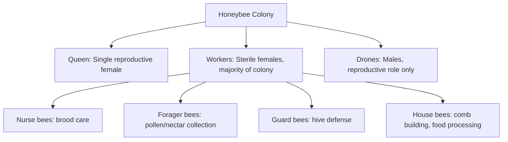
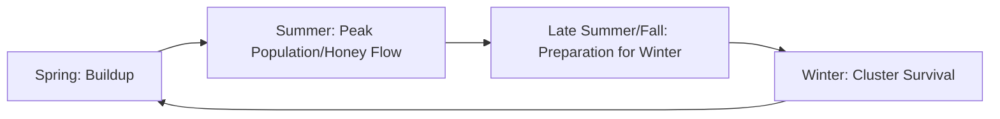

## Apiculture and Beekeeping

### Overview

Apiculture is the management of honeybee colonies for honey and other hive product production, pollination services, and colony propagation. Unlike conventional livestock production, beekeeping manages a highly organized eusocial insect superorganism rather than individual animals, requiring understanding of colony-level biology, seasonal management cycles, and a distinct set of health threats — most notably the parasitic mite *Varroa destructor* — that dominate modern beekeeping management priorities.

**Key Points**

- The honeybee colony functions as a single biological/management unit (a "superorganism") rather than a collection of independent individuals, fundamentally shaping how beekeepers assess and manage colony health.
- Colony management follows a seasonal cycle synchronized with forage availability, requiring proactive intervention timed well ahead of dearth or winter periods.
- *Varroa destructor* mite management is the single most critical modern beekeeping health practice, given the mite's role as both a direct parasite and a vector for several damaging viral diseases.
- Beekeeping serves dual economic roles: direct hive product output (honey, wax, propolis) and pollination services for agricultural crops, with the latter representing a major economic value stream in many regions.

---

### Colony Structure and Biology

#### Caste System

- **Queen** – the colony's sole reproductive female, responsible for essentially all egg-laying; also produces pheromones ("queen substance") that regulate colony behavior and suppress worker ovary development, making queen presence/quality a central diagnostic factor in colony health assessment
- **Workers** – sterile females performing all colony labor, progressing through an age-based division of labor (younger bees perform in-hive tasks like brood care and comb building; older bees transition to foraging), though this progression can be flexible based on colony needs
- **Drones** – males whose primary function is mating with virgin queens (from other colonies, since colonies avoid inbreeding); drones are typically produced seasonally and expelled from the colony ahead of winter dearth when their reproductive role is no longer needed and they represent a net resource cost

#### The Life Cycle and Brood Development

Honeybees undergo complete metamorphosis (egg → larva → pupa → adult), with development time varying by caste (queens develop fastest, drones slowest), a distinction beekeepers use in queen-rearing timing and colony assessment.

#### Colony Reproduction: Swarming

Colonies reproduce at the colony level through **swarming** — the process by which a portion of the workforce departs with the old queen to establish a new colony, while the original colony raises a new queen from remaining brood. Swarming is a natural reproductive behavior but represents a management challenge for beekeepers, since a swarming event substantially reduces the workforce (and thus honey production potential) of the parent colony.

---

### Seasonal Management Cycle

#### Spring Management

- **Colony assessment** – inspecting overwintered colonies for queen presence/quality, brood pattern, and overall population strength
- **Swarm prevention** – providing adequate space (adding boxes/supers) as population rapidly expands, since overcrowding is a primary swarming trigger
- **Buildup support** – ensuring adequate stores or supplemental feeding (sugar syrup) if natural forage is not yet sufficient to support rapid spring population growth

#### Summer Management

- **Honey flow management** – adding honey supers (boxes dedicated to surplus honey storage, separate from the brood area) to capture the main nectar flow period
- **Swarm monitoring** – continued inspection for swarm cell (queen cell) presence as an indicator of impending swarming, allowing intervention (splitting the colony, requeening) if desired
- **Pest/disease monitoring** – ongoing Varroa mite monitoring, since mite populations typically build through the season

#### Fall Preparation

- **Honey harvest** – removing surplus honey while leaving adequate stores for winter survival
- **Varroa treatment** – a critical fall treatment window in many temperate regions, since mite populations peaking in late summer/fall directly damage the "winter bees" (a physiologically distinct, longer-lived worker generation responsible for carrying the colony through winter)
- **Winter stores assessment** – ensuring adequate honey/pollen stores remain, supplementing with sugar syrup or fondant if natural stores are insufficient

#### Winter Management

- Colonies survive winter by **clustering** — workers form a tight thermoregulatory cluster around the queen, generating heat through metabolic activity and muscle vibration, with cluster position shifting to access stored honey
- Beekeeper intervention is minimal during deep winter (opening hives risks disrupting the cluster's thermal seal), with management primarily limited to periodic external checks and emergency feeding if stores run critically low

---

### Colony Health Management

#### Varroa destructor: The Dominant Modern Health Threat

*Varroa destructor* is an external parasitic mite that feeds on developing brood and adult bees, and critically, acts as a vector transmitting several damaging bee viruses (notably deformed wing virus), making mite management arguably the single highest-priority modern beekeeping health practice.

**Monitoring methods:**

- **Alcohol wash or sugar roll** – sampling a measured quantity of adult bees to quantify mite load as mites-per-100-bees, providing a threshold-based treatment decision metric
- **Sticky board counts** – passive monitoring of natural mite drop, though generally considered less precise than active sampling methods

**Management approaches:**

- **Chemical treatments** – various miticide products (organic acids such as oxalic or formic acid, and synthetic miticides) applied on a treatment schedule informed by monitoring results and seasonal timing
- **Cultural/mechanical controls** – drone brood removal (since mites preferentially reproduce in drone brood cells), screened bottom boards, and brood breaks (interrupting the brood cycle to disrupt mite reproduction)
- **Genetic approaches** – selection for mite-resistant or hygienic bee stock (colonies that detect and remove mite-infested brood at higher rates) as a longer-term management strategy

#### Other Notable Pests and Diseases

| Threat | Type | Key Management Note |
| --- | --- | --- |
| American Foulbrood (AFB) | Bacterial (spore-forming) | Highly persistent and contagious; often requires destruction of infected equipment per regulatory guidance in many regions |
| European Foulbrood (EFB) | Bacterial | Generally less severe than AFB; often resolves with strong colony management, sometimes requiring antibiotic treatment where permitted |
| Nosema | Fungal/microsporidian gut parasite | Associated with dysentery-like symptoms and reduced colony vigor, particularly under stress conditions |
| Small hive beetle | Insect pest | Larvae can damage comb and contaminate honey; managed via trapping and maintaining strong colonies (strong colonies better defend against beetle establishment) |
| Wax moth | Insect pest | Primarily affects weak colonies or stored equipment; managed via maintaining strong colonies and proper equipment storage |

#### Colony Collapse Disorder (CCD) Context

CCD refers to a specific pattern of rapid adult worker bee disappearance (with the queen and brood remaining, but insufficient workers to sustain the colony) that drew significant attention in the mid-to-late 2000s; current understanding attributes major colony losses more broadly to a combination of factors including Varroa/associated viruses, pesticide exposure, forage/nutritional stress, and management practices, with the specific CCD pattern itself now less frequently reported as a distinct phenomenon compared to multifactorial colony loss generally. [Unverified — this remains an area of ongoing research; consult current apicultural research literature for the latest scientific consensus]

---

### Hive Equipment and Apiary Design

#### Common Hive Types

- **Langstroth hive** – the most widely used commercial design internationally, featuring removable frames within stacked rectangular boxes, enabling inspection, honey extraction, and colony manipulation without destroying comb
- **Top-bar hive** – simpler, often lower-cost design using top bars from which bees build comb downward without full frames, common in smaller-scale or resource-limited beekeeping contexts
- **Warre hive** – a vertical top-bar variant designed around minimal intervention management philosophy

#### Apiary Site Considerations

- **Forage availability** – proximity to diverse, season-spanning nectar and pollen sources directly determines colony nutrition and honey production potential
- **Water access** – bees require a reliable water source for hive cooling and brood food preparation
- **Sun/wind exposure** – morning sun exposure encourages earlier daily foraging activity; wind protection reduces colony stress and cooling demands
- **Spacing and orientation** – adequate spacing between hives reduces drift (bees entering the wrong hive) and simplifies individual colony management access

---

### Pollination Services

Beyond honey production, managed honeybee colonies provide substantial economic value through **commercial pollination services**, where colonies are transported to align bloom timing with specific crops (a practice especially prominent in large-scale monoculture crop systems requiring pollinator density beyond what wild pollinator populations alone typically provide).

$$\text{Pollination Value} \gg \text{Honey Value}$$ in many commercial almond, fruit, and vegetable seed production contexts, where crop yield/quality is directly dependent on adequate pollinator visitation rates — though the precise relative economic weighting varies substantially by crop, region, and market conditions. [Inference — well-established general pattern in commercial pollination economics literature, though exact figures are crop- and market-specific]

---

### Practical Example: Preparing a Colony for Winter in a Temperate Climate

**Scenario:** A beekeeper in a temperate region needs to prepare colonies for winter survival, addressing the two dominant late-season risk factors: inadequate stores and unmanaged Varroa mite load.

**Steps:**

1. **Late-summer mite assessment** – conduct an alcohol wash or sugar roll mite count in late summer, since this period's mite population directly impacts the health of the winter bee generation being reared at this time.
2. **Mite treatment** – apply an appropriate miticide treatment if mite counts exceed the operation's action threshold, timed to treat before the critical winter bee brood is reared, since winter bees damaged by mites/viruses during development cannot be "fixed" after emergence.
3. **Stores assessment** – evaluate honey/pollen stores by hive weight or frame inspection, ensuring adequate reserves for the expected winter duration in the local climate.
4. **Supplemental feeding** – provide sugar syrup (heavier ratio in fall to encourage storage rather than immediate consumption) if natural stores are insufficient, completing feeding before temperatures drop too low for bees to process syrup effectively.
5. **Colony consolidation** – combine weak colonies with stronger ones if a colony's population is too small to reliably form an effective winter cluster, since an undersized colony often cannot generate sufficient cluster heat to survive extended cold periods.
6. **Physical winterization** – reduce hive entrances to deter robbing and pest entry, and consider windbreaks or insulation appropriate to local climate severity.
7. **Final fall inspection** – confirm queen presence and adequate population heading into winter, since queenlessness discovered too late in the season leaves no practical window for requeening before winter dearth.

This sequence reflects the core principle that most winter colony losses are actually determined by decisions and conditions established in late summer/early fall, well before winter cold itself becomes the proximate management concern.

---

### Colony Superorganism Diagram

<svg xmlns="http://www.w3.org/2000/svg" viewBox="0 0 640 340" font-family="sans-serif">
<text x="320" y="24" text-anchor="middle" font-size="16" font-weight="bold" fill="#333">Honeybee Colony Caste Structure (svg_diagram)</text>
<circle cx="320" cy="160" r="55" fill="#f0c674" stroke="#a17a1e" stroke-width="2" />
<text x="320" y="155" text-anchor="middle" font-size="11" fill="#4d3a0e">Queen</text>
<text x="320" y="170" text-anchor="middle" font-size="9" fill="#4d3a0e">(reproduction)</text>
<ellipse cx="150" cy="90" rx="70" ry="45" fill="#d9c2a3" stroke="#7a5c3e" stroke-width="2" />
<text x="150" y="85" text-anchor="middle" font-size="10" fill="#3d2e1e">Workers</text>
<text x="150" y="100" text-anchor="middle" font-size="9" fill="#3d2e1e">(majority of colony)</text>
<ellipse cx="490" cy="90" rx="70" ry="45" fill="#a3c2d9" stroke="#3e5c7a" stroke-width="2" />
<text x="490" y="85" text-anchor="middle" font-size="10" fill="#1e2e3d">Drones</text>
<text x="490" y="100" text-anchor="middle" font-size="9" fill="#1e2e3d">(mating role)</text>
<rect x="60" y="240" width="120" height="50" rx="6" fill="#c2d9a3" stroke="#5c7a3e" stroke-width="1.5" />
<text x="120" y="270" text-anchor="middle" font-size="9" fill="#2e3d1e">Nurse Bees</text>
<rect x="200" y="240" width="120" height="50" rx="6" fill="#c2d9a3" stroke="#5c7a3e" stroke-width="1.5" />
<text x="260" y="270" text-anchor="middle" font-size="9" fill="#2e3d1e">Forager Bees</text>
<rect x="340" y="240" width="120" height="50" rx="6" fill="#c2d9a3" stroke="#5c7a3e" stroke-width="1.5" />
<text x="400" y="270" text-anchor="middle" font-size="9" fill="#2e3d1e">Guard Bees</text>
<rect x="480" y="240" width="120" height="50" rx="6" fill="#c2d9a3" stroke="#5c7a3e" stroke-width="1.5" />
<text x="540" y="270" text-anchor="middle" font-size="9" fill="#2e3d1e">House Bees</text>
</svg>

---

**Related Topics**

- Varroa destructor monitoring and integrated pest management protocols
- Queen rearing and instrumental insemination techniques
- American Foulbrood identification and regulatory response
- Commercial pollination logistics and colony transport management
- Honey extraction, processing, and quality/moisture standards
- Africanized honeybee management considerations in affected regions
- Native and wild pollinator conservation alongside managed apiculture
- Winter cluster thermoregulation physiology
- Nutritional supplementation and pollen substitute formulation
- Hive product diversification (propolis, royal jelly, beeswax markets)