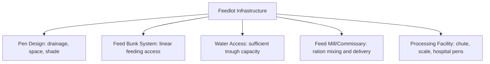
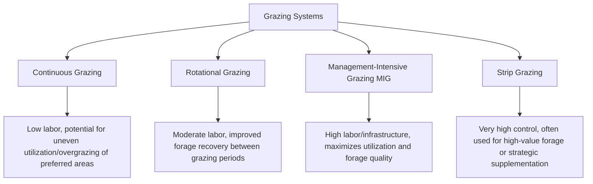

## Feedlot and Grazing Management

### Overview

Feedlot and grazing management encompasses the two fundamentally distinct approaches to feeding ruminant livestock at scale: confined, high-concentrate feeding systems (feedlots) designed to maximize growth rate and finishing efficiency, and pasture/rangeland-based systems (grazing management) designed to optimize forage utilization and animal performance from standing vegetation. Most commercial ruminant operations use both approaches sequentially or in combination, making an integrated understanding of each system's principles essential for whole-enterprise management.

**Key Points**

- Feedlot systems prioritize feed efficiency and controlled finishing through high-concentrate diets in confined settings, while grazing systems prioritize forage utilization efficiency and pasture sustainability.
- Bunk management and diet transition protocols are central to feedlot success, primarily to prevent digestive upset (acidosis) from rapid dietary shifts.
- Grazing management centers on balancing stocking rate, grazing duration, and rest/recovery periods to sustain long-term forage productivity.
- Both systems require careful health monitoring, though the dominant health risks differ (respiratory/digestive disease in feedlots; parasitism and nutritional deficiency in extensive grazing).

---

### Feedlot Systems

#### Feedlot Design and Infrastructure

- **Pen design** – open-lot pens with adequate drainage (mounding, slope) to manage manure/mud, sufficient linear bunk space per animal to reduce competition-related feeding behavior issues, and increasingly, shade structures in hot climates to mitigate heat stress
- **Feed delivery systems** – centralized feed mills mix rations (often using a Total Mixed Ration approach) delivered via feed trucks/wagons on a consistent daily schedule
- **Water systems** – adequate trough capacity and flow rate, since water intake directly influences dry matter intake and overall performance
- **Processing and health facilities** – dedicated chute/working facilities for arrival processing, and hospital/sick pens for isolating and treating animals requiring individual attention

#### Diet Transition and Step-Up Programs

The central technical challenge in feedlot nutrition is safely transitioning cattle from a forage-based diet (as received from stocker/backgrounding systems) to a high-concentrate finishing diet, since rapid dietary shifts risk **ruminal acidosis** — a potentially severe digestive disorder resulting from excessive rapid fermentation of readily fermentable carbohydrate (grain) overwhelming the rumen's buffering capacity.

**Step-up program principles:**

- Introduce grain gradually over a defined period (commonly 2–4 weeks, though exact timelines vary by starting diet, cattle background, and facility protocols), progressively increasing concentrate proportion while decreasing roughage
- Allow rumen microbial population time to shift toward starch-fermenting organisms, reducing the risk of a sudden pH crash from insufficient adapted microbial capacity
- Monitor bunk behavior and manure consistency throughout the transition as early indicators of digestive adaptation problems

$$\text{Rumen pH stability} \; \text{depends on} \; \frac{\text{Buffering capacity (saliva, dietary fiber)}}{\text{Rate of fermentable carbohydrate fermentation}}$$

#### Bunk Management

Bunk management is the ongoing practice of monitoring feed bunk conditions (feed remaining before the next feeding) to fine-tune daily feed delivery amounts, balancing the goal of maximizing intake (and thus growth) against the risk of overfeeding (leading to acidosis or feed waste) or underfeeding (limiting growth potential).

- **Bunk scoring systems** – standardized visual assessment scales (commonly ranging from empty/clean bunks to substantial feed refusal) used to guide next-feeding adjustments
- **Feed call decisions** – experienced bunk managers or increasingly, technology-assisted systems, adjust feed delivery amounts pen-by-pen based on bunk scores, weather conditions, and recent intake trends
- **Consistency emphasis** – maintaining consistent feeding times and delivery patterns reduces digestive disruption, since cattle develop feeding behavior patterns synchronized with routine

#### Feed Additives in Finishing Diets

- **Ionophores** (e.g., monensin, lasalocid) – improve feed efficiency by shifting rumen fermentation patterns and help control coccidiosis
- **Beta-agonists** (where regulatory-approved) – may be used in the final weeks of finishing to improve lean tissue growth efficiency
- **Buffers** (e.g., sodium bicarbonate) – sometimes included to support rumen pH stability, particularly during diet transitions or in high-risk feeding programs

#### Feedlot Performance Metrics

| Metric | Definition | Significance |
| --- | --- | --- |
| Average Daily Gain (ADG) | Weight gain per day | Primary growth performance indicator |
| Feed Conversion Ratio (FCR) / Feed:Gain | Feed intake per unit of gain | Primary economic efficiency indicator |
| Dry Matter Intake (DMI) | Daily feed consumption on a dry matter basis | Used to calculate efficiency ratios and monitor health/appetite trends |
| Cost of Gain | Total feed and yardage cost per unit weight gained | Key economic decision metric for marketing timing |

---

### Grazing Management

#### Grazing System Types

- **Continuous grazing** – animals have season-long access to a single pasture unit; simplest to manage but risks uneven grazing pressure, with animals preferentially overgrazing favored areas while avoiding less palatable zones
- **Rotational grazing** – pastures are subdivided into paddocks, with animals moved between them on a schedule allowing rested paddocks to recover forage growth before the next grazing pass
- **Management-intensive grazing (MIG)** – an intensified form of rotational grazing using frequent moves (often daily or near-daily) between small paddocks, maximizing forage utilization efficiency and quality consistency, but requiring substantially more fencing infrastructure and management labor/attention
- **Strip grazing** – a highly controlled variant using temporary (often electric) fencing to allocate a narrow forage strip at a time, common in intensive grass-based dairy systems or for rationing high-value forage/crop residue

#### Stocking Rate Determination

Stocking rate — the number of animals per unit land area over a defined period — is the central grazing management decision, balancing forage production capacity against animal demand:

$$\text{Stocking Rate} = \frac{\text{Animal Units}}{\text{Land Area}}$$

Appropriate stocking rates depend on forage species, soil fertility, rainfall/climate, and season, and are typically informed by regional forage production data and monitoring rather than a single universal formula; overstocking degrades long-term pasture productivity and increases erosion/weed encroachment risk, while understocking underutilizes available forage resources and reduces per-acre output. [Unverified — highly region- and forage-specific; consult local agronomic/extension guidance for specific stocking rate recommendations]

#### Grazing Height and Rest Period Principles

- **Take half, leave half** – a widely referenced general grazing management guideline suggesting animals should graze roughly half of available forage height/mass, leaving adequate residual leaf area for photosynthetic recovery and root reserve maintenance
- **Rest period sufficiency** – paddocks must be rested long enough to allow adequate forage regrowth before the next grazing pass; required rest length varies significantly with season (faster regrowth in peak growing season, slower in cool/dry periods), forage species, and soil conditions
- **Grazing height thresholds** – many forage species have a minimum residual height below which regrowth vigor and root reserves are compromised, informing when animals should be moved off a given paddock

#### Multi-Species and Complementary Grazing

Combining livestock species with differing grazing/browsing preferences (e.g., cattle grazing grasses alongside sheep or goats browsing forbs/brush) can improve overall pasture utilization across vegetation layers and, in some systems, contribute to parasite management through reduced host-specific parasite transmission between species (see Sheep and Goat Production for detail on this mechanism).

---

### Comparative Considerations: Feedlot vs. Grazing Systems

| Factor | Feedlot | Grazing |
| --- | --- | --- |
| Primary cost driver | Purchased feed/grain cost | Land/pasture management, fencing/water infrastructure |
| Growth rate | Generally faster due to energy-dense diet | Generally slower, forage-quality dependent |
| Labor pattern | Concentrated (daily feeding, bunk management) | Distributed (fencing, water, periodic monitoring) |
| Dominant health risk | Respiratory disease (especially at arrival), acidosis | Internal parasitism, nutritional deficiency, dystocia in extensive settings |
| Environmental consideration | Manure/nutrient management, runoff control | Soil health, overgrazing/erosion risk, riparian area management |

Many operations use grazing for the cow-calf and stocker/backgrounding phases (economical growth on forage) followed by feedlot finishing (efficient, controlled final weight gain and carcass quality development), combining the relative cost advantages of each system across the animal's production lifecycle.

---

### Water and Mineral Access Considerations

#### Feedlot Water Management

Water intake in feedlot cattle is closely linked to dry matter intake; inadequate trough capacity, flow rate, or water quality (temperature extremes, contamination) can suppress feed intake and growth performance, making water system design and maintenance a frequently underappreciated performance factor.

#### Grazing Water and Mineral Distribution

In extensive grazing systems, water source location strongly influences grazing distribution patterns, since animals concentrate activity near water and under-utilize forage in areas distant from water access; strategic placement of water points and mineral/supplement stations is a practical tool for improving overall pasture utilization uniformity and reducing overgrazing near water sources.

---

### Practical Example: Managing a New Arrival Group Through Feedlot Diet Transition

**Scenario:** A feedlot receives a group of newly weaned, background-raised calves and must safely transition them onto a finishing ration while managing arrival-related health risk.

**Steps:**

1. **Arrival processing** – conduct initial health assessment, administer arrival vaccinations/treatments per herd health protocol, and allow a rest/recovery period with access to hay and water before introducing concentrate feed.
2. **Starter ration introduction** – begin with a higher-roughage, lower-concentrate starter ration to ease the transition from a forage-based background diet, prioritizing consistent intake establishment over rapid energy density increase.
3. **Step-up sequence** – progressively increase concentrate inclusion across a series of defined ration steps over several weeks, monitoring bunk scores and manure consistency at each stage before advancing to the next step.
4. **Bunk monitoring routine** – implement daily bunk scoring to detect early signs of reduced intake (potentially indicating respiratory disease onset or digestive upset), adjusting feed delivery accordingly.
5. **Health surveillance** – conduct daily pen rider observation for signs of Bovine Respiratory Disease (depression, nasal discharge, reduced feeding activity), given the elevated BRD risk window in the weeks following arrival and comingling stress.
6. **Finishing ration achievement** – once cattle reach the target finishing ration without digestive or health complications, maintain consistent feeding routine through to target market weight/finish.
7. **Ongoing performance tracking** – monitor ADG and feed efficiency trends throughout the feeding period, using deviations from expected performance as an early indicator of subclinical health or management issues.

This structured transition addresses the two dominant early-feedlot risks — acidosis from overly rapid grain introduction and respiratory disease from arrival/comingling stress — through parallel nutritional and health monitoring protocols.

---

### Grazing Rotation and Rest Period Diagram

<svg xmlns="http://www.w3.org/2000/svg" viewBox="0 0 640 320" font-family="sans-serif">
<text x="320" y="24" text-anchor="middle" font-size="16" font-weight="bold" fill="#333">Rotational Grazing Paddock Cycle (svg_diagram)</text>
<rect x="40" y="60" width="120" height="90" fill="#a3d97a" stroke="#4c7a3e" stroke-width="2" />
<text x="100" y="110" text-anchor="middle" font-size="10" fill="#1e3d1e">Paddock 1</text>
<text x="100" y="125" text-anchor="middle" font-size="9" fill="#1e3d1e">Grazing Now</text>
<rect x="180" y="60" width="120" height="90" fill="#d9d9a3" stroke="#7a7a3e" stroke-width="2" />
<text x="240" y="110" text-anchor="middle" font-size="10" fill="#3d3d1e">Paddock 2</text>
<text x="240" y="125" text-anchor="middle" font-size="9" fill="#3d3d1e">Recovering</text>
<rect x="320" y="60" width="120" height="90" fill="#c2d9a3" stroke="#5c7a3e" stroke-width="2" />
<text x="380" y="110" text-anchor="middle" font-size="10" fill="#2e3d1e">Paddock 3</text>
<text x="380" y="125" text-anchor="middle" font-size="9" fill="#2e3d1e">Rested/Regrowing</text>
<rect x="460" y="60" width="120" height="90" fill="#a3d9c2" stroke="#3e7a5c" stroke-width="2" />
<text x="520" y="110" text-anchor="middle" font-size="10" fill="#1e3d2e">Paddock 4</text>
<text x="520" y="125" text-anchor="middle" font-size="9" fill="#1e3d2e">Ready Next</text>
<path d="M100,150 Q100,220 240,220" fill="none" stroke="#555" stroke-width="2" marker-end="url(#arrow6)" />
<path d="M240,150 Q240,220 380,220" fill="none" stroke="#555" stroke-width="2" marker-end="url(#arrow6)" opacity="0" />
<path d="M240,220 Q240,250 380,250" fill="none" stroke="#555" stroke-width="2" marker-end="url(#arrow6)" />
<path d="M380,150 L380,180" fill="none" stroke="#555" stroke-width="1" opacity="0" />
<path d="M380,250 Q460,250 520,220" fill="none" stroke="#555" stroke-width="2" marker-end="url(#arrow6)" />
<path d="M520,150 Q560,180 560,150" fill="none" stroke="#555" stroke-width="1" opacity="0" />
<path d="M520,220 Q560,150 100,150" fill="none" stroke="#555" stroke-width="2" stroke-dasharray="5,4" marker-end="url(#arrow6)" />

<text x="320" y="290" text-anchor="middle" font-size="10" fill="#555">Animals rotate; each paddock rests before the next grazing pass</text>

</svg>

---

**Related Topics**

- Ruminal acidosis pathophysiology and prevention strategies
- Bunk management scoring systems and feed call decision-making
- Forage species selection and pasture establishment
- Stocking rate calculation and carrying capacity assessment
- Bovine Respiratory Disease risk management at feedlot arrival
- Manure and nutrient management in confined feeding operations
- Riparian area and water source management in extensive grazing
- Feed additive regulatory status and use in finishing diets
- Cost of gain analysis and feedlot marketing timing decisions
- Silvopasture and multi-species grazing system design