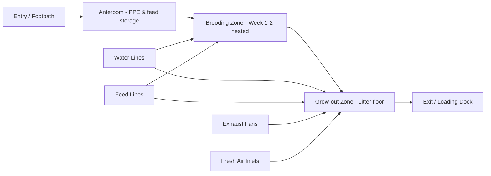

## Livestock Housing and Facilities

### Overview and Purpose

Livestock housing refers to the structures, equipment, and spatial arrangements provided to farm animals to protect them from adverse environmental conditions, predators, and disease, while supporting efficient production management. Well-designed housing balances four core objectives: animal welfare and comfort, biosecurity and health protection, labor and operational efficiency, and structural/economic feasibility.

Housing decisions directly influence feed conversion efficiency, reproductive performance, disease incidence, and mortality rates. Poorly designed housing is a common root cause of production losses in tropical and subtropical smallholder systems, particularly through heat stress, poor ventilation, and inadequate waste management.

### Core Functions of Livestock Housing

- **Thermoregulation support**: Buffering animals from extreme heat, cold, wind, and precipitation
- **Protection**: Shielding against predators, theft, and disease vectors
- **Restraint and handling**: Facilitating feeding, milking, breeding, and veterinary procedures
- **Waste management**: Containing and channeling manure and urine for collection or treatment
- **Production optimization**: Providing conditions (lighting, space, ventilation) that maximize growth, egg/milk yield, or reproduction

### General Principles of Livestock Building Design

#### Site Selection

- **Topography**: Slightly elevated, well-drained land prevents flooding and waterlogging around structures
- **Orientation**: In tropical climates, long axis oriented east-west minimizes direct solar radiation on the long walls and roof exposure during peak sun hours; in temperate climates, orientation shifts to maximize winter sun capture
- **Water access**: Proximity to a reliable, clean water source for drinking, cleaning, and cooling
- **Distance from residences**: Sufficient buffer to manage odor, noise, and biosecurity risk, subject to local zoning ordinances
- **Drainage**: Ground slope of approximately 2–5% away from the structure to prevent pooling
- **Wind considerations**: Positioning relative to prevailing winds affects both ventilation and odor drift toward neighboring properties

#### Space Allowance

Space requirements vary substantially by species, age, and production system (extensive, semi-intensive, intensive). Insufficient space causes stress, aggression, and disease spread; excessive space increases construction costs without proportional benefit.

| Animal Category | Typical Floor Space Allowance |
| --- | --- |
| Dairy cattle (free-stall) | 7–10 m² per animal (stall + alley) |
| Beef cattle (feedlot, open) | 15–30 m² per animal |
| Swine (finishing pigs) | 0.7–1.0 m² per animal |
| Sow (farrowing crate) | 4–5 m² per crate |
| Broiler chickens | 0.06–0.08 m² per bird (8–12 birds/m²) |
| Layer hens (cage-free) | 0.09–0.11 m² per bird |
| Goats/sheep | 1.0–1.5 m² per animal |

*[Inference: exact figures vary by breed, climate, management system, and applicable animal welfare regulations; these represent commonly cited industry ranges rather than universal standards.]*

#### Ventilation

Ventilation removes excess heat, moisture, ammonia, carbon dioxide, and airborne pathogens while supplying fresh oxygen. Two broad ventilation strategies are used:

- **Natural ventilation**: Relies on thermal buoyancy (stack effect) and wind pressure through open sidewalls, ridge vents, and strategically placed openings. Low-cost and suited to naturally ventilated tropical housing.
- **Mechanical (forced) ventilation**: Uses fans and controlled inlets to maintain precise airflow rates, essential in enclosed, high-density systems like tunnel-ventilated poultry houses.

Key ventilation design targets:

- Minimum fresh air exchange rates scale with animal body weight and stocking density
- Air speed at animal level typically 0.15–0.25 m/s in cold weather, up to 2–3 m/s for heat abatement (tunnel ventilation)
- Ridge height and roof pitch (commonly 25–30° for natural ventilation) affect stack-effect efficiency

#### Thermal Environment and Heat Stress

Each species has a **thermoneutral zone** — a temperature range within which the animal expends minimal energy on thermoregulation. Outside this zone, feed conversion, growth, milk yield, and fertility decline.

$$THI = T_{db} - [(0.55 - 0.0055 \times RH) \times (T_{db} - 14.5)]$$

Where $THI$ is the Temperature-Humidity Index, $T_{db}$ is dry-bulb temperature (°C), and $RH$ is relative humidity (%). A THI above 72 generally indicates the onset of heat stress in dairy cattle, with severe stress above 78–80. *[Inference: threshold values vary slightly across published sources and by breed tolerance.]*

Mitigation strategies include:

- Roof insulation and reflective roofing materials
- Adequate roof overhang (0.5–1.0 m) to shade walls
- Evaporative cooling pads and misting/fogging systems
- Increased ridge height (3.5–5 m) to promote hot air escape
- Shade structures and tree windbreaks in open-range systems

#### Flooring

Floor type affects hygiene, comfort, and injury rates.

- **Solid concrete floors**: Durable, easy to clean and disinfect; require adequate slope (2–3%) for drainage and bedding for comfort
- **Slatted/slotted floors**: Allow manure to fall through, reducing contact with waste (common in swine and poultry systems); slat width and gap size must match hoof/foot size to prevent injury
- **Deep litter systems**: Bedding material (rice hull, sawdust, straw) absorbs moisture and manure, composting in place; common in smallholder poultry and swine
- **Earthen floors**: Low-cost but harder to sanitize; suited to extensive, low-density systems

#### Lighting

Lighting affects behavior, feeding activity, and reproductive cycles, particularly in poultry where photoperiod directly regulates egg production via the hypothalamic-pituitary axis.

- Broilers: typically near-continuous light (20-23 hours) in early growth, tapering photoperiod programs used to manage growth rate and leg health
- Layers: photostimulation programs (gradually increasing daylength) trigger onset of lay; typically 14–16 hours light/day during peak production
- Light intensity: generally 10–20 lux for broilers, sufficient for feed/water finding without inducing excess activity

### Species-Specific Housing Systems

#### Cattle (Dairy and Beef)

- **Free-stall (cubicle) housing**: Individual resting stalls with a shared feeding and exercise alley; allows cows to move freely, widely used in commercial dairies
- **Tie-stall/stanchion barns**: Animals restrained at individual stalls for feeding and milking; more labor-intensive, less common in modern large-scale operations
- **Loose housing/open corral**: Cattle move freely within a bedded or paved yard, often combined with a shaded resting area; common in extensive beef and tropical dairy systems
- **Feedlots**: Open, high-density pens for finishing beef cattle, with a focus on feed bunk access length (0.3–0.6 m per animal) and drainage

Key structural components: feed bunks/mangers, water troughs, headlocks or breeding chutes, milking parlors (herringbone, parallel, rotary configurations), and holding pens.

#### Swine

- **Farrowing house**: Uses farrowing crates to protect piglets from crushing by the sow, with a heated creep area (32–35°C) separate from the sow's cooler comfort zone (18–22°C)
- **Nursery/weaner housing**: Elevated temperature (26–30°C, tapering with age), often slatted flooring for hygiene
- **Grower-finisher housing**: Group pens with solid or partially slatted floors, wallows or misting for cooling in hot climates
- **Gestation housing**: Individual stalls or group pens (regulatory trends increasingly favor group housing for sow welfare)

#### Poultry

- **Broiler housing**: Open-sided (naturally ventilated) or environmentally controlled (tunnel-ventilated, evaporative-cooled) houses; floor-raised on litter
- **Layer housing**: Conventional cages, enriched/furnished cages, or cage-free (barn/aviary) systems, each with distinct space, nesting, and perching requirements
- **Brooder housing**: Localized heating (gas brooders, infrared lamps, or radiant brooders) maintaining 32–35°C at chick level in week one, reduced ~2-3°C per week
- **Deep litter vs. battery cage**: Litter systems support natural behaviors (dust bathing, scratching) but require more floor space and litter management; cage systems maximize density and ease of manure collection but restrict movement

#### Small Ruminants (Goats and Sheep)

- Elevated slatted-floor housing is common for goats to keep animals dry and reduce parasite (helminth) exposure from ground contact
- Sheep tolerate more open, ground-level housing with adequate windbreaks
- Both require dry bedding areas and separate creep areas for young stock

### Waste Management Infrastructure

Manure management is an integral part of housing design, not an afterthought:

- **Manure pits/lagoons**: Anaerobic storage for liquid manure systems, often paired with biogas digesters for energy recovery
- **Solid manure storage**: Covered stacking areas to prevent nutrient leaching and runoff
- **Composting sheds**: Convert bedded manure into stabilized organic fertilizer
- **Drainage channels**: Direct wastewater to treatment or storage, preventing contamination of water sources

Biogas digesters coupled to livestock housing (particularly swine and dairy) are increasingly integrated as both a waste management and renewable energy solution. *[Inference: economic viability depends on herd size, capital cost, and local energy prices.]*

### Construction Materials

| Component | Common Materials | Considerations |
| --- | --- | --- |
| Roofing | Galvanized iron, fiber cement, thatch, insulated panels | Reflectivity, insulation value, cost, lifespan |
| Walls | Concrete block, brick, wire mesh, bamboo/wood (smallholder) | Ventilation openness vs. weather protection |
| Flooring | Concrete, compacted earth, slatted plastic/metal | Drainage, cleanability, animal comfort |
| Framing | Steel, timber, bamboo | Cost, termite/corrosion resistance, span capability |

### Biosecurity Design Features

- **Perimeter fencing** and controlled single-point entry
- **Footbaths/wheel dips** with disinfectant at entrances
- **All-in/all-out** housing flow to allow complete cleaning and disinfection between production cycles (especially poultry and swine)
- **Quarantine/isolation pens** for new or sick animals, physically separated from the main herd/flock
- **Dead animal disposal** areas (composting, incineration, or burial pits) located away from production and water sources

### Example: Basic Layout Logic for a Small-Scale Broiler House

### Illustration: Cross-Section of a Naturally Ventilated Tropical Livestock House (svg_diagram)

<svg xmlns="http://www.w3.org/2000/svg" viewBox="0 0 700 420" font-family="sans-serif">
<text x="350" y="25" font-size="16" text-anchor="middle" font-weight="bold">Naturally Ventilated Tropical Livestock House — Cross-Section (svg_diagram)</text>

<rect x="0" y="360" width="700" height="20" fill="#8b6f47" />
<text x="10" y="400" font-size="11" fill="#333">Ground level, sloped 2-3% for drainage</text>

<rect x="120" y="350" width="460" height="10" fill="#b0b0b0" />

<rect x="120" y="280" width="20" height="70" fill="#999999" />
<rect x="560" y="280" width="20" height="70" fill="#999999" />
<text x="60" y="320" font-size="11" text-anchor="middle">Low sidewall</text>
<text x="640" y="320" font-size="11" text-anchor="middle">Low sidewall</text>

<line x1="140" y1="280" x2="140" y2="150" stroke="#555" stroke-width="2" stroke-dasharray="4,3" />
<line x1="560" y1="280" x2="560" y2="150" stroke="#555" stroke-width="2" stroke-dasharray="4,3" />
<text x="90" y="220" font-size="11" text-anchor="middle">Open/curtain wall (air inlet)</text>
<text x="610" y="220" font-size="11" text-anchor="middle">Open/curtain wall (air inlet)</text>

<polygon points="120,150 350,60 580,150" fill="#a0522d" stroke="#5c2e0f" stroke-width="2" />
<text x="350" y="105" font-size="11" text-anchor="middle" fill="#fff">Insulated / reflective roofing</text>

<line x1="120" y1="150" x2="90" y2="165" stroke="#5c2e0f" stroke-width="4" />
<line x1="580" y1="150" x2="610" y2="165" stroke="#5c2e0f" stroke-width="4" />
<text x="60" y="150" font-size="10" text-anchor="middle">Overhang</text>
<text x="640" y="150" font-size="10" text-anchor="middle">Overhang</text>

<rect x="330" y="55" width="40" height="15" fill="#333" opacity="0.8" />
<text x="350" y="45" font-size="11" text-anchor="middle" font-weight="bold">Ridge vent</text>

<path d="M 350 300 L 350 80" stroke="#e63946" stroke-width="2" fill="none" marker-end="url(#arrow)" />
<text x="400" y="260" font-size="10" fill="#e63946">Warm air rises (stack effect)</text>
<path d="M 60 300 L 130 300" stroke="#1d3557" stroke-width="2" fill="none" marker-end="url(#arrow)" />
<text x="65" y="290" font-size="10" fill="#1d3557">Fresh air in</text>
<path d="M 640 300 L 570 300" stroke="#1d3557" stroke-width="2" fill="none" marker-end="url(#arrow)" />
<text x="635" y="290" font-size="10" fill="#1d3557" text-anchor="end">Fresh air in</text>
<rect x="200" y="320" width="300" height="25" fill="#dbe4c9" stroke="#6b8e23" />
<text x="350" y="337" font-size="11" text-anchor="middle">Animal occupation zone</text>
</svg>

### Common Design Mistakes

- Insufficient roof overhang, allowing driving rain and direct sun onto animals
- Under-sized ventilation openings relative to stocking density, causing ammonia buildup
- Flooring without adequate slope, leading to standing water and mastitis/foot rot risk
- Ignoring prevailing wind direction, causing poor natural ventilation or odor complaints from neighbors
- Overcrowding relative to design capacity, increasing disease transmission and stress-related aggression

### Regulatory and Welfare Considerations

Many jurisdictions impose minimum space, ventilation, and enrichment standards (e.g., EU welfare directives for laying hens and sows, USDA guidelines, or national livestock codes in various countries). Housing design should be cross-checked against applicable local and export-market regulations, as these directly affect market access for animal products. *[Unverified: specific regulatory thresholds should be confirmed against the current legislation of the relevant jurisdiction, as these are periodically revised.]*

### **Next Steps**

- Ventilation system design and calculation (natural vs. mechanical)
- Livestock waste management and biogas digester systems
- Housing for specific systems: dairy parlor design, poultry cage systems, swine farrowing management
- Heat stress physiology and mitigation strategies in livestock
- Biosecurity protocols in livestock and poultry farms
- Animal welfare standards and certification systems (e.g., Global Animal Partnership, RSPCA Assured)
- Feeding and watering equipment design
- Construction cost estimation and materials selection for farm structures