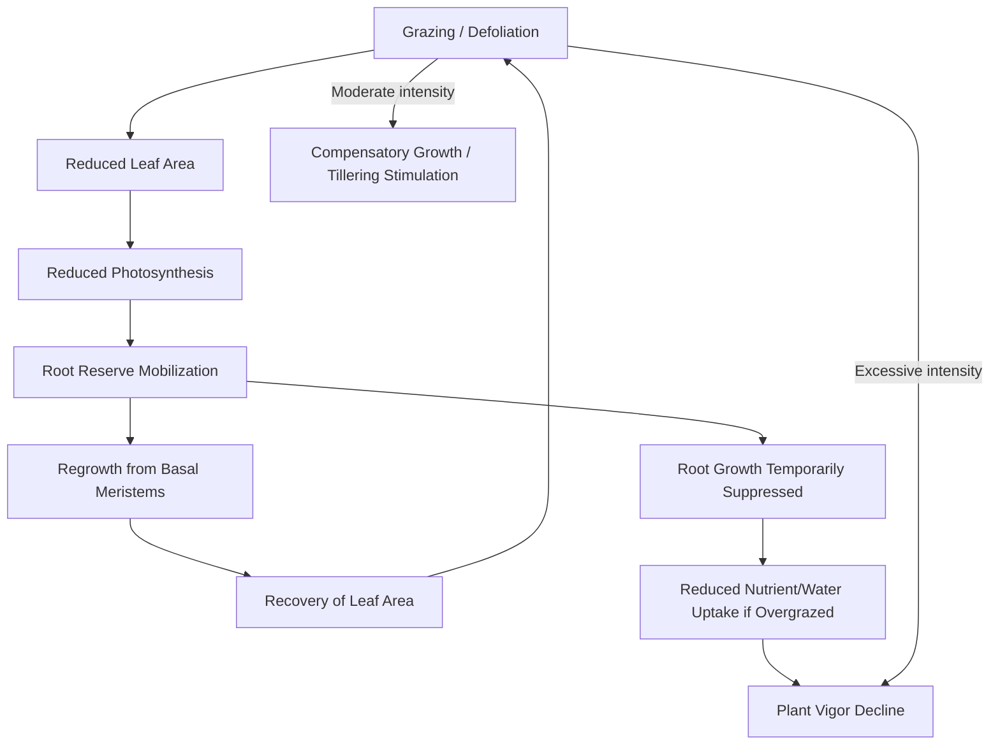

## Grassland Ecology

### Overview

Grassland ecology is the study of the structure, function, and dynamics of ecosystems dominated by grasses (Poaceae) and other herbaceous vegetation, along with their interactions with soil, climate, herbivores, and management practices. In an agricultural context, understanding grassland ecology underpins sustainable pasture and rangeland management, forage productivity, and long-term land stewardship.

Grasslands cover roughly 25–40% of the world's terrestrial land area and support the majority of global livestock production through grazing systems. *[Inference: exact global coverage estimates vary across sources depending on classification methodology.]*

### Grassland Classification

- **Natural/native grasslands**: Prairies, steppes, savannas, and veld ecosystems shaped by climate, fire, and grazing over long time scales (e.g., North American tallgrass prairie, African savanna, Eurasian steppe)
- **Semi-natural grasslands**: Historically managed but not sown, maintaining high species diversity (e.g., European hay meadows)
- **Sown/improved pastures**: Deliberately established with selected forage species for higher productivity (e.g., ryegrass-clover swards)
- **Rangelands**: Extensive, often arid or semi-arid grasslands managed primarily through grazing rather than cultivation

### Plant Community Structure

#### Growth Forms and Functional Groups

- **Grasses (graminoids)**: Dominant primary producers; classified by photosynthetic pathway into $C_3$ (cool-season, e.g., tall fescue, Kentucky bluegrass) and $C_4$ (warm-season, e.g., bermudagrass, big bluestem)
- **Legumes**: Nitrogen-fixing forbs (clover, alfalfa, lucerne) that improve soil fertility and forage protein content via symbiosis with *Rhizobium* bacteria
- **Forbs**: Broad-leaved, non-leguminous herbaceous plants contributing to biodiversity and micronutrient supply
- **Shrubs/woody encroachment**: Can indicate degradation or altered fire/grazing regimes when increasing in grass-dominated systems

#### Growth Habit and Grazing Tolerance

Grass growth points (meristems) are typically located near the soil surface, an adaptation that allows regrowth after grazing or mowing — a key ecological trait distinguishing grasslands from forests, where growth points are elevated and vulnerable to defoliation.

- **Bunchgrasses (caespitose)**: Grow in discrete tufts, e.g., big bluestem
- **Sod-forming (rhizomatous/stoloniferous)**: Spread via underground rhizomes or above-ground stolons, forming continuous cover, e.g., bermudagrass, kikuyu grass

### The Grass Plant Growth Cycle

$$GDD = \frac{T_{max} + T_{min}}{2} - T_{base}$$

Where $GDD$ is growing degree days, $T_{max}$ and $T_{min}$ are daily temperature extremes, and $T_{base}$ is the species-specific minimum growth temperature. This metric is commonly used to predict phenological stages (tillering, stem elongation, heading, seed set) relevant to grazing and haymaking timing.

Key phenological stages relevant to management:

1. **Vegetative stage**: Leaf production dominant; highest nutritive value and regrowth capacity
2. **Reproductive/stem elongation stage**: Energy shifts to seed head development; forage quality declines, lignin content rises
3. **Seed maturation/senescence**: Lowest digestibility; seed dispersal and dormancy mechanisms activate

### Grassland Productivity and Primary Production

**Net Primary Productivity (NPP)** in grasslands is governed by:

- Solar radiation interception (canopy leaf area index)
- Water availability (a dominant limiting factor in semi-arid/arid rangelands)
- Nutrient availability (particularly nitrogen and phosphorus)
- Temperature (governing the growing season length and $C_3$/$C_4$ competitive balance)

$$NPP = \epsilon \times APAR$$

Where $\epsilon$ is radiation use efficiency and $APAR$ is absorbed photosynthetically active radiation. Grassland radiation use efficiency is generally lower than forest systems but grasslands often show faster nutrient cycling. *[Inference: precise efficiency coefficients are species- and condition-specific and are typically derived empirically for a given ecosystem.]*

### Grazing Ecology and Herbivore Interactions

#### The Grazing-Plant Feedback Loop

#### Grazing Intensity Effects

- **Light-to-moderate grazing**: Can stimulate tillering, maintain species diversity, and prevent litter accumulation (intermediate disturbance effects)
- **Overgrazing**: Depletes root carbohydrate reserves, reduces basal cover, favors unpalatable or grazing-resistant species, and increases bare soil exposure to erosion
- **Undergrazing/no grazing**: Can lead to thatch buildup, reduced tillering, dominance by tall competitive species, and loss of grazing-adapted forb diversity in some systems

#### Herbivore-Grassland Coevolution

Many grassland ecosystems evolved under sustained large-herbivore grazing pressure (e.g., bison on North American prairies, wildebeest on African savanna), producing plant traits such as low growing points, silica deposition (reducing palatability/increasing tooth wear resistance), and rapid regrowth capacity — informing the rationale behind rotational and adaptive multi-paddock grazing systems that attempt to mimic natural grazing-rest cycles.

### Soil-Grassland Interactions

#### Root Systems and Soil Structure

Grassland root systems, particularly of perennial bunchgrasses, can extend several meters deep and contribute extensively to soil organic carbon through root turnover and exudates, distinguishing grassland carbon dynamics from aboveground-biomass-dominated forest systems.

- **Fibrous root architecture** improves soil aggregate stability and infiltration
- **Root exudates** feed rhizosphere microbial communities, influencing nutrient cycling
- **Mycorrhizal associations** (particularly arbuscular mycorrhizal fungi) enhance phosphorus uptake in many grassland species

#### Nutrient Cycling

- **Nitrogen cycling**: Driven by legume fixation, litter decomposition, and animal excreta (urine patches create localized nitrogen "hotspots" with distinct plant community responses)
- **Carbon cycling**: Grasslands are significant soil organic carbon sinks; well-managed grasslands can sequester carbon, while degraded or converted grasslands become net carbon sources
- **Phosphorus and potassium**: Often limiting nutrients in unimproved grasslands; typically supplemented in intensive pasture systems

### Disturbance Ecology

#### Fire

Fire is a natural and management-applied disturbance in many grassland ecosystems (prairies, savannas), serving to:

- Remove accumulated litter/thatch and recycle nutrients
- Suppress woody plant encroachment
- Stimulate warm-season grass regrowth and seed germination in fire-adapted species
- Reduce parasite and pest loads in some systems

#### Drought

Grassland species exhibit varying drought tolerance strategies:

- **Drought avoidance**: Deep rooting, stomatal closure, dormancy
- **Drought tolerance**: Osmotic adjustment, reduced leaf area
- $C_4$ grasses generally show greater water-use efficiency than $C_3$ grasses due to differences in photosynthetic carbon fixation pathways, contributing to their competitive advantage in warmer, drier conditions

### Grassland Succession and Degradation

#### Ecological Succession

Grasslands undergo succession following disturbance (fire, cultivation abandonment, overgrazing cessation), typically progressing from annual/pioneer species through perennial grass dominance, potentially toward shrub/woodland encroachment in the absence of disturbance (fire or grazing) in many biomes.

#### Degradation Indicators

- Increased bare ground and soil erosion
- Shift toward unpalatable, invasive, or annual species
- Declining basal cover and root biomass
- Soil compaction and reduced infiltration capacity
- Loss of biodiversity (both plant and associated fauna)

### Biodiversity and Ecosystem Services

Grasslands provide services beyond forage production:

- **Habitat provision**: For ground-nesting birds, pollinators, and grassland-specialist fauna
- **Water regulation**: Infiltration and groundwater recharge, reduced runoff
- **Carbon sequestration**: Particularly in perennial, deep-rooted systems
- **Pollination services**: Forb-rich grasslands support pollinator populations relevant to adjacent crop production
- **Soil erosion control**: Root networks stabilize soil against wind and water erosion

### Illustration: Grassland Ecosystem Nutrient and Energy Flow (svg_diagram)

<svg xmlns="http://www.w3.org/2000/svg" viewBox="0 0 700 460" font-family="sans-serif">
<text x="350" y="25" font-size="16" text-anchor="middle" font-weight="bold">Grassland Ecosystem Nutrient and Energy Flow (svg_diagram)</text>

<circle cx="80" cy="70" r="30" fill="#f4a300" />
<text x="80" y="115" font-size="11" text-anchor="middle">Solar Radiation</text>

<line x1="110" y1="80" x2="230" y2="130" stroke="#f4a300" stroke-width="2" marker-end="url(#arrow2)" />

<rect x="230" y="120" width="180" height="60" rx="8" fill="#6b8e23" />
<text x="320" y="155" font-size="13" text-anchor="middle" fill="#fff">Grasses &amp; Forbs</text>
<text x="320" y="170" font-size="10" text-anchor="middle" fill="#eee">(Primary Producers)</text>

<line x1="320" y1="180" x2="320" y2="230" stroke="#333" stroke-width="2" marker-end="url(#arrow2)" />
<text x="360" y="210" font-size="10">Grazing</text>

<rect x="230" y="230" width="180" height="55" rx="8" fill="#c19a6b" />
<text x="320" y="262" font-size="13" text-anchor="middle" fill="#fff">Grazing Herbivores</text>

<line x1="290" y1="285" x2="200" y2="340" stroke="#333" stroke-width="2" marker-end="url(#arrow2)" />
<text x="180" y="320" font-size="10">Dung / Urine</text>

<line x1="260" y1="180" x2="200" y2="340" stroke="#5c4632" stroke-width="2" stroke-dasharray="3,3" marker-end="url(#arrow2)" />
<text x="150" y="260" font-size="10">Litter / Root turnover</text>

<rect x="120" y="345" width="220" height="60" rx="8" fill="#5c4632" />
<text x="230" y="370" font-size="13" text-anchor="middle" fill="#fff">Soil Organic Matter</text>
<text x="230" y="386" font-size="10" text-anchor="middle" fill="#eee">Microbes, Nutrients, Carbon</text>

<path d="M 340 375 C 450 375 450 200 410 155" stroke="#2a7f2a" stroke-width="2" fill="none" marker-end="url(#arrow2)" />
<text x="440" y="260" font-size="10" fill="#2a7f2a">Nutrient Uptake</text>

<rect x="450" y="345" width="180" height="55" rx="8" fill="#8d6e63" />
<text x="540" y="377" font-size="13" text-anchor="middle" fill="#fff">Decomposers</text>
<line x1="410" y1="380" x2="445" y2="375" stroke="#333" stroke-width="2" marker-end="url(#arrow2)" />

<path d="M 410 260 C 500 280 550 320 545 340" stroke="#333" stroke-width="2" fill="none" stroke-dasharray="3,3" marker-end="url(#arrow2)" />
</svg>

### Applications to Pasture and Rangeland Management

Understanding grassland ecology directly informs practical management decisions:

- **Stocking rate determination**: Based on NPP and carrying capacity rather than fixed historical rates
- **Rotational/rest-based grazing systems**: Designed around plant recovery physiology and root reserve dynamics
- **Species selection for reseeding**: Matching $C_3$/$C_4$ species and legume inclusion to climate and soil conditions
- **Fire and brush management**: Using ecological disturbance regimes to control woody encroachment
- **Riparian and erosion-sensitive area management**: Applying buffer zones informed by root-soil stabilization principles

### Common Misconceptions

- Grasslands are not simply "unused" or unproductive land; many are among the most biodiverse and carbon-dense terrestrial ecosystems when in good condition
- Zero grazing/complete rest is not universally optimal; many grassland ecosystems co-evolved with grazing pressure and can decline in vigor and diversity without periodic disturbance
- Not all bare ground indicates degradation in naturally sparse arid rangeland ecosystems, though excessive bare ground beyond the ecological baseline typically does

### **Next Steps**

- Carrying capacity and stocking rate calculations
- Rotational and adaptive multi-paddock grazing systems
- Pasture species selection and establishment
- Rangeland monitoring and condition assessment techniques
- Soil carbon sequestration in grazing systems
- Fire ecology and prescribed burning in rangeland management
- Riparian zone and erosion control in grazed landscapes
- Invasive species management in grasslands