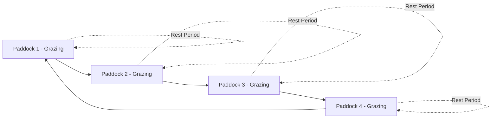

## Grazing Systems and Rotational Grazing

### Overview

Grazing systems are structured approaches to managing the timing, intensity, frequency, and spatial distribution of livestock grazing on pasture or rangeland. The choice of grazing system directly affects forage productivity, plant persistence, animal performance, soil health, and land degradation risk. Rotational grazing — cycling animals through subdivided paddocks with rest periods — is one of the most widely applied strategies for aligning grazing pressure with plant recovery physiology.

### Fundamental Grazing System Classifications

#### Continuous (Set-Stock) Grazing

Animals have unrestricted access to a single, undivided pasture area for an extended period (often a full season or year).

- **Advantages**: Low infrastructure and labor cost; simple management; animals can select preferred forage
- **Disadvantages**: Selective overgrazing of preferred species/patches, undergrazing of less palatable areas, uneven nutrient (dung/urine) distribution, reduced plant recovery time, and progressive decline in desirable species over time

#### Rotational Grazing

The pasture is subdivided into multiple paddocks; livestock graze one paddock intensively for a defined period, then move to the next, allowing grazed paddocks a rest/recovery interval before regrazing.

- **Advantages**: Improved forage utilization efficiency, more even nutrient distribution, allows plants to rebuild root and leaf reserves, can increase overall carrying capacity compared to continuous grazing
- **Disadvantages**: Higher infrastructure cost (fencing, water points), greater management/labor intensity, requires monitoring of plant recovery stage to time paddock moves correctly

#### Variants and Related Systems

- **Rotational-deferred grazing**: One paddock in the rotation is rested for an entire growing season (deferment) to allow seed set or full recovery, then rotated into the cycle in subsequent years
- **Strip grazing**: A movable electric fence restricts animals to a narrow strip of pasture, advanced daily or every few days; commonly used in intensive dairy and forage-crop grazing
- **Mob grazing / ultra-high-density grazing (UHDG)**: Very high stock density (often >100,000 kg liveweight/ha) for very short durations (hours to 1–2 days), followed by long rest periods (30–90+ days); designed to mimic natural herd-predator grazing patterns and maximize litter trampling for soil organic matter buildup
- **Adaptive multi-paddock (AMP) grazing**: Rotational grazing with flexible (non-fixed) paddock size, timing, and stock density, adjusted continuously based on forage growth rate, weather, and monitoring rather than a rigid calendar
- **Management-intensive grazing (MiG)**: A broader term for rotational systems emphasizing frequent monitoring and paddock moves tailored to forage regrowth rates
- **Creep grazing**: Young animals are allowed access to fresh, high-quality pasture ahead of or separate from the main herd via a creep gate, improving growth rates in nursing offspring
- **First-last grazing (leader-follower)**: Higher-nutrient-requirement animals (e.g., lactating cows, growing calves) graze a paddock first for the best-quality forage, followed by lower-requirement animals (dry cows, mature stock) that clean up the remainder

### Core Ecological and Physiological Principles

#### Rest Period and Regrowth Physiology

The rest period must be long enough for defoliated plants to replenish carbohydrate reserves in roots and crowns and restore adequate leaf area before being regrazed. Regrazing too soon depletes root reserves progressively, weakening plant vigor and reducing long-term productivity — a central rationale for rotational over continuous grazing.

Approximate rest period guidance (highly climate- and species-dependent):

| Growing Conditions | Typical Rest Period |
| --- | --- |
| Rapid growth (warm, moist season) | 15–25 days |
| Moderate growth (spring/fall) | 25–40 days |
| Slow growth (dry/cool season) | 40–90+ days |

*[Inference: these ranges are commonly cited management guidelines; optimal rest periods should be calibrated to local forage species regrowth rate and monitored directly via pasture height/cover rather than applied as fixed calendar values.]*

#### Grazing Intensity and Residual Height

The "take half, leave half" principle is a widely used rule of thumb: removing no more than approximately 50% of available forage leaf material preserves sufficient leaf area for rapid post-grazing photosynthetic recovery and protects root reserves.

$$U = \frac{F_c - F_r}{F_c} \times 100$$

Where $U$ is utilization rate (%), $F_c$ is forage mass before grazing, and $F_r$ is residual forage mass after grazing.

- **Under-utilization** (<30-40%): Inefficient use of available forage, potential for rank/overmature forage reducing quality
- **Optimal utilization** (~40-60%, system-dependent): Balances animal intake with plant recovery
- **Over-utilization** (>65-70%): Risk of root reserve depletion, exposed soil, and reduced regrowth vigor

#### Stock Density and Grazing Period Duration

Higher stock density concentrated on smaller paddock areas for shorter durations improves grazing uniformity (reducing selective overgrazing of preferred plants) and increases trampling of ungrazed material into litter, but requires more frequent paddock moves and closer monitoring for animal welfare (heat stress, water access).

$$SD = \frac{N \times W}{A}$$

Where $SD$ is stock density (kg liveweight/ha), $N$ is number of animals, $W$ is average liveweight per animal, and $A$ is paddock area.

### Carrying Capacity and Stocking Rate

**Carrying capacity** is the maximum stocking rate achievable without inducing long-term resource degradation, while **stocking rate** is the actual number/density of animals placed on a given land area over a specified time.

$$SR = \frac{AU \times D}{A}$$

Where $SR$ is stocking rate, $AU$ is animal units, $D$ is grazing days, and $A$ is area (commonly expressed as Animal Unit Months per hectare/acre, AUM/ha).

Matching stocking rate to forage availability — and adjusting it seasonally and in drought — is arguably the single most influential management decision in any grazing system, more consequential to long-term rangeland condition than the specific rotational pattern chosen. *[Inference: this relative-importance framing reflects a widely repeated rangeland management principle rather than a single universally cited quantitative study.]*

### Infrastructure Requirements for Rotational Systems

- **Fencing**: Permanent perimeter fencing plus temporary/semi-permanent electric fencing for paddock subdivision; polywire and step-in posts allow flexible, low-cost paddock reconfiguration
- **Water distribution**: Reliable water access in every paddock or via portable trough systems connected to a central water source; water point placement significantly affects grazing distribution, as livestock underutilize forage far from water
- **Handling facilities**: Working chutes/races and loading areas positioned for efficient stock movement between paddocks
- **Laneways**: Dedicated travel corridors between paddocks and water/handling points reduce trampling damage to pasture during moves

### Monitoring Tools for Grazing Management

- **Pasture height/rising plate meter**: Estimates standing forage mass from compressed sward height, used to time grazing entry and exit
- **Visual assessment of ground cover and litter**: Indicates erosion risk and residual forage adequacy
- **Grazing charts/records**: Track paddock entry/exit dates, rest periods, and stocking rates for adaptive planning
- **Body condition scoring**: Assesses whether current forage supply is meeting animal nutritional needs

### Illustration: Rotational Grazing Paddock Cycle and Recovery Curve (svg_diagram)

<svg xmlns="http://www.w3.org/2000/svg" viewBox="0 0 700 420" font-family="sans-serif">
<text x="350" y="25" font-size="16" text-anchor="middle" font-weight="bold">Rotational Grazing: Paddock Cycle and Forage Recovery (svg_diagram)</text>

<text x="150" y="55" font-size="12" font-weight="bold" text-anchor="middle">Paddock Rotation</text>

<rect x="60" y="70" width="80" height="60" fill="`#a8d08d`" stroke="#333" />

<text x="100" y="105" font-size="11" text-anchor="middle">P1</text>

<text x="100" y="145" font-size="9" text-anchor="middle">Grazing</text>

<rect x="150" y="70" width="80" height="60" fill="#dbe4c9" stroke="#333" />
<text x="190" y="105" font-size="11" text-anchor="middle">P2</text>
<text x="190" y="145" font-size="9" text-anchor="middle">Resting</text>
<rect x="60" y="140" width="80" height="60" fill="#dbe4c9" stroke="#333" />
<text x="100" y="175" font-size="11" text-anchor="middle">P4</text>
<text x="100" y="215" font-size="9" text-anchor="middle">Resting</text>
<rect x="150" y="140" width="80" height="60" fill="#f4e285" stroke="#333" />
<text x="190" y="175" font-size="11" text-anchor="middle">P3</text>
<text x="190" y="215" font-size="9" text-anchor="middle">Near-full recovery</text>

<path d="M 140 100 L 148 100" stroke="#333" stroke-width="2" marker-end="url(#arrow3)" />
<path d="M 190 130 L 190 138" stroke="#333" stroke-width="2" marker-end="url(#arrow3)" />
<path d="M 148 170 L 140 170" stroke="#333" stroke-width="2" marker-end="url(#arrow3)" />
<path d="M 100 138 L 100 130" stroke="#333" stroke-width="2" marker-end="url(#arrow3)" />

<text x="480" y="55" font-size="12" font-weight="bold" text-anchor="middle">Forage Recovery After Grazing</text>

<line x1="330" y1="230" x2="330" y2="70" stroke="#333" stroke-width="1.5" />

<line x1="330" y1="230" x2="650" y2="230" stroke="#333" stroke-width="1.5" />

<text x="320" y="70" font-size="9" text-anchor="end">Forage</text>

<text x="320" y="82" font-size="9" text-anchor="end">Mass</text>

<text x="650" y="245" font-size="9" text-anchor="end">Time (rest days)</text>

<path d="M 330 220 C 380 210 400 190 420 150 C 450 100 500 80 550 75 C 590 72 620 70 650 70" stroke="`#2a7f2a`" stroke-width="2.5" fill="none" />

<line x1="330" y1="150" x2="650" y2="150" stroke="#999" stroke-width="1" stroke-dasharray="4,3" />
<text x="655" y="153" font-size="9" fill="#666">50% recovery ref.</text>
<circle cx="330" cy="220" r="4" fill="#e63946" />
<text x="330" y="240" font-size="9" text-anchor="middle" fill="#e63946">Post-grazing</text>
<circle cx="500" cy="90" r="4" fill="#2a7f2a" />
<text x="500" y="60" font-size="9" text-anchor="middle" fill="#2a7f2a">Regrazing-ready</text>
</svg>

### Comparative Summary of Systems

| System | Labor/Infrastructure | Forage Utilization | Plant Recovery | Best Suited To |
| --- | --- | --- | --- | --- |
| Continuous | Low | Uneven, often low | Poor (no enforced rest) | Extensive, low-input operations |
| Simple rotational | Moderate | Improved | Moderate to good | Mixed commercial farms |
| Strip grazing | Moderate-high (daily moves) | High | Good | Intensive dairy, forage crops |
| Mob/UHDG | High | Very high | Very good (long rest) | Regenerative/soil-focused systems |
| AMP grazing | High (requires monitoring skill) | High, adaptive | Very good | Variable-climate rangelands |

### Common Design and Management Pitfalls

- Fixed rotation schedules that ignore actual forage growth rate, leading to regrazing before adequate recovery during slow-growth periods
- Water point placement causing severe grazing pressure gradients (heavy use near water, undergrazed areas farther away)
- Paddocks sized without accounting for herd size, causing either excessive trampling damage or forage waste
- Neglecting drought contingency destocking plans, risking long-term rangeland degradation during extended dry periods
- Overreliance on visual "greenness" rather than actual forage mass/height when deciding grazing readiness

### Applications and Outcomes

Well-managed rotational grazing has been associated in various studies and long-term ranch management programs with improved forage species diversity, increased soil organic matter and infiltration, more even nutrient distribution, and higher achievable stocking rates over time compared to continuous grazing on the same land base. *[Inference: the magnitude of these benefits is context-dependent on climate, soil type, forage species, and grazing management skill, and results vary across published research and field observations; behavior of a given system in practice may differ from these general patterns.]*

### **Next Steps**

- Carrying capacity and stocking rate calculation methods
- Pasture monitoring tools (rising plate meter, NDVI-based remote sensing)
- Fencing and water infrastructure design for grazing systems
- Drought management and destocking strategies
- Forage species selection for rotational systems
- Soil health indicators in grazed landscapes
- Grazing management software and precision livestock tools
- Riparian and sensitive-area exclusion strategies within grazing plans