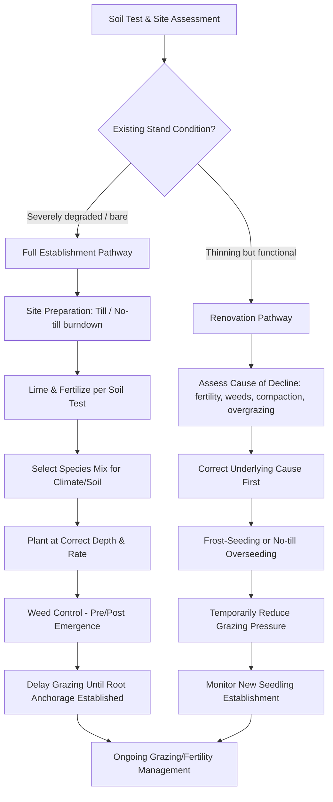

## Pasture Establishment and Renovation

### Overview

Pasture establishment refers to creating a new forage stand on previously uncultivated or non-pasture land, while pasture renovation refers to improving or restoring an existing, degraded, or thinning pasture without full re-establishment from bare ground. Both processes involve species selection, seedbed/soil preparation, planting method selection, and post-establishment management, and both aim to build a productive, persistent forage stand suited to the site's soil, climate, and intended grazing or hay use.

### Deciding Between Establishment and Renovation

| Factor | Favors Full Establishment | Favors Renovation |
| --- | --- | --- |
| Existing stand density | Sparse/absent desirable species | Moderate stand with gaps |
| Weed pressure | Severe, difficult perennial weeds | Manageable |
| Soil erosion risk | Low (bare soil period tolerable) | High (renovation preserves cover) |
| Cost tolerance | Higher budget available | Lower-cost intervention needed |
| Species change desired | Complete species/variety change | Overseeding compatible species |

### Site Assessment and Planning

#### Soil Testing

A soil test should precede any establishment or renovation decision, assessing:

- **pH**: Most temperate forage grasses and legumes perform best at pH 6.0–7.0; legumes (especially alfalfa) are generally more pH-sensitive than grasses
- **Phosphorus and potassium levels**: Critical for root establishment and stand persistence
- **Organic matter content**: Influences water-holding capacity and nutrient cycling
- **Soil texture and drainage class**: Determines species suitability (e.g., tolerance to waterlogging or drought)

#### Climate and Species Matching

Species selection should align photosynthetic pathway and growth cycle with the site's climate:

- **$C_3$ (cool-season) grasses**: Tall fescue, orchardgrass, perennial ryegrass, timothy — suited to temperate zones with cooler growing seasons
- **$C_4$ (warm-season) grasses**: Bermudagrass, bahiagrass, sorghum-sudangrass, napier grass — suited to tropical/subtropical zones with high summer temperatures
- **Legumes**: White clover, red clover, alfalfa/lucerne, stylo, desmodium — included for nitrogen fixation and forage quality improvement

### Pasture Establishment Process

#### Site Preparation Methods

- **Conventional tillage establishment**: Plowing, disking, and harrowing to create a fine, firm seedbed; effective for weed control but exposes soil to erosion risk during the bare period
- **Minimum/reduced tillage**: Partial soil disturbance (e.g., single-pass disking) combined with herbicide burndown, reducing erosion risk while still creating adequate seed-to-soil contact
- **No-till/direct drilling**: Seed placed directly into existing sod or crop residue using a no-till drill, following a herbicide burndown; minimizes erosion and preserves soil structure, but requires effective vegetation suppression prior to planting and generally more precise equipment

#### Seedbed Quality Requirements

A well-prepared seedbed for conventional or minimum-till establishment should be:

- **Firm**: Compacted enough that a footprint sinks no more than approximately 1–1.5 cm, ensuring good seed-to-soil contact and capillary moisture movement to the seed
- **Fine**: Free of large clods that create air pockets around small-seeded forages
- **Level**: Reducing water pooling and uneven seeding depth

#### Seeding Depth and Rate

Seeding depth is critical, particularly for small-seeded forage species:

| Seed Size Category | Typical Seeding Depth | Example Species |
| --- | --- | --- |
| Very small seed | 0.5–1.0 cm | Clover, ryegrass |
| Small-medium seed | 1.0–2.0 cm | Tall fescue, orchardgrass |
| Larger seed | 2.0–4.0 cm | Sorghum-sudangrass |

Seeding too deep is one of the most common causes of establishment failure, as small-seeded forages have limited energy reserves to reach the surface.

Seeding rates vary by species and mixture composition, generally ranging from approximately 5–15 kg/ha for fine-seeded grasses and legumes in monoculture up to 25–40 kg/ha for larger-seeded or mixed-species pastures. *[Inference: exact rates depend heavily on species, seed quality/purity, germination percentage, and regional agronomic recommendations, and should be adjusted using pure live seed (PLS) calculations.]*

$$PLS = \frac{Purity \times Germination}{100}$$

Where $PLS$ (Pure Live Seed, %) adjusts the bag seeding rate upward to compensate for impurities and reduced germination.

#### Planting Methods

- **Broadcast seeding**: Seed scattered on the soil surface, often followed by light harrowing/rolling to improve seed-to-soil contact; lower equipment cost but generally less uniform emergence than drilling
- **Drill seeding**: Precision placement at controlled depth and row spacing using a seed drill; typically achieves more uniform stands
- **Hydroseeding**: Seed, mulch, and tackifier applied as a slurry, primarily used on erosion-prone slopes or difficult-access sites
- **Broadcasting with a companion/cover crop**: A fast-establishing annual (e.g., oats) is sometimes seeded alongside perennial forage to provide early ground cover and reduce erosion, though at some risk of competition if the cover crop is not managed (mowed/grazed lightly) during establishment

### Illustration: Pasture Establishment Decision and Timeline (svg_diagram)

### Pasture Renovation Techniques

#### Overseeding/Interseeding

Introducing new seed into an existing, thinning sward without full tillage:

- **Frost-seeding**: Broadcasting seed (commonly legumes like red clover) onto pasture in late winter, relying on freeze-thaw soil heaving to work seed into the soil surface; low-cost but less reliable than drilling
- **No-till interseeding**: Using a no-till drill to place seed directly into existing sod, typically combined with grazing/mowing the existing stand short beforehand to reduce competition for light

#### Addressing Root Causes of Decline

Renovation should identify and correct the underlying cause of pasture decline before or alongside reseeding, since reseeding into an uncorrected problem (e.g., persistent overgrazing, poor drainage, severe compaction, unresolved soil fertility deficiency) typically fails:

- **Soil fertility correction**: Lime application to correct pH, fertilization based on current soil test recommendations
- **Compaction relief**: Subsoiling/aeration where compaction restricts root growth and water infiltration
- **Grazing management correction**: Adjusting stocking rate or rest periods if overgrazing caused the decline
- **Drainage improvement**: Tile drainage or surface grading in waterlogging-prone areas

#### Sod-Seeding vs. Complete Renovation

- **Sod-seeding**: Preserves existing desirable species while filling gaps, generally lower cost and lower erosion risk
- **Complete renovation (kill and reseed)**: Chemical or mechanical termination of the existing stand followed by full re-establishment, warranted when weed pressure or species composition problems are too severe for overseeding to correct

### Weed Management During Establishment and Renovation

- **Pre-plant burndown**: Non-selective herbicide application to eliminate existing vegetation before no-till planting
- **Pre-emergence herbicides**: Applied before weed germination to suppress early competition, used cautiously with legume-inclusive mixtures due to differing herbicide tolerances
- **Post-emergence/clipping**: Mowing new stands at a height above the growing forage seedlings but below competing weeds can suppress weed seed production without damaging establishing forage
- **Timing advantage**: Planting when the target forage species has a competitive germination/growth advantage over problem weeds (e.g., cool-season establishment timed to outcompete summer annual weeds)

### Post-Establishment Management

#### Grazing/Harvest Timing

New stands require a delay before first grazing or cutting to allow adequate root anchorage; premature grazing can uproot seedlings before root systems are established. A commonly used guideline is delaying grazing until plants reach a height allowing removal of no more than the top portion of growth without pulling roots, verified with a simple "pull test" — if seedlings resist a gentle tug rather than uprooting, initial light grazing can generally begin.

#### First-Season Management

- Light, short-duration grazing or mowing in the establishment year to control weed competition without stressing seedlings
- Avoiding grazing during wet soil conditions, when pugging/treading damage risk to shallow new root systems is highest
- Monitoring stand density and filling gaps via spot-reseeding if early establishment is patchy

### Common Causes of Establishment Failure

- Seeding too deep, particularly for small-seeded species
- Poor seed-to-soil contact due to inadequate seedbed firmness or coverage
- Grazing or haying too soon after emergence, damaging shallow root systems
- Uncorrected soil fertility or pH problems limiting seedling vigor
- Severe weed competition overwhelming slow-establishing perennial forage seedlings
- Drought stress immediately following planting, particularly for surface-sown small seeds with limited soil moisture reserve

### Economic Considerations

Full establishment involves higher upfront costs (tillage, herbicide, seed, temporary loss of grazing/hay production during the establishment period) compared to renovation, but may be justified where species composition change, severe degradation, or persistent problem weeds make renovation ineffective. Renovation offers a lower-cost, lower-risk pathway to improve stand density and composition when the underlying pasture structure remains largely functional. *[Inference: relative cost-effectiveness depends on regional input costs, forage prices, and site-specific severity of degradation, and should be evaluated against local agronomic and economic conditions.]*

### **Next Steps**

- Forage species and cultivar selection by climate zone
- Soil fertility management and lime/fertilizer application in pastures
- Weed identification and control strategies in pasture systems
- No-till and conservation tillage equipment and techniques
- Grazing management following stand establishment
- Erosion control practices on renovated or newly established pasture
- Cover crop integration in pasture renovation
- Economic analysis of pasture improvement investment