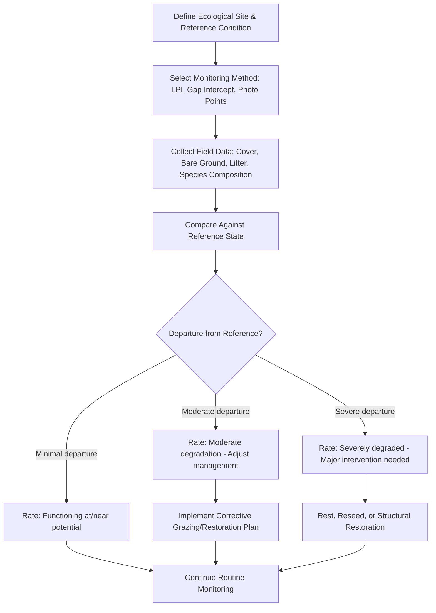

## Rangeland Monitoring and Health Assessment

### Overview

Rangeland monitoring is the systematic, repeated measurement of vegetation, soil, and site conditions over time to detect trends and inform management decisions. Rangeland health assessment is the evaluation of a site's current ecological function against its ecological potential, typically at a single point in time, by comparing observed indicators against an expected reference state for that site's soil and climate (ecological site). Together, these practices distinguish natural short-term fluctuation (e.g., drought-driven forage reduction) from genuine long-term degradation, and provide the evidence base for adaptive grazing and land management decisions.

### Core Concepts

#### Ecological Sites and Reference Conditions

An **ecological site** is a distinct kind of land with specific soil and physical characteristics that produces a characteristic native plant community and responds predictably to disturbance and management. Health assessment requires comparing a given site against its own reference condition (the plant community expected on that specific soil type and climate under natural disturbance regimes), rather than against a generic "healthy grassland" standard, since potential productivity and species composition vary substantially by site type.

#### Three Core Attributes of Rangeland Health

Rangeland health assessment frameworks (such as the U.S. Interagency Technical Reference approach) evaluate three interrelated attributes:

1. **Soil/site stability**: The capacity of the site to limit redistribution and loss of soil resources by wind and water
2. **Hydrologic function**: The capacity of the site to capture, store, and safely release precipitation
3. **Biotic integrity**: The capacity of the site to support characteristic functional and structural communities in the context of normal variability

### Monitoring vs. Assessment: Key Distinction

| Aspect | Monitoring | Assessment |
| --- | --- | --- |
| Timing | Repeated over time (trend) | Single point in time (status) |
| Purpose | Detect change/trend | Evaluate current condition against potential |
| Output | Time-series data | Qualitative/quantitative health rating |
| Typical Use | Adjusting ongoing grazing management | Land classification, baseline establishment |

### Key Vegetation Indicators

#### Species Composition

The relative abundance of different plant species/functional groups compared to the expected reference community. Shifts toward increaser species (opportunistic, often less palatable or shallow-rooted species that expand under grazing pressure) and away from decreaser species (palatable, productive climax species that decline under heavy grazing) signal degradation trends.

#### Basal and Canopy Cover

- **Basal cover**: The percentage of ground surface directly occupied by plant stem bases at ground level; a stable, sensitive indicator of long-term vegetation trend since it is less affected by short-term seasonal growth fluctuations than canopy cover
- **Canopy cover**: The percentage of ground surface shaded by plant foliage when viewed from above; more responsive to short-term seasonal and annual rainfall variation

#### Bare Ground and Litter Cover

Increasing bare ground and declining litter cover are primary indicators of reduced soil protection and impending erosion risk. Litter also serves functional roles in moisture retention and nutrient cycling, so declining litter often precedes visible soil loss.

#### Plant Vigor and Reproductive Capacity

Assessed through indicators such as: current year's growth relative to plant potential, presence/absence of flowering and seed set, root reserve indicators (where measurable), and evidence of decadence (excessive old, unproductive plant material) versus healthy age-class distribution within a stand.

### Key Soil Indicators

- **Soil surface structure**: Presence of surface crusting, compaction, or platy structure indicating reduced infiltration capacity
- **Rills and gullies**: Small to large erosional channels indicating active water erosion
- **Pedestals and terracettes**: Small soil pedestals formed around plant bases or rocks, indicating historical sheet/wind erosion
- **Soil surface resistance to erosion**: Often field-tested via aggregate stability tests (e.g., dropping soil aggregates into water and observing slaking behavior)
- **Compaction layer detection**: Assessed via penetrometer resistance or manual probing, indicating restricted root penetration and water infiltration

### Standard Field Monitoring Methods

#### Line-Point Intercept (LPI)

A transect line is laid across the monitoring site, and vegetation/ground cover type is recorded at systematic point intervals (e.g., every 0.5–1 m) using a vertical pin or laser point. This produces statistically robust estimates of canopy cover, basal cover, litter, and bare ground percentages, and is one of the most widely used quantitative rangeland monitoring methods due to its repeatability and relatively low observer bias.

$$Cover_i = \frac{n_i}{N} \times 100$$

Where $Cover_i$ is the percent cover of category $i$, $n_i$ is the number of intercept points recording category $i$, and $N$ is the total number of points sampled.

#### Gap Intercept

Measures the length of canopy gaps (bare ground/interspace between plant canopies) along a transect, used as an indicator of erosion susceptibility, since larger gaps between vegetation allow greater unimpeded wind and water erosive force across the soil surface.

#### Photo Point Monitoring

Fixed-location photographs taken repeatedly over time (same GPS point, same camera angle/height, ideally same season each year) provide a qualitative but highly valuable visual record of vegetation change, useful for communicating trend to stakeholders even where detailed quantitative data is unavailable.

#### Utilization Monitoring

Measures the proportion of current year's forage production that has been consumed or trampled by grazing animals, commonly via:

- **Height-weight method**: Comparing grazed plant height/weight to ungrazed reference plants of the same species
- **Ocular estimate by plot**: Trained observer visual estimation of utilization percentage across sample plots
- **Grazed plant/grazed class method**: Classifying individual plants into utilization classes (e.g., ungrazed, lightly grazed, moderately grazed, closely grazed)

#### Frequency and Density Sampling

- **Frequency**: The percentage of sample plots (quadrats) in which a species occurs, useful for detecting the presence/spread of specific species (including invasive species) over time
- **Density**: The number of individual plants of a species per unit area, useful for tracking establishment/recruitment success or decline of specific populations

### Illustration: Rangeland Health Assessment Workflow (svg_diagram)

### Remote Sensing and Technology-Assisted Monitoring

- **Normalized Difference Vegetation Index (NDVI)**: Satellite or drone-derived index using red and near-infrared reflectance to estimate vegetation greenness/vigor over large areas, useful for detecting broad productivity trends and drought stress across landscapes too large for exhaustive ground sampling
- **Unmanned aerial vehicles (UAVs/drones)**: Enable high-resolution imagery for cover estimation, gully/erosion mapping, and detecting vegetation change at finer spatial resolution than satellite platforms
- **GPS-referenced permanent monitoring plots**: Ensure repeated measurements occur at precisely the same location over years, critical for valid trend detection
- **GIS-based ecological site mapping**: Links field monitoring data to spatially explicit soil and ecological site classifications for landscape-scale management planning

*[Inference: the specific remote sensing platforms, resolution, and analytical tools available continue to evolve; current best-available regional tools and data products should be verified against up-to-date agricultural extension or rangeland science sources.]*

$$NDVI = \frac{NIR - Red}{NIR + Red}$$

Where $NIR$ and $Red$ are the reflectance values in the near-infrared and red spectral bands, respectively. Higher NDVI values generally correspond to greater live vegetation density and vigor, though interpretation requires accounting for soil background reflectance and seasonal phenology effects.

### Interpreting Monitoring Data: Trend vs. Natural Variability

A central challenge in rangeland monitoring is distinguishing genuine management-driven trend from natural year-to-year variability driven by rainfall fluctuation. Best practice generally involves:

- Monitoring over multiple years (ideally 5+ years) before drawing firm trend conclusions
- Comparing monitored sites against nearby reference/exclosure areas (ungrazed or lightly grazed control plots) to separate climate effects from grazing management effects
- Using standardized, repeatable methods and consistent timing (same season/phenological stage each year) to minimize confounding variation

### Indicators of Rangeland Health Categories

| Health Category | Vegetation Indicators | Soil Indicators |
| --- | --- | --- |
| **Functioning properly** | Composition near reference; good basal cover; healthy age-class diversity | Minimal bare ground; stable surface; low erosion evidence |
| **Functioning at risk** | Shift toward increasers; reduced litter; some decadence | Emerging rills/pedestals; increasing bare ground patches |
| **Non-functional / severely degraded** | Dominance by invasive or unpalatable species; sparse cover; poor reproduction | Active gullying; extensive bare ground; crusted/compacted surface |

### Applications to Management Decision-Making

Monitoring and assessment data directly inform:

- **Stocking rate adjustment**: Reducing stock numbers when utilization monitoring or cover trend indicates overuse
- **Grazing system modification**: Adjusting rest periods or rotation timing based on plant recovery indicators
- **Restoration prioritization**: Identifying which management units require active intervention (reseeding, erosion control structures) versus continued passive management
- **Drought response triggers**: Establishing pre-determined utilization or forage-availability thresholds that trigger destocking decisions before irreversible damage occurs
- **Regulatory and certification compliance**: Supporting land health reporting required under grazing permits, conservation programs, or sustainability certification schemes

### Common Pitfalls in Rangeland Monitoring

- Inconsistent transect placement or timing between years, undermining valid trend comparison
- Relying solely on qualitative visual impression without standardized quantitative methods, introducing observer bias
- Evaluating a site's condition against a generic "healthy grassland" ideal rather than its specific ecological site potential
- Monitoring too infrequently or abandoning long-term plots, losing the ability to detect meaningful trend versus noise
- Ignoring soil indicators in favor of vegetation-only assessment, potentially missing early erosion warning signs that precede visible vegetation decline

### **Next Steps**

- Ecological site descriptions and reference state models
- Grazing utilization monitoring techniques in practice
- Remote sensing applications in rangeland management
- Drought early-warning systems and destocking triggers
- Restoration techniques for degraded rangeland
- Soil erosion assessment and control structures
- Adaptive management frameworks in grazing systems
- Rangeland health regulatory and certification standards