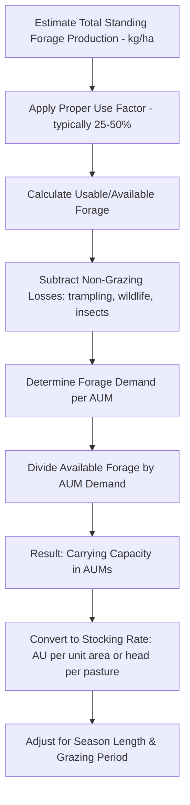

## Carrying Capacity Calculations

### Overview

Carrying capacity is the maximum stocking rate that a given area of land can sustain over a specified time period without causing long-term deterioration of vegetation, soil, or associated ecological resources. Carrying capacity calculations translate forage production estimates into practical animal numbers, forming the foundation for setting stocking rates, planning grazing rotations, and preventing overgrazing-driven rangeland degradation.

### Foundational Concepts and Units

#### Animal Unit (AU)

An **Animal Unit** is a standardized reference measure representing the forage consumption of one mature (approximately 450–500 kg) non-lactating beef cow, used to convert different livestock classes into a common comparable unit.

$$AU = \frac{Actual Body Weight (kg)}{454} \times AUE$$

Where $AUE$ (Animal Unit Equivalent) is a species/class-specific conversion factor.

| Livestock Class | Approximate AUE |
| --- | --- |
| Mature beef cow (dry, ~454 kg) | 1.0 |
| Beef cow with calf | 1.25–1.3 |
| Bull | 1.25–1.5 |
| Yearling cattle (270–360 kg) | 0.6–0.8 |
| Horse | 1.25 |
| Sheep (mature ewe) | 0.20 |
| Goat (mature) | 0.15–0.17 |

*[Inference: AUE values vary somewhat across regional guides and agencies (e.g., differing between USDA-NRCS, university extension, and international sources); the values above reflect commonly cited approximate ranges rather than a single universal standard, and lactation status, breed, and body condition further adjust actual intake.]*

#### Animal Unit Month (AUM)

An **Animal Unit Month** represents the amount of forage required to sustain one animal unit for one month, commonly used as the standard unit for expressing land carrying capacity and lease/permit stocking allocations.

$$AUM = AU \times Number\ of\ Months$$

### Core Carrying Capacity Formula

$$Carrying\ Capacity (AUM) = \frac{Available\ Forage\ (kg)}{Forage\ Demand\ per\ AUM\ (kg)}$$

A commonly used reference intake figure is approximately 350–360 kg of air-dry forage consumed per animal unit per month (based on a daily intake near 2.5–3% of body weight for a ~454 kg animal unit).

*[Inference: this per-AUM forage demand figure is a widely used planning approximation; actual intake varies with forage quality, animal physiological state, and environmental conditions, and localized extension guides should be consulted for precise regional figures.]*

### Step-by-Step Calculation Process

#### Step 1: Estimate Total Forage Production

Forage production per hectare/acre can be estimated via:

- **Clip-and-weigh sampling**: Physically clipping vegetation from known small plot areas (e.g., 0.25 m² quadrats), drying, and weighing, then extrapolating to a per-hectare basis
- **Comparative yield/visual estimation methods**: Trained observer comparison of standing forage against reference photo standards
- **Rising plate meter or pasture height correlation**: Using calibrated height-to-mass regression equations specific to the forage type
- **Remote sensing (NDVI-based biomass estimation)**: Increasingly used for large rangeland areas, calibrated against ground-truth clip samples

#### Step 2: Apply the Proper Use Factor (Harvest Efficiency)

Not all standing forage can be safely removed without harming plant vigor and future productivity. The **proper use factor** (also called harvest efficiency or utilization rate) represents the percentage of total forage production that can be grazed while leaving adequate residual for plant health, litter cover, and wildlife/other uses.

$$Available\ Forage = Total\ Production \times Proper\ Use\ Factor$$

| Range/Pasture Type | Typical Proper Use Factor |
| --- | --- |
| Continuously grazed rangeland | 25–35% |
| Rotationally grazed rangeland | 35–45% |
| Intensively managed improved pasture | 45–60% |
| Riparian/sensitive areas | 15–25% |

*[Inference: these ranges represent commonly cited rangeland management guidelines; the appropriate proper use factor for a specific site should be calibrated using local monitoring data, slope, and management intensity rather than applied as a fixed universal value.]*

#### Step 3: Account for Non-Grazing Losses

Additional deductions are sometimes applied for:

- Trampling and fouling losses (forage damaged or contaminated by dung/urine, reducing palatability)
- Wildlife and insect consumption where significant on the land unit
- Areas physically inaccessible to livestock (steep slopes, dense brush, distance from water)

#### Step 4: Convert to Stocking Rate

$$Stocking\ Rate (head) = \frac{Carrying\ Capacity (AUM)}{AUE \times Grazing\ Period (months)}$$

### Worked Example

**Scenario**: A 100-hectare pasture produces an estimated 2,500 kg/ha of air-dry forage annually. The site is rotationally grazed with a proper use factor of 40%. The operator plans to graze mature dry beef cows for a 6-month season.

1. **Total production**: $2,500 \text{ kg/ha} \times 100 \text{ ha} = 250{,}000 \text{ kg}$
2. **Available forage** (40% proper use): $250{,}000 \times 0.40 = 100{,}000 \text{ kg}$
3. **AUM demand per animal unit**: approximately 355 kg/AUM (reference value)
4. **Total carrying capacity**: $100{,}000 \div 355 \approx 282 \text{ AUMs}$
5. **Stocking rate for 6-month season**: $282 \text{ AUMs} \div 6 \text{ months} = 47 \text{ head}$ (at AUE = 1.0 for dry mature cows)

This means the pasture can sustainably support approximately 47 mature dry cows for a 6-month grazing season under the stated assumptions.

### Adjusting Carrying Capacity for Livestock Class Mix

When multiple livestock classes graze together, total demand is calculated by summing each class's AU contribution:

$$Total\ AUM\ Demand = \sum (N_i \times AUE_i \times Months_i)$$

**Example**: A herd of 30 cow-calf pairs (AUE 1.25) and 2 bulls (AUE 1.35) grazing for 5 months:

$$= (30 \times 1.25 \times 5) + (2 \times 1.35 \times 5) = 187.5 + 13.5 = 201 \text{ AUMs}$$

### Seasonal and Drought Adjustments

#### Seasonal Forage Variation

Carrying capacity is rarely constant year-round; forage growth is concentrated in specific growing-season periods, so stocking rate plans commonly incorporate:

- **Peak growing season allocation**: Higher stocking density supportable when growth rate is highest
- **Dormant/slow-growth season carryover**: Requires either stockpiled forage, reduced stocking, or supplemental feeding
- **Deferred grazing reserves**: Portions of range rested during the growing season to build a standing forage reserve for later use

#### Drought De-Stocking Triggers

Because forage production varies substantially with rainfall, static carrying capacity estimates calculated in an average or favorable year can significantly overstate sustainable stocking in drought years. Adaptive stocking approaches recommend:

- Setting a conservative base stocking rate calculated from below-average forage production years
- Maintaining a flexible portion of the herd (e.g., yearlings, cull animals) that can be sold or relocated quickly when forage monitoring indicates declining availability
- Establishing pre-determined utilization or forage-mass thresholds that trigger destocking decisions before root reserve depletion occurs

### Carrying Capacity in Different System Contexts

| System | Key Calculation Adjustment |
| --- | --- |
| Native rangeland | Lower proper use factor; ecological site potential drives baseline production estimate |
| Improved/sown pasture | Higher proper use factor; production estimates from field trial or regional agronomic data |
| Rotational grazing | Carrying capacity generally increases moderately relative to continuous grazing due to improved utilization efficiency and reduced selective overgrazing |
| Silvopastoral/agroforestry systems | Forage production estimate must account for canopy shading effects on understory forage yield |

*[Inference: the degree of carrying capacity increase attributable specifically to rotational grazing versus continuous grazing varies across studies and site conditions, and should not be assumed to apply uniformly across all environments.]*

### Common Errors in Carrying Capacity Calculations

- Using a single "average year" forage production figure without adjusting for drought or below-average years
- Applying a proper use factor appropriate for improved pasture to native rangeland, resulting in overestimated capacity
- Failing to account for inaccessible or lightly-used areas (steep slopes, areas far from water) in the total land area used for calculation
- Ignoring seasonal distribution of forage growth, leading to shortages during slow-growth periods despite adequate annual total production
- Neglecting to update calculations following significant vegetation change (e.g., after fire, drought, or brush encroachment)

### Practical Monitoring Feedback Loop

Carrying capacity estimates should not be treated as fixed values; they should be periodically validated and adjusted based on ongoing utilization monitoring, forage production sampling, and rangeland health assessment trends, since actual sustainable capacity can shift due to management history, climate variability, and site condition changes over time.

### **Next Steps**

- Forage production sampling and clip-and-weigh methodology
- Stocking rate adjustment strategies for drought
- Animal unit equivalent tables for diverse livestock species
- Rangeland monitoring and health assessment integration
- Rotational grazing system design based on carrying capacity
- Remote sensing for large-scale forage biomass estimation
- Economic implications of stocking rate decisions
- Silvopastoral system forage yield estimation