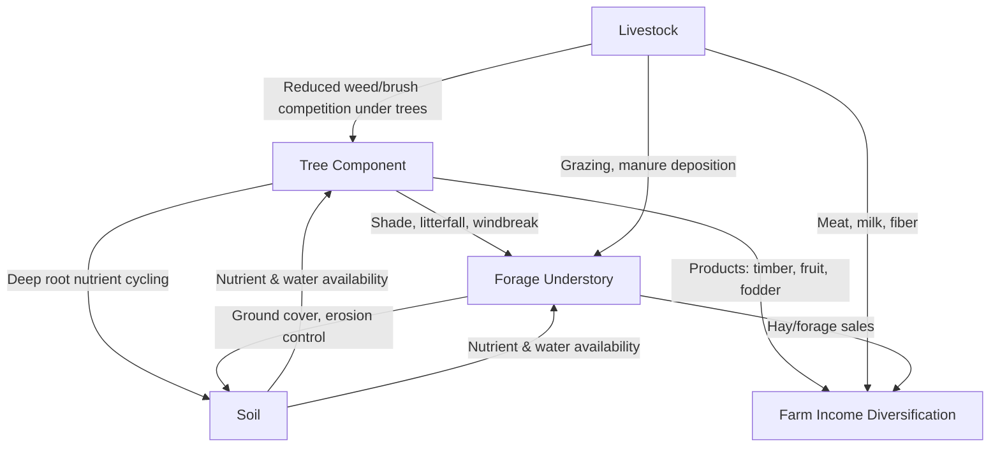

## Silvopasture and Agroforestry Integration

### Overview

Silvopasture is an agroforestry practice that deliberately integrates trees, forage, and livestock on the same land unit as a managed, interacting system, rather than treating trees and pasture as incidental or competing land uses. It is one of the most widely practiced agroforestry systems globally, combining the ecological functions of tree canopies (shade, windbreak, nutrient cycling, product diversification) with the forage and livestock production functions of pasture in a single spatial and temporal design.

### Distinguishing Silvopasture from Related Systems

| System | Defining Feature |
| --- | --- |
| Silvopasture | Deliberate integration of trees + forage + livestock as a managed system |
| Wooded pasture (incidental) | Trees present but not actively managed for tree-forage interaction |
| Alley cropping | Trees in rows with crops (not livestock) grown between them |
| Windbreak/shelterbelt alone | Trees planted primarily for wind protection, without integrated grazing design |
| Forest grazing (unmanaged) | Livestock allowed into closed-canopy forest without silvicultural management |

### Core Components and Design Principles

#### The Three-Way Interaction

Silvopasture design must balance interactions among three components simultaneously:

- **Trees**: Provide shade, timber/fruit/fodder products, windbreak, and root-driven nutrient cycling
- **Forage understory**: Provides grazing/hay production, ground cover, and erosion control
- **Livestock**: Provide grazing management (including vegetation control under trees) and generate direct production income

#### Tree Density and Canopy Management

Tree density and spacing critically determine understory light availability, which in turn determines viable forage species and yield:

$$Light\ Transmission (\%) \approx 100 - (Canopy\ Cover \% \times Shade\ Factor)$$

- **Low-density silvopasture** (widely spaced trees, ~50-150 trees/ha depending on species and system goals): Allows sun-loving ($C_4$/high-light) forage species to persist with minimal yield reduction
- **Moderate-density systems**: Requires shade-tolerant forage species selection as canopy closes
- **High-density/thinned forest conversion**: Substantial forage yield reduction unless understory species are selected specifically for shade tolerance

*[Inference: optimal tree density figures vary substantially by tree species, region, and management objective (timber vs. fodder vs. windbreak priority); the ranges given are illustrative rather than universal prescriptions.]*

### Benefits of Silvopasture Integration

#### Microclimate Modification

Tree shade reduces solar radiation load on grazing livestock, lowering heat stress and associated declines in feed intake, growth, and reproductive performance during hot periods — a particularly significant benefit in tropical and subtropical grazing systems where heat stress is a major production constraint.

#### Forage and Soil Interactions

- **Moderate shade effects on forage quality**: Some shade-tolerant forage species show improved crude protein content and reduced lignification under partial shade compared to full sun, though total forage biomass yield typically declines with increasing shade level
- **Nutrient cycling**: Deep tree root systems can access and cycle nutrients from soil depths beyond the reach of shallow-rooted pasture grasses, contributing organic matter via litterfall
- **Wind erosion reduction**: Tree rows/windbreaks reduce wind speed at ground level, decreasing soil moisture loss and wind erosion risk on exposed pastures

#### Animal Welfare and Production

Shade access has been associated in various studies with improved weight gain, milk production, and reproductive performance in livestock exposed to high ambient temperatures, compared to unshaded open pasture, particularly in $Bos\ taurus$ cattle breeds with lower inherent heat tolerance than $Bos\ indicus$ breeds. *[Inference: the magnitude of production benefit is climate- and breed-dependent, and results vary across published research.]*

#### Economic Diversification

- Timber, fruit, or nut production provides a secondary or long-term income stream alongside ongoing livestock revenue
- Fodder tree species (e.g., leucaena, gliricidia, moringa) can supplement grazed forage with high-protein browse, particularly valuable during dry-season forage scarcity
- Carbon sequestration potential may generate additional value through emerging carbon credit/payment-for-ecosystem-service programs

#### Environmental Services

- Enhanced habitat structure and biodiversity compared to open monoculture pasture
- Increased soil organic carbon storage from combined tree and grassland root systems
- Improved riparian buffer function when silvopasture is applied along waterways

### Common Silvopasture Design Configurations

- **Scattered/dispersed trees**: Individual trees or small clusters distributed across open pasture, often retained from original forest clearing or planted at wide spacing
- **Alley/row silvopasture**: Trees planted in parallel rows with forage alleys between them, facilitating easier grazing management and potential mechanized forage harvest between rows
- **Living fence/boundary tree lines**: Trees planted along paddock boundaries providing windbreak and browse access at paddock edges
- **Thinned forest conversion**: Existing forest selectively thinned to open the canopy sufficiently for forage establishment, retaining valuable timber trees
- **Fodder bank/cut-and-carry systems**: Dense fodder tree/shrub plantings managed for cut browse supply to livestock rather than direct grazing under the canopy

### Species Selection Considerations

#### Tree Species Selection Criteria

- **Canopy characteristics**: Light, filtered canopy (e.g., many leguminous trees) generally preferable to dense canopy for maintaining understory forage productivity
- **Root system depth**: Deep-rooted species reduce direct competition with shallow-rooted pasture grasses for surface soil moisture and nutrients
- **Nitrogen fixation capacity**: Leguminous tree species (e.g., *Leucaena leucocephala*, *Gliricidia sepium*, *Faidherbia albida*) contribute nitrogen to the system via symbiotic fixation
- **Livestock compatibility**: Freedom from toxicity to grazing livestock (some tree species/parts are toxic and must be excluded or managed with restricted access)
- **Palatability and browse value**: Trees selected partly for fodder integration should provide nutritious, palatable browse

#### Forage Species Selection for Shaded Conditions

Shade-tolerant forage species (e.g., certain *Brachiaria* species, some clover varieties, and select native shade-adapted grasses) are generally prioritized in moderate-to-high canopy density silvopasture designs, since standard full-sun pasture species often decline substantially in productivity under significant shade.

### Illustration: Silvopasture System Cross-Section (svg_diagram)

<svg xmlns="http://www.w3.org/2000/svg" viewBox="0 0 700 400" font-family="sans-serif">
<text x="350" y="25" font-size="16" text-anchor="middle" font-weight="bold">Silvopasture System Cross-Section (svg_diagram)</text>

<rect x="0" y="35" width="700" height="270" fill="#dbeeff" />

<circle cx="620" cy="70" r="25" fill="#f4a300" />

<rect x="0" y="305" width="700" height="60" fill="#8b6f47" />
<text x="10" y="390" font-size="10" fill="#333">Soil profile: shared root zones, nutrient cycling</text>

<rect x="0" y="295" width="700" height="15" fill="#7cb342" />

<g>
<rect x="95" y="200" width="10" height="100" fill="#6d4c41" />
<ellipse cx="100" cy="180" rx="55" ry="45" fill="#4a7c34" opacity="0.85" />
<text x="100" y="345" font-size="10" text-anchor="middle">Tree 1</text>
</g>
<g>
<rect x="345" y="190" width="10" height="110" fill="#6d4c41" />
<ellipse cx="350" cy="165" rx="60" ry="50" fill="#4a7c34" opacity="0.85" />
<text x="350" y="345" font-size="10" text-anchor="middle">Tree 2</text>
</g>
<g>
<rect x="565" y="205" width="10" height="95" fill="#6d4c41" />
<ellipse cx="570" cy="185" rx="50" ry="42" fill="#4a7c34" opacity="0.85" />
<text x="570" y="345" font-size="10" text-anchor="middle">Tree 3</text>
</g>

<ellipse cx="115" cy="303" rx="70" ry="10" fill="#333" opacity="0.15" />
<ellipse cx="370" cy="303" rx="80" ry="10" fill="#333" opacity="0.15" />
<ellipse cx="590" cy="303" rx="65" ry="10" fill="#333" opacity="0.15" />

<g>
<ellipse cx="230" cy="295" rx="28" ry="15" fill="#5c4632" />
<circle cx="255" cy="288" r="9" fill="#5c4632" />
<rect x="210" y="300" width="4" height="12" fill="#5c4632" />
<rect x="245" y="300" width="4" height="12" fill="#5c4632" />
</g>
<text x="230" y="325" font-size="10" text-anchor="middle">Grazing livestock</text>

<text x="500" y="290" font-size="10" text-anchor="middle" fill="`#2a5c1a`">Shade-tolerant forage understory</text>

<line x1="595" y1="85" x2="575" y2="145" stroke="#f4a300" stroke-width="2" stroke-dasharray="3,2" />
<text x="600" y="120" font-size="9" fill="#c07800">Filtered light</text>
</svg>

### Establishment Approaches

#### Planting Trees into Existing Pasture

- Requires temporary protective exclusion (individual tree shelters, temporary fencing) to prevent livestock browsing/trampling damage until trees are established beyond grazing damage risk height
- Slower to achieve functional canopy but avoids the forage production loss associated with thinning existing forest

#### Thinning Existing Forest/Woodland

- Selective removal of trees to reduce canopy density to a target light transmission level suitable for forage establishment
- Requires forage seeding/establishment under the newly opened canopy, following standard pasture establishment principles adapted for partial shade
- Retains mature, potentially valuable timber trees while creating grazing value from previously non-productive forest land

### Management Considerations

#### Grazing Management Adjustments

- **Rotational grazing recommended**: Continuous grazing risks livestock camping excessively under shade trees, causing localized soil compaction, nutrient concentration, and root damage near tree bases
- **Tree protection during establishment**: Young trees require physical protection (shelters, temporary exclusion fencing) from browsing and trampling until bark and root systems are established
- **Browse line management**: Where livestock have access to lower tree branches, monitoring for excessive browse damage to young or valuable trees is necessary

#### Long-Term Canopy Management

As trees mature and canopy density increases over years to decades, forage composition and productivity under the canopy will shift, requiring periodic reassessment of understory species suitability and potential selective thinning to maintain a functional forage-tree balance.

### Common Challenges and Trade-Offs

- **Establishment cost and time lag**: Tree establishment requires upfront investment and a multi-year period before trees provide significant shade/product benefit, during which protective measures add cost
- **Root and light competition**: Excessive tree density can suppress forage yield beyond acceptable levels if not carefully managed
- **Species toxicity risk**: Some tree species pose poisoning risk to livestock if leaves, bark, or seed pods are toxic and not adequately restricted from access
- **Equipment/mechanization constraints**: Tree presence can complicate mechanized haying or fertilizer application compared to open pasture
- **Knowledge and design complexity**: Silvopasture requires integrated knowledge of forestry, forage agronomy, and livestock management, representing a more complex management skill set than single-enterprise systems

### **Next Steps**

- Fodder tree species selection and cut-and-carry systems
- Shade-tolerant forage species for silvopasture understories
- Tree establishment and protection techniques in grazed systems
- Heat stress mitigation in livestock through shade management
- Carbon sequestration and payment-for-ecosystem-service programs in agroforestry
- Riparian buffer silvopasture applications
- Timber and fodder tree economic valuation in mixed systems
- Grazing management adaptations for tree-integrated pastures