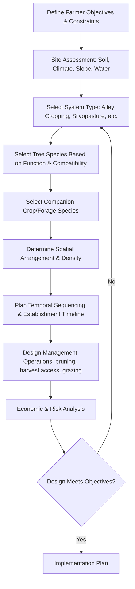

## Agroforestry System Design

### Overview

Agroforestry system design is the deliberate spatial and temporal arrangement of trees/shrubs with crops and/or livestock on the same land management unit to create beneficial ecological and economic interactions. Effective design requires balancing tree-crop-livestock competition and complementarity, matching system structure to farmer objectives (income diversification, soil conservation, product diversification), and adapting proven design templates to local site, climate, and market conditions.

### Core Design Objectives

Agroforestry systems are typically designed to achieve one or more of the following objectives, which directly shape structural decisions:

- **Productivity diversification**: Multiple products (timber, fruit, fodder, crops, livestock) from a single land unit
- **Soil conservation**: Erosion control, nutrient cycling, and soil structure improvement via tree root systems and litter input
- **Microclimate modification**: Windbreak effects, shade provision, temperature and humidity buffering
- **Biodiversity enhancement**: Habitat structure and species diversity beyond monoculture systems
- **Risk mitigation**: Reduced total-system vulnerability to market or climate shocks through enterprise diversification
- **Long-term capital accumulation**: Timber and tree crops as a standing financial asset alongside annual income streams

### Classification of Agroforestry Systems

#### By Structural Component

| System Type | Components | Primary Interaction |
| --- | --- | --- |
| Agrisilviculture | Trees + annual/perennial crops | Tree-crop competition/complementarity |
| Silvopasture | Trees + forage + livestock | Tree-forage-animal interaction |
| Agrosilvopasture | Trees + crops + forage + livestock | Full three-way integration |
| Multipurpose tree systems | Trees managed for multiple products (fodder, fruit, timber) with minimal understory management | Tree-centered, minimal crop interaction |

#### By Spatial Arrangement

- **Alley cropping**: Trees planted in widely spaced rows with crops grown in the alleys between rows
- **Boundary planting**: Trees planted along field or property boundaries, minimizing land area removed from primary crop/pasture use
- **Windbreaks/shelterbelts**: Linear tree plantings oriented perpendicular to prevailing wind direction to protect crops, livestock, or structures
- **Scattered/dispersed trees**: Individual trees or small clusters distributed across cropland or pasture at low density
- **Homegardens**: Dense, multi-story mixtures of trees, shrubs, and crops around homesteads, common in tropical smallholder systems
- **Riparian buffer systems**: Trees and shrubs planted along waterways for erosion control and water quality protection
- **Forest farming**: Cultivation of shade-tolerant crops (e.g., specialty mushrooms, medicinal plants) under a managed forest canopy

### Design Process Framework

### Spatial Design Parameters

#### Tree Row Spacing and Orientation

Row spacing determines the balance between tree density (for wood/product yield) and available light/space for the understory component.

- **North-south row orientation**: Generally maximizes light interception uniformity across the alley in most latitudes, an important consideration for light-demanding companion crops
- **East-west orientation**: Can create a persistent shaded strip on one side of the row, sometimes intentionally used to accommodate shade-tolerant crops on that side
- **Wider alley spacing** (e.g., 10–20+ m in alley cropping): Reduces competition, extends the period before shading significantly limits crop yield, but reduces total tree product volume per hectare
- **Narrower spacing**: Increases tree product yield per hectare but shortens the productive lifespan of the alley crop component before canopy closure

#### Tree Density and Light Competition

$$Relative\ Yield_{crop} = f(PAR_{transmitted}, Root\ Competition\ Zone)$$

Where crop yield under a tree canopy is a function of transmitted photosynthetically active radiation and the extent of below-ground root competition, both of which decline with proximity to the tree row.

Distance-dependent competition zones are typically modeled as:

- **Zone of high competition**: Within approximately 1–2 canopy radii of the tree row, where both light and root competition significantly reduce companion crop/forage yield
- **Zone of moderate competition**: Intermediate distance, where light competition may be reduced but root competition persists
- **Zone of minimal interaction**: Beyond the root and canopy influence radius, approaching sole-crop yield potential

*[Inference: precise competition zone distances are species- and site-specific, depending on tree root architecture, canopy shape, and soil type, and should be calibrated through local trial observation or regional agroforestry research where available.]*

### Vertical/Structural Stratification

Well-designed multi-story agroforestry systems (particularly homegardens and forest farming systems) stratify species by height and light requirement:

1. **Upper canopy**: Tall timber or large fruit trees (light-demanding, deep-rooted)
2. **Sub-canopy**: Medium-height fruit or fodder trees (moderate shade tolerance)
3. **Shrub layer**: Coffee, cacao, or shade-tolerant shrub crops
4. **Herbaceous/ground layer**: Shade-tolerant crops, forage, or ground cover species
5. **Root/underground layer**: Root and tuber crops occupying otherwise unused below-ground space

This stratification maximizes light capture efficiency across the vertical profile compared to a single-layer monoculture, analogous to natural forest canopy structure.

### Species Selection Criteria

#### Tree Component Selection

- **Growth habit compatibility**: Root depth and canopy density selected to minimize excessive competition with the intended companion crop/forage (e.g., deep-rooted, light-canopied species preferred for alley cropping with shallow-rooted annual crops)
- **Nitrogen fixation**: Leguminous trees (e.g., *Gliricidia sepium*, *Leucaena leucocephala*, *Faidherbia albida*, *Calliandra calothyrsus*) contribute biologically fixed nitrogen, often prioritized in soil-fertility-focused designs
- **Multipurpose value**: Species providing multiple products (timber + fodder + fruit) increase system resilience and total output value
- **Growth rate and rotation length**: Fast-growing species suit shorter-rotation fuelwood/fodder objectives; slow-growing, high-value timber species suit long-term capital accumulation objectives
- **Local ecological suitability**: Native or well-naturalized species generally present lower invasive risk and are better adapted to local pest/disease pressure than untested exotics

#### Companion Crop/Forage Selection

- **Shade tolerance**: Matched to the expected light environment at each stage of tree canopy development
- **Rooting depth complementarity**: Shallow-rooted companion crops paired with deep-rooted trees reduce direct below-ground resource competition
- **Phenological complementarity**: Crops with growth cycles timed to utilize resources during periods of lower tree demand (e.g., before full leaf-out in deciduous tree systems)

### Temporal Design: Succession and Rotation Planning

Agroforestry design must account for how the system changes over time as trees mature, since the tree-crop interaction changes substantially from establishment through canopy closure:

- **Early phase (establishment)**: Minimal tree canopy competition; full-sun crops/forage can be grown with minimal yield penalty
- **Intermediate phase**: Increasing shade and root competition begins to reduce yield of light-demanding companion species; may require transition to shade-tolerant alternatives
- **Mature phase**: Full canopy development; system may transition toward primarily tree-product focus (timber harvest, fodder banks) with reduced or eliminated intercropping, or shift to shade-tolerant crop/forage species long-term
- **Harvest/regeneration cycle**: For rotational timber components, felling and regeneration cycles must be planned to avoid abrupt loss of system function (e.g., staggered rather than clear-felling all trees simultaneously)

### Site-Specific Adaptations

#### Sloped/Erosion-Prone Land

Contour hedgerow/alley designs, where tree/shrub rows follow land contour lines rather than arbitrary grid patterns, are commonly used specifically to intercept surface runoff and reduce soil erosion on sloped land, with the added benefit of gradually forming natural terraces as sediment accumulates behind hedgerow lines over time.

#### Arid/Semi-Arid Regions

Wider tree spacing and drought-tolerant, often deep-rooted species selection (e.g., *Faidherbia albida*, which uniquely sheds leaves during the crop growing season, reducing competition with intercropped cereals in West African parkland systems) are typically prioritized to manage limited water availability.

#### Riparian Zones

Multi-species buffer strips combining fast-growing shrubs (immediate bank stabilization) with longer-term canopy trees (shade and habitat function) are typically designed in tiered zones extending outward from the waterbank, with width determined by local water quality regulations and erosion risk.

### Illustration: Alley Cropping Spatial Design (svg_diagram)

<svg xmlns="http://www.w3.org/2000/svg" viewBox="0 0 700 380" font-family="sans-serif">
<text x="350" y="25" font-size="16" text-anchor="middle" font-weight="bold">Alley Cropping Spatial Design (svg_diagram)</text>

<rect x="40" y="60" width="620" height="280" fill="#f0ead6" stroke="#999" />

<g>
<line x1="100" y1="60" x2="100" y2="340" stroke="#4a7c34" stroke-width="10" />
<text x="100" y="55" font-size="10" text-anchor="middle">Tree Row 1</text>
</g>
<g>
<line x1="350" y1="60" x2="350" y2="340" stroke="#4a7c34" stroke-width="10" />
<text x="350" y="55" font-size="10" text-anchor="middle">Tree Row 2</text>
</g>
<g>
<line x1="600" y1="60" x2="600" y2="340" stroke="#4a7c34" stroke-width="10" />
<text x="600" y="55" font-size="10" text-anchor="middle">Tree Row 3</text>
</g>

<rect x="105" y="60" width="35" height="280" fill="#4a7c34" opacity="0.25" />
<rect x="315" y="60" width="35" height="280" fill="#4a7c34" opacity="0.25" />
<rect x="565" y="60" width="35" height="280" fill="#4a7c34" opacity="0.25" />
<rect x="350" y="60" width="35" height="280" fill="#4a7c34" opacity="0.25" />
<rect x="600" y="60" width="35" height="280" fill="#4a7c34" opacity="0.25" />

<text x="122" y="200" font-size="8" text-anchor="middle" fill="`#2a5c1a`" transform="rotate(-90 122 200)">High competition zone</text>

<rect x="140" y="60" width="175" height="280" fill="#e8d99a" opacity="0.6" />
<text x="227" y="200" font-size="11" text-anchor="middle" fill="#7a5c00">Crop Alley (Zone of minimal interaction, center)</text>
<text x="227" y="220" font-size="9" text-anchor="middle" fill="#7a5c00">e.g. maize, legumes, forage</text>
<rect x="385" y="60" width="175" height="280" fill="#e8d99a" opacity="0.6" />
<text x="472" y="200" font-size="11" text-anchor="middle" fill="#7a5c00">Crop Alley 2</text>

<line x1="100" y1="350" x2="350" y2="350" stroke="#333" stroke-width="1" marker-start="url(#arrowL)" marker-end="url(#arrowR)" />
<text x="225" y="365" font-size="10" text-anchor="middle">Row spacing (e.g., 10-20 m)</text>
</svg>

### Economic and Risk Design Considerations

- **Enterprise budget integration**: Design should include a combined economic model accounting for staggered income timing (annual crop/forage income vs. long-term timber/fruit tree maturation)
- **Market access verification**: Product diversification is only economically beneficial if viable markets exist for each product; designing for products without accessible markets undermines the economic rationale
- **Labor requirement changes over time**: Labor needs shift as the system matures (e.g., initial establishment/protection labor vs. later pruning/harvest labor), requiring realistic long-term labor planning
- **Risk diversification value**: Multiple product streams can reduce total-system income volatility compared to monoculture, though this benefit should be weighed against the increased management complexity

### Common Design Pitfalls

- Underestimating long-term shading effects, leading to unexpected companion crop/forage decline as trees mature beyond the establishment phase
- Selecting tree species with aggressive, shallow, competitive root systems adjacent to shallow-rooted annual crops
- Ignoring mechanization/equipment access constraints created by tree row spacing incompatible with existing farm machinery
- Designing without a clear temporal management plan, resulting in an unmanaged transition as the system matures beyond its original design assumptions
- Selecting species based solely on ecological function without verifying market viability for the intended tree products

### **Next Steps**

- Alley cropping species pairing and spacing trials
- Windbreak and shelterbelt design specifications
- Homegarden and multi-story tropical agroforestry systems
- Riparian buffer design and regulatory requirements
- Tree-crop root competition and light interception modeling
- Agroforestry economic and enterprise budget analysis
- Contour hedgerow design for erosion control
- Nitrogen-fixing tree species selection guide