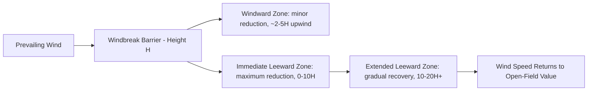

## Windbreaks and Shelterbelts

### Overview

Windbreaks (also called shelterbelts) are linear plantings of trees and/or shrubs designed and positioned to reduce wind speed and modify the microclimate over an adjacent protected area. They are one of the oldest and most widely adopted agroforestry practices, used to protect crops, livestock, soil, structures, and water resources from the damaging effects of wind, including erosion, mechanical crop damage, evapotranspiration stress, and animal cold/heat stress.

### Functional Classification

| Type | Primary Purpose |
| --- | --- |
| Field windbreak | Protects field crops from wind damage and desiccation |
| Farmstead windbreak | Shelters buildings, homes, and yards from wind and reduces heating energy demand |
| Livestock windbreak | Reduces cold stress and energy expenditure in exposed pasture/feedlot livestock |
| Living snow fence | Traps drifting snow away from roads, driveways, or livestock areas |
| Riparian/streambank windbreak | Combines wind protection with streambank stabilization and water quality buffering |
| Odor/dust barrier | Reduces particulate and odor drift from livestock or field operations toward neighboring properties |

### Aerodynamic Principles

#### Wind Speed Reduction Zones

A windbreak modifies airflow both upwind (windward) and downwind (leeward) of the barrier, with the protected zone typically measured in multiples of barrier height ($H$).

$$Protected\ Distance = n \times H$$

Where $n$ is a multiplier typically ranging from approximately 10–20 times barrier height on the leeward side for a well-designed, moderately dense windbreak, with the greatest wind speed reduction generally occurring within the first 5–10 $H$.

#### Porosity and Wind Flow Behavior

**Porosity** (the percentage of open space within the barrier cross-section, as opposed to solid vegetative material) is the single most important design variable controlling windbreak effectiveness and the character of turbulence produced.

- **Dense/low-porosity barriers** (<30% porosity): Produce a more pronounced wind speed reduction immediately behind the barrier but create greater turbulence and a shorter total protected distance due to increased eddy formation
- **Moderately porous barriers** (~40–60% porosity): Generally considered optimal for most agricultural applications, providing a good balance of wind speed reduction with reduced turbulence and a longer effective protected distance
- **Highly porous/sparse barriers** (>60% porosity): Provide only modest wind speed reduction but with minimal turbulence

*[Inference: exact optimal porosity ranges vary somewhat across published windbreak engineering studies and design guides depending on application (crop protection vs. snow control vs. livestock shelter); the 40-60% range is a commonly cited general agricultural design target.]*

### Design Parameters

#### Orientation

Windbreaks are most effective when oriented perpendicular (at or near 90°) to the prevailing damaging wind direction. In regions with variable wind direction across seasons, design may incorporate:

- A primary barrier oriented against the dominant erosive/damaging wind
- Perpendicular cross-barriers forming a partial grid pattern for multi-directional protection, particularly in open, wind-erosion-prone agricultural landscapes

#### Height

Windbreak height is the dominant factor determining the extent of the protected zone, since protected distance scales directly with barrier height (measured in multiples of $H$). Taller windbreaks, generally achieved using a combination of tree species with layered mature heights, protect a proportionally larger downwind area than shorter shrub-only barriers.

#### Length and Continuity

- Windbreaks should generally extend well beyond the area needing protection on both ends, since wind can flow around and re-accelerate at unprotected gaps or barrier ends
- Gaps in an otherwise continuous windbreak (e.g., for equipment access) create localized wind acceleration ("jetting") through the gap, which can be more damaging at that specific point than having no windbreak at all if not carefully positioned

#### Number of Rows and Species Layering

Multi-row designs typically layer species by mature height and growth form to create a graduated vertical profile from ground level to full canopy height:

1. **Shrub row(s)** (windward or leeward edge): Low-growing, dense shrubs providing ground-level porosity control and snow-trapping function
2. **Deciduous tree row(s)**: Medium-to-tall broadleaf trees providing the bulk of the wind-reducing canopy structure
3. **Conifer row(s)**: Often placed for year-round (evergreen) porosity control, particularly valuable in cold-climate designs where winter wind protection is a primary objective and deciduous trees would otherwise be leafless

### Species Selection Criteria

- **Growth rate**: Fast-growing species provide earlier functional benefit but may have shorter lifespans or weaker wood, sometimes combined with slower-growing, longer-lived species in a phased-replacement design strategy
- **Mature height and form**: Matched to the target protected zone distance and available planting width
- **Site adaptation**: Soil type, drought tolerance, and cold hardiness matched to local conditions
- **Root system characteristics**: Species with less aggressive lateral root systems are generally preferred near cropland edges to minimize competition with adjacent crops
- **Longevity and disease resistance**: Species vulnerable to regionally significant pests/diseases (e.g., historical widescale windbreak losses from Dutch elm disease or emerald ash borer in affected regions) should generally be avoided or diversified against to reduce catastrophic single-species-loss risk

### Benefits by Application

#### Crop Protection

- Reduced mechanical damage (lodging, leaf abrasion, sandblasting) to field crops from high wind events
- Reduced evapotranspiration rates in the protected zone, improving soil moisture retention and potentially crop yield in wind-exposed, moisture-limited environments
- Reduced wind erosion of exposed topsoil, particularly significant in semi-arid cropping regions historically prone to severe wind erosion events

#### Livestock Protection

Windbreaks reduce the wind chill effect experienced by livestock in open pasture or feedlot conditions, reducing maintenance energy requirements needed to sustain body temperature during cold, windy weather, and correspondingly reducing feed requirements and cold-stress-related production losses. In hot climates, strategically placed shade-producing windbreak trees can additionally reduce heat load, though this function overlaps more with silvopasture shade design than pure wind-reduction function.

#### Farmstead and Structure Protection

- Reduced heating energy demand for buildings sheltered from prevailing winter winds
- Reduced snow drift accumulation on driveways, roads, and building entrances when combined with living snow fence design principles
- Reduced wind-driven dust and debris around residential and working areas

#### Soil and Water Conservation

- Wind erosion control is one of the most significant historical drivers of windbreak adoption at scale, notably following large-scale soil loss events such as the North American Dust Bowl period, which prompted extensive government-supported shelterbelt planting programs
- Riparian windbreak/buffer combinations contribute to streambank stabilization and reduced sediment/nutrient runoff into waterways

### Illustration: Windbreak Wind-Speed Reduction Profile (svg_diagram)

<svg xmlns="http://www.w3.org/2000/svg" viewBox="0 0 700 380" font-family="sans-serif">
<text x="350" y="25" font-size="16" text-anchor="middle" font-weight="bold">Windbreak Wind Speed Reduction Profile (svg_diagram)</text>

<line x1="30" y1="320" x2="670" y2="320" stroke="#333" stroke-width="1.5" />

<rect x="230" y="150" width="10" height="170" fill="#4a7c34" />
<ellipse cx="235" cy="140" rx="30" ry="45" fill="#4a7c34" opacity="0.9" />
<ellipse cx="235" cy="180" rx="40" ry="55" fill="#5c9c40" opacity="0.75" />
<text x="235" y="345" font-size="10" text-anchor="middle">Windbreak (Height H)</text>

<line x1="200" y1="150" x2="200" y2="320" stroke="#999" stroke-width="1" stroke-dasharray="3,2" />
<text x="195" y="145" font-size="9" text-anchor="end">H</text>

<path d="M 40 260 C 150 260 190 260 220 250 C 250 200 280 300 340 305 C 420 310 500 290 600 265 C 630 260 650 258 660 258" stroke="`#e63946`" stroke-width="2.5" fill="none" />

<text x="60" y="245" font-size="9" fill="`#e63946`">Open-field wind speed</text>

<line x1="40" y1="260" x2="660" y2="260" stroke="#e63946" stroke-width="1" stroke-dasharray="2,2" opacity="0.5" />

<text x="130" y="300" font-size="9" text-anchor="middle">Windward zone</text>

<text x="130" y="312" font-size="8" text-anchor="middle">(minor reduction)</text>

<text x="290" y="335" font-size="9" text-anchor="middle">Immediate leeward</text>

<text x="290" y="348" font-size="8" text-anchor="middle">(max reduction, 0-10H)</text>

<text x="480" y="335" font-size="9" text-anchor="middle">Extended leeward zone (10-20H)</text>

<text x="480" y="348" font-size="8" text-anchor="middle">gradual wind speed recovery</text>

<line x1="50" y1="200" x2="90" y2="200" stroke="#1d3557" stroke-width="2" marker-end="url(#arrowW)" />
<text x="70" y="190" font-size="9" fill="#1d3557" text-anchor="middle">Wind</text>
</svg>

### Establishment and Site Preparation

- **Site preparation**: Weed/vegetation control along the planting line prior to establishment, since young trees/shrubs compete poorly with established grass or weed cover for moisture and nutrients
- **Setback distance from field/property boundary**: Sufficient distance planned to avoid future property line, drainage, or utility conflicts as the windbreak matures
- **Irrigation during establishment**: Often necessary in drier climates for the first 1-3 years until root systems are established
- **Weed barrier/mulch**: Commonly used around young plantings to reduce competition and moisture loss during establishment

### Maintenance Considerations

- **Pruning**: Some designs require periodic pruning of lower branches, particularly for windbreaks adjacent to roadways requiring sightline clearance, though excessive pruning reduces ground-level porosity control function
- **Renovation/replacement planning**: Aging or declining rows (from disease, senescence, or storm damage) should be identified for phased replacement before the windbreak's protective function is significantly compromised
- **Weed and pest management**: Ongoing control needed particularly during establishment years and periodically as the barrier matures
- **Fencing**: Livestock exclusion fencing often necessary to prevent browsing damage until the barrier is established, particularly relevant where windbreaks are adjacent to grazed pasture

### Common Design Pitfalls

- Excessively dense (low-porosity) single-species barriers, producing high turbulence and a shorter effective protected zone than a well-designed multi-row, moderate-porosity barrier
- Gaps for equipment access placed without consideration of wind-jetting effects, creating localized damage zones
- Single-species plantings vulnerable to catastrophic loss from a single pest or disease outbreak
- Insufficient setback from property boundaries or utility lines, causing conflicts as mature tree size is reached
- Underestimating establishment-period maintenance needs (weed competition, irrigation, browse protection), leading to poor survival rates

### Economic and Land-Use Trade-Offs

Windbreaks remove land from direct crop or forage production along the planted strip and can create some competition zone yield reduction in immediately adjacent cropland, but this is typically offset over time by reduced erosion losses, reduced crop damage from wind events, reduced livestock cold-stress feed costs, and (where applicable) direct products from the windbreak itself (fuelwood, timber, or fruit from multipurpose species selection). *[Inference: the specific economic payback period depends heavily on regional wind severity, crop value, and windbreak establishment cost, and should be evaluated with site-specific economic analysis.]*

### **Next Steps**

- Windbreak species selection by climate zone
- Living snow fence design specifications
- Riparian buffer and streambank stabilization design
- Wind erosion control practices in cropland
- Livestock cold stress mitigation strategies
- Windbreak renovation and phased replacement planning
- Agroforestry economic analysis for conservation plantings
- Multi-row shelterbelt establishment techniques