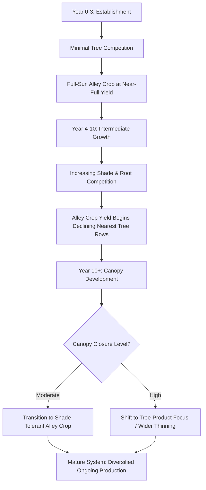

## Alley Cropping

### Overview

Alley cropping is an agroforestry practice in which trees or shrubs are planted in single or multiple rows, with agricultural crops cultivated in the alleys (open spaces) between the tree rows. The system is designed to generate income and ecological benefits from both the tree and crop components simultaneously on the same land unit, distinguishing it from windbreaks (which primarily protect an adjacent area rather than intercrop within the barrier itself) and from silvopasture (which pairs trees with grazed forage/livestock rather than cultivated crops).

### Core Design Rationale

Alley cropping is built on the principle of temporal and spatial resource-use complementarity: during the early years after tree establishment, minimal canopy competition allows near-full-yield cropping in the alleys, generating short-term income while the tree component matures toward its own long-term product value (timber, fruit, nuts). As trees mature, the system's balance of products shifts, requiring either transition to shade-tolerant alley crops or eventual conversion toward primarily tree-product focus.

### Spatial Design Parameters

#### Row Orientation

- **North-south orientation**: Generally provides the most uniform light distribution across the alley width throughout the day, an important consideration for maximizing light-demanding crop yield across the full alley
- **East-west orientation**: Creates a persistent shaded strip on one side of each row for a larger portion of the day; sometimes deliberately used where a shade-tolerant secondary crop is planned adjacent to the tree row while a light-demanding crop occupies the sunnier portion of the alley

#### Row Spacing

Alley width is a central design trade-off between tree product yield per unit area and the duration/quality of the intercropping period:

| Alley Width | Effect on System |
| --- | --- |
| Narrow (e.g., 4–8 m) | Higher tree density and product yield; shorter productive intercropping window before shading dominates |
| Moderate (e.g., 8–15 m) | Balanced compromise commonly used in temperate timber-alley systems |
| Wide (e.g., 15–25+ m) | Extended intercropping period and easier mechanization; lower total tree product yield per hectare |

*[Inference: optimal spacing is highly dependent on tree species canopy architecture, mature height, intended tree rotation length, and companion crop light requirements; the ranges above reflect commonly cited general design guidance rather than a fixed universal standard.]*

#### Mechanization Compatibility

Alley width and row spacing should be planned to accommodate the turning radius and working width of existing farm equipment, since a design that is ecologically sound but incompatible with available machinery significantly increases labor costs and reduces practical adoption viability.

### Tree Component Selection

Trees selected for alley cropping systems are typically evaluated against criteria distinct from pure timber plantations, prioritizing traits that minimize interference with the alley crop:

- **Deep, non-competitive rooting habit**: Species with deep taproots or root systems that occupy soil strata below the primary crop rooting zone reduce below-ground competition for water and nutrients
- **Open, filtered canopy architecture**: Light-transmitting canopy form (common in many leguminous species) preserves more usable light for the alley crop compared to dense, closed-canopy species
- **Deciduous phenology advantages**: Species that leaf out later or shed leaves earlier relative to the crop's peak growing period reduce the overlap window of maximum shading during the crop's critical growth stages
- **High-value product potential**: Timber species selected for veneer/furniture-grade wood, nut trees (walnut, pecan), or fruit trees provide substantial long-term or annual product value justifying the land allocated to tree rows

### Notable Examples and Regional Applications

- **Temperate hardwood-alley systems**: Combining valuable hardwood species (e.g., black walnut, oak) with annual grain crops or forage in the alleys during the tree establishment and early growth decades, common in North American and European temperate agroforestry research and adoption
- **Tropical parkland systems**: Traditional systems such as those built around *Faidherbia albida* in West African agriculture exploit the species' unusual "reverse phenology" (leafing out during the dry season and shedding leaves during the wet/cropping season), minimizing shading competition with intercropped cereals during their critical growth period
- **Fodder-tree alley cropping**: Leguminous fodder shrubs (e.g., *Leucaena leucocephala*, *Calliandra calothyrsus*) planted in alleys with food crops, periodically pruned/cut back (hedgerow intercropping) to control shading and provide cut-and-carry fodder or green manure mulch

### Hedgerow Intercropping (Managed Alley Cropping Variant)

A specific alley cropping variant using fast-growing, coppicing shrub/tree hedgerows that are periodically cut back (pruned) during the crop growing season to control shade and root competition, with the cut biomass often applied directly to the alley as green manure/mulch:

- **Pruning timing**: Coordinated with crop planting and critical growth stages to minimize shading precisely when the crop is most light-sensitive
- **Biomass/nutrient contribution**: Regularly pruned leguminous hedgerow biomass can contribute meaningful nitrogen and organic matter input to the alley crop, particularly valuable in low-external-input smallholder systems
- **Labor intensity**: Requires more frequent management (pruning several times per growing season) compared to wider-spaced, unmanaged timber-alley systems

### Crop Selection for Alley Cropping

- **Early-phase crops**: Full-sun annual grains, vegetables, or forage suited to minimal shade conditions during the tree establishment years
- **Intermediate-phase crops**: Moderately shade-tolerant species selected as canopy density increases
- **Mature-phase crops**: Shade-tolerant perennial or specialty crops (e.g., certain forage species, shade-grown specialty crops) suited to the eventual light environment under a closed or partially closed canopy

### Ecological and Agronomic Benefits

- **Nutrient cycling**: Deep tree roots can access and recycle nutrients from below the primary crop rooting depth, with litterfall/pruning residue returning organic matter and nutrients to the alley soil surface
- **Microclimate moderation**: Reduced wind speed and evapotranspiration within alleys compared to open cropland, particularly beneficial in wind-erosion-prone or moisture-limited environments
- **Soil erosion control**: Tree root systems and any pruned mulch/residue contribute to improved soil structure and reduced surface erosion compared to sole cropping
- **Biodiversity enhancement**: Structural diversity supports greater habitat value than monoculture cropland, potentially benefiting beneficial insect and pollinator populations
- **Income diversification and risk spreading**: Combines shorter-term annual crop income with longer-term tree product value, reducing total-system vulnerability to single-market or single-crop price shocks

### Illustration: Alley Cropping Light and Competition Gradient (svg_diagram)

<svg xmlns="http://www.w3.org/2000/svg" viewBox="0 0 700 340" font-family="sans-serif">
<text x="350" y="25" font-size="16" text-anchor="middle" font-weight="bold">Alley Cropping: Light &amp; Root Competition Gradient (svg_diagram)</text>

<rect x="60" y="60" width="14" height="220" fill="#4a7c34" />
<ellipse cx="67" cy="55" rx="35" ry="30" fill="#5c9c40" />
<text x="67" y="300" font-size="10" text-anchor="middle">Tree Row A</text>
<rect x="626" y="60" width="14" height="220" fill="#4a7c34" />
<ellipse cx="633" cy="55" rx="35" ry="30" fill="#5c9c40" />
<text x="633" y="300" font-size="10" text-anchor="middle">Tree Row B</text>

<text x="350" y="55" font-size="11" text-anchor="middle" font-weight="bold">Alley (Crop Zone)</text>

<rect x="90" y="150" width="40" height="80" fill="#c0392b" opacity="0.7" />
<rect x="140" y="170" width="40" height="60" fill="#e07b39" opacity="0.7" />
<rect x="190" y="195" width="40" height="35" fill="#f2c14e" opacity="0.7" />
<rect x="240" y="215" width="40" height="15" fill="#a3d977" opacity="0.7" />
<rect x="290" y="220" width="120" height="10" fill="#4a9c3f" opacity="0.7" />
<rect x="410" y="215" width="40" height="15" fill="#a3d977" opacity="0.7" />
<rect x="460" y="195" width="40" height="35" fill="#f2c14e" opacity="0.7" />
<rect x="510" y="170" width="40" height="60" fill="#e07b39" opacity="0.7" />
<rect x="560" y="150" width="40" height="80" fill="#c0392b" opacity="0.7" />
<line x1="60" y1="230" x2="640" y2="230" stroke="#333" stroke-width="1" />
<text x="110" y="245" font-size="8" text-anchor="middle">High</text>
<text x="350" y="245" font-size="8" text-anchor="middle">Minimal competition</text>
<text x="580" y="245" font-size="8" text-anchor="middle">High</text>
<text x="350" y="260" font-size="9" text-anchor="middle" font-style="italic">Competition intensity (light + root) by distance from tree row</text>
</svg>

### Management Over Time

#### Canopy Management

- **Selective pruning**: Timber-alley systems may prune lower branches to improve crop light access and future timber quality (knot-free lower log sections)
- **Root pruning**: In some systems, periodic mechanical root pruning along the tree row is used to physically limit lateral root encroachment into the crop alley, reducing below-ground competition
- **Thinning**: As trees mature and canopy closes, selective removal of some trees can restore adequate light for continued intercropping, while yielding early timber/fuelwood product

#### Harvest and Rotation Planning

Tree rows planned for eventual timber harvest require rotation and replacement planning to avoid a total, abrupt loss of the tree component and its associated benefits at a single harvest event; staggered or partial-row harvest approaches are commonly used to maintain continuous system function.

### Common Design and Management Challenges

- Underestimating the rate of canopy closure, resulting in unplanned, abrupt alley crop yield decline before a shade-tolerant transition crop or thinning plan is in place
- Selecting tree species with aggressive, shallow lateral roots that compete heavily with adjacent crop root zones
- Row spacing incompatible with available farm equipment, increasing labor costs and reducing practical management feasibility
- Neglecting long-term rotation/harvest planning for the tree component, leading to disruptive whole-system change at final harvest
- Underestimating the establishment-period investment (tree planting, protection, potential reduced yield in immediate tree-row-adjacent crop area) relative to short-term financial return expectations

### **Next Steps**

- Hedgerow intercropping and biomass transfer systems
- Tree species selection for timber-alley systems
- Shade-tolerant crop varieties for maturing alley systems
- Root pruning and canopy management techniques
- Faidherbia albida parkland systems and reverse phenology species
- Agroforestry economic modeling across establishment to maturity
- Mechanization planning for alley cropping row spacing
- Nitrogen cycling from leguminous hedgerow systems