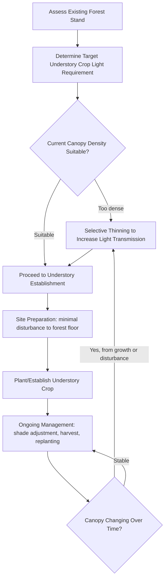

## Forest Farming

### Overview

Forest farming is an agroforestry practice involving the deliberate cultivation of shade-tolerant food, medicinal, ornamental, or specialty crops under a managed forest canopy, using the forest overstory as an integral production input rather than merely an incidental backdrop. Unlike simple non-timber forest product (NTFP) gathering from unmanaged wild stands, forest farming involves active silvicultural management of the canopy alongside deliberate planting, tending, and harvest of the understory crop, making it a distinct discipline from both conventional forestry and open-field agriculture.

### Distinguishing Forest Farming from Related Practices

| Practice | Canopy Management | Understory Crop Origin | Primary Intent |
| --- | --- | --- | --- |
| Forest farming | Actively managed for understory light/conditions | Deliberately planted/cultivated | Integrated overstory + understory production |
| Wild harvesting/gathering | Unmanaged | Naturally occurring, wild | Extraction only, no cultivation |
| Wildcrafting with stewardship | Minimal management | Wild, but harvested sustainably | Conservation-oriented extraction |
| Conventional forestry | Managed for timber | None (or incidental) | Timber/wood product only |
| Silvopasture | Managed for forage/livestock | Forage species (grazed) | Livestock + tree integration |

### Core Design Principle: Canopy as a Production Input

The defining feature of forest farming is that overstory canopy density, structure, and species composition are deliberately managed to create the specific light, temperature, and humidity conditions required by the target understory crop, rather than treating the forest as a fixed, unmodifiable given.

$$Understory\ PAR = Incident\ PAR \times (1 - Canopy\ Interception\ Fraction)$$

Where $PAR$ is photosynthetically active radiation and canopy interception fraction depends on species composition, stand density, and seasonal leaf phenology (particularly relevant in deciduous forest systems where light availability varies substantially through the year).

### Common Forest Farming Products

#### Medicinal and Botanical Crops

- **American ginseng (*Panax quinquefolius*)**: One of the most economically significant forest-farmed medicinal crops in North America, requiring deep shade (typically 70-80% shade) and specific hardwood forest soil conditions; wild-simulated and woods-cultivated production methods both fall under forest farming when deliberately planted and managed
- **Goldenseal (*Hydrastis canadensis*)**: Shade-requiring medicinal understory species with market demand for root material
- **Black cohosh, bloodroot, and other native woodland medicinals**: Various additional shade-tolerant medicinal species cultivated under similar forest farming principles

#### Edible and Culinary Products

- **Specialty mushrooms**: Shiitake, oyster, and other log-grown or forest-floor-cultivated mushroom species represent one of the most widely adopted forest farming enterprises, using inoculated hardwood logs or forest floor beds under natural canopy shade
- **Ramps (wild leeks)**: Shade-tolerant native allium increasingly cultivated under forest farming management due to wild population overharvesting concerns
- **Maple syrup production**: Sugar maple tapping represents a long-established forest farming practice combining forest stand management with a distinct annual product harvest
- **Pawpaw and other native forest fruit species**: Understory fruit trees adapted to partial shade conditions

#### Ornamental and Floral Products

- **Woodland florals and greenery**: Ferns, galax, and other decorative foliage harvested for floral industry use
- **Native woodland ornamental plants**: Nursery production of shade-adapted native species for landscaping markets

### Canopy Management for Forest Farming

#### Thinning and Stand Density Control

Selective thinning of the overstory canopy is often necessary to achieve target light transmission levels for the intended understory crop, requiring silvicultural knowledge of which trees to retain (based on species, health, spacing, and future timber value) versus remove:

- **Light thinning**: Modest canopy opening suited to deep-shade crops (e.g., ginseng)
- **Moderate thinning**: Greater light transmission suited to partial-shade crops
- **Understory removal without overstory thinning**: In some systems, existing understory brush/vegetation is cleared to make room for the target crop while retaining the overstory canopy largely intact

#### Species Composition Considerations

- Deciduous versus evergreen overstory composition significantly affects seasonal light availability patterns, with deciduous canopies providing markedly more light during dormant/leafless periods
- Overstory species with historically valuable timber potential may warrant longer-term retention and management planning distinct from purely light-management decisions
- Some overstory tree species produce leaf litter or root exudates that affect soil chemistry in ways that influence understory crop suitability (e.g., certain understory medicinal species have documented associations with specific overstory forest types)

### Site Assessment for Forest Farming

- **Existing canopy density and species composition**: Determines baseline light environment and thinning needs
- **Soil characteristics**: pH, drainage, and organic matter content matched to the specific understory crop's requirements (e.g., ginseng requires well-drained, calcium-rich hardwood forest soils)
- **Slope and aspect**: North-facing slopes in temperate regions generally provide cooler, moister conditions often favorable to many woodland medicinal and mushroom crops
- **Existing understory vegetation**: Competing native vegetation may need partial clearing, while some native ground layer species can indicate suitable soil/moisture conditions for target crops
- **Access and terrain**: Harvest logistics for typically labor-intensive forest farming products should be considered in site selection

### Illustration: Forest Farming Stratified Production System (svg_diagram)

<svg xmlns="http://www.w3.org/2000/svg" viewBox="0 0 700 420" font-family="sans-serif">
<text x="350" y="25" font-size="16" text-anchor="middle" font-weight="bold">Forest Farming Stratified Production System (svg_diagram)</text>

<rect x="0" y="35" width="700" height="120" fill="#dbeeff" />

<ellipse cx="120" cy="90" rx="90" ry="55" fill="#4a7c34" opacity="0.75" />
<ellipse cx="350" cy="80" rx="100" ry="60" fill="#4a7c34" opacity="0.75" />
<ellipse cx="580" cy="90" rx="90" ry="55" fill="#4a7c34" opacity="0.75" />
<text x="350" y="35" font-size="11" text-anchor="middle" font-weight="bold">Managed Overstory Canopy (thinned for target light level)</text>

<rect x="115" y="140" width="10" height="120" fill="#6d4c41" />
<rect x="345" y="135" width="10" height="125" fill="#6d4c41" />
<rect x="575" y="140" width="10" height="120" fill="#6d4c41" />

<line x1="200" y1="60" x2="230" y2="200" stroke="#f4c542" stroke-width="2" stroke-dasharray="3,3" opacity="0.7" />
<line x1="450" y1="55" x2="420" y2="200" stroke="#f4c542" stroke-width="2" stroke-dasharray="3,3" opacity="0.7" />

<rect x="0" y="260" width="700" height="30" fill="#c8e6a0" opacity="0.6" />
<text x="350" y="280" font-size="10" text-anchor="middle">Shrub/sub-canopy layer (e.g., pawpaw, understory shrubs)</text>

<rect x="0" y="290" width="700" height="70" fill="#e8dcc0" />
<ellipse cx="180" cy="315" rx="18" ry="8" fill="#3a6e2a" />
<text x="180" y="335" font-size="9" text-anchor="middle">Ginseng/goldenseal</text>
<ellipse cx="350" cy="315" rx="18" ry="8" fill="#8b5e3c" />
<text x="350" y="335" font-size="9" text-anchor="middle">Mushroom logs</text>
<ellipse cx="520" cy="315" rx="18" ry="8" fill="#4a8f3a" />
<text x="520" y="335" font-size="9" text-anchor="middle">Ramps/native florals</text>

<text x="350" y="380" font-size="10" text-anchor="middle" font-style="italic">Forest floor: minimal soil disturbance, understory cultivation zone</text>

</svg>

### Establishment Methods

#### Wild-Simulated Planting

Seeds or rootstock planted directly into the natural forest floor with minimal site disturbance, mimicking natural regeneration patterns as closely as possible; typically slower to reach harvestable maturity but often commands premium market value (particularly relevant for wild-simulated ginseng) due to closer resemblance to wild-harvested product in root morphology and perceived quality.

#### Woods-Cultivated Planting

More intensive bed preparation and management within the forest setting (raised beds, soil amendment, closer plant spacing) than wild-simulated methods, generally achieving faster growth and higher yield per unit area, but with correspondingly higher establishment labor/input cost and potentially lower per-unit market value for products where "wild" characteristics command a premium.

#### Log-Based Cultivation (Mushrooms)

Freshly cut hardwood logs (species-specific, e.g., oak for shiitake) are inoculated with fungal spawn and stacked or laid in a shaded forest environment, requiring periodic management (soaking/"shocking" logs to trigger fruiting, monitoring moisture) over a multi-year productive log lifespan before eventual log decomposition and replacement.

### Market and Economic Considerations

- **Long production timelines**: Many forest farming products, particularly medicinal roots like ginseng, require multiple years (often 5-10+ years for wild-simulated ginseng) before first harvest, requiring patient capital and long-term land tenure security
- **Premium/niche market positioning**: Forest-farmed products often access specialty, health food, or export markets (particularly for medicinal herbs with export demand) at premium prices compared to conventional agricultural commodities, though market size and price stability can be more volatile than established commodity markets
- **Certification and traceability**: Some markets increasingly demand certification (organic, forest-grown verification programs) distinguishing cultivated forest-farmed product from wild-harvested material, relevant to both market access and wild population conservation concerns
- **Diversified income timing**: Combining faster-return products (mushroom logs, annual florals) with slower-return products (medicinal roots) can help balance cash flow during the establishment period of longer-term crops

### Conservation and Sustainability Considerations

Forest farming is often promoted specifically as an alternative to unsustainable wild-harvesting pressure on native forest species (such as American ginseng and ramps), some of which face population decline concerns in parts of their native range due to overharvesting; deliberate cultivation under forest farming management can reduce wild-harvest pressure while still generating income from forest-based, non-timber products. *[Inference: the extent to which forest farming adoption measurably reduces wild-harvest pressure at a landscape scale depends on market dynamics and regional adoption rates, and results vary by species and region.]*

### Common Challenges in Forest Farming

- Long time-to-first-harvest for high-value medicinal crops, creating financial planning challenges for new producers
- Canopy changes over time (storm damage, tree mortality, natural succession) can unpredictably alter the light environment established for a given understory crop, requiring ongoing monitoring and adaptive thinning
- Theft/poaching risk for high-value products like wild-simulated ginseng, given the difficulty of continuously monitoring dispersed forest plantings
- Limited mechanization potential due to terrain and the need to preserve forest floor conditions, making most forest farming systems labor-intensive
- Market volatility and price fluctuation for niche specialty products, particularly those with export-dependent demand

### **Next Steps**

- American ginseng cultivation methods and market dynamics
- Shiitake and specialty mushroom log cultivation techniques
- Non-timber forest product (NTFP) certification and market access
- Silvicultural thinning techniques for understory light management
- Maple syrup production and sugarbush management
- Sustainable wild-harvest alternatives and conservation programs
- Forest soil and site assessment for medicinal crop suitability
- Value-added processing for forest-farmed specialty products