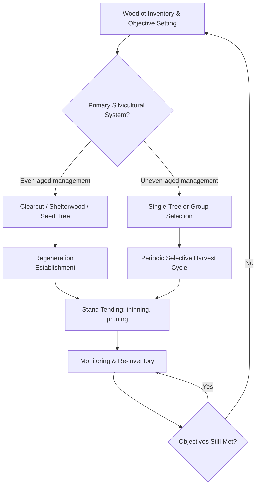

## Woodlot Management

### Overview

Woodlot management is the planned, ongoing stewardship of a small-to-moderate-sized forested land parcel — typically owned or managed alongside agricultural land — to achieve landowner objectives such as sustained timber and fuelwood production, wildlife habitat, soil and water protection, and integration with farm income and operations. Unlike large-scale industrial forestry, woodlot management is characteristically practiced at the farm or smallholder scale, often balancing multiple objectives simultaneously rather than optimizing for a single commercial output.

### Core Objectives of Woodlot Management

- **Sustained timber/fuelwood yield**: Ongoing harvest of wood products at a rate the stand can regenerate, avoiding depletion of the growing stock over time
- **Farm income diversification**: Periodic timber sales, fuelwood, and non-timber forest products supplementing primary agricultural income
- **Soil and water protection**: Erosion control, watershed protection, and riparian buffer function where the woodlot borders waterways or steep terrain
- **Wildlife habitat**: Maintaining or enhancing habitat structure for game and non-game species, relevant both for conservation objectives and recreational/hunting lease income in some regions
- **Aesthetic and recreational value**: Maintaining woodland character for recreational use, hunting, or general property enjoyment
- **Farm infrastructure support**: On-farm fuelwood supply, fence post material, and windbreak/shelterbelt tree stock

### Woodlot Inventory and Assessment

#### Stand Inventory

A baseline inventory establishes the foundation for management planning, typically recording:

- **Species composition**: Relative abundance of tree species present, informing both ecological assessment and market value potential
- **Diameter at breast height (DBH)** distribution: Measured at 1.3–1.4 m above ground, used to estimate volume, growth rate, and stand age structure
- **Stand density**: Trees per unit area, often expressed as basal area (total cross-sectional area of tree stems at breast height per hectare)
- **Stand health**: Presence of disease, insect damage, storm damage, or invasive species pressure
- **Regeneration status**: Presence and adequacy of young trees/seedlings to replace the current overstory over time

$$Basal\ Area\ (m^2/ha) = \sum \left( \pi \times \left(\frac{DBH}{200}\right)^2 \right) \times \frac{10{,}000}{Plot\ Area\ (m^2)}$$

Where $DBH$ is measured in centimeters, converted to radius in meters for the area calculation, and scaled to a per-hectare basis from sample plot measurements.

#### Growth and Yield Estimation

$$MAI = \frac{Total\ Standing\ Volume}{Stand\ Age}$$

Where $MAI$ (Mean Annual Increment) estimates the average annual volume growth rate of the stand, used alongside current annual increment (the growth rate in the most recent year) to help determine optimal harvest timing and identify whether a stand is still in an actively growing phase or has reached a growth plateau warranting harvest consideration.

### Silvicultural Systems for Woodlot Management

#### Even-Aged Management Systems

- **Clearcutting**: Complete or near-complete removal of the overstory in a defined area, followed by natural or planted regeneration; produces a single-age stand, generally most applicable to shade-intolerant species requiring full sunlight for regeneration, but with greater visual, erosion, and wildlife habitat disruption impact than partial-harvest systems
- **Shelterwood system**: Overstory removed in a series of partial cuts over time, retaining some mature trees to provide seed source and partial shade for establishing regeneration before final overstory removal
- **Seed tree system**: Most of the stand harvested, retaining a small number of scattered mature trees specifically to provide seed source for natural regeneration, with these seed trees typically removed once regeneration is established

#### Uneven-Aged Management Systems

- **Single-tree selection**: Individual mature or defective trees are periodically harvested throughout the stand, maintaining a continuous multi-age, multi-size canopy structure; well-suited to shade-tolerant species and landowners prioritizing continuous forest cover and habitat structure
- **Group selection**: Small clusters/groups of trees are harvested together, creating small canopy gaps that can support regeneration of species with intermediate shade tolerance while maintaining overall uneven-aged stand structure at the landscape level

#### Choosing Between Systems

| Factor | Favors Even-Aged | Favors Uneven-Aged |
| --- | --- | --- |
| Regenerating species shade tolerance | Shade-intolerant | Shade-tolerant |
| Aesthetic/continuous cover priority | Lower priority | Higher priority |
| Wildlife habitat structural diversity goal | Lower priority (post-harvest) | Higher priority |
| Harvest logistics/equipment access | Often simpler | Can be more complex (selective marking/removal) |
| Erosion sensitivity of site | Higher risk if clearcut | Lower disturbance risk |

### Stand Tending Practices

#### Thinning

Removal of selected trees from a stand before final harvest to concentrate growth potential (light, water, nutrients) on the remaining, typically higher-quality or higher-value trees:

- **Thinning from below**: Removes smaller, suppressed, or poorly-formed trees, favoring dominant and co-dominant crop trees
- **Crop tree release**: Identifies specific high-value future crop trees and removes competing neighbors to accelerate their growth and quality development
- **Timing**: Generally most effective when applied before significant competition-induced growth stagnation occurs, though timing varies by species and stand density history

#### Pruning

Removal of lower branches from selected crop trees to promote clear, knot-free lower log sections, increasing future timber value (particularly relevant for high-value veneer or furniture-grade timber objectives); typically applied to a limited number of selected crop trees rather than the entire stand due to labor intensity.

#### Timber Stand Improvement (TSI)

A broader category of non-commercial cultural treatments—removing diseased, damaged, poorly-formed, or undesirable competing trees—that improve overall stand quality, health, and value trajectory without generating immediate commercial timber revenue, often justified as a long-term investment in future stand value and health.

### Regeneration Management

- **Natural regeneration**: Relying on seed fall, root sprouting (coppicing), or existing seedling/sapling banks to reestablish the stand following harvest; lower cost but less control over resulting species composition and stocking density
- **Artificial regeneration (planting)**: Direct planting of nursery seedlings, providing greater control over species selection, spacing, and genetic stock, but at higher establishment cost
- **Coppice management**: Harvesting hardwood species capable of vigorous stump resprouting, allowing repeated harvest cycles from the same root system without replanting; historically significant for fuelwood and small-diameter product rotations in many temperate woodlot traditions
- **Regeneration surveys**: Post-harvest monitoring to confirm adequate seedling/sapling density and desirable species composition before considering the regeneration phase successfully established

### Harvest Planning and Timber Sale Considerations

#### Timber Marking and Cruising

Prior to a harvest sale, a timber cruise (statistical sampling of the stand to estimate volume, species, and quality/grade distribution) and individual tree marking (physically identifying which trees are to be harvested versus retained) are standard practices to ensure the harvest aligns with the management plan objectives rather than being determined solely by the harvesting contractor's preferences.

#### Sale Methods

- **Lump-sum sale**: Landowner receives a fixed total payment for a defined harvest area/volume, with market risk transferred to the buyer
- **Pay-as-cut (scaled) sale**: Payment based on actual volume/grade harvested and scaled (measured) as it is removed, reducing landowner risk from volume estimation error but requiring ongoing scaling oversight during the harvest
- **Consulting forester engagement**: Independent professional forestry assistance in marking, cruising, contract negotiation, and harvest oversight is widely recommended to protect landowner interests, particularly for landowners without direct timber marketing experience

#### Best Management Practices (BMPs) During Harvest

- Streamside management zones/buffers left unharvested or lightly harvested along waterways to protect water quality
- Erosion control measures on skid trails and access roads, including water bars and proper drainage
- Minimizing residual stand damage to retained trees during felling and skidding operations
- Slash/debris management appropriate to fire risk, aesthetics, and site regeneration needs

### Illustration: Woodlot Management Cycle (svg_diagram)

<svg xmlns="http://www.w3.org/2000/svg" viewBox="0 0 700 420" font-family="sans-serif">
<text x="350" y="25" font-size="16" text-anchor="middle" font-weight="bold">Woodlot Management Cycle (svg_diagram)</text>

<circle cx="350" cy="220" r="150" fill="none" stroke="#999" stroke-width="1.5" stroke-dasharray="4,3" />

<g>
<circle cx="350" cy="70" r="45" fill="#4a7c34" />
<text x="350" y="66" font-size="10" text-anchor="middle" fill="#fff">Inventory &amp;</text>
<text x="350" y="79" font-size="10" text-anchor="middle" fill="#fff">Assessment</text>
</g>
<g>
<circle cx="500" cy="150" r="45" fill="#6b8e23" />
<text x="500" y="146" font-size="10" text-anchor="middle" fill="#fff">Plan Silvicultural</text>
<text x="500" y="159" font-size="10" text-anchor="middle" fill="#fff">System</text>
</g>
<g>
<circle cx="500" cy="300" r="45" fill="#8b6f47" />
<text x="500" y="296" font-size="10" text-anchor="middle" fill="#fff">Thinning /</text>
<text x="500" y="309" font-size="10" text-anchor="middle" fill="#fff">Harvest</text>
</g>
<g>
<circle cx="350" cy="370" r="45" fill="#c0392b" />
<text x="350" y="366" font-size="10" text-anchor="middle" fill="#fff">Regeneration</text>
<text x="350" y="379" font-size="10" text-anchor="middle" fill="#fff">Establishment</text>
</g>
<g>
<circle cx="200" cy="300" r="45" fill="#2a5c8a" />
<text x="200" y="296" font-size="10" text-anchor="middle" fill="#fff">Stand Tending</text>
<text x="200" y="309" font-size="10" text-anchor="middle" fill="#fff">&amp; Monitoring</text>
</g>
<g>
<circle cx="200" cy="150" r="45" fill="#5c4632" />
<text x="200" y="146" font-size="10" text-anchor="middle" fill="#fff">Re-Inventory</text>
<text x="200" y="159" font-size="10" text-anchor="middle" fill="#fff">&amp; Reassess</text>
</g>

<path d="M 385 90 L 465 130" stroke="#333" stroke-width="1.5" marker-end="url(#arrowC)" fill="none" />
<path d="M 500 195 L 500 255" stroke="#333" stroke-width="1.5" marker-end="url(#arrowC)" fill="none" />
<path d="M 465 320 L 385 355" stroke="#333" stroke-width="1.5" marker-end="url(#arrowC)" fill="none" />
<path d="M 315 360 L 235 320" stroke="#333" stroke-width="1.5" marker-end="url(#arrowC)" fill="none" />
<path d="M 200 255 L 200 195" stroke="#333" stroke-width="1.5" marker-end="url(#arrowC)" fill="none" />
<path d="M 235 125 L 315 85" stroke="#333" stroke-width="1.5" marker-end="url(#arrowC)" fill="none" />
</svg>

### Integration with Farm Operations

- **Fuelwood self-sufficiency**: Woodlot thinning byproducts and periodic harvest can supply farm heating fuel needs at low marginal cost
- **Fence post and farm timber supply**: Direct use of woodlot products for on-farm infrastructure reduces purchased material costs
- **Windbreak and riparian buffer linkage**: Woodlot edges bordering cropland or waterways can be managed with dual timber and conservation buffer objectives
- **Grazing exclusion or managed integration**: Woodlots may be fenced to exclude livestock (protecting regeneration and soil structure) or, where deliberately designed, integrated as a silvopasture system with managed grazing access

### Financial and Tax Considerations

Timber represents a distinct, often infrequent income stream compared to annual crop or livestock revenue, and many jurisdictions provide specific tax treatment, cost-share programs, or management plan incentive programs for actively managed woodlots meeting defined stewardship criteria. *[Unverified: specific tax provisions, cost-share program availability, and management plan requirements vary significantly by country, state/province, and are subject to legislative change; landowners should verify current programs through local forestry extension or tax professional consultation.]*

### Common Woodlot Management Pitfalls

- **High-grading ("diameter-limit cutting")**: Repeatedly harvesting only the largest, best-quality trees while leaving smaller, poorly-formed, or less desirable trees to dominate future stand composition — widely regarded among foresters as a degrading practice that undermines long-term stand value and health rather than a sustainable management approach
- Harvesting without a management plan or professional guidance, risking both financial underperformance (selling timber below fair market value) and ecological degradation
- Neglecting regeneration monitoring following harvest, resulting in inadequate stocking or undesirable species dominance
- Ignoring invasive species establishment in canopy gaps created by harvest or natural disturbance
- Delaying necessary thinning, resulting in stagnated growth and reduced individual tree quality/value across the stand

### **Next Steps**

- Timber cruising and volume estimation methods
- Forest stand improvement and crop tree release techniques
- Coppice management and regeneration systems
- Timber sale contracts and consulting forester engagement
- Streamside management zones and harvest best management practices
- Wildlife habitat management within working woodlots
- Woodlot taxation and cost-share incentive programs
- Invasive species management following forest disturbance