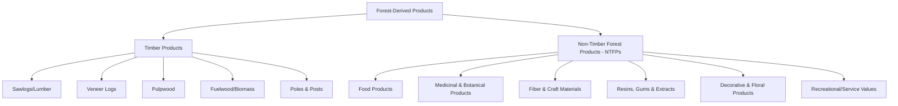

## Timber and Non-Timber Forest Products

### Overview

Timber and non-timber forest products (NTFPs) represent the two broad categories of goods derived from forested land integrated into agricultural systems. Timber products encompass wood harvested for structural, manufacturing, or fuel use, while NTFPs comprise the diverse range of biological materials — foods, medicinals, fibers, resins, and decorative materials — extracted from forests without felling the tree resource itself (or, in some cases, from parts of trees that are harvested). Together, these product categories determine the economic return structure of agroforestry and woodlot systems, often complementing each other across different time horizons and market channels.

### Classification Framework

### Timber Product Categories

#### Product Grades and Uses

| Product Class | Typical Use | Value Tier |
| --- | --- | --- |
| Veneer logs | High-grade furniture, decorative panels | Highest value per unit volume |
| Sawlogs | Lumber for construction, furniture | High value |
| Pulpwood | Paper, engineered wood products | Moderate value |
| Fuelwood/biomass | Heating, bioenergy | Lower value per unit volume |
| Poles and posts | Fencing, construction, utility poles | Variable, often niche/local markets |

#### Factors Determining Timber Value

- **Species**: Market demand and wood properties (hardness, grain, workability) vary substantially by species, with certain hardwoods (e.g., black walnut, white oak) commanding significant premiums over common softwoods in many markets
- **Log diameter and length**: Larger-diameter, longer, straighter logs generally yield higher-value products (veneer, wide-board lumber) than small-diameter or short logs limited to pulpwood or fuelwood use
- **Defects and quality**: Knots, rot, sweep (curvature), and other defects reduce achievable product grade and price
- **Log scaling/measurement**: Standardized volume measurement systems (e.g., board-foot scales such as the Doyle, Scribner, or International 1/4-inch rules in North American contexts, or metric cubic volume systems elsewhere) are used to estimate usable lumber volume from a given log, with different scales sometimes yielding meaningfully different volume estimates for the same log
- **Market accessibility**: Proximity to processing facilities (sawmills, veneer plants) and transportation infrastructure significantly affects net stumpage value received by the landowner

### Non-Timber Forest Product Categories

#### Food Products

- **Fruits and nuts**: Wild or semi-cultivated tree fruits (pawpaw, persimmon) and nuts (chestnut, hickory, walnut) harvested from forest or forest-farmed trees
- **Mushrooms**: Both wild-foraged and deliberately cultivated (e.g., shiitake on inoculated logs) fungal products
- **Maple syrup and other tree saps**: Seasonal sap harvest from specific tree species, processed into syrup or other products
- **Wild greens and edible understory plants**: Ramps, fiddleheads, and other seasonal foraged foods

#### Medicinal and Botanical Products

- **Roots and rhizomes**: American ginseng, goldenseal, and other medicinal roots with significant domestic and export market demand, particularly in traditional medicine markets
- **Bark and leaf extracts**: Various species harvested for pharmaceutical, nutraceutical, or traditional medicine compounds
- **Essential oils**: Distilled from specific tree/shrub species foliage or wood for aromatic and pharmaceutical applications

#### Fiber and Craft Materials

- **Bark and vine materials**: Used in basketry, cordage, and traditional craft production
- **Decorative wood products**: Burls, unusual grain figured wood pieces marketed for specialty woodworking
- **Bamboo and rattan** (in relevant regions): Fast-growing fiber materials with construction and craft applications

#### Resins, Gums, and Extracts

- **Pine resin/turpentine products**: Historically and currently significant in certain pine-producing regions
- **Gum arabic and similar exudates**: Significant NTFP in specific tree species (e.g., *Acacia senegal*) in relevant agroecological zones
- **Tannin extraction**: From bark of specific species for leather processing and other industrial uses

#### Decorative and Floral Products

- **Woodland greenery**: Ferns, galax leaves, and other foliage for the floral industry
- **Decorative branches and woody ornamentals**: Seasonal harvest (e.g., holiday greenery) from managed forest stands
- **Christmas tree production**: A specialized, deliberately cultivated forest product occupying a distinct management category between conventional forestry and horticulture

#### Recreational and Service Values

While not physically extracted products, hunting leases, recreational access fees, and payment-for-ecosystem-service arrangements (carbon credits, watershed protection payments) increasingly represent a significant non-timber revenue category for forest and woodlot owners in many regions.

### Comparative Economics: Timber vs. NTFPs

| Factor | Timber | NTFPs |
| --- | --- | --- |
| Harvest frequency | Infrequent (years to decades between harvests) | Often annual or seasonal |
| Capital tie-up | Long-term (decades to full maturity) | Generally shorter production cycles |
| Market volatility | Subject to regional/global timber commodity cycles | Highly variable; some niche NTFPs command stable premium pricing, others face volatile speculative demand |
| Harvest impact on stand | Can be significant (especially even-aged systems) | Generally lower impact if sustainably managed; can be significant if overharvested |
| Diversification value | Large lump-sum income events | Smoother, more frequent cash flow |

Integrating both timber and NTFP production on the same land base is a widely recommended strategy specifically because it combines the large but infrequent income events of timber harvest with the more frequent, smaller cash flows of NTFP production, improving overall farm financial resilience compared to reliance on either category alone. *[Inference: the degree of financial resilience benefit depends on specific product markets, regional demand, and management scale, and should be evaluated against site-specific economic conditions rather than assumed as a universal outcome.]*

### Sustainable Harvest Principles

#### Timber Sustainability

Sustained yield management — harvesting timber at a rate not exceeding the forest's regenerative growth capacity over the long term — is the foundational principle distinguishing sustainable timber management from resource depletion (liquidation) harvesting, assessed through periodic inventory and growth/yield calculations (see woodlot management growth and yield concepts).

#### NTFP Sustainability

NTFP harvest sustainability considerations differ by product type and harvested plant part:

- **Fruit/nut harvest**: Generally low ecological impact since the parent plant is not damaged, though excessive harvest can reduce natural regeneration if seed availability for wildlife/reseeding is significantly depleted
- **Bark harvest**: Can be highly damaging or fatal to the source tree if performed incorrectly (e.g., complete girdling); sustainable bark harvest techniques (partial, strip harvesting with adequate recovery time) are critical where bark is the target product
- **Root/rhizome harvest**: Typically requires destructive harvest of the individual plant (e.g., ginseng root harvest ends that plant's life), making population-level sustainability dependent on harvest rate relative to natural or cultivated regeneration rate rather than individual-plant recovery
- **Whole-plant/foliage harvest**: Sustainability depends on harvest frequency and intensity relative to the species' regrowth capacity

### Illustration: Combined Timber-NTFP Farm Income Timeline (svg_diagram)

<svg xmlns="http://www.w3.org/2000/svg" viewBox="0 0 700 380" font-family="sans-serif">
<text x="350" y="25" font-size="16" text-anchor="middle" font-weight="bold">Combined Timber and NTFP Income Timeline (svg_diagram)</text>

<line x1="60" y1="320" x2="660" y2="320" stroke="#333" stroke-width="1.5" />
<line x1="60" y1="320" x2="60" y2="60" stroke="#333" stroke-width="1.5" />
<text x="360" y="355" font-size="11" text-anchor="middle">Years</text>
<text x="30" y="190" font-size="11" text-anchor="middle" transform="rotate(-90 30 190)">Income</text>

<rect x="90" y="290" width="20" height="30" fill="#4a9c3f" />
<rect x="150" y="285" width="20" height="35" fill="#4a9c3f" />
<rect x="210" y="288" width="20" height="32" fill="#4a9c3f" />
<rect x="270" y="280" width="20" height="40" fill="#4a9c3f" />
<rect x="330" y="283" width="20" height="37" fill="#4a9c3f" />
<rect x="390" y="278" width="20" height="42" fill="#4a9c3f" />
<rect x="450" y="275" width="20" height="45" fill="#4a9c3f" />
<rect x="510" y="278" width="20" height="42" fill="#4a9c3f" />
<rect x="570" y="280" width="20" height="40" fill="#4a9c3f" />
<rect x="630" y="277" width="20" height="43" fill="#4a9c3f" />
<text x="200" y="270" font-size="10" fill="#2a5c1a">Recurring NTFP income (mushrooms, syrup, botanicals)</text>

<rect x="330" y="120" width="30" height="160" fill="#8b6f47" />
<text x="345" y="110" font-size="10" text-anchor="middle" fill="#5c4632">Thinning harvest</text>
<rect x="630" y="70" width="30" height="210" fill="#5c4632" />
<text x="645" y="60" font-size="10" text-anchor="middle" fill="#5c4632">Final timber harvest</text>

<text x="360" y="345" font-size="9" text-anchor="middle">0</text>

<text x="655" y="345" font-size="9" text-anchor="middle">~25-40+</text>

</svg>

### Market Development and Value-Added Processing

- **On-farm primary processing**: Portable sawmilling, or basic drying/grading of medicinal roots, can capture additional value compared to selling raw, unprocessed material
- **Direct marketing channels**: Farmers markets, specialty food/craft retailers, and direct-to-consumer sales (particularly for NTFPs) can achieve higher per-unit returns than commodity wholesale channels, though at higher marketing labor cost
- **Certification programs**: Forest stewardship certification (sustainable timber sourcing) and organic/wild-simulated certification for NTFPs can support premium market access, particularly for export-oriented or environmentally conscious consumer markets
- **Cooperative marketing**: Producer cooperatives can help small-scale forest and NTFP producers achieve better market access and pricing than individual direct sales, particularly relevant given the typically small individual production volumes characteristic of diversified farm woodlots

### Legal, Regulatory, and Rights Considerations

- **Harvest permits and regulations**: Many jurisdictions regulate timber harvest (particularly on larger scales) and wild-harvest of specific NTFP species (e.g., ginseng export regulations tied to international conservation agreements) requiring landowner awareness of applicable permit and reporting requirements
- **Land tenure and access rights**: NTFP harvest rights, particularly in communal or customary tenure systems common in many tropical forest regions, may be governed by distinct traditional or legal frameworks separate from timber rights
- **Species protection status**: Some NTFP species face harvest restrictions or monitoring requirements due to conservation concern from overharvesting pressure

*[Unverified: specific regulatory requirements vary substantially by country, state/province, and species, and are subject to legislative change; current requirements should be verified through relevant local forestry or agricultural extension authorities before commercial harvest activity.]*

### Common Pitfalls in Timber and NTFP Management

- Treating timber as a one-time liquidation event rather than a component of an ongoing, sustained-yield management plan
- Overharvesting NTFP populations (particularly destructively-harvested roots/rhizomes) beyond sustainable regeneration capacity, risking local population depletion
- Neglecting market research before investing in NTFP production, resulting in products without accessible or adequately sized markets
- Underestimating labor intensity of most NTFP harvest and processing relative to per-unit product value
- Failing to verify current permit, certification, or export regulation requirements before commercial-scale harvest or sale

### **Next Steps**

- Timber cruising, scaling, and log grading systems
- American ginseng and medicinal root market dynamics
- Specialty mushroom cultivation and marketing
- Forest product certification programs (FSC, organic, wild-simulated)
- Value-added processing for farm-based forest products
- Cooperative marketing models for small-scale forest producers
- Sustainable harvest guidelines for bark and root NTFPs
- Regulatory frameworks for NTFP harvest and export