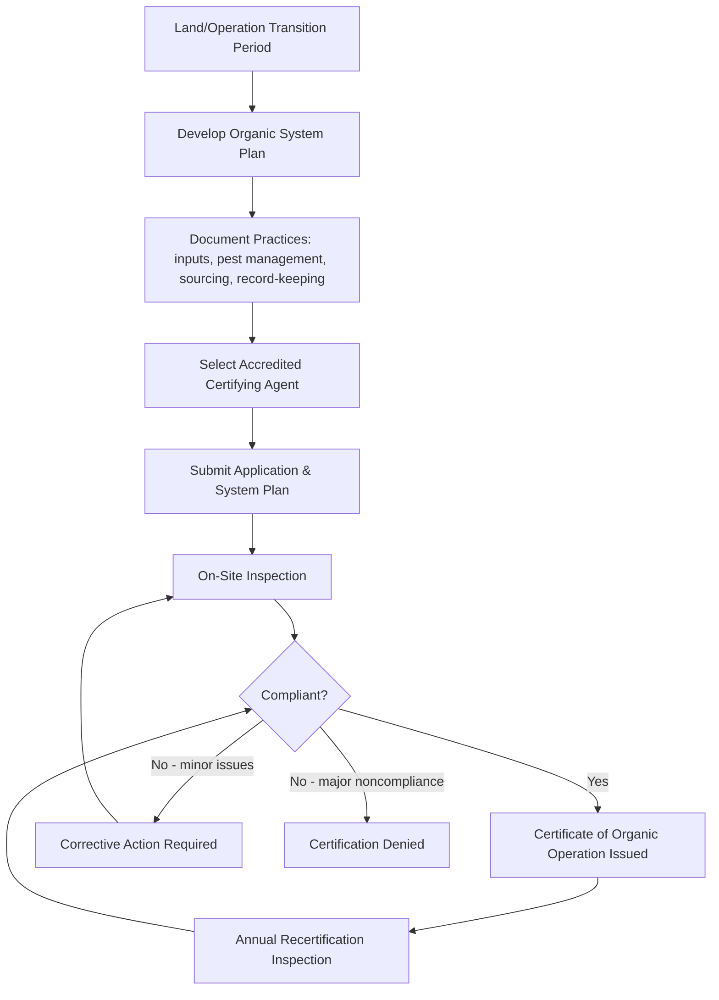

## Organic Certification Standards

I'll verify current organic certification program details before writing this, since specific requirements and thresholds are periodically revised by regulatory bodies.

Searched the web

### Overview

Organic certification standards are the legally defined sets of production, handling, and labeling requirements that a farm or processing operation must meet — and have independently verified by an accredited third-party certifier — before its products may be marketed as "organic." While the general philosophy (prohibiting synthetic inputs, GMOs, and most conventional chemical interventions in favor of biological and cultural management) is broadly shared across countries, the specific legal frameworks, permitted-substance lists, and labeling thresholds differ by jurisdiction, most significantly between the United States National Organic Program (NOP), the European Union's organic regulation, and the international reference framework provided by Codex Alimentarius.

### Core Regulatory Frameworks

#### United States: National Organic Program (NOP)

The NOP, administered by the USDA's Agricultural Marketing Service under the Organic Foods Production Act of 1990, governs organic certification in the United States through regulations codified at 7 CFR Part 205, which defines certification as a determination made by a certifying agent that a production or handling operation is in compliance with the Act and the regulations. Central to the NOP is the **National List of Allowed and Prohibited Substances**, which identifies the synthetic substances that may be used and the nonsynthetic (natural) substances that may not be used in organic crop and livestock production, and also identifies the nonorganic substances that may be used in or on processed organic products. [eCFR](https://www.ecfr.gov/current/title-7/subtitle-B/chapter-I/subchapter-M/part-205)[govinfo](https://www.govinfo.gov/content/pkg/FR-2026-02-09/pdf/2026-02548.pdf)

The National List is not static: it undergoes periodic **sunset review**, a recurring process in which substances are reevaluated and either renewed, amended, or removed. The 2026 sunset review process resulted in the renewal of 56 substances on the National List, applicable July 26, 2026, following recommendations from the National Organic Standards Board (NOSB) to the Secretary of Agriculture. The NOSB itself is a Federal Advisory Committee made up of fifteen members of the public who provide input into this ongoing rulemaking process. [Federal Register](https://www.federalregister.gov/documents/2026/02/09/2026-02548/national-organic-program-2026-sunset-review-and-substance-renewals)[USDA](https://www.ams.usda.gov/rules-regulations/organic)

#### European Union: Regulation (EU) 2018/848

Regulation (EU) 2018/848 is the basic Act laying down EU rules on organic production and labelling, revising and strengthening the controls system, trade regime, and production rules that had been in place since 2007, with stated aims of encouraging sustainable development of the organic sector, guaranteeing fair competition, preventing fraud, and improving consumer confidence. The regulation took effect January 1, 2022, and expanded the scope of covered products to include a wider range of items closely linked to agriculture, beyond just live or unprocessed agricultural products. [Agrinfo](https://agrinfo.eu/book-of-reports/new-eu-organic-regulation-explained/)[Khlaw](https://tomorrowsfoodandfeed.khlaw.com/2021/05/the-future-of-organic-in-europe-changes-coming-to-processing-and-labelling-rules/)

A significant shift introduced by this regulation was in import policy: the EU's 2018/848 regulation tightened import rules, requiring third-country operators to comply directly with EU organic rules rather than merely demonstrating "equivalent" standards, affecting ingredient sourcing from non-EU origins. This shift from equivalence to compliance creates new demands for exporters in third countries seeking EU market access. [Nutrada](https://nutrada.com/blog/organic-certification-eu-usda)[Agriculture Institute](https://agriculture.institute/organic-farming-introduction/understanding-global-standards-organic-farming/)

#### Codex Alimentarius (International Reference Framework)

Codex Alimentarius, the joint FAO/WHO international food standards body, provides non-binding international guidelines for organic production that many national systems reference or align with. Codex addresses the challenge of keeping standards current through a two-year review cycle for permitted inputs, comparable in function to the EU's use of delegated acts to amend technical annexes as needed. [Agriculture Institute](https://agriculture.institute/organic-farming-introduction/understanding-global-standards-organic-farming/)

### Certification Process Workflow

The path to organic certification follows a consistent sequence regardless of which accredited certifying agent an operation works with, and understanding this full sequence in advance is important since it can take longer than expected, particularly where land or equipment requires a transition period first. Under the NOP, this transition period is well-established at three years without prohibited substance application before harvested crops may be certified organic. A core early step involves documentation: operations must document every practice, substance, and procedure used in production, covering ingredient sourcing, pest management, sanitation, and record-keeping systems. [iFactory](https://ifactoryapp.com/industries/food-manufacturing/organic-certification-usda-nop-food-manufacturing)[iFactory](https://ifactoryapp.com/industries/food-manufacturing/organic-certification-usda-nop-food-manufacturing)

### Labeling Tiers and Thresholds

#### United States (NOP) Labeling Categories

Products labeled "100% organic" must contain only certified organic ingredients, excluding water and salt from the calculation, and may display the USDA organic seal. Products labeled simply "organic" must contain at least 95 percent certified organic ingredients, with the remaining 5 percent limited to substances on the National List that are not commercially available in organic form, and these products may also display the USDA seal. Products labeled "made with organic ingredients" must contain at least 70 percent certified organic ingredients and may list up to three specific organic ingredients on the front panel, but cannot display the USDA organic seal itself. Choosing the wrong labeling tier for an actual product formulation is a common and easily avoidable compliance error. [Organic Certification: USDA NOP Requirements 2026 +3](https://ifactoryapp.com/industries/food-manufacturing/organic-certification-usda-nop-food-manufacturing)

#### EU Comparison

Both the EU and USDA systems require a minimum of 95% organic ingredients for standard organic labeling, but they diverge on how the remaining 5% is handled, how imports are verified, and how strictly residue testing is enforced. [Nutrada](https://nutrada.com/blog/organic-certification-eu-usda)

| Labeling Tier | US NOP Threshold | Notes |
| --- | --- | --- |
| "100% Organic" | 100% (excl. water/salt) | May bear USDA seal |
| "Organic" | ≥95% | Remaining 5% must be non-synthetic or National List-approved items unavailable organically; may bear USDA seal |
| "Made with organic ingredients" | ≥70% | Up to 3 organic ingredients may be listed on front panel; cannot bear USDA seal |

### Prohibited Substance Contamination and Residue Handling

A key area of divergence between major systems concerns how incidental pesticide residue detection is handled. Under EU Regulation 2018/848, finding residues triggers a mandatory investigation to determine the source; if contamination is accidental — such as spray drift from a neighbouring conventional farm — the product may retain organic status, but if intentional use is proven, the product loses organic status. Notably, the EU regulation does not set a specific numerical decertification threshold for residues, a deliberately flexible approach that contrasts with some other systems that apply fixed action-level thresholds. [Nutrada](https://nutrada.com/blog/organic-certification-eu-usda)[Nutrada](https://nutrada.com/blog/organic-certification-eu-usda)

### International Trade and Equivalency Arrangements

The EU organic regulation and the USDA NOP maintain a mutual recognition agreement, meaning US-certified organic products generally qualify for EU organic status and vice versa, though this is not unlimited — notable exceptions include differing rules on antibiotics in livestock and certain processing aids. For companies operating across both markets, the practical options are to maintain dual certification through a certifying body accredited for both systems, or to rely on the equivalence arrangement supported by documentation proving compliance in both regulatory frameworks. [Nutrada](https://nutrada.com/blog/organic-certification-eu-usda)[Nutrada](https://nutrada.com/blog/organic-certification-eu-usda)

### Certifying Agents and Accreditation

Certification is performed by **accredited certifying agents** — third-party bodies (which may be private organizations or, in some countries, government agencies) authorized by the relevant national authority to conduct inspections and issue certification. A certifying agent conducts a certification review, defined as the act of reviewing and evaluating a certified operation or applicant for certification and determining compliance or ability to comply with the organic regulations, which is distinct from the on-site inspection itself. Choosing between accredited certifying agents typically involves comparing their scope of accreditation, industry specialization, and fee structure. [eCFR](https://www.ecfr.gov/current/title-7/subtitle-B/chapter-I/subchapter-M/part-205)[iFactory](https://ifactoryapp.com/industries/food-manufacturing/organic-certification-usda-nop-food-manufacturing)

### Group Certification

For smallholder-dominated production systems, particularly common in many developing-country export contexts, **group (internal control system) certification** allows a cooperative or producer organization to be certified as a single unit rather than requiring individual certification of every member farm. The EU's 2018/848 regulation defines specific rules for group certification, including a limit of 2,000 members per group, alongside strengthened compliance requirements for third countries and increased sampling and inspection requirements for certifiers. [scribd](https://www.scribd.com/document/663336201/3-2-19-2-EN-Client-Updates-EU-Reg-2018848)

### Core Production Principles Common Across Systems

While specific permitted-substance lists differ, most major organic standards share foundational production principles:

- **Prohibition of synthetic pesticides and fertilizers**: With specific, listed exceptions for particular synthetic substances judged to have low environmental/health impact and no viable natural alternative
- **Prohibition of genetically modified organisms (GMOs)**: Across nearly all major organic standards globally
- **Soil-building and biological management emphasis**: Required use of practices such as crop rotation, cover cropping, and composting to build soil fertility rather than relying on synthetic fertilizer inputs
- **Buffer zones**: Required physical or vegetative buffers between certified organic fields and adjacent conventionally managed land to reduce prohibited-substance drift contamination risk
- **Livestock-specific requirements**: Organic livestock standards typically require organic feed, restrictions or prohibitions on routine antibiotic and synthetic hormone use, and outdoor access/pasture requirements for ruminants
- **Recordkeeping and traceability**: Comprehensive audit trail documentation from input purchase through final product sale, enabling certifiers to verify organic integrity throughout the supply chain

### Illustration: Organic Certification Regulatory Landscape (svg_diagram)

<svg xmlns="http://www.w3.org/2000/svg" viewBox="0 0 700 400" font-family="sans-serif">
<text x="350" y="25" font-size="16" text-anchor="middle" font-weight="bold">Organic Certification Regulatory Landscape (svg_diagram)</text>

<ellipse cx="350" cy="80" rx="150" ry="45" fill="#dbe4c9" stroke="#6b8e23" stroke-width="2" />
<text x="350" y="75" font-size="12" text-anchor="middle" font-weight="bold">Codex Alimentarius</text>
<text x="350" y="92" font-size="9" text-anchor="middle">International reference guidelines (FAO/WHO)</text>

<line x1="250" y1="120" x2="150" y2="170" stroke="#333" stroke-width="1.5" marker-end="url(#arrowO)" />
<line x1="450" y1="120" x2="550" y2="170" stroke="#333" stroke-width="1.5" marker-end="url(#arrowO)" />

<rect x="50" y="175" width="220" height="110" rx="8" fill="#c8dff0" stroke="#2a5c8a" stroke-width="2" />
<text x="160" y="200" font-size="12" text-anchor="middle" font-weight="bold">USDA NOP (US)</text>
<text x="160" y="220" font-size="9" text-anchor="middle">7 CFR Part 205</text>
<text x="160" y="235" font-size="9" text-anchor="middle">National List (sunset review)</text>
<text x="160" y="250" font-size="9" text-anchor="middle">Labeling: 100% / 95% / 70%</text>
<text x="160" y="265" font-size="9" text-anchor="middle">NOSB advisory board</text>

<rect x="430" y="175" width="220" height="110" rx="8" fill="#f0dcc8" stroke="#8a5c2a" stroke-width="2" />
<text x="540" y="200" font-size="12" text-anchor="middle" font-weight="bold">EU Organic (2018/848)</text>
<text x="540" y="220" font-size="9" text-anchor="middle">Compliance-based (not equivalence)</text>
<text x="540" y="235" font-size="9" text-anchor="middle">95% threshold; flexible residue rule</text>
<text x="540" y="250" font-size="9" text-anchor="middle">Group cert: 2,000 member limit</text>
<text x="540" y="265" font-size="9" text-anchor="middle">Delegated acts for updates</text>

<line x1="270" y1="230" x2="430" y2="230" stroke="#2a7f2a" stroke-width="2" stroke-dasharray="5,3" />
<text x="350" y="325" font-size="10" text-anchor="middle" fill="#2a7f2a" font-weight="bold">Mutual Recognition Agreement</text>
<text x="350" y="340" font-size="9" text-anchor="middle" fill="#2a7f2a">(with exceptions: antibiotics, processing aids)</text>
</svg>

### Common Compliance Challenges

- Mislabeling due to incorrect application of the labeling percentage tiers, particularly for multi-ingredient processed products
- Underestimating the time required for the land transition period before certification eligibility, especially where prior conventional input use history is poorly documented
- Inadequate buffer zones or contamination control measures, risking prohibited-substance residue detection
- Confusion over evolving National List sunset review outcomes, given that permitted-substance status can change with each review cycle
- Assuming full equivalence between certification systems without verifying jurisdiction-specific exceptions (e.g., livestock antibiotic rules) relevant to dual-market sales

*[Unverified: this content reflects current regulatory frameworks as identified through recent search results; given that both the NOP National List and EU technical annexes are subject to ongoing periodic revision, current requirements for a specific product or jurisdiction should be verified directly against the applicable regulatory agency's most current published rule text before making certification compliance decisions.]*

### **Next Steps**

- Organic transition planning and record-keeping systems
- National List substances and sunset review process
- Organic livestock production standards
- Group/internal control system certification for smallholders
- Organic input sourcing and approved materials lists
- International organic trade equivalency arrangements
- Organic certification cost-share programs
- Buffer zone design and contamination prevention