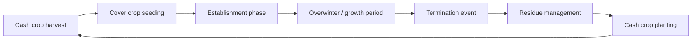

## Cover Cropping Strategies

### Definition and Purpose

Cover cropping is the practice of planting non-cash crops to cover and protect soil during periods when it would otherwise lie fallow. Unlike cash crops grown for sale, cover crops are grown primarily for soil and ecosystem benefits, though some are later terminated as green manure or grazed for additional value.

**Key Points**

- Cover crops occupy the niche between cash crop cycles (winter, shoulder seasons, or fallow rotations)
- Primary functions: erosion control, weed suppression, nitrogen management, soil structure improvement, and biodiversity support
- Distinguished from "catch crops" (which specifically scavenge residual nitrogen) though the terms overlap in practice

### Functional Classification

Cover crops are typically grouped by their dominant agronomic function, though most species deliver several benefits simultaneously.

#### Legumes (Nitrogen-Fixing)

Legumes form symbiotic relationships with *Rhizobium* bacteria in root nodules, converting atmospheric nitrogen ($N_2$) into plant-available ammonium ($NH_4^+$).

- **Examples**: Crimson clover (*Trifolium incarnatum*), hairy vetch (*Vicia villosa*), field peas (*Pisum sativum*), cowpeas (*Vigna unguiculata*), berseem clover
- Nitrogen contribution ranges roughly from 50–200 lbs N/acre depending on species, biomass, and termination timing [Unverified — highly site- and climate-dependent]
- Nitrogen becomes available to subsequent crops through mineralization after termination, not immediately upon fixation

#### Grasses and Cereals (Biomass and Scavenging)

- **Examples**: Cereal rye (*Secale cereale*), oats (*Avena sativa*), annual ryegrass, winter wheat (as a cover)
- Fibrous root systems excel at scavenging residual soil nitrogen, reducing leaching losses
- Cereal rye is notable for allelopathic compounds (e.g., benzoxazinoids) that suppress weed germination
- High carbon-to-nitrogen (C:N) ratio biomass decomposes slowly, contributing to longer-term soil organic matter

#### Brassicas (Biofumigation and Compaction Relief)

- **Examples**: Tillage radish (daikon type), mustard species (*Brassica juncea*, *Sinapis alba*), turnips
- Deep taproots (tillage radish) physically fracture compacted soil layers ("bio-drilling")
- Glucosinolate compounds hydrolyze into isothiocyanates upon tissue disruption, providing a biofumigation effect against certain soilborne pathogens and nematodes [Inference — efficacy varies substantially by species, concentration, and target organism, and is not equivalent to synthetic fumigation]

#### Broadleaf/Forb Species

- **Examples**: Buckwheat (*Fagopyrum esculentum*), phacelia, sunflower
- Buckwheat's rapid growth cycle (30–45 days to flower) makes it useful for short-window smother cropping and pollinator support
- Often included in mixes for structural diversity and root exudate diversity

### Cover Crop Mixes ("Cocktails")

Multi-species mixes combine functional groups to stack benefits simultaneously.

**Example**

A typical fall-planted mix for temperate row-crop systems:

- Cereal rye (winter hardiness, biomass, weed suppression)
- Hairy vetch (nitrogen fixation)
- Tillage radish (compaction relief, rapid fall growth)

Design considerations:

- Seeding rate adjustments: individual species rates are typically reduced (often by 50% or more per component) relative to monoculture rates to avoid excessive competition
- Rooting architecture diversity (fibrous vs. taproot vs. fine root) maximizes soil profile exploration
- Winterkill vs. winter-hardy components are selected deliberately depending on whether spring termination timing flexibility is desired

### Cover Crop Life Cycle in Rotation

### Termination Methods

Termination timing and method significantly affect nitrogen release timing, weed suppression duration, and planting logistics for the following cash crop.

- **Mechanical**: Mowing, roller-crimping (effective on cereal rye at anthesis/flowering stage, when stem lignification prevents regrowth), tillage incorporation
- **Chemical**: Herbicide burndown (glyphosate or paraquat-based, timing dependent on regulatory and resistance-management context)
- **Winterkill**: Species selection (e.g., oats, spring peas in cold climates) that naturally die from frost, eliminating a separate termination pass
- **Grazing**: Livestock integration terminates cover partially or fully while converting biomass to manure and animal product, a hallmark of regenerative systems

**Key Points**

- Roller-crimping requires the crop to be at the correct phenological stage (flowering) — terminating too early results in regrowth
- Termination timing involves a trade-off: earlier termination favors easier cash-crop planting and faster N mineralization; later termination maximizes biomass, weed suppression, and moisture/nutrient scavenging but can deplete soil moisture ahead of a moisture-sensitive cash crop [Unverified — trade-off magnitude is regionally and seasonally variable]

### Soil and Ecosystem Effects

#### Nitrogen Cycling

Legume-fixed nitrogen and grass-scavenged nitrogen both become plant-available through microbial decomposition. The rate of release depends on residue C:N ratio:

$$\text{Net N mineralization occurs when C:N} < \sim 25:1$$

Above this threshold, microbes immobilize soil nitrogen while decomposing high-carbon residue, temporarily reducing availability to the subsequent cash crop.

#### Soil Structure and Organic Matter

- Root channels from taprooted species improve macropore continuity, aiding water infiltration
- Continuous living roots feed soil microbial communities via root exudates (a foundational regenerative agriculture principle — "keep living roots in the soil")
- Above- and below-ground biomass additions contribute to soil organic carbon over multi-year timescales

#### Erosion and Water Management

Ground cover reduces raindrop impact energy and slows surface water velocity, reducing sheet and rill erosion, and can improve water infiltration rates over time as structure improves [Inference — magnitude depends on slope, rainfall intensity, and existing soil condition].

#### Weed Suppression Mechanisms

- Physical: canopy competition for light limits weed seedling establishment
- Allelopathic: certain species (notably cereal rye) release compounds inhibiting weed germination
- Mulch effect: post-termination residue mat physically suppresses weed emergence through light exclusion and physical barrier

### Cover Cropping Decision Diagram

<svg xmlns="http://www.w3.org/2000/svg" viewBox="0 0 780 460" font-family="Arial, sans-serif">
<text x="390" y="28" font-size="18" font-weight="bold" text-anchor="middle">Cover Crop Selection Framework (svg_diagram)</text>
<rect x="30" y="55" width="200" height="60" rx="8" fill="#e8f4ea" stroke="#4a7c59" stroke-width="1.5" />
<text x="130" y="80" font-size="13" font-weight="bold" text-anchor="middle">Primary Goal?</text>
<text x="130" y="98" font-size="11" text-anchor="middle">(farmer defines objective)</text>
<line x1="130" y1="115" x2="130" y2="150" stroke="#333" stroke-width="1.5" />
<line x1="130" y1="150" x2="30" y2="150" stroke="#333" stroke-width="1.5" />
<line x1="130" y1="150" x2="230" y2="150" stroke="#333" stroke-width="1.5" />
<line x1="130" y1="150" x2="380" y2="150" stroke="#333" stroke-width="1.5" />
<line x1="130" y1="150" x2="530" y2="150" stroke="#333" stroke-width="1.5" />
<line x1="130" y1="150" x2="680" y2="150" stroke="#333" stroke-width="1.5" />
<rect x="10" y="150" width="120" height="45" rx="6" fill="#fff4e0" stroke="#c9862f" />
<text x="70" y="177" font-size="11" text-anchor="middle">Nitrogen supply</text>
<rect x="150" y="150" width="120" height="45" rx="6" fill="#fff4e0" stroke="#c9862f" />
<text x="210" y="177" font-size="11" text-anchor="middle">Weed control</text>
<rect x="300" y="150" width="120" height="45" rx="6" fill="#fff4e0" stroke="#c9862f" />
<text x="360" y="177" font-size="11" text-anchor="middle">Compaction relief</text>
<rect x="450" y="150" width="120" height="45" rx="6" fill="#fff4e0" stroke="#c9862f" />
<text x="510" y="177" font-size="11" text-anchor="middle">Erosion control</text>
<rect x="600" y="150" width="150" height="45" rx="6" fill="#fff4e0" stroke="#c9862f" />
<text x="675" y="177" font-size="11" text-anchor="middle">Multiple / stacked</text>
<line x1="70" y1="195" x2="70" y2="230" stroke="#333" stroke-width="1.2" />
<line x1="210" y1="195" x2="210" y2="230" stroke="#333" stroke-width="1.2" />
<line x1="360" y1="195" x2="360" y2="230" stroke="#333" stroke-width="1.2" />
<line x1="510" y1="195" x2="510" y2="230" stroke="#333" stroke-width="1.2" />
<line x1="675" y1="195" x2="675" y2="230" stroke="#333" stroke-width="1.2" />
<rect x="10" y="230" width="120" height="55" rx="6" fill="#e6f0fa" stroke="#2e6da4" />
<text x="70" y="252" font-size="10.5" text-anchor="middle">Legumes:</text>
<text x="70" y="267" font-size="10.5" text-anchor="middle">vetch, clover,</text>
<text x="70" y="280" font-size="10.5" text-anchor="middle">field peas</text>
<rect x="150" y="230" width="120" height="55" rx="6" fill="#e6f0fa" stroke="#2e6da4" />
<text x="210" y="252" font-size="10.5" text-anchor="middle">Cereal rye,</text>
<text x="210" y="267" font-size="10.5" text-anchor="middle">buckwheat</text>
<text x="210" y="280" font-size="10.5" text-anchor="middle">(smother)</text>
<rect x="300" y="230" width="120" height="55" rx="6" fill="#e6f0fa" stroke="#2e6da4" />
<text x="360" y="252" font-size="10.5" text-anchor="middle">Tillage radish,</text>
<text x="360" y="267" font-size="10.5" text-anchor="middle">mustard</text>
<text x="360" y="280" font-size="10.5" text-anchor="middle">(taproot)</text>
<rect x="450" y="230" width="120" height="55" rx="6" fill="#e6f0fa" stroke="#2e6da4" />
<text x="510" y="252" font-size="10.5" text-anchor="middle">Cereal rye,</text>
<text x="510" y="267" font-size="10.5" text-anchor="middle">ryegrass</text>
<text x="510" y="280" font-size="10.5" text-anchor="middle">(fibrous cover)</text>
<rect x="600" y="230" width="150" height="55" rx="6" fill="#e6f0fa" stroke="#2e6da4" />
<text x="675" y="252" font-size="10.5" text-anchor="middle">Multi-species</text>
<text x="675" y="267" font-size="10.5" text-anchor="middle">cocktail mix</text>
<text x="675" y="280" font-size="10.5" text-anchor="middle">(stacked traits)</text>
<line x1="390" y1="285" x2="390" y2="320" stroke="#333" stroke-width="1.5" />
<rect x="230" y="320" width="320" height="55" rx="8" fill="#fce8e8" stroke="#a44" />
<text x="390" y="342" font-size="12" font-weight="bold" text-anchor="middle">Match to termination window</text>
<text x="390" y="360" font-size="11" text-anchor="middle">and cash-crop planting date</text>
<line x1="390" y1="375" x2="390" y2="410" stroke="#333" stroke-width="1.5" />
<rect x="250" y="410" width="280" height="40" rx="8" fill="#e8f4ea" stroke="#4a7c59" />
<text x="390" y="435" font-size="12" font-weight="bold" text-anchor="middle">Finalize species/mix and rate</text>
</svg>

### Regenerative Agriculture Context

Cover cropping is one of the core practices in regenerative agriculture frameworks (alongside reduced tillage, diverse rotations, and livestock integration), aligned with the principle of maximizing "living root" duration and minimizing bare soil exposure. It is frequently paired with:

- No-till or reduced-till systems ("planting green" — direct-seeding cash crops into standing or freshly terminated cover)
- Integrated livestock grazing for termination and nutrient cycling
- Long-term soil health monitoring metrics: soil organic matter %, water infiltration rate, aggregate stability

### Economic and Practical Considerations

- **Costs**: Seed cost, seeding pass (drilled or broadcast), potential termination pass, and possible yield drag risk if termination is delayed or moisture is limited
- **Incentives**: Many regions offer cost-share or subsidy programs for cover crop adoption (e.g., USDA NRCS EQIP payments in the U.S.) [Unverified — program availability and rates are jurisdiction- and year-specific]
- **Establishment risk**: Seeding window is often tight (post-harvest, pre-frost), and stand failure can occur under drought or late harvest conditions
- Return on investment is typically realized over multiple seasons through reduced input costs (synthetic N, herbicide) and yield stability rather than immediate cash return [Inference]

### Common Species Selection Reference

| Function | Species Examples | Approx. Seeding Window (temperate) | Termination Note |
| --- | --- | --- | --- |
| N-fixation | Hairy vetch, crimson clover | Late summer–early fall | Roller-crimp or herbicide at flowering |
| Biomass/weed suppression | Cereal rye | Fall | Roller-crimp at anthesis |
| Compaction relief | Tillage radish | Late summer | Winterkills in cold climates |
| Rapid smother/pollinator | Buckwheat | Spring–summer gaps | Mow before seed set |
| N scavenging | Oats, annual ryegrass | Fall | Winterkill (oats) or herbicide |

**Next Steps**

- Soil health indicator testing (aggregate stability, infiltration rate, active carbon)
- No-till and reduced-tillage system integration
- Nitrogen credit calculation and fertilizer rate adjustment following legume covers
- Roller-crimper mechanics and "planting green" techniques
- Livestock-cover crop grazing integration (mob grazing, strip grazing)
- Cover crop cost-share and conservation program structures (e.g., NRCS EQIP)
- Cash crop rotation design incorporating cover crop windows
- Biofumigation and soilborne pathogen/nematode suppression mechanisms