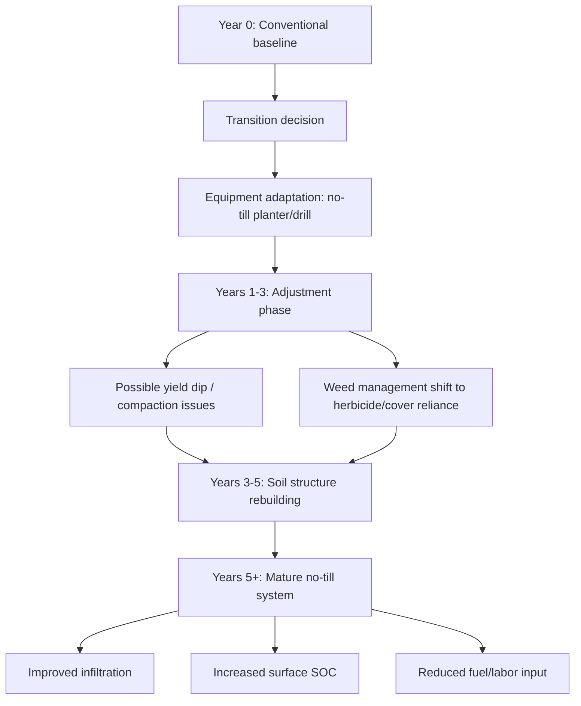

## No-Till and Reduced Tillage Systems

### Definition and Classification

Tillage systems are classified along a spectrum based on the degree of soil disturbance performed prior to and during crop establishment.

- **Conventional tillage**: Full-width soil inversion/disturbance (moldboard plow, disking, harrowing), typically leaving less than 15% residue cover
- **Reduced tillage**: Intermediate disturbance (chisel plow, vertical tillage, strip-till), leaving 15–30% residue cover
- **Conservation tillage**: Any system leaving ≥30% residue cover after planting (a USDA-defined threshold), which includes both reduced-till and no-till
- **No-till (zero-till)**: Soil is disturbed only in a narrow slot or band at the point of seed placement; no full-width inversion or mixing occurs

**Key Points**

- "Conservation tillage" is a residue-based regulatory/classification threshold, not a specific implement or method
- Strip-till is a hybrid: full-width no-till except in narrow tilled strips (typically 6–10 inches wide) where the seed row will be placed, combining no-till's residue benefits with a warmer, mellower seedbed in the row

### Core Mechanisms and Rationale

#### Soil Structure Preservation

Conventional tillage physically fractures soil aggregates and disrupts fungal hyphal networks and macropore continuity built up by roots and soil fauna. No-till avoids this disruption, allowing:

- Continuous macropore channels (from earthworm burrows and decayed root channels) to persist across seasons, improving water infiltration
- Soil aggregate stability to increase over time as microbial glues (glomalin, extracellular polysaccharides) and fungal hyphae remain intact
- Reduced bulk density variability at the surface, though **increased bulk density in the 0–15 cm layer relative to tilled soil is commonly observed in the first several years** due to lack of mechanical loosening [Unverified — magnitude and duration vary by soil texture and time since transition]

#### Residue Management

Surface residue retention (rather than incorporation) is central to no-till function:

- Physical soil cover reduces raindrop impact energy, limiting erosion
- Residue moderates soil temperature extremes and reduces evaporative water loss
- Slow surface decomposition (versus rapid incorporated decomposition) contributes to longer-term surface organic matter stratification

#### Soil Organic Carbon Stratification

A well-documented effect of long-term no-till is vertical stratification of soil organic carbon (SOC), with higher concentrations near the surface (0–5 cm) compared to tilled systems, where carbon is more evenly distributed through the plow layer due to mechanical mixing.

$$\text{SOC}_{0-5cm, no-till} > \text{SOC}_{0-5cm, tilled}$$

[Inference — whole-profile (e.g., 0–30 cm) total SOC differences between no-till and tilled systems are more variable across studies than surface-layer differences, and depend on climate, soil type, and time since adoption]

### Equipment and Implementation

#### No-Till Planters and Drills

No-till seeding equipment must cut through residue and place seed at consistent depth in undisturbed soil, requiring specific components:

- **Row cleaners/trash whippers**: Move surface residue aside from the seed row without disturbing soil
- **Coulters**: Rotating discs (fluted or straight) that cut a slot through residue and soil ahead of the opener
- **Double-disk openers**: Create a narrow V-slot for seed placement
- **Closing wheels**: Press soil back over the seed slot, ensuring seed-to-soil contact — critical in no-till since loose soil for natural closure is less available
- **Down-pressure systems**: Hydraulic or spring-based systems ensuring consistent seeding depth across variable residue and soil firmness

#### Strip-Till Equipment

Strip-till units typically combine a coulter, row cleaners, a shank or knife (for deeper tillage/fertilizer placement, often 6–10 inches deep), and a berming/finishing disk to shape a raised, tilled strip — often performed in a separate pass in fall for spring planting.

### No-Till Transition Timeline

### Weed Management Adaptations

Since tillage historically served as a primary weed control mechanism (burying seeds, uprooting seedlings), no-till systems require compensating strategies:

- **Herbicide reliance**: Pre-emergent and burndown herbicides substitute for mechanical weed control, historically increasing dependence on chemicals such as glyphosate
- **Cover crops**: Serve a dual role suppressing weeds via competition and allelopathy (see cereal rye's benzoxazinoid-mediated suppression)
- **Herbicide resistance management**: Continuous no-till with herbicide-only weed control has been associated with selection pressure for resistant weed biotypes (e.g., glyphosate-resistant Palmer amaranth, waterhemp), prompting integrated approaches combining residual herbicides, cover crop competition, and occasional strategic tillage ("rotational tillage") [Unverified — resistance dynamics are highly regional and management-history dependent]

### Nutrient Management Considerations

#### Nitrogen Dynamics

- Surface-applied nitrogen (rather than incorporated) is more susceptible to volatilization losses (as ammonia, $NH_3$) in no-till, particularly with urea-based fertilizers, unless incorporated via injection, banding, or use of urease inhibitors
- Residue-covered soils can experience temporary N immobilization near the surface where high-C:N residue decomposes, similar to cover crop residue dynamics

#### Phosphorus Stratification

Because no-till lacks mechanical mixing, broadcast-applied phosphorus and potassium tend to accumulate near the soil surface over time rather than distributing through the profile — a documented long-term effect requiring monitoring via stratified soil sampling (segmented by depth) rather than a single composite sample.

### Soil Temperature and Moisture Trade-offs

No-till soils, insulated by residue, typically warm more slowly in spring than bare tilled soil.

**Key Points**

- Slower spring warming can delay germination and early growth in cool-season-sensitive crops, sometimes producing an early-season yield lag in temperate climates
- The same residue layer conserves soil moisture during dry periods by reducing evaporation — a net benefit in moisture-limited environments and a potential drawback in already-wet, poorly-drained soils where slower drying delays field access
- Strip-till partially resolves the spring-warming issue by exposing a narrow tilled strip while retaining inter-row residue benefits

### Compaction Management

Without periodic tillage to fracture compacted layers, no-till systems rely on alternative approaches:

- **Controlled traffic farming**: Restricting heavy equipment to permanent traffic lanes to prevent compaction across the cropped area
- **Biological tillage**: Deep-taprooted cover crops (e.g., tillage radish) create root channels that substitute for mechanical subsoiling
- **Occasional strategic/vertical tillage**: Some no-till practitioners use infrequent, shallow vertical tillage passes to address specific compaction or residue management issues without fully reverting to conventional tillage

### Comparative Summary

| Factor | Conventional Tillage | Reduced Tillage | No-Till |
| --- | --- | --- | --- |
| Residue cover after planting | <15% | 15–30% | >30% (often >70%) |
| Erosion risk | High | Moderate | Low |
| Fuel/labor input | High | Moderate | Low |
| Early-season soil temperature | Warms fastest | Intermediate | Warms slowest |
| Weed control method | Mechanical + chemical | Mixed | Primarily chemical/biological |
| Soil structure development | Disrupted annually | Partially preserved | Progressively built |
| Equipment cost | Standard | Moderate investment | Higher specialized investment |

### Environmental and Economic Considerations

- **Erosion reduction**: No-till substantially reduces soil erosion by both wind and water compared to conventional tillage, one of its most consistently documented benefits
- **Fuel and labor savings**: Eliminating tillage passes reduces fuel consumption, labor hours, and equipment wear
- **Equipment investment**: Specialized no-till planters/drills represent a significant upfront capital cost relative to conventional equipment
- **Carbon sequestration claims**: No-till is often promoted as a carbon sequestration practice; however, the net whole-profile soil carbon benefit (as opposed to surface stratification) remains an area of active scientific debate, and gains can be reversed relatively quickly if tillage resumes [Unverified/Speculation — this is a contested area in soil science literature, sensitive to sampling depth and methodology]

### Integration with Organic and Regenerative Systems

No-till presents a specific tension within organic systems: organic certification prohibits synthetic herbicides, which are the primary weed-control substitute for tillage in conventional no-till. This has driven development of:

- **Organic no-till/reduced-till approaches**: Roller-crimped cover crop mulches (terminated mechanically rather than chemically) providing weed suppression without herbicides
- **Reduced-tillage organic systems**: Partial disturbance (e.g., shallow strip-till, high-residue cultivators) balancing weed control needs against soil disturbance minimization goals
- This reflects a broader regenerative agriculture principle of minimizing soil disturbance while still requiring practical, farm-specific compromises between the "no synthetic inputs" and "minimal tillage" pillars

**Next Steps**

- Cover cropping strategies (roller-crimping, planting green techniques)
- Herbicide resistance management and integrated weed management (IWM)
- Controlled traffic farming systems
- Stratified soil sampling and nutrient management protocols
- Soil organic carbon measurement methodology and sequestration accounting
- Strip-till equipment setup and fertilizer banding
- Organic weed control alternatives (mechanical cultivation, mulching)
- Soil compaction diagnosis (penetrometer use, bulk density testing)